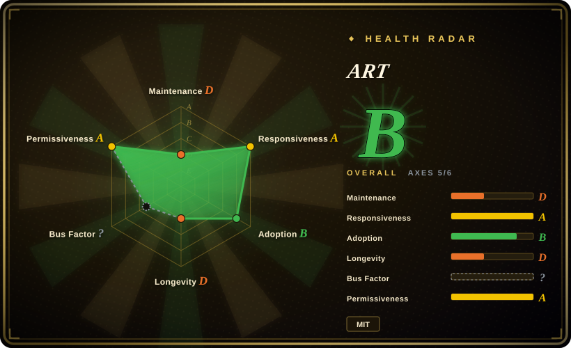
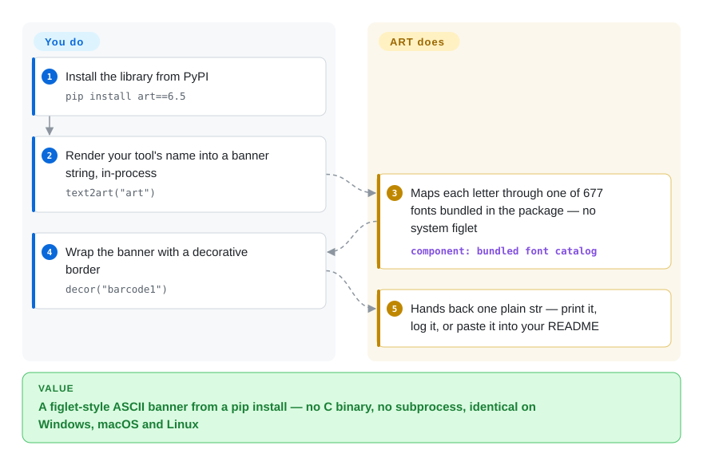

# ART

You want your CLI's startup banner — your tool's name in big figlet-style block letters — without installing a C binary or shelling out to `figlet`. ART keeps 677 fonts and 700+ one-line art pieces as pure-Python data inside the package, so `text2art("MyTool")` just returns the rendered banner as a string you can print, log, or embed anywhere.

## When to use

You're building a CLI tool and you want a polished startup banner — your tool's name in big ASCII letters, maybe boxed or decorated — without shelling out to a system `figlet` binary or bundling C dependencies. You `pip install art`, call `text2art("MyTool")`, and get the rendered banner as a string you can print, log, or embed. Because it's pure Python with the fonts shipped in-package, it works the same on Windows, macOS and Linux and in environments where you can't install system packages (CI, locked-down containers, serverless). You can pick from hundreds of fonts, fetch random art/decorations, and wrap text in borders — all from the library API or its CLI.

You reach for it when ASCII-art *text* is the deliverable: banners, splash screens, generated README art, Discord/Telegram bot output, terminal greetings, or test fixtures. It's a focused text→art generator with a stable, well-documented API and an unusually large bundled font/art catalog.

## How it works

Everything ART knows is data shipped inside the Python package: font tables, one-line art pieces, and decoration fragments — no system `figlet`, no network. `text2art("MyTool", font=...)` maps each character of your string through the chosen font table and joins the columns into a multi-line banner string; `art("coffee")` returns a named one-line piece, `randart()` a random one; `decor("barcode1")` returns border fragments you concatenate around the banner. What ART does for you: the whole catalog, the character mapping, the layout. What stays yours: deciding where the returned string goes (stdout, a log, a README) and handling terminal width yourself — big fonts produce wide output. There is also a CLI (`art text yourtext`, `art fonts`), but the README marks 5.9 as the last version to officially support that CLI structure, so the Python API is the maintained surface.

<!-- flow-steps:begin (generated from flows/terminal-ui-art.json by tools/flow_card.py — do not edit) -->

Text version of the flow

1. **You**: Install the library from PyPI — `pip install art==6.5`
2. **You**: Render your tool's name into a banner string, in-process — `text2art("art")`
3. **ART**: Maps each letter through one of 677 fonts bundled in the package — no system figlet — component: `bundled font catalog`
4. **You**: Wrap the banner with a decorative border — `decor("barcode1")`
5. **ART**: Hands back one plain str — print it, log it, or paste it into your README

**Value**: A figlet-style ASCII banner from a pip install — no C binary, no subprocess, identical on Windows, macOS and Linux

<!-- flow-steps:end -->

## When NOT to use

- **The release line has been quiet.** The default branch last saw a commit 2025-04 (v6.5, 2025-04-12); as of 2026-09 the published release is ~17 months old, and new work lands on the `dev` branch instead (feature commits and README updates through 2026-09). If your project cannot wait on a fix coming from an irregular maintainer, prefer a busier alternative (`pyfiglet`, not indexed) — or accept that you may vendor a patch.
- **You want to convert an image/photo into ASCII.** art works on *text and characters*, not raster images — for picture-to-ASCII you need an image converter ([asciify](asciify.md), `ascii-magic`, `jp2a`), not this.
- **You're building a full-screen TUI or animation.** art produces strings, not a UI; for interactive screens, widgets or effects use a TUI library ([asciimatics](asciimatics.md), Textual, urwid).
- **You must match `figlet`'s exact fonts/output.** art has its own font set and rendering; if you need byte-for-byte figlet compatibility, use `pyfiglet` or the `figlet` binary instead.
- **You only need one banner, once, by hand.** For a one-off, an online figlet generator or the `figlet` CLI avoids adding a runtime dependency to your project.
- **Output size/performance is critical.** Large fonts produce wide multi-line output; in width-constrained or high-volume logging contexts, verify rendering fits and the call cost is acceptable. [未验证]

## Comparison

| Alternative | In index | Our verdict | Tradeoff |
|---|---|---|---|
| pyfiglet | 未收录 | Choose pyfiglet when you need a pure-Python FIGlet port with the canonical figlet font set. | Pure-Python port of FIGlet with the canonical figlet font set; the standard if you specifically want FIGlet fonts/compatibility, narrower scope (no decor/art-piece catalog). |
| figlet / toilet (CLI) | 未收录 | Choose figlet / toilet when you need the classic C banner generators from shell scripts. | The classic C banner generators; require a system binary and aren't a Python API — fine for shell use, awkward to embed. |
| [asciify](asciify.md) | ✅ | Choose asciify when your input is an *image* that needs ASCII conversion. | Converts *images* to ASCII — a different input entirely (raster, not text); complementary, not a substitute. |
| [rich (figlet/markup)](rich.md) | ✅ | Choose rich when large text is only one part of a broader styled terminal-output toolkit. | Styling library that can render large text and styled output as part of a bigger toolkit; broader but heavier if you only want art text. |
| ascii-magic / cowsay | 未收录 | Choose ascii-magic / cowsay when you need niche image-art or speech-bubble character generators. | Niche art generators (images / speech-bubble characters); narrower and stylistically specific. |

## Tech stack

- **Language:** pure Python; fonts and art pieces are shipped inside the package (no system `figlet` needed).
- **API surface:** `text2art` (text→large-font banner), `art` (named single-piece art), `decor` (decorative borders), font/art listing helpers; plus a CLI.
- **Catalog:** 677 fonts, 711 one-line art pieces and 218 decorations in the master-branch README counters (counts grow release-to-release).
- **Distribution:** PyPI (`pip install art==6.5`), conda-forge (`conda install -c conda-forge ascii-art`), private conda channel, plus MATLAB bindings.

## Dependencies

- **Runtime:** Python only — PyPI metadata for 6.5 lists **no third-party runtime dependencies** (the `coverage`/`bandit`/etc. entries are dev-only extras); the font/art data ships with the package.
- **Python floor:** `setup.py` declares `python_requires>=3.6`, but INSTALL.md warns ART 6.4 was the last version to officially support Python 3.6 — use 3.7+ [推断].
- **Install:** `pip install art` (or conda); the CLI comes with it.
- **No external services, network, or datastore** — fully offline, in-process string generation.

## Ops difficulty

**Low.** It's a zero-infra pure-Python library: `pip install`, call a function, get a string. Nothing to deploy or operate, no service, no state, no system binaries. The only practical consideration is that large-font output is wide and multi-line, so you handle wrapping/width in your own UI — there's no operational burden beyond that.

## Health & viability

- **Maintenance (measured 2026-09).** Radar `maintenance: D` — the default branch last saw a commit 2025-04-12 (v6.5), ~17 months quiet. Not archived, and the `dev` branch keeps receiving feature commits and README updates through 2026-09, with dependabot PRs open — alive, but releases are irregular rather than a steady train.
- **Responsiveness.** Radar `responsiveness: A` — measured median time-to-first-response on recent PRs is ~0.1h (small sample); issue attention is credible.
- **Governance / bus factor.** Radar `governance: ?` (unattributable from contribution data); human read: driven by the author (sepandhaghighi) with an AUTHORS-recognized co-maintainer — single-lead small team [推断].
- **Age & Lindy verdict.** ~9 years old (created 2017-10) — but Lindy needs age × still-active, and activity currently lives on `dev`, not on released `master`; treat as a mature library in a slow-release season rather than a strong-Lindy all-clear [推断].
- **Adoption (measured 2026-09).** 2,501 stars; PyPI shows 1,063,012 downloads last month and ~391 dependent repos — unusually strong uptake for a single-purpose banner lib.
- **Risk flags.** MIT, no relicense history; the real risks are release cadence and the quiet default branch, not licensing.

## Caveats (unverified)

- [推断] Python 3.7+ recommendation: `setup.py` declares `>=3.6` while INSTALL.md says 6.4 was the last version officially supporting 3.6 — the effective floor for 6.5 is not stated numerically.
- [推断] "dev branch activity predicts a future release" is an inference from branch commits (2026-08/09); no release roadmap is published.
- [推断] The single-lead + co-maintainer governance read comes from authors/contributor patterns, not a governance document.
- [未验证] Width/performance of very large fonts in high-volume contexts is a general caution, not a measured benchmark for this library.
