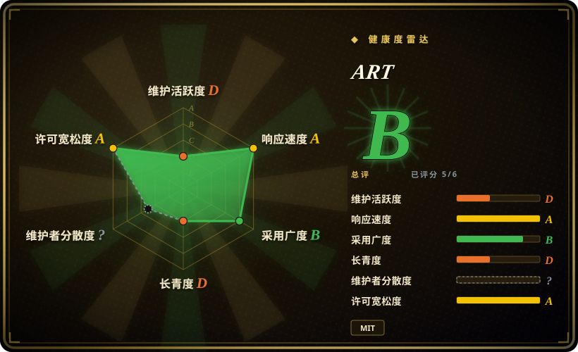
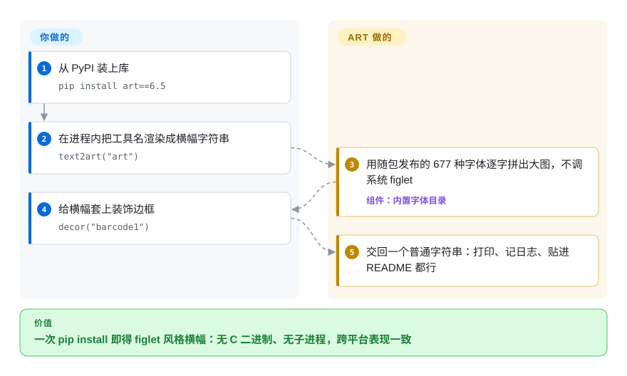

# ART

你想让 CLI 一启动就打出体面的横幅——工具名排成 figlet 风格的大块字母——却不想装 C 二进制，也不想调系统的 `figlet`。ART 把 677 种字体和 700 多个单行艺术片段以纯 Python 数据随包发布，`text2art("MyTool")` 直接返回渲染好的横幅字符串，打印、记日志、嵌进文档都行。

## 何时使用

你在做一个 CLI 工具，想要一个体面的启动横幅——把工具名做成大号 ASCII 字母，也许加个框或装饰——又不想去调系统的 `figlet` 二进制或捆绑 C 依赖。你 `pip install art`，调 `text2art("MyTool")`，拿到渲染好的横幅字符串，可以打印、记日志或嵌入。因为它是纯 Python、字体随包发布，所以在 Windows、macOS、Linux 上表现一致，在装不了系统包的环境（CI、受限容器、serverless）里也能用。你可以从数百种字体里挑、取随机艺术/装饰、给文字套边框——全部来自库 API 或它的 CLI。

当 ASCII 艺术*文字*就是交付物时你会选它：横幅、启动画面、生成的 README 艺术、Discord/Telegram 机器人输出、终端问候语，或测试 fixture。它是个聚焦的“文字→艺术”生成器，API 稳定、文档完善，内置字体/艺术目录大得出奇。

## 怎么用起来

ART 认识的一切都藏在 Python 包里的数据：字体表、单行艺术片段、装饰碎片——没有系统 `figlet`，也不联网。`text2art("MyTool", font=...)` 把你字符串里的每个字符按所选字体表映射，再把各列拼成一个多行横幅字符串；`art("coffee")` 返回一个具名的单行片段，`randart()` 返回随机片段；`decor("barcode1")` 返回边框碎片，由你自己拼接包裹。ART 替你做完整的目录、字符映射和排版；留给你的只有决定字符串去向（stdout、日志、README）以及自己处理终端宽度——大字体输出很宽。它还带一个 CLI（`art text yourtext`、`art fonts`），但 README 明确 5.9 是官方支持该 CLI 结构的最后一个版本，所以 Python API 才是被维护的入口。

<!-- flow-steps:begin (generated from flows/terminal-ui-art.json by tools/flow_card.py — do not edit) -->

流程文字版

1. **你**：从 PyPI 装上库 — `pip install art==6.5`
2. **你**：在进程内把工具名渲染成横幅字符串 — `text2art("art")`
3. **ART**：用随包发布的 677 种字体逐字拼出大图，不调系统 figlet — 组件：`内置字体目录`
4. **你**：给横幅套上装饰边框 — `decor("barcode1")`
5. **ART**：交回一个普通字符串：打印、记日志、贴进 README 都行

**价值**：一次 pip install 即得 figlet 风格横幅：无 C 二进制、无子进程，跨平台表现一致

<!-- flow-steps:end -->

## 何时不用

- **发布线已经沉寂。** 默认分支最后一次提交在 2025-04（v6.5，2025-04-12）；截至 2026-09，正式发布已约 17 个月没有动静，新工作都落在 `dev` 分支上（2026-09 仍有特性提交与 README 更新）。如果你的项目等不起一个节奏不定的维护者修 bug，请选更活跃的替代品（`pyfiglet`，未收录）——或者接受可能需要自己 vendor 补丁。
- **你想把图片/照片转成 ASCII。** art 处理的是*文字和字符*，不是位图——图片转 ASCII 你需要图像转换器（[asciify](asciify.zh.md)、`ascii-magic`、`jp2a`），不是它。
- **你在做全屏 TUI 或动画。** art 产出的是字符串，不是 UI；交互屏、widget 或特效请用 TUI 库（[asciimatics](asciimatics.zh.md)、Textual、urwid）。
- **你必须与 `figlet` 的字体/输出完全一致。** art 有自己的字体集和渲染；若你要逐字节的 figlet 兼容，请改用 `pyfiglet` 或 `figlet` 二进制。
- **你只需要手动生成一个横幅、就一次。** 一次性的需求，用在线 figlet 生成器或 `figlet` CLI 就行，免得给项目加一个运行时依赖。
- **输出尺寸/性能很关键。** 大字体会产出很宽的多行输出；在宽度受限或高频日志场景下，请核实渲染是否放得下、调用开销是否可接受。[未验证]

## 横向对比

| 替代品 | 是否收录 | 我们的评价 | 取舍 |
|---|---|---|---|
| pyfiglet | 未收录 | 需要 FIGlet 的纯 Python 移植和标准 figlet 字体集时，选 pyfiglet。 | FIGlet 的纯 Python 移植，带标准 figlet 字体集；若你专门要 FIGlet 字体/兼容性这是标准选择，范围更窄（无装饰/艺术片段目录）。 |
| figlet / toilet（CLI） | 未收录 | 需要从 shell 脚本调用经典 C 横幅生成器时，选 figlet / toilet。 | 经典 C 横幅生成器；需要系统二进制，不是 Python API——shell 用没问题，嵌入则别扭。 |
| [asciify](asciify.zh.md) | ✅ | 输入是*图片*且要转成 ASCII 时，选 asciify。 | 把*图片*转成 ASCII——输入完全不同（位图而非文字）；互补而非替代。 |
| [rich（figlet/标记）](rich.zh.md) | ✅ | 大字渲染只是更大终端样式输出工具集的一部分时，选 rich。 | 样式库，可作为更大工具集的一部分渲染大字和带样式输出；更广但若只要艺术文字则更重。 |
| ascii-magic / cowsay | 未收录 | 需要图片艺术或对话气泡角色这类小众艺术生成器时，选 ascii-magic / cowsay。 | 小众艺术生成器（图片 / 对话气泡字符）；更窄、风格特定。 |

## 技术栈

- **语言：** 纯 Python；字体和艺术片段随包发布（无需系统 `figlet`）。
- **API 面：** `text2art`（文字→大字横幅）、`art`（具名单片艺术）、`decor`（装饰边框）、字体/艺术列表辅助函数；外加一个 CLI。
- **目录：** master 分支 README 计数为 677 种字体、711 个单行艺术片段、218 种装饰（数量随版本增长）。
- **分发：** PyPI（`pip install art==6.5`）、conda-forge（`conda install -c conda-forge ascii-art`）、私有 conda 频道，另有 MATLAB 绑定。

## 依赖

- **运行时：** 仅 Python——6.5 的 PyPI 元数据里**没有第三方运行时依赖**（`coverage`/`bandit` 等条目属于 dev 专用 extras）；字体/艺术数据随包发布。
- **Python 下限：** `setup.py` 声明 `python_requires>=3.6`，但 INSTALL.md 提示 ART 6.4 是最后官方支持 Python 3.6 的版本——建议用 3.7+ [推断]。
- **安装：** `pip install art`（或 conda）；CLI 随之附带。
- **无外部服务、网络或数据存储**——完全离线、进程内字符串生成。

## 运维难度

**低。** 这是个零基础设施的纯 Python 库：`pip install`、调函数、拿字符串。没有要部署或运维的东西，无服务、无状态、无系统二进制。唯一的实际考量是大字体输出宽且多行，所以你要在自己的 UI 里处理换行/宽度——除此之外没有运维负担。

## 健康度与可持续性

- **维护（2026-09 实测）。** 雷达 `maintenance: D`——默认分支最后一次提交是 2025-04-12（v6.5），沉寂约 17 个月。仓库未归档，`dev` 分支到 2026-09 仍持续收到特性提交与 README 更新，dependabot PR 也开着——项目活着，但发布节奏已经不成班次。
- **响应速度。** 雷达 `responsiveness: A`——近期 PR 的中位首次响应约 0.1 小时（样本很小）；对 issue 的关注度可信。
- **治理 / bus factor。** 雷达 `governance: ?`（贡献数据无法归因）；人工判读：由作者（sepandhaghighi）主导，AUTHORS 承认有一位常驻协作者——单一主导的小团队 [推断]。
- **年龄与 Lindy 判断。** 约 9 年（2017-10 创建）——但 Lindy 要年龄乘以仍在活跃，而当前的活跃在 `dev` 而非已发布的 `master` 上；应视为“处于慢发布季的老熟库”，不是强 Lindy 的全绿通行 [推断]。
- **采用度（2026-09 实测）。** 2,501 star；PyPI 上月 1,063,012 次下载、约 391 个依赖仓库——对单一用途的横幅库来说，采用度异常扎实。
- **风险标记。** MIT，无 relicense 历史；真正的风险是发布节奏与默认分支沉寂，不是许可。

## 存疑（未验证）

- [推断] 建议 Python 3.7+：`setup.py` 声明 `>=3.6`，而 INSTALL.md 说 6.4 是最后官方支持 3.6 的版本——6.5 的实际下限没有给出数字。
- [推断] “dev 分支活跃预示未来会发版”是从分支提交（2026-08/09）推断，项目未发布路线图。
- [推断] 单一主导 + 协作者的治理判读来自作者/贡献者分布，而非治理文档。
- [未验证] 超大字体在高频场景下的宽度/性能是一般性提醒，而非针对本库的实测基准。
