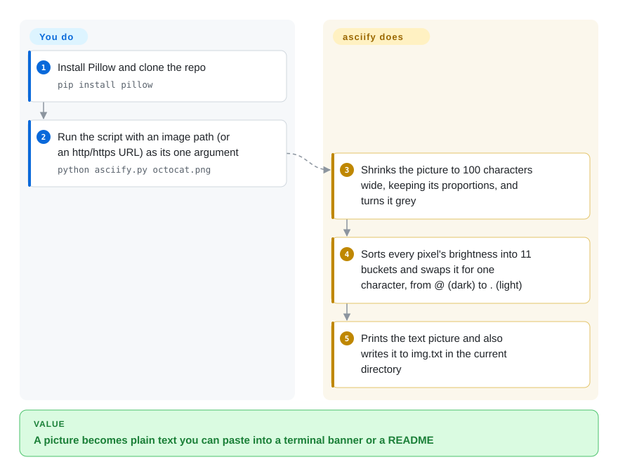

# asciify

A small Python script that converts an image into ASCII art — it downsamples the picture, maps pixel brightness to a ramp of characters, and prints/saves the result as text.

## When to use

You're hacking on a fun side project — a terminal greeting, a generated avatar, a "turn this logo into text" gag for a README — and you want the canonical *image-to-ASCII* recipe in Python: open an image with Pillow, resize it down, convert to greyscale, and map each pixel's luminance to a character from a density ramp. asciify is a single, short, readable `asciify.py` that does exactly that. It's useful as a copy-paste reference for the algorithm, or as a quick local CLI to asciify one picture, when you don't need anything robust or supported.

You'd pick it specifically because it's *minimal and legible* — you can read the whole thing in a minute and adapt the character ramp, resolution, or invert logic yourself. It's a learning/demo artifact more than a maintained product.

## How it works

The whole program is about 60 lines of one file, and the idea is a mosaic made of letters: a dense character like `@` covers more of its cell with ink than a `.` does, so from a distance a grid of characters reads as shades of grey. asciify shrinks your picture to 100 pixels wide, turns it grey, and replaces each pixel with one of 11 characters picked by brightness (0–255 split into steps of 25), then joins them into 100-character lines. **Everything is fixed in code** — the width, the 11-character ramp, the output file name — so you change behaviour by editing `asciify.py`, not by passing flags. It does not correct for terminal characters being roughly twice as tall as they are wide, so the result usually looks vertically stretched; squashing the height before conversion is your edit to make.

<!-- flow-steps:begin (generated from flows/asciify.json by tools/flow_card.py — do not edit) -->

Text version of the flow

1. **You**: Install Pillow and clone the repo — `pip install pillow`
2. **You**: Run the script with an image path (or an http/https URL) as its one argument — `python asciify.py octocat.png`
3. **asciify**: Shrinks the picture to 100 characters wide, keeping its proportions, and turns it grey
4. **asciify**: Sorts every pixel's brightness into 11 buckets and swaps it for one character, from @ (dark) to . (light)
5. **asciify**: Prints the text picture and also writes it to img.txt in the current directory

**Value**: A picture becomes plain text you can paste into a terminal banner or a README

<!-- flow-steps:end -->

## When NOT to use

- **You need a license to use it legally.** The repo ships **no LICENSE file** — under default copyright, "no license" means all rights reserved: you have no granted permission to copy, modify, or redistribute it. Do not vendor it into a product. Re-implement the (trivial) algorithm or use a properly-licensed library instead.
- **You need a maintained dependency.** The last commit on `master` is from 2018-10, with no releases/tags and a single author — treat it as **abandoned**; for a maintained Python library use `ascii-magic` instead.
- **You want features (colour ANSI, video, batch, web).** It's a minimal brightness-ramp converter; for colour/ANSI output, animation, or richer control use a maintained library (`ascii-magic`, `ascii_py`) or a CLI (`jp2a`, `chafa`).
- **You want text→ASCII banners, not image conversion.** That's the opposite direction — use [art](art.md) or `pyfiglet`; asciify only goes image→text.
- **You're on Windows/odd terminals and need guaranteed rendering.** Output fidelity depends on terminal width, font aspect ratio, and the chosen ramp; expect to tune it, with no support to fall back on.

## Comparison

| Alternative | In index | Our verdict | Tradeoff |
|---|---|---|---|
| ascii-magic | 未收录 | Choose ascii-magic when you need a maintained Python image→ASCII library with colour, HTML, and terminal output. | Maintained Python library for image→ASCII with colour/HTML/terminal output; properly licensed and far more featureful — the practical replacement. |
| jp2a | 未收录 | Choose jp2a when you need a fast C CLI that converts JPEG/PNG to coloured ASCII. | Fast C CLI converting JPEG/PNG to ASCII with colour; a single binary, mature, but not a Python API. |
| chafa | 未收录 | Choose chafa when you need a powerful terminal graphics/ASCII/Unicode image renderer. | Powerful terminal graphics/ASCII/Unicode image renderer (C); handles colour, animation and many terminals — heavier, far more capable. |
| [art](art.md) | ✅ | Choose art when you need ASCII art from *text* rather than raster images. | Generates ASCII art from *text* (figlet-style), not images — opposite input; not a substitute. |
| Pillow + ~20 lines | 未收录 | Choose Pillow + a small custom script when you want the DIY route asciify itself embodies. | The DIY route asciify itself embodies; with no license on asciify, rolling your own from Pillow is often the cleaner, legally-clear option. |

## Tech stack

- **Language:** Python — a single `asciify.py` script.
- **Imaging:** Pillow (PIL) for opening, resizing, greyscale conversion and reading pixel data; brightness is mapped to an 11-character ramp (`@#S%?*+;:,.`).
- **Interface:** `python asciify.py <path-or-url>`; output is printed and written to `img.txt` in the current working directory (the code comment claims the script's directory, but the code opens a relative path). A URL argument is first downloaded to `asciify.jpg`.
- **Scope:** one-file converter — no package, no releases, no plugin surface.

## Dependencies

- **Runtime:** Python 3 plus Pillow (PIL); `asciify.py` imports only `PIL.Image` and the standard library (`sys`, `urllib.request`).
- **Input:** a local image file (the repo includes `octocat.png`) or an http/https URL.
- **No services or datastore** — one-shot local conversion; the network is touched only when you pass a URL.

## Ops difficulty

**Low (but unsupported).** Operationally trivial — it's one script with one dependency; nothing to deploy or run as a service. The real "difficulty" isn't ops, it's the **legal and maintenance** posture: no license and no maintenance mean you shouldn't depend on it in anything you ship; copying the algorithm into your own (licensed) code is the safer path.

## Health & viability

- **Responsiveness**: Cannot be scored — no_traffic.
- **Maintenance (2026-10).** Last commit on `master` 2018-10-11 (GitHub's 2022-10 `pushed_at` does not correspond to any commit on `master`, the only branch); no releases or tags — effectively **unmaintained / abandoned**. Not formally archived, but inactive for about eight years.
- **Governance / bus factor.** Single author on a personal account with a few drive-by contributors; no governance, no roadmap. Maximal bus-factor risk — but for a frozen demo script that matters less than the license gap. [推断]
- **Age & Lindy verdict.** ~8 years old (created 2018-08) but **inactive since 2018** ⇒ Lindy **does not apply** — age without ongoing activity is staleness, not durability. [推断]
- **Adoption.** ~1.2k stars, but those reflect its value as a *learning reference*, not production use; high stars on an unmaintained, unlicensed single-script repo are a **risk flag**, not social proof. [未验证]
- **Risk flags.** **No license (all-rights-reserved by default)** is the headline risk; plus abandonment and single-author. Avoid as a dependency.

## Caveats (unverified)

- [推断] "No license = all rights reserved" is the default-copyright reading; the repo-root listing (2026-10-08) has no `LICENSE`/`COPYING` and GitHub reports none, but this page gives no legal advice on jurisdiction-specific exceptions.
- [未验证] ~1.2k stars as of 2026-10-08; star counts drift — indicative only.
- [推断] "Abandoned / unmaintained" is inferred from the 2018-10 last commit on `master` and the absence of releases — not a maintainer statement.
- [推断] The vertical stretch comes from mapping one pixel to one character without compensating for character aspect ratio; how strong it looks depends on your terminal font.
- [推断] Lindy "does not apply" follows from age × inactivity (old but dormant), per the age-must-pair-with-still-active rule.
