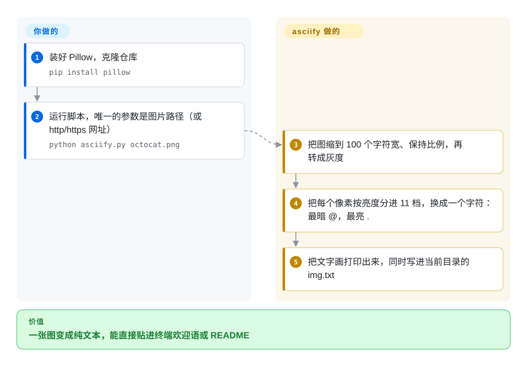

# asciify

一个小巧的 Python 脚本，把图片转成 ASCII 艺术——它对图片降采样，把像素亮度映射到一组字符的梯度上，再把结果以文本形式打印/保存。

## 何时使用

你在折腾一个好玩的小项目——终端问候语、生成头像、给 README 来个“把这个 logo 变成文字”的彩蛋——想要 Python 里那套经典的*图片转 ASCII*配方：用 Pillow 打开图片、缩小、转灰度，把每个像素的亮度映射到一条字符密度梯度上。asciify 就是一个简短、可读的 `asciify.py`，干的正是这件事。它适合当算法的复制粘贴参考，或当你不需要任何健壮/有支持的东西时，作为快速本地 CLI 把一张图 asciify 一下。

你选它正是因为它*极简、易读*——一分钟就能读完，然后自己改字符梯度、分辨率或反相逻辑。它更像一个学习/演示产物，而非有维护的产品。

## 怎么用起来

整个程序就一个文件、六十来行，原理是用字母拼马赛克：`@` 这种笔画密的字符在格子里占的墨多，`.` 占的少，远看一排排字符就成了深浅不同的灰。asciify 把你的图缩到 100 个像素宽、转成灰度，再按亮度（0–255，每 25 一档）给每个像素换一个字符，一共 11 个字符可选，最后按 100 个字符一行拼起来。**所有参数都写死在代码里**——宽度、11 个字符的梯度、输出文件名——想改行为就直接改 `asciify.py`，没有命令行开关可传。它没有补偿终端字符“高约为宽两倍”这件事，所以结果通常看起来被竖着拉长了；转换前先把高度压扁，得你自己改。

<!-- flow-steps:begin (generated from flows/asciify.json by tools/flow_card.py — do not edit) -->

流程文字版

1. **你**：装好 Pillow，克隆仓库 — `pip install pillow`
2. **你**：运行脚本，唯一的参数是图片路径（或 http/https 网址） — `python asciify.py octocat.png`
3. **asciify**：把图缩到 100 个字符宽、保持比例，再转成灰度
4. **asciify**：把每个像素按亮度分进 11 档，换成一个字符：最暗 @，最亮 .
5. **asciify**：把文字画打印出来，同时写进当前目录的 img.txt

**价值**：一张图变成纯文本，能直接贴进终端欢迎语或 README

<!-- flow-steps:end -->

## 何时不用

- **你需要一份许可才能合法使用。** 仓库**没有 LICENSE 文件**——在默认版权下，“无许可”意味着保留所有权利：你没有被授予复制、修改或再分发的任何许可。别把它 vendor 进产品。改为自己重写这个（很简单的）算法，或用一个许可清晰的库。
- **你需要一个有维护的依赖。** `master` 上最后一次提交在 2018-10，无 release/tag，单一作者——视为**已废弃**；要有维护的 Python 库，改用 `ascii-magic`。
- **你想要功能（彩色 ANSI、视频、批量、Web）。** 它只是个极简的亮度梯度转换器；要彩色/ANSI 输出、动画或更细控制，请用有维护的库（`ascii-magic`、`ascii_py`）或 CLI（`jp2a`、`chafa`）。
- **你想要文字→ASCII 横幅，而非图片转换。** 那是相反方向——用 [art](art.zh.md) 或 `pyfiglet`；asciify 只做图片→文字。
- **你在 Windows/奇怪终端上、需要保证渲染。** 输出还原度取决于终端宽度、字体宽高比和所选梯度；预期要自己调，且没有支持可依靠。

## 横向对比

| 替代品 | 是否收录 | 我们的评价 | 取舍 |
|---|---|---|---|
| ascii-magic | 未收录 | 需要有维护的 Python 图片→ASCII 库，且支持彩色、HTML、终端输出时，选 ascii-magic。 | 有维护的 Python 库，做图片→ASCII，支持彩色/HTML/终端输出；许可清晰、功能丰富得多——实际的替代品。 |
| jp2a | 未收录 | 需要快速的 C CLI 把 JPEG/PNG 转成彩色 ASCII 时，选 jp2a。 | 快速的 C CLI，把 JPEG/PNG 转 ASCII 并支持彩色；单二进制、成熟，但不是 Python API。 |
| chafa | 未收录 | 需要强大的终端图形、ASCII 或 Unicode 图像渲染器时，选 chafa。 | 强大的终端图形/ASCII/Unicode 图像渲染器（C）；处理彩色、动画和众多终端——更重、能力强得多。 |
| [art](art.zh.md) | ✅ | 需要从*文字*生成 ASCII 艺术而不是处理图片时，选 art。 | 从*文字*生成 ASCII 艺术（figlet 风格），不是图片——输入相反；不是替代品。 |
| Pillow + ~20 行 | 未收录 | 想走 asciify 自身体现的 DIY 路线时，选 Pillow 加一小段自写脚本。 | asciify 自身体现的 DIY 路线；既然 asciify 无许可，基于 Pillow 自己写往往是更干净、法律更清晰的选择。 |

## 技术栈

- **语言：** Python——一个单文件 `asciify.py` 脚本。
- **图像：** Pillow（PIL）用于打开、缩放、转灰度和读取像素数据；亮度被映射到一条 11 个字符的梯度上（`@#S%?*+;:,.`）。
- **接口：** `python asciify.py <路径或网址>`；结果打印到终端，同时写进**当前工作目录**下的 `img.txt`（代码注释说写在脚本所在目录，但代码用的是相对路径）。传网址时会先下载成 `asciify.jpg`。
- **范围：** 单文件转换器——无包、无 release、无插件面。

## 依赖

- **运行时：** Python 3 加 Pillow（PIL）；`asciify.py` 只 import 了 `PIL.Image` 和标准库（`sys`、`urllib.request`）。
- **输入：** 一个本地图片文件（仓库自带 `octocat.png`），或一个 http/https 网址。
- **无服务、无数据存储**——本地一次性转换；只有传网址时才会联网。

## 运维难度

**低（但无支持）。** 运维上微不足道——一个脚本、一个依赖，没有要部署或当服务跑的东西。真正的“难度”不在运维，而在**法律与维护**姿态：无许可、无维护意味着你不该在任何要交付的东西里依赖它；把算法抄进你自己的（有许可的）代码里才是更安全的路。

## 健康度与可持续性

- **响应速度**：无法计算——no_traffic。
- **维护（2026-10）。** `master` 上最后一次提交在 2018-10-11（GitHub 显示的 2022-10 `pushed_at` 对应不到唯一分支 `master` 上的任何提交）；无 release 或 tag——实质上**无维护 / 已废弃**。未正式归档，但已沉寂约八年。
- **治理 / bus factor。** 个人账号下的单一作者，外加几位顺手贡献者；无治理、无路线图。bus-factor 风险最大——但对一个冻结的演示脚本来说，这没有许可缺口要紧。[推断]
- **年龄与 Lindy 判断。** 约 8 年（2018-08 创建）但**自 2018 起不活跃**⇒ Lindy **不适用**——没有持续活动的年龄是陈旧，不是耐久。[推断]
- **采用度。** 约 1.2k star，但这些反映的是它作为*学习参考*的价值，而非生产使用；一个无维护、无许可的单脚本仓库上的高 star 是**风险标记**，不是社会证明。[未验证]
- **风险标记。** **无许可（默认保留所有权利）**是头号风险；外加废弃和单一作者。不要作为依赖。

## 存疑（未验证）

- [推断] “无许可 = 保留所有权利”是按默认版权的读法；2026-10-08 查仓库根目录没有 `LICENSE`/`COPYING`，GitHub 也报无许可，但本页不就各司法辖区的例外给法律意见。
- [未验证] 截至 2026-10-08 约 1.2k star；star 数会漂移，仅供参考。
- [推断] “已废弃 / 无维护”是从 `master` 上 2018-10 的最后一次提交和缺 release 推断的，而非维护者声明。
- [推断] 竖向拉长来自“一个像素换一个字符”却没补偿字符宽高比；看起来拉得多厉害取决于你的终端字体。
- [推断] Lindy“不适用”源自年龄 × 不活跃（老但休眠），遵循“年龄须与仍活跃配对”的规则。
