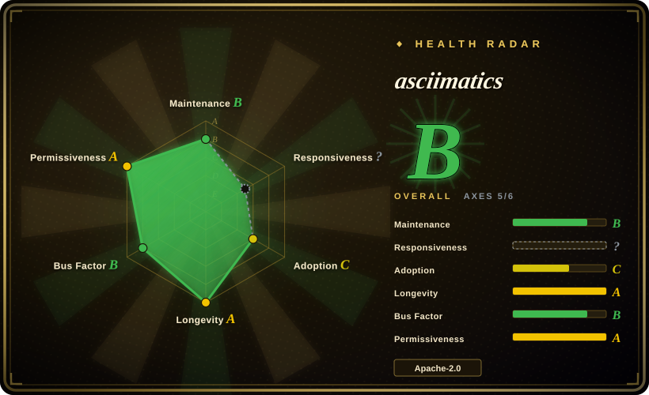
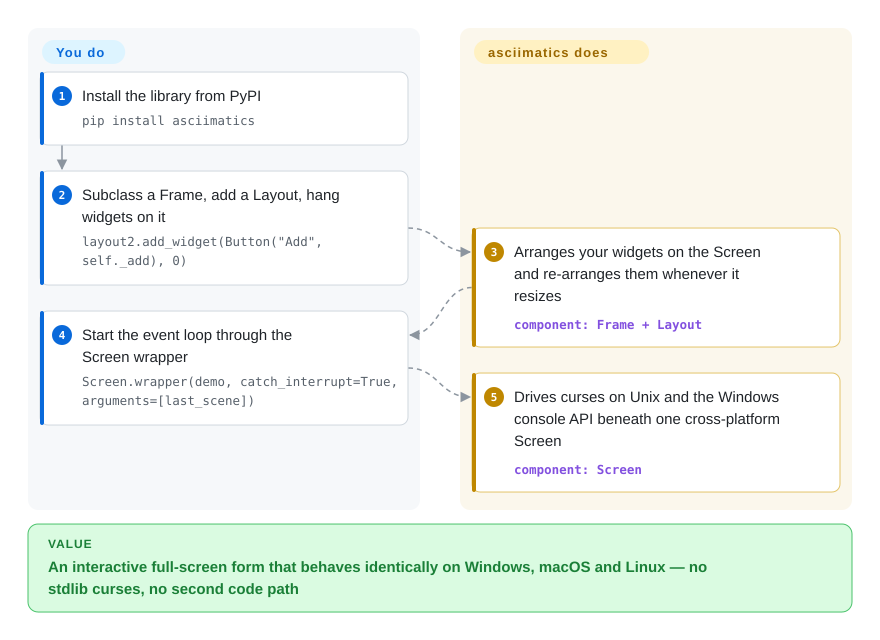

# asciimatics

The stdlib `curses` you'd use for a full-screen terminal app only exists on Unix — the same code just won't run on your colleague's Windows laptop. asciimatics wraps curses and the native Windows console API behind one `Screen` API, so interactive forms, dashboards and ASCII animations are written once in Python and behave the same on Linux, macOS and Windows.

## When to use

You're a Python developer who needs a real full-screen terminal interface — an interactive form, a dashboard, a wizard — and you want it to behave identically on a colleague's Windows laptop, your Mac, and the Linux CI box. The stdlib `curses` module is Unix-only and famously fiddly, and you don't want to ship two code paths. You pull in asciimatics: it gives you one `Screen` abstraction that handles colour/styled text (including 256-colour and CJK unicode), cursor positioning, non-blocking keyboard and mouse input, and console-resize detection across all three platforms. On top of that it ships a `Frame`/widget layer — text boxes, lists, buttons, layouts — so you can assemble a form-driven TUI without hand-rolling the event loop.

You also reach for it when you want the *fun* layer: scrolling banners, sprites, particle effects, Conway's Life, transitions between scenes. asciimatics started as an animation toolkit (the name is a pun), so if you're building a splash screen, a retro demo, an ASCII-art intro, or a teaching visual, the `Effect`/`Scene`/`Renderer` model is purpose-built for it. It's the same library whether you want a serious data-entry screen or a credits-roll animation.

## How it works

asciimatics hands you one `Screen` object and swaps the engine under it per OS: Python's `curses` on Linux/macOS, the native Windows console API on Windows (via pywin32) — that is where the "write once, runs everywhere" comes from. Above the Screen sit two layers. The **effects layer** is a draw loop: a `Renderer` produces each frame as ASCII art, `Effect`s move it around, and `Scene`s play the effects on the Screen — sprites, banners, particles. The **widgets layer** is where forms live: you subclass a `Frame`, add a `Layout` (which re-arranges your widgets whenever the terminal resizes), and drop `Button`/`TextBox`/`DropdownList` widgets onto it; the Frame's event loop routes keystrokes and mouse clicks to the focused widget. What asciimatics does for you: taking over the screen, the per-platform plumbing, repaints, resize and non-blocking input. What stays yours: the app logic behind your callbacks and testing how it renders in the specific terminals you ship to — colour depth and unicode width differ per emulator. The entry point is `Screen.wrapper(demo)`: it opens the screen, calls your function with it, and restores the terminal afterwards.

<!-- flow-steps:begin (generated from flows/asciimatics.json by tools/flow_card.py — do not edit) -->

Text version of the flow

1. **You**: Install the library from PyPI — `pip install asciimatics`
2. **You**: Subclass a Frame, add a Layout, hang widgets on it — `layout2.add_widget(Button("Add", self._add), 0)`
3. **asciimatics**: Arranges your widgets on the Screen and re-arranges them whenever it resizes — component: `Frame + Layout`
4. **You**: Start the event loop through the Screen wrapper — `Screen.wrapper(demo, catch_interrupt=True, arguments=[last_scene])`
5. **asciimatics**: Drives curses on Unix and the Windows console API beneath one cross-platform Screen — component: `Screen`

**Value**: An interactive full-screen form that behaves identically on Windows, macOS and Linux — no stdlib curses, no second code path

<!-- flow-steps:end -->

## When NOT to use

- **You only target Linux/macOS and want maximum control.** If cross-platform isn't a requirement, raw `curses` or a lower-level binding has no extra dependency and finer control — asciimatics' abstraction is a convenience layer you may not need.
- **You want a modern, reactive, richly-styled TUI framework.** Textual (CSS-like styling, async, mouse-first widgets) or `urwid` target richer app UIs; asciimatics' widget set is functional but more spartan and its API is older-style. Compare before committing to a large app.
- **You just want pretty static output, tables, progress bars, or markup.** `rich` is the better fit for styled non-fullscreen output — asciimatics takes over the whole screen and is overkill for log colouring or a progress bar.
- **You want a banner string to print/log, not a screen to take over.** asciimatics can do figlet-style text (`FigletText`) and image-to-ASCII conversion, but its renderers paint onto a full-screen `Screen` frame, they don't hand you a string to print anywhere — for a printable banner use [art](art.md) or `pyfiglet`; for standalone picture-to-ASCII use a converter like `jp2a` or [asciify](asciify.md).
- **The published package lags master by years.** The newest PyPI release is 1.15.0 (2023-10); master has since added mouse-wheel scrolling, grapheme-cluster Unicode handling and type hints (1.15.1 was tagged 2026-07 but not published to PyPI as of 2026-09). If you need a fix quickly, you'll be installing from source — or you'd rather ride Textual's release cadence.
- **Roadmap is single-led.** Three committers were active over the last 12 months, but the top one holds ~60% of the window's commits — a concentrated bus-factor for a long-lived production dependency (see Health). If you want vendor backing instead, use Textual. [推断]

## Comparison

| Alternative | In index | Our verdict | Tradeoff |
|---|---|---|---|
| [Textual](textual.md) | ✅ | Choose Textual when you need a modern async, CSS-styled, mouse-first TUI framework. | Modern async, CSS-styled, mouse-first TUI framework (Textualize); much richer widget/styling model and active backing, but heavier and a different programming model than asciimatics' curses-like API. |
| urwid | 未收录 | Choose urwid when you need a long-established Python console UI library with flexible widgets and layouts. | Long-established Python console UI library with a flexible widget/layout system; Unix-focused (weaker Windows story) and no animation engine. |
| [rich](rich.md) | ✅ | Choose rich when you need styled terminal *output* such as tables, markup, progress, or syntax highlighting. | Styled terminal *output* (tables, markup, progress, syntax) — not a full-screen UI/event loop; complementary, not a substitute for interactive screens. |
| blessed / curses (stdlib) | 未收录 | Choose blessed or curses when you need lower-level terminal control instead of a widget/animation framework. | Lower-level terminal control; `curses` is Unix-only, `blessed` is a friendlier wrapper — neither ships widgets or an animation framework. |
| prompt_toolkit | 未收录 | Choose prompt_toolkit when you need powerful interactive prompts, REPLs, or input-heavy full-screen apps. | Powerful for interactive prompts/REPLs and some full-screen apps; strong line-editing, but a different focus (input) and no ASCII-effects engine. |

## Tech stack

- **Language:** pure Python; master `pyproject.toml` declares `requires-python >=3.8` with CI classifiers for 3.9–3.11 (the 1.15.0 changelog line says Python 3.9+ is required after dropping Python 2).
- **Core abstraction:** a `Screen` class wrapping platform-specific terminal back-ends — `curses` on Unix-likes, native console APIs on Windows (pywin32) — to present one cross-platform surface.
- **Widget layer:** `Frame`, `Layout`, and widgets (text, list, button, etc.) with a scene/effect model on top.
- **Animation engine:** `Scene` / `Effect` / `Renderer` primitives for sprites, particles, transitions, figlet text and image-to-ASCII rendering.

## Dependencies

- **Runtime:** Python plus four pip dependencies (master `pyproject.toml`): `pyfiglet >=0.7.2`, `Pillow >=2.7.0`, `wcwidth >=0.5.0`, and `pywin32 >=1.0` on Windows only; install via `pip install asciimatics`.
- **Platform:** a terminal/console; on Windows it uses native console APIs rather than requiring a Unix `curses`.
- **No external services or datastore** — it's an in-process UI library.

## Ops difficulty

**Low.** It's a library, not a service — there's nothing to deploy or operate. The burden is purely development-time: it grabs the whole terminal, so you design around its event loop and scene model, and you test rendering across the terminals you actually target (colour support, resize behaviour, and CJK/unicode width handling differ between emulators). No datastore, no network, no runtime infra.

## Health & viability

- **Maintenance (measured 2026-09).** Radar `maintenance: B`: master received commits on 2026-07-03/04 — grapheme-cluster Unicode fixes, mouse-wheel support, mypy cleanup — but the release train is stalled: latest PyPI release is 1.15.0 (2023-10-25) and the 1.15.1 GitHub tag (2026-07) was not on PyPI when checked. Reads as **maintained-but-release-late**, not abandoned; not archived.
- **Responsiveness.** Radar `responsiveness: ?` (no signal inside the measured window) — don't count on fast issue turnaround; no data either way.
- **Governance / bus factor.** Radar `governance: B` — 3 active committers over 12 months with the top one at ~60% of window commits: single-led (Peter Brittain) but not a lone wolf; no foundation backing.
- **Age & Lindy verdict.** ~11.5 years old (created 2015-04) with commits still landing ⇒ a **solid Lindy** signal, tempered by the multi-year PyPI release gap: the library persists, the distribution train slows. [推断]
- **Adoption (measured 2026-09).** 4,302 stars, 97,458 PyPI downloads last month, ~176 dependent repos — established for a niche, no longer growing fast.
- **Risk flags.** Apache-2.0, no relicense history found; the realistic risk is release velocity and the concentrated roadmap, not licensing.

## Caveats (unverified)

- [推断] The 1.15.1 tag existing on GitHub while absent from PyPI suggests more releases are coming; there is no published release roadmap, so timing is a guess.
- [推断] "Single-led, ~60% top-contributor share" is a 12-month commit-statistics window, not a governance document.
- [未验证] Textual/urwid being "richer" is a general characterization of their feature sets, not a feature-by-feature audit against asciimatics.
