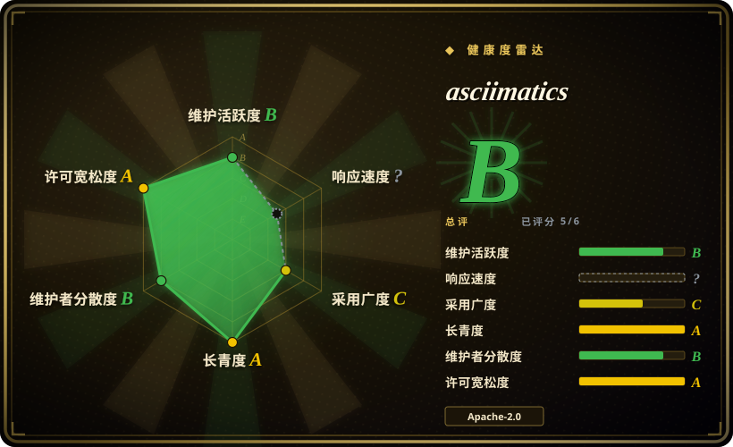
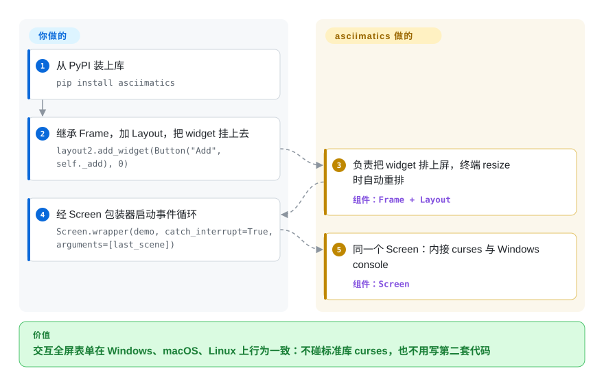

# asciimatics

你用来做全屏终端界面的标准库 `curses` 只能在 Unix 上跑，同一份代码在同事的 Windows 笔记本上根本起不来。asciimatics 把 curses 与 Windows 原生 console API 收进同一个 `Screen` API 后面，交互式表单、仪表盘、ASCII 动画都只写一份 Python，在 Linux、macOS、Windows 上表现一致。

## 何时使用

你是 Python 开发者，需要一个真正的全屏终端界面——交互式表单、仪表盘、向导——而且希望它在同事的 Windows 笔记本、你的 Mac 和 Linux CI 机器上行为一模一样。标准库的 `curses` 只能在 Unix 上用，且出了名地难伺候，你也不想为此写两套代码路径。于是你引入 asciimatics：它给你一个 `Screen` 抽象，统一处理彩色/带样式文本（含 256 色和 CJK unicode）、光标定位、非阻塞键鼠输入，以及控制台 resize 检测，三个平台一致。在此之上它还带一层 `Frame`/widget——文本框、列表、按钮、布局——让你不用手搓事件循环就能拼出一个表单驱动的 TUI。

当你想要那层*好玩*的能力时，你也会选它：滚动横幅、精灵、粒子特效、生命游戏、场景间转场。asciimatics 最初就是个动画工具集（名字本身就是双关），所以如果你在做启动画面、复古 demo、ASCII 艺术开场或教学可视化，它的 `Effect`/`Scene`/`Renderer` 模型就是为此而生。无论你要的是严肃的数据录入屏，还是滚动片尾，用的都是同一个库。

## 怎么用起来

asciimatics 交给你一个 `Screen` 对象，底下按操作系统换引擎：Linux/macOS 上走 Python 的 `curses`，Windows 上直接走原生 console API（经 pywin32）——“一次编写、处处能跑”就来自这里。Screen 上面有两层。**特效层**是一个绘制循环：`Renderer` 把每一帧生成成 ASCII 画，`Effect` 让它动起来，`Scene` 把这些特效放到 Screen 上播——精灵、横幅、粒子都属于这层。**widget 层**才是表单所在地：你继承一个 `Frame`，加上 `Layout`（终端 resize 时它负责重排你的 widget），再把 `Button`/`TextBox`/`DropdownList` 挂上去；Frame 的事件循环把键鼠事件路由到当前聚焦的 widget。它替你做的：接管整屏、跨平台管道、重绘、resize 与非阻塞输入。仍归你的：回调背后的业务逻辑，以及在你实际投放的各个终端里测渲染——色彩深度和 unicode 宽度各家模拟器并不一致。入口是 `Screen.wrapper(demo)`：开屏、把 Screen 传进你的函数、退出时恢复终端。

<!-- flow-steps:begin (generated from flows/asciimatics.json by tools/flow_card.py — do not edit) -->

流程文字版

1. **你**：从 PyPI 装上库 — `pip install asciimatics`
2. **你**：继承 Frame，加 Layout，把 widget 挂上去 — `layout2.add_widget(Button("Add", self._add), 0)`
3. **asciimatics**：负责把 widget 排上屏，终端 resize 时自动重排 — 组件：`Frame + Layout`
4. **你**：经 Screen 包装器启动事件循环 — `Screen.wrapper(demo, catch_interrupt=True, arguments=[last_scene])`
5. **asciimatics**：同一个 Screen：内接 curses 与 Windows console — 组件：`Screen`

**价值**：交互全屏表单在 Windows、macOS、Linux 上行为一致：不碰标准库 curses，也不用写第二套代码

<!-- flow-steps:end -->

## 何时不用

- **你只面向 Linux/macOS 且想要最大控制力。** 如果跨平台不是硬需求，原生 `curses` 或更底层的绑定没有额外依赖、控制更细——asciimatics 的抽象是一层你未必需要的便利层。
- **你想要现代、响应式、样式丰富的 TUI 框架。** Textual（CSS 式样式、异步、鼠标优先 widget）或 `urwid` 面向更丰富的应用 UI；asciimatics 的 widget 集能用但偏简朴，API 风格也偏老。做大型应用前请先对比。
- **你只想要漂亮的静态输出、表格、进度条或标记。** `rich` 更适合带样式的非全屏输出——asciimatics 会接管整个屏幕，给日志上色或画进度条属于杀鸡用牛刀。
- **你要的是拿来即印的横幅字符串，不是接管整屏。** asciimatics 能做 figlet 风格文字（`FigletText`）也能把图片转 ASCII，但它的 renderer 是把画面画到全屏 `Screen` 上，不会交给你一段可随处打印的字符串——要可打印的横幅请用 [art](art.zh.md) 或 `pyfiglet`；要独立的图片转 ASCII 请用 `jp2a`、[asciify](asciify.zh.md) 这类转换器。
- **发布版落后 master 好几年。** PyPI 上最新是 1.15.0（2023-10）；master 此后又加了鼠标滚轮、字素簇 Unicode 处理和类型标注（1.15.1 已于 2026-07 打 tag，但截至 2026-09 未发 PyPI）。急着要修复就得从源码装——或者干脆改追 Textual 的发布节奏。
- **路线图系于一人。** 过去 12 个月有 3 位活跃提交者，但头号贡献者约占六成的窗口提交——对长期生产依赖是集中的 bus-factor（见健康度）。换成 [Textual](textual.zh.md) 也换不来厂商背书了：背后的公司 Textualize 已在 2025 年结束运营，Textual 现在基本也是一人维护；urwid 和 prompt_toolkit 同样各由一人主导（看 2025-10 以来的提交作者）。在 Python TUI 里，对策是把 UI 层做薄、便于替换，而不是换一个库。[推断]

## 横向对比

| 替代品 | 是否收录 | 我们的评价 | 取舍 |
|---|---|---|---|
| [Textual](textual.zh.md) | ✅ | 需要现代异步、CSS 样式、鼠标优先的 TUI 框架时，选 Textual。 | 现代异步、CSS 样式、鼠标优先的 TUI 框架；widget/样式模型丰富得多、发版活跃，但背后的公司 Textualize 已在 2025 年结束运营，只剩一位维护者，而且更重，编程模型也与 asciimatics 类 curses 的 API 不同。 |
| urwid | 未收录 | 需要老牌 Python 控制台 UI 库和灵活 widget/布局系统时，选 urwid。 | 老牌 Python 控制台 UI 库，widget/布局系统灵活；偏 Unix（Windows 支持弱），且无动画引擎。 |
| [rich](rich.zh.md) | ✅ | 需要表格、标记、进度、语法高亮等带样式终端*输出*时，选 rich。 | 带样式的终端*输出*（表格、标记、进度、语法）——不是全屏 UI/事件循环；与之互补，不能替代交互屏。 |
| blessed / curses（标准库） | 未收录 | 需要更底层的终端控制，而不是 widget/动画框架时，选 blessed 或 curses。 | 更底层的终端控制；`curses` 仅 Unix，`blessed` 是更友好的封装——两者都不带 widget 或动画框架。 |
| prompt_toolkit | 未收录 | 需要强交互提示、REPL 或输入密集型全屏应用时，选 prompt_toolkit。 | 擅长交互式提示/REPL 和部分全屏应用，行编辑很强，但侧重点不同（输入），也没有 ASCII 特效引擎。 |

## 技术栈

- **语言：** 纯 Python；master 的 `pyproject.toml` 声明 `requires-python >=3.8`，CI 分类器覆盖 3.9–3.11（1.15.0 的变更记录写明放弃 Python 2 后需要 3.9+）。
- **核心抽象：** 一个 `Screen` 类封装各平台终端后端——Unix-like 上用 `curses`、Windows 上用原生 console API（pywin32）——对外呈现统一的跨平台界面。
- **widget 层：** `Frame`、`Layout` 及各 widget（文本、列表、按钮等），其上叠加场景/特效模型。
- **动画引擎：** `Scene` / `Effect` / `Renderer` 原语，用于精灵、粒子、转场、figlet 文字与图片转 ASCII 渲染。

## 依赖

- **运行时：** Python 加四个 pip 依赖（master `pyproject.toml`）：`pyfiglet >=0.7.2`、`Pillow >=2.7.0`、`wcwidth >=0.5.0`，仅 Windows 另需 `pywin32 >=1.0`；`pip install asciimatics` 即可。
- **平台：** 一个终端/控制台；Windows 上用原生 console API，而非要求 Unix 的 `curses`。
- **无外部服务或数据存储**——它是进程内 UI 库。

## 运维难度

**低。** 它是库不是服务——没有要部署或运维的东西。负担纯在开发期：它会接管整个终端，所以你要围绕它的事件循环和场景模型来设计，并在你实际面向的终端上测试渲染（各模拟器的彩色支持、resize 行为、CJK/unicode 宽度处理都不同）。无数据存储、无网络、无运行时基础设施。

## 健康度与可持续性

- **维护（2026-09 实测）。** 雷达 `maintenance: B`：master 在 2026-07-03/04 仍有提交——字素簇 Unicode 修复、鼠标滚轮支持、mypy 清理——但发布列车停摆：PyPI 最新是 1.15.0（2023-10-25），1.15.1 的 GitHub tag（2026-07）核查时仍未上 PyPI。读作**有人维护但发版滞后**，不是废弃，未归档。
- **响应速度。** 雷达 `responsiveness: ?`（测量窗口内无信号）——别指望快速响应 issue，数据也没给出反面证据。
- **治理 / bus factor。** 雷达 `governance: B`——12 个月窗口内 3 位活跃提交者，头号占约六成：单人主导（Peter Brittain）但不是独狼，无基金会背书。
- **年龄与 Lindy 判断。** 约 11.5 年（2015-04 创建）且提交仍在落地 ⇒ **扎实的 Lindy** 信号，但被多年的 PyPI 空窗打折：库还活着，分发火车在慢速行驶。[推断]
- **采用度（2026-09 实测）。** 4,302 star，PyPI 上月 97,458 次下载，约 176 个依赖仓库——在小众领域已站稳脚跟，但不再高增长。
- **风险标记。** Apache-2.0，未发现 relicense 历史；现实风险是发布速度与集中的路线图，不是许可。

## 存疑（未验证）

- [推断] GitHub 上打了 1.15.1 而 PyPI 上没有，暗示后续还会发版；但没有公开路线图，时间点纯属推测。
- [推断] “单人主导、头号贡献者约六成”是 12 个月提交统计窗口，而非治理文档。
- [未验证] Textual/urwid“更丰富”是对其特性集的概括，而非对 asciimatics 逐项功能审计。
- [推断] “Textual、urwid、prompt_toolkit 基本都是一人维护”来自 2025-10 以来的 GitHub 提交作者（urwid：100 次提交中 94 次出自同一账号；prompt_toolkit：主维护者 22 次中占 7 次，其余是一次性贡献者）和 Textual 页（2026-10-09 核对），而非治理文档。
