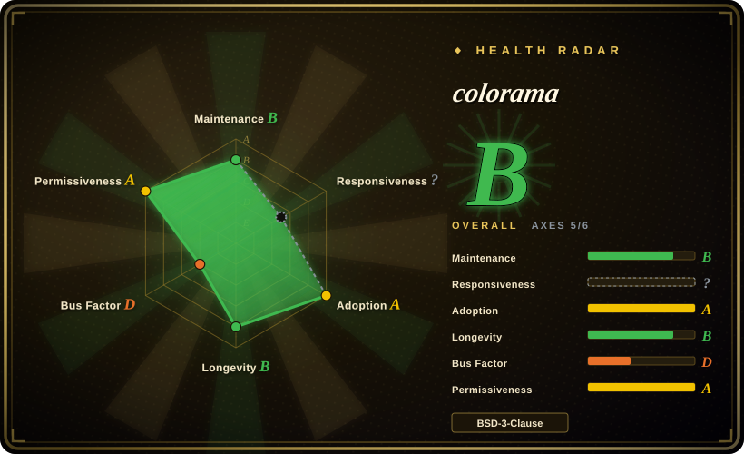
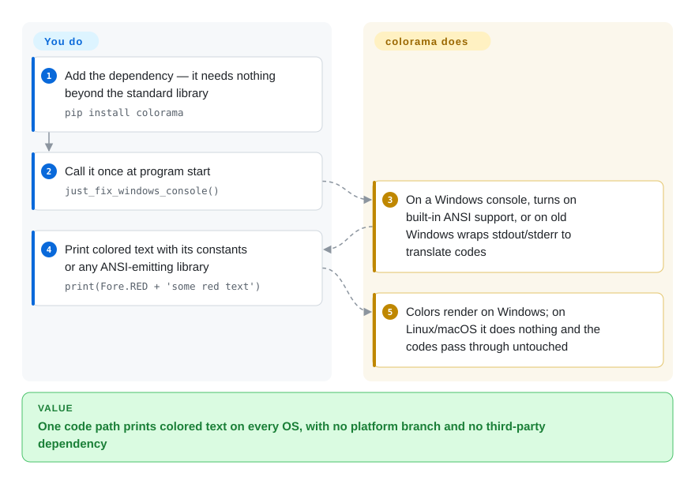

# colorama

A tiny pure-Python library that makes ANSI color/style escape codes work on Windows — call `colorama.init()` once and the same ANSI sequences that color your output on Linux/macOS now render correctly in legacy Windows terminals too.

## When to use

You're writing a Python CLI — a build tool, a test runner, a deploy script — and you want red errors, green successes, and dim secondary text. On Linux and macOS you just print ANSI escape codes (`\033[31m...`). But your users on older Windows (cmd.exe, pre-modern conhost) see literal garbage like `←[31m` instead of color, because those terminals didn't interpret ANSI. You add `from colorama import just_fix_windows_console; just_fix_windows_console()` at startup (or the older `init()`), and colorama intercepts stdout/stderr on Windows and translates the ANSI codes into the Win32 console API calls that actually set colors — while doing nothing (passing ANSI straight through) on platforms that already support it. The result: one code path, colored output everywhere, no `if platform == 'windows'` branching. Its `Fore`, `Back`, and `Style` constants also give you readable names instead of raw escape numbers.

It's the de-facto compatibility shim under a huge slice of Python CLIs and is bundled with many higher-level color/UI libraries — reach for it when you need *cross-platform colored terminal text* with a near-zero dependency footprint, not a full TUI.

## How it works

ANSI escape codes are invisible instructions mixed into printed text — `\033[31m` means "switch to red" — and Unix terminals have always obeyed them, while older Windows consoles print them as junk. colorama sits between your program and the Windows console. **The translation is entirely colorama's job; you only call one function at startup and keep printing ANSI as you would on Linux.** On Windows 10 or later it simply flips the console's own switch for understanding ANSI; on older Windows it wraps `sys.stdout`/`sys.stderr` in a stand-in object that strips each code out and replays it as the matching Win32 console call (the Windows API that sets text color). On Linux and macOS, or when output is redirected to a file, it does nothing. The `Fore` / `Back` / `Style` constants are deliberately rudimentary — the maintainers say they will not accept new ANSI-generating features, and suggest pairing colorama with termcolor, blessings or Rich for nicer styling.

<!-- flow-steps:begin (generated from flows/colorama.json by tools/flow_card.py — do not edit) -->

Text version of the flow

1. **You**: Add the dependency — it needs nothing beyond the standard library — `pip install colorama`
2. **You**: Call it once at program start — `just_fix_windows_console()`
3. **colorama**: On a Windows console, turns on built-in ANSI support, or on old Windows wraps stdout/stderr to translate codes
4. **You**: Print colored text with its constants or any ANSI-emitting library — `print(Fore.RED + 'some red text')`
5. **colorama**: Colors render on Windows; on Linux/macOS it does nothing and the codes pass through untouched

**Value**: One code path prints colored text on every OS, with no platform branch and no third-party dependency

<!-- flow-steps:end -->

## When NOT to use

- **You only target Linux/macOS (or Windows 10+).** On Linux/macOS colorama does nothing, and on Windows 10+ `just_fix_windows_console()` only flips the console's built-in ANSI switch — so if you already control that switch or only run in Windows Terminal, print escape codes directly (or use `termcolor`) without it. Its core value is *legacy Windows*.
- **You want rich terminal UI — tables, layout, progress bars, markdown.** colorama only translates color/style codes. For styled tables, spinners, live layouts, syntax highlighting, reach for **Rich** (which is a far larger library) or **Textual** for full TUIs.
- **You want high-level styling ergonomics.** colorama gives you raw-ish `Fore.RED + text + Style.RESET_ALL`; libraries like **Rich** or **click.style** offer nicer APIs. colorama is the low-level shim, often *underneath* them.
- **Non-Python stacks.** It's Python-only; other ecosystems have their own (chalk for Node, etc.).
- **You need 24-bit truecolor guarantees everywhere.** colorama centers on the standard ANSI SGR codes and Windows console translation; truecolor support depends on the terminal, and colorama is not the layer that guarantees it. [未验证]

## Comparison

| Alternative | In index | Our verdict | Tradeoff |
|---|---|---|---|
| [Rich (Textualize)](rich.md) | ✅ | Choose Rich when you need a full styled-output toolkit for color, tables, markdown, progress, and tracebacks. | Full styled-output toolkit (color, tables, markdown, progress, traceback) — vastly more capable, but a large library; overkill if you only need cross-platform color. |
| termcolor / colored | 未收录 | Choose termcolor / colored when you need tiny ANSI color helpers with friendly APIs but no legacy-Windows ANSI translation. | Tiny ANSI color helpers with friendly APIs, but don't translate ANSI on legacy Windows — often paired *with* colorama for that. |
| click.style (Click) | 未收录 | Choose click.style when you need convenient styling inside the Click CLI framework. | Convenient styling within the Click CLI framework; Click itself historically depended on colorama for the Windows shim. |
| blessed / blessings | 未收录 | Choose blessed / blessings when you need terminfo-based terminal capability plus cursor and styling control. | Terminal capability + cursor/styling library (terminfo-based) — richer terminal control, heavier, less focused on the Windows-ANSI gap. |
| raw ANSI escape codes | 未收录 | Choose raw ANSI escape codes when you want zero deps and only target ANSI-capable terminals. | Zero deps and works on every ANSI-capable terminal, but breaks on legacy Windows consoles — exactly the gap colorama fills. |

## Tech stack

- **Language:** pure Python, no compiled extensions.
- **Mechanism:** wraps `sys.stdout`/`sys.stderr` and, on Windows, parses ANSI SGR sequences and replays them via the **Win32 console API** (SetConsoleTextAttribute, etc.); a pass-through on other platforms.
- **API:** `init()`/`deinit()`/`just_fix_windows_console()`, plus `Fore`, `Back`, `Style` constant namespaces and `AnsiToWin32` internals.

## Dependencies

- **Runtime:** Python only — **no third-party runtime dependencies** (it uses ctypes/stdlib to call the Windows console API). The README states "No requirements other than the standard library", and PyPI metadata lists no `requires_dist`; that zero-dep footprint is a big reason it's so widely bundled.
- **External services:** none.
- **Install:** `pip install colorama`.

## Ops difficulty

**Trivial.** It's a `pip install` and one `just_fix_windows_console()` call (or the older `init()`, which the README warns is unsafe to call twice and will not get further fixes); there's nothing to deploy, configure, or operate. The only practical care is calling it early, remembering to `Style.RESET_ALL` so colors don't bleed, and being aware it's mainly a no-op on already-ANSI-capable terminals — so don't expect it to add capabilities (truecolor, TUI) it was never meant to provide.

## Health & viability

- **Responsiveness**: Cannot be scored — no_traffic.
- **Maintenance (2026-10).** Last commit 2026-05-13, not archived; the latest PyPI release is still **0.4.6 (2022-10)**. Read it as a finished library that gets occasional housekeeping commits, not one that ships new versions — fine for a problem this stable, but do not wait on new features.
- **Governance / bus factor.** Owner type **User** (tartley / Jonathan Hartley) with multiple steady contributors (wiggin15, hugovk, njsmith, jdufresne) — better bus factor than a one-person script, though still individually owned rather than foundation-backed. [推断]
- **Age & Lindy verdict.** Created **2014**, ~12 years old and **still maintained** ⇒ a **strong Lindy** signal; it's a settled, ubiquitous dependency whose problem (legacy-Windows ANSI) is itself stable. [推断]
- **Adoption.** ~3.8k stars but the real signal is **transitive ubiquity** — it's a dependency of a vast number of Python CLIs and color/UI libraries (historically pip, Click, pytest tooling, etc. bundle or depend on it). [未验证]
- **Risk flags.** **BSD-3-Clause**, permissive, no relicense history found. As legacy Windows recedes (Windows 10+ consoles support ANSI natively), the library's *relevance* slowly narrows, but it remains the safe default for broad compatibility.

## Caveats (unverified)

- [未验证] ~3.8k stars / ~279 forks / ~137 open issues as of 2026-06 — date-sensitive, indicative only.
- [推断] "Narrowing relevance" is a judgment about legacy Windows usage declining, not a measured trend.
- [推断] The README's Windows 10+ behavior ("flip the magic configuration switch") is taken at its word; colorama's behavior on third-party Windows terminals not attached to a console was not tested.
- [未验证] Truecolor (24-bit) behavior across terminals is outside colorama's guaranteed scope and not verified here.
