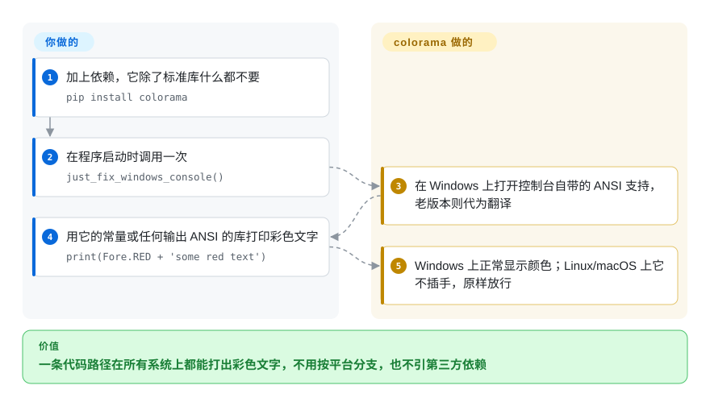

# colorama

一个极小的纯 Python 库，让 ANSI 颜色/样式转义码在 Windows 上也能工作——调一次 `colorama.init()`，那些在 Linux/macOS 上给你输出着色的同一套 ANSI 序列，如今在老式 Windows 终端里也能正确渲染。

## 何时使用

你在写一个 Python CLI——构建工具、测试 runner、部署脚本——想要红色的错误、绿色的成功、暗淡的次要文字。在 Linux 和 macOS 上你直接打印 ANSI 转义码（`\033[31m...`）。但你在老 Windows（cmd.exe、现代版之前的 conhost）上的用户看到的是 `←[31m` 这类乱码而非颜色，因为那些终端不解释 ANSI。你在启动处加上 `from colorama import just_fix_windows_console; just_fix_windows_console()`（或旧接口 `init()`），colorama 就在 Windows 上拦截 stdout/stderr，把 ANSI 码翻译成真正设置颜色的 Win32 控制台 API 调用——而在已经支持 ANSI 的平台上什么都不做（把 ANSI 原样透传）。结果是：一条代码路径、到处都是带色输出，不用 `if platform == 'windows'` 分支。它的 `Fore`、`Back`、`Style` 常量也给你可读的名字，而非裸的转义数字。

它是一大片 Python CLI 底下事实上的兼容垫片，也被许多更高层的颜色/UI 库打包进去——当你需要*跨平台带色终端文字*、又想要近乎零依赖时选它，而不是要一套完整 TUI。

## 怎么用起来

ANSI 转义码是夹在输出文字里的隐形指令——`\033[31m` 的意思是“接下来变红”——Unix 终端一直照办，老式 Windows 控制台却把它们当乱码印出来。colorama 就夹在你的程序和 Windows 控制台中间。**翻译这件事全归 colorama 管；你只在启动时调一个函数，然后照 Linux 上的习惯打印 ANSI。** 在 Windows 10 及以后，它只是打开控制台自带的“认 ANSI”开关；在更老的 Windows 上，它把 `sys.stdout`/`sys.stderr` 换成一个替身对象，把每个转义码摘出来，改用对应的 Win32 控制台调用（Windows 设置文字颜色的系统接口）重放一遍。在 Linux、macOS 上，或者输出被重定向到文件时，它什么都不做。`Fore` / `Back` / `Style` 常量是故意做得很简陋的——维护者明说不再接受生成新 ANSI 样式的功能，建议把 colorama 和 termcolor、blessings 或 Rich 搭着用。

<!-- flow-steps:begin (generated from flows/colorama.json by tools/flow_card.py — do not edit) -->

流程文字版

1. **你**：加上依赖，它除了标准库什么都不要 — `pip install colorama`
2. **你**：在程序启动时调用一次 — `just_fix_windows_console()`
3. **colorama**：在 Windows 上打开控制台自带的 ANSI 支持，老版本则代为翻译
4. **你**：用它的常量或任何输出 ANSI 的库打印彩色文字 — `print(Fore.RED + 'some red text')`
5. **colorama**：Windows 上正常显示颜色；Linux/macOS 上它不插手，原样放行

**价值**：一条代码路径在所有系统上都能打出彩色文字，不用按平台分支，也不引第三方依赖

<!-- flow-steps:end -->

## 何时不用

- **你只面向 Linux/macOS（或 Windows 10+）。** 在 Linux/macOS 上 colorama 什么都不做；在 Windows 10+ 上 `just_fix_windows_console()` 也只是打开控制台自带的 ANSI 开关——所以如果这个开关你已经自己管了，或只在 Windows Terminal 里跑，直接打印转义码（或用 `termcolor`）就行，不用它。它的核心价值是*老式 Windows*。
- **你想要富终端 UI——表格、布局、进度条、markdown。** colorama 只翻译颜色/样式码。要带样式的表格、spinner、实时布局、语法高亮，请找 **Rich**（一个大得多的库），或要完整 TUI 找 **Textual**。
- **你想要高层的样式人体工学。** colorama 给你的是偏裸的 `Fore.RED + text + Style.RESET_ALL`；像 **Rich** 或 **click.style** 这类库 API 更好。colorama 是底层垫片，常常在*它们底下*。
- **非 Python 技术栈。** 它只面向 Python；别的生态有各自的（Node 的 chalk 等）。
- **你需要处处保证 24 位 truecolor。** colorama 聚焦标准 ANSI SGR 码和 Windows 控制台翻译；truecolor 支持取决于终端，colorama 不是保证它的那一层。[未验证]

## 横向对比

| 替代品 | 是否收录 | 我们的评价 | 取舍 |
|---|---|---|---|
| [Rich（Textualize）](rich.zh.md) | ✅ | 需要颜色、表格、Markdown、进度和 traceback 等完整带样式输出工具包时，选 Rich。 | 完整的带样式输出工具包（颜色、表格、markdown、进度、traceback）——能力强太多，但是个大库；只要跨平台颜色就是杀鸡用牛刀。 |
| termcolor / colored | 未收录 | 需要极小、API 友好的 ANSI 颜色助手，且不需要老式 Windows ANSI 翻译时，选 termcolor / colored。 | 极小的 ANSI 颜色助手，API 友好，但不在老式 Windows 上翻译 ANSI——常和 colorama *搭配*以补这点。 |
| click.style（Click） | 未收录 | 需要 Click CLI 框架内方便的样式能力时，选 click.style。 | Click CLI 框架内方便的样式；Click 自身历史上为 Windows 垫片依赖 colorama。 |
| blessed / blessings | 未收录 | 需要基于 terminfo 的终端能力、光标和样式控制时，选 blessed / blessings。 | 终端能力 + 光标/样式库（基于 terminfo）——终端控制更丰富、更重，对 Windows-ANSI 缺口不那么聚焦。 |
| 裸 ANSI 转义码 | 未收录 | 想要零依赖且只面向支持 ANSI 的终端时，选裸 ANSI 转义码。 | 零依赖，在每个支持 ANSI 的终端都能用，但在老式 Windows 控制台上崩——正是 colorama 补的缺口。 |

## 技术栈

- **语言：** 纯 Python，无编译扩展。
- **机制：** 包住 `sys.stdout`/`sys.stderr`，在 Windows 上解析 ANSI SGR 序列并经 **Win32 控制台 API**（SetConsoleTextAttribute 等）重放；在别的平台上是透传。
- **API：** `init()`/`deinit()`/`just_fix_windows_console()`，加上 `Fore`、`Back`、`Style` 常量命名空间和 `AnsiToWin32` 内部实现。

## 依赖

- **运行时：** 只要 Python——**无第三方运行时依赖**（它用 ctypes/标准库调 Windows 控制台 API）。README 写明“除标准库外没有任何依赖”，PyPI 元数据里也没有 `requires_dist`；这种零依赖足迹正是它被如此广泛打包的一大原因。
- **外部服务：** 没有。
- **安装：** `pip install colorama`。

## 运维难度

**微不足道。** 一句 `pip install` 加一次 `just_fix_windows_console()` 调用（或旧接口 `init()`，README 警告它重复调用不安全，且不会再修它的问题）；没有要部署、配置或运维的东西。唯一实际要在意的是早点调用、记得 `Style.RESET_ALL` 以免颜色串色，并知道它在已支持 ANSI 的终端上基本是空操作——所以别指望它加上它本就不打算提供的能力（truecolor、TUI）。

## 健康度与可持续性

- **响应速度**：无法计算——no_traffic。
- **维护（2026-10）。** 最后一次提交在 2026-05-13，未归档；PyPI 上最新版本仍是 **0.4.6（2022-10）**。把它看成一个已经写完、偶尔有些整理性提交的库，而不是会继续发新版的库——对这么稳定的问题够用，但别等新功能。
- **治理 / bus factor。** owner 类型 **User**（tartley / Jonathan Hartley），有多位稳定贡献者（wiggin15、hugovk、njsmith、jdufresne）——bus factor 好于单人脚本，但仍是个人所有而非基金会背书。[推断]
- **年龄与 Lindy 判断。** **2014** 年创建，约 12 岁且**仍在维护**⇒ **强 Lindy** 信号；它是个安定、无处不在的依赖，它要解决的问题（老式 Windows 的 ANSI）本身也很稳定。[推断]
- **采用度。** 约 3.8k star，但真正的信号是**传递式无处不在**——它是海量 Python CLI 和颜色/UI 库的依赖（历史上 pip、Click、pytest 相关工具等都打包或依赖它）。[未验证]
- **风险标记。** **BSD-3-Clause**，宽松，未发现 relicense 历史。随着老式 Windows 退场（Windows 10+ 控制台原生支持 ANSI），这个库的*相关性*在缓慢收窄，但它仍是求广泛兼容的安全默认。

## 存疑（未验证）

- [未验证] 截至 2026-06 约 3.8k star / 约 279 fork / 约 137 open issue——对时间敏感，仅供参考。
- [推断] “相关性在收窄”是对老式 Windows 使用量下降的判断，不是测出来的趋势。
- [推断] README 说的 Windows 10+ 行为（“打开那个配置开关”）是照原文采信的；没测过 colorama 在不挂控制台的第三方 Windows 终端上的表现。
- [未验证] 跨终端的 truecolor（24 位）行为在 colorama 的保证范围之外，这里未经核实。
