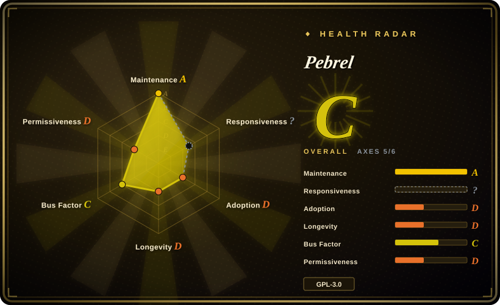
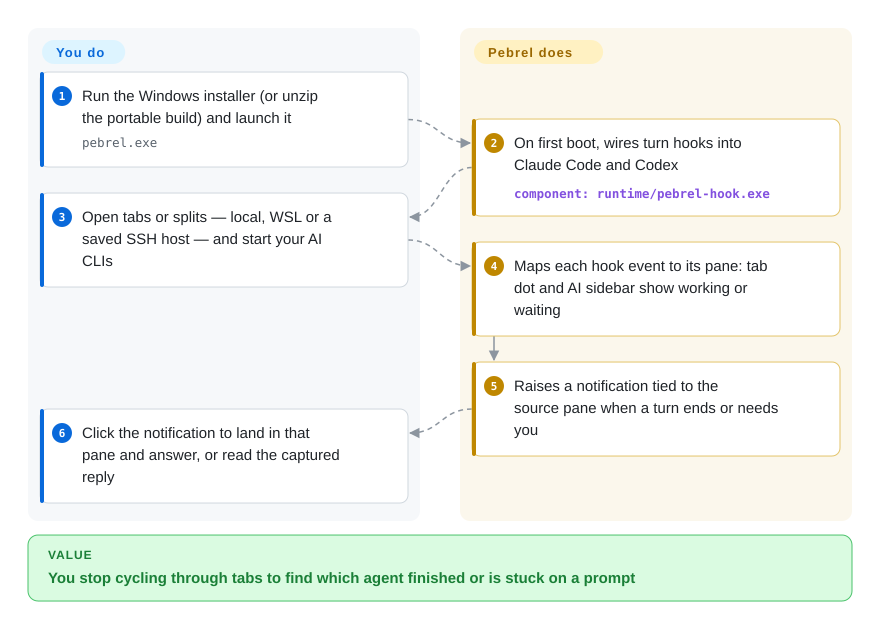

# Pebrel

You run Claude Code in one tab, Codex in another and an SSH session in a third on a Windows machine, and the only way to learn which agent finished or is stuck on a permission prompt is to click through every tab. Pebrel is a desktop terminal that installs hooks into those AI CLIs, so each pane reports its own state — working, waiting for you, done — and a notification jumps you straight to the pane that needs you.

## When to use

You are a developer on Windows 10/11 whose day is three or four AI coding CLIs plus a couple of servers. Today that is Windows Terminal with a dozen tabs, a separate SSH/SFTP client for file transfer, and the recurring moment where Codex has been sitting on `Allow this command? (y/n)` for twenty minutes in a tab you forgot about. You reach for Pebrel because it bundles the three things into one native window: local/WSL/SSH panes with splits and saved layouts, an SFTP browser beside them, and — the deciding part — hook integration that turns each Claude Code / Codex / opencode / Pi turn into a per-pane state dot, an AI activity sidebar and a notification that returns you to the source pane. On Windows it also keeps sessions alive in the tray when you close the window.

You pick it over [Windows Terminal](https://github.com/microsoft/terminal) or [Alacritty](alacritty.md) because neither knows what runs inside a pane; over [herdr](../agent-frameworks/coding-agents/orchestration-and-review/herdr.md) because you want a GUI app with SSH/SFTP and a Markdown/formula reader rather than a TUI multiplexer inside another terminal; and over [Warp](warp.md) because Pebrel's source is actually open (GPL-3.0) and it targets Windows first. The price is betting on a twelve-week-old, essentially single-maintainer project.

## How it works

Pebrel is a desktop app: a terminal core derived from Alacritty (the part that turns a program's output into a grid of characters) drawn by GPUI, the GPU-accelerated UI toolkit from the Zed editor, with a pinned fork as its platform layer. On first boot on Windows it writes small hook entries into your AI CLIs' own config files — think of it as leaving a doorbell on each agent — so that every time an agent starts a turn, asks for permission or stops, a helper (`pebrel-hook.exe`) rings Pebrel with the pane id; Linux and macOS Preview builds do not configure these hooks automatically. Pebrel does the bookkeeping: it maps events to panes, colours the tab dot, fills the AI sidebar, raises the notification and captures the answer into a reader. You still run the agents yourself, decide what to approve, and keep your API keys wherever the CLI keeps them (an optional provider panel can store keys in the OS credential store and, after an explicit confirm, write a provider into `~/.codex/config.toml`). A second surface exists for automation: every local pane exports `PEBREL_CLI`, and a token-guarded loopback API lets a script or an agent run `pebrel pane send` / `pebrel agent send` to drive other panes — useful for multi-agent setups, and also a capability to be aware of.

<!-- flow-steps:begin (generated from flows/pebrel.json by tools/flow_card.py — do not edit) -->

Text version of the flow

1. **You**: Run the Windows installer (or unzip the portable build) and launch it — `pebrel.exe`
2. **Pebrel**: On first boot, wires turn hooks into Claude Code and Codex — component: `runtime/pebrel-hook.exe`
3. **You**: Open tabs or splits — local, WSL or a saved SSH host — and start your AI CLIs
4. **Pebrel**: Maps each hook event to its pane: tab dot and AI sidebar show working or waiting
5. **Pebrel**: Raises a notification tied to the source pane when a turn ends or needs you
6. **You**: Click the notification to land in that pane and answer, or read the captured reply

**Value**: You stop cycling through tabs to find which agent finished or is stuck on a prompt

<!-- flow-steps:end -->

## When NOT to use

- **You are not on Windows.** Linux and macOS builds are labelled Preview; tray residency, the global quick-terminal hotkey, automatic AI-hook setup and automatic updates are Windows-only, and the macOS DMGs are ad-hoc-signed, not notarized (INSTALL.md, 2026-09-28). On macOS/Linux use [WezTerm](https://github.com/wezterm/wezterm) or [Alacritty](alacritty.md) for the terminal, plus [herdr](../agent-frameworks/coding-agents/orchestration-and-review/herdr.md) if you want agent state.
- **You hand-manage your agents' hook configuration.** First boot edits Claude Code, Codex, opencode and Pi config to add Pebrel-owned hooks. INSTALL.md says user-owned entries are preserved, but an open issue (#297, 2026-09-26) reports the generated opencode hook failing to load under OpenCode 2.x. If your hooks live in version-controlled dotfiles, keep Windows Terminal or [tmux](tmux.md)/[Zellij](zellij.md) and wire your own notifications rather than letting a GUI app co-own those files.
- **You need a long-horizon, low-churn tool for a team.** The repo is twelve weeks old, the owner account was created in June 2026, one author has made roughly 80% of the ~840 commits, and there were 15 releases in seven weeks. For a fleet default pick [Windows Terminal](https://github.com/microsoft/terminal) (Microsoft-backed, since 2017) or Alacritty.
- **You want the smallest attack surface on a shared host.** The runtime API lets any process running as your user send keystrokes to any pane (`pane send`, `agent send`); its docs state the random token does not defend against an attacker who can already read your user's files. On a multi-tenant or sensitive box prefer a terminal with no control plane (Alacritty) and do agent supervision elsewhere.
- **You need a library or embeddable terminal widget.** Pebrel is an application; internal crates are named `nebula_*`, are not published for reuse, and GPUI is pulled from a pinned fork. For an embeddable VT engine look at `alacritty_terminal` (未收录) or WezTerm's crates.
- **You need a proprietary-friendly license or a vetted supply chain.** GPL-3.0-or-later; the Windows release bundles `OpenConsole.exe`/`conpty.dll` side-loaded next to the exe, and 1.9.1's CHANGELOG still lists SHA-256 values as `PENDING FINAL BUILD` (a `SHA256SUMS` asset is attached to the release). Verify artifacts before rolling out.

## Comparison

| Alternative | In index | Our verdict | Tradeoff |
|---|---|---|---|
| Windows Terminal | not indexed | For a stable Windows terminal that a whole team can standardize on, pick Windows Terminal; pick Pebrel only when per-pane AI-agent state and built-in SSH/SFTP are worth adopting a twelve-week-old project. | Windows Terminal: MIT, Microsoft-maintained since 2017, ~105k stars, but agent-blind and no SFTP. Pebrel: agent-aware, SSH/SFTP, tray residency, single-maintainer risk. Not added in this tab-intake batch. |
| [Warp](warp.md) | ✅ | If you want an AI-first terminal with its own agent and blocks and accept closed source, Warp; if you want open source on Windows that hosts *your* CLIs (Claude Code, Codex) instead of shipping its own agent, Pebrel. | Warp: polished commercial product, proprietary code, account for some features. Pebrel: GPL source, bring-your-own agent CLIs, far younger and Windows-first. |
| [herdr](../agent-frameworks/coding-agents/orchestration-and-review/herdr.md) | ✅ | For agent-state supervision that runs over SSH and inside any terminal, choose herdr; choose Pebrel when you want the same "which agent needs me" signal inside a native GUI with SFTP, readers and Windows tray residency. | herdr: TUI multiplexer, cross-platform, scriptable, no GUI. Pebrel: GUI app, Windows-first, heavier surface; both are 2026-vintage projects. |
| [Alacritty](alacritty.md) | ✅ | For a minimal, fast, long-lived GPU terminal pick Alacritty and add a multiplexer; pick Pebrel when tabs, splits, SSH and agent awareness should come in the box. | Alacritty: A-grade health, no tabs/splits by design, no network surface. Pebrel: reuses Alacritty's terminal core but adds a large app surface and a local control API. |
| WezTerm | not indexed | On macOS/Linux, or when you want a Lua-scriptable cross-platform terminal with a built-in multiplexer and SSH domains, pick WezTerm; Pebrel only wins on Windows with AI-CLI hooks. | WezTerm: mature (since 2018), cross-platform, last tagged release 2024-02 with nightly builds since. Pebrel: newer, agent-aware, Windows-first. Not added in this tab-intake batch. |

## Tech stack

- **Rust 2024 edition**, toolchain pinned to 1.97.1; Cargo workspace of `nebula_app`, `nebula_terminal` (grid/VT/PTY), `nebula_split`, `nebula_settings`, `nebula_config`, `nebula_hook`, `nebula-completions`, `nebula_gpui` (a component lab, not shipped) — `Cargo.toml`, 2026-09-28.
- **UI:** GPUI (`gpui =0.2.2`) with `gpui_platform` from a pinned fork `Kuddev/zed`, plus `gpui-component`; a legacy winit/OpenGL renderer is kept behind the `legacy-shell` feature.
- **Terminal core:** builds on Alacritty (README acknowledgements); Windows PTY via ConPTY with a bundled `OpenConsole.exe`/`conpty.dll`.
- **SSH/SFTP:** `russh` + `russh-sftp`; **config:** Lua 5.4 via `mlua` (TOML still accepted); **storage:** `rusqlite` (bundled SQLite); **HTTP:** `ureq` for update checks.
- **AI integration:** hook bridge `pebrel-hook.exe` plus bundled hook scripts for opencode (`opencode.js`), Pi (`pi.ts`) and remote shells (Python).

## Dependencies

- **Windows 10 1809+ / 11 x64** for the full feature set (Windows ARM64 portable ZIP exists; installer and auto-install are x64-only). Direct3D feature level 10.1+.
- **Linux Preview:** x86_64, glibc 2.35+; saving SSH secrets needs `libsecret-tools` and an unlocked Secret Service keyring.
- **macOS Preview:** 14+ deployment target, arm64 or x64; ad-hoc signed.
- **Optional:** the AI CLIs you want tracked (Claude Code, Codex, opencode, Pi); Codex's full hook set needs codex-cli ≥ 0.154.0, older versions fall back to turn-only events (`ai_hook/installation.rs`).
- **Building from source:** rustup with the pinned toolchain; macOS builds need SDK 26+.

## Ops difficulty

**Low for one developer, medium for a team.** Install is an `.exe` wizard (per-user, no admin) or a portable ZIP, and it self-updates on Windows. The operational weight is elsewhere: it writes into your AI CLIs' config and adds a helper process (an open issue, #259, reports the Pi notification helper staying resident and blocking updates), it opens a loopback control API, and near-daily releases mean you are tracking a fast-moving target. Uninstall runs `pebrel setup-ai --remove` to take its hooks back out.

## Health & viability

- **Maintenance (2026-09-28).** Extremely active: 15 releases from v1.0.0 (2026-08-10) to v1.9.1 (2026-09-24), 12–29 commits a day in the last week, fixes referencing issues within days. The flip side is churn — an app renamed from Nebula to Pebrel in 1.6 with a data-directory migration.
- **Governance / bus factor.** Personal account `Kuddev` (created 2026-06-11) owns the repo and authored ~670 of ~840 commits (GitHub contributor stats: top-1 share 0.799, 2026-09-28); the next contributor has 92. External PRs are being merged (1.9.1 credits two outside contributors), and the repo carries unusually strict agent/contributor rules (`AGENTS.md`, architecture budgets, `pr-size` check). Still a single-owner roadmap.
- **Backing & age × Lindy.** No company or foundation; the README carries a sponsor block for an API reseller. Twelve weeks old — no Lindy credit yet. ROADMAP.md also notes the entire git history was rewritten on 2026-08-13 to strip co-author trailers, so older commit hashes are not stable.
- **Adoption.** ~2.5k stars and 133 forks after twelve weeks (2026-09-28) — fast for the age, which is a hype-risk signal rather than proof. Release downloads are concrete: the 1.9.1 Windows installer had ~1.7k downloads four days after release; Linux/macOS assets are in the tens.
- **Risk flags.** GPL-3.0-or-later (fine for use, copyleft for derivatives); dependency on a personal GPUI fork; a local control plane that can type into panes; 93 open issues/PRs. No relicense history (too young to have one).

## Caveats (unverified)

- [未验证] That Pebrel's hook installation preserves all user-owned hook entries is INSTALL.md's claim; this page did not test it against a hand-written Claude Code / Codex config.
- [未验证] Linux/macOS behaviour of AI-state tracking without automatic hook setup (whether a manual `pebrel setup-ai` restores it) was not tested; INSTALL.md only says automatic local configuration is Windows-only.
- [推断] The ~80% single-author share (GitHub contributor stats: top-1 share 0.799, top-3 0.93, 2026-09-28) counts commits, not review or design ownership; squash merges and the 2026-08-13 history rewrite can skew it.
- [推断] Reading the star growth as a hype-risk signal is this index's heuristic for a twelve-week-old repo; no evidence of inorganic stars was found or looked for in detail.
- [未验证] The "terminal core derived from Alacritty" wording rests on the README acknowledgement and `THIRD-PARTY-NOTICES`; how much of `nebula_terminal` is still upstream Alacritty code was not measured.
- [未验证] The runtime API's security boundary (127.0.0.1 + random token in `runtime.port`) is from `docs/runtime-control-api.md`; it was not probed.
- [未验证] Direct3D 10.1 and Windows Server 2019 compatibility claims come from INSTALL.md and were not reproduced.
