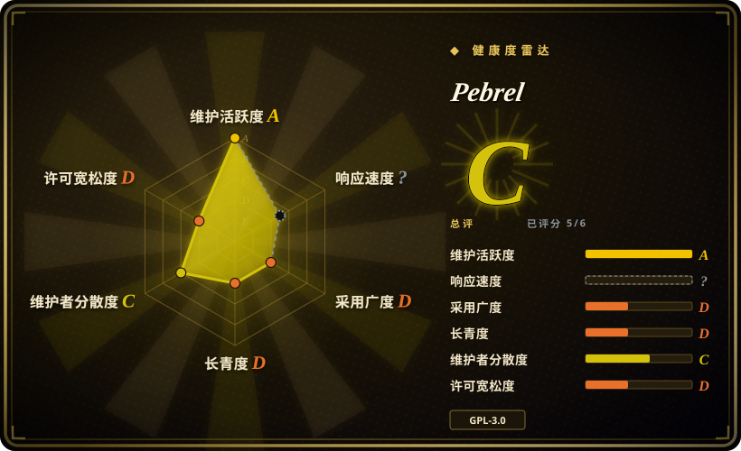
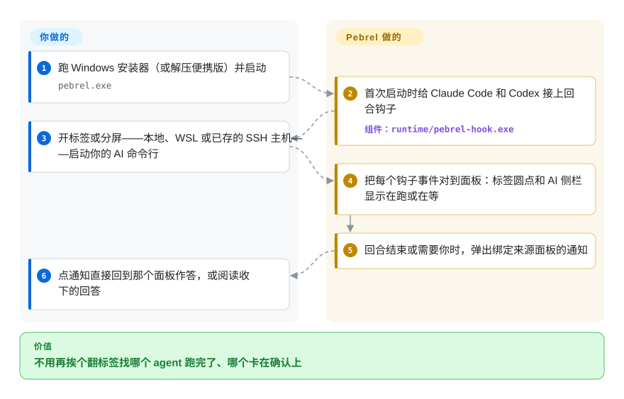

# Pebrel

你在 Windows 上一个标签开 Claude Code、一个开 Codex、再开一个 SSH，想知道哪个 agent 跑完了、哪个卡在权限确认上，只能挨个点开标签看。Pebrel 是一个桌面终端，它往这些 AI 命令行工具里装钩子，让每个面板自己报状态——在跑、等你、跑完了——通知一点就跳回需要你的那个面板。

## 何时使用

你在 Windows 10/11 上写代码，一天里同时开着三四个 AI 编程命令行，外加几台服务器。现在的做法是 Windows Terminal 开一排标签，另装一个 SSH/SFTP 客户端传文件，然后反复遇到这种时刻：Codex 停在 `Allow this command? (y/n)` 上等了二十分钟，而那个标签你早忘了。你选 Pebrel，是因为它把三样东西装进一个原生窗口：本地／WSL／SSH 面板加分屏和布局保存，旁边一个 SFTP 文件浏览器，以及真正起决定作用的部分——给 Claude Code／Codex／opencode／Pi 装钩子，把每一轮对话变成面板上的状态圆点、一个 AI 活动侧栏和一条能带你回到来源面板的通知。在 Windows 上关掉窗口时它还能驻留托盘，让会话继续活着。

选它而不选 [Windows Terminal](https://github.com/microsoft/terminal) 或 [Alacritty](alacritty.zh.md)，是因为后两者都不知道面板里跑的是什么；不选 [herdr](../agent-frameworks/coding-agents/agent-multiplexers/herdr.zh.md)，是因为你要的是带 SSH/SFTP 和 Markdown／公式阅读器的图形应用，而不是跑在另一个终端里的 TUI 复用器；不选 [Warp](warp.zh.md)，是因为 Pebrel 的源码真的开放（GPL-3.0），而且以 Windows 为第一平台。代价是押注一个只有十二周、基本由一个人维护的项目。

## 怎么用起来

Pebrel 是一个桌面应用：终端核心来自 Alacritty（负责把程序输出变成一格一格字符网格的那部分），界面由 GPUI 绘制——GPUI 是 Zed 编辑器那套用 GPU 加速的界面工具包，平台层用的是一个固定版本的分叉。在 Windows 上第一次启动时，它会往各个 AI 命令行自己的配置文件里写几条钩子——相当于在每个 agent 门口装一个门铃：agent 每开始一轮、请求权限或停下来，辅助程序 `pebrel-hook.exe` 就带着面板编号按一下 Pebrel 的门铃；Linux 和 macOS 的 Preview 版不会自动配置这些钩子。Pebrel 负责记账：把事件对应到面板、给标签圆点上色、填 AI 侧栏、弹通知、把回答收进阅读器。agent 仍然由你自己启动，批不批准由你决定，API key 也还放在命令行工具原来的地方（可选的供应商面板能把 key 存进系统凭据库，并在你明确确认后把供应商写进 `~/.codex/config.toml`）。另外还有一个面向自动化的入口：每个本地面板都会导出 `PEBREL_CLI`，一个用 token 保护的本机回环 API 让脚本或 agent 能用 `pebrel pane send`／`pebrel agent send` 去操作别的面板——做多 agent 协作很方便，同时也是一项需要心里有数的能力。

<!-- flow-steps:begin (generated from flows/pebrel.json by tools/flow_card.py — do not edit) -->

流程文字版

1. **你**：跑 Windows 安装器（或解压便携版）并启动 — `pebrel.exe`
2. **Pebrel**：首次启动时给 Claude Code 和 Codex 接上回合钩子 — 组件：`runtime/pebrel-hook.exe`
3. **你**：开标签或分屏——本地、WSL 或已存的 SSH 主机——启动你的 AI 命令行
4. **Pebrel**：把每个钩子事件对到面板：标签圆点和 AI 侧栏显示在跑或在等
5. **Pebrel**：回合结束或需要你时，弹出绑定来源面板的通知
6. **你**：点通知直接回到那个面板作答，或阅读收下的回答

**价值**：不用再挨个翻标签找哪个 agent 跑完了、哪个卡在确认上

<!-- flow-steps:end -->

## 何时不用

- **你不在 Windows 上。** Linux 和 macOS 版本标着 Preview；托盘驻留、全局快捷终端热键、AI 钩子自动配置和自动更新都只有 Windows 有，macOS 的 DMG 只做了 ad-hoc 签名、没有公证（INSTALL.md，2026-09-28）。macOS／Linux 上终端用 [WezTerm](https://github.com/wezterm/wezterm) 或 [Alacritty](alacritty.zh.md)，要看 agent 状态再加 [herdr](../agent-frameworks/coding-agents/agent-multiplexers/herdr.zh.md)。
- **你自己手工管理 agent 的钩子配置。** 首次启动会改 Claude Code、Codex、opencode 和 Pi 的配置，加入 Pebrel 自有的钩子。INSTALL.md 说用户自己的条目会保留，但有一个未关闭的 issue（#297，2026-09-26）报告生成的 opencode 钩子在 OpenCode 2.x 下加载失败。如果你的钩子放在受版本管理的 dotfiles 里，就继续用 Windows Terminal 或 [tmux](tmux.zh.md)／[Zellij](zellij.zh.md)，自己接通知，别让一个图形应用和你共同持有这些文件。
- **你要给团队选一个长期、低变动的工具。** 仓库才十二周，所有者账号 2026 年 6 月才注册，约 840 个提交里一个作者占了大约八成，七周内发了 15 个版本。团队默认终端选 [Windows Terminal](https://github.com/microsoft/terminal)（微软维护，2017 年起）或 Alacritty。
- **你要在共享主机上把攻击面压到最小。** 运行时 API 让任何以你身份运行的进程都能往任意面板打字（`pane send`、`agent send`）；它的文档自己写明，随机 token 挡不住已经能读你用户文件的攻击者。多租户或敏感机器上选没有控制面的终端（Alacritty），agent 监督放到别处做。
- **你需要一个库或可嵌入的终端组件。** Pebrel 是应用；内部 crate 叫 `nebula_*`，没有为复用发布，GPUI 还来自一个固定版本的分叉。要可嵌入的 VT 引擎，去看 `alacritty_terminal`（未收录）或 WezTerm 的 crate。
- **你需要对闭源友好的许可证，或供应链要过审。** 许可证是 GPL-3.0-or-later；Windows 发行包把 `OpenConsole.exe`／`conpty.dll` 侧载在 exe 旁边，1.9.1 的 CHANGELOG 里 SHA-256 还写着 `PENDING FINAL BUILD`（发布页另附了 `SHA256SUMS` 文件）。批量部署前先自己校验安装包。

## 横向对比

| 替代品 | 是否收录 | 我们的评价 | 取舍 |
|---|---|---|---|
| Windows Terminal | 未收录 | 要一个能让全团队统一的稳定 Windows 终端，选 Windows Terminal；只有当面板级 AI agent 状态和内置 SSH/SFTP 值得你去用一个十二周大的项目时，才选 Pebrel。 | Windows Terminal：MIT，微软 2017 年起维护，约 10.5 万星，但看不见 agent、没有 SFTP。Pebrel：感知 agent、带 SSH/SFTP、托盘驻留，单维护者风险。本批次 tab 收录未添加。 |
| [Warp](warp.zh.md) | ✅ | 想要自带 agent 和命令块的 AI 优先终端、能接受闭源，选 Warp；想要在 Windows 上开源、承载你自己的命令行（Claude Code、Codex）而不是自带 agent，选 Pebrel。 | Warp：打磨好的商业产品，代码闭源，部分功能要账号。Pebrel：GPL 源码，自带 agent 命令行由你选，年轻得多且以 Windows 为先。 |
| [herdr](../agent-frameworks/coding-agents/agent-multiplexers/herdr.zh.md) | ✅ | 要能跑在 SSH 上、嵌进任何终端的 agent 状态监督，选 herdr；要在原生图形界面里拿到同样的“哪个 agent 在等我”信号，外加 SFTP、阅读器和 Windows 托盘驻留，选 Pebrel。 | herdr：TUI 复用器，跨平台，可脚本化，没有图形界面。Pebrel：图形应用，Windows 为先，功能面更大；两者都是 2026 年的新项目。 |
| [Alacritty](alacritty.zh.md) | ✅ | 要极简、快、长寿的 GPU 终端，选 Alacritty 再配一个复用器；要标签、分屏、SSH 和 agent 感知开箱即用，选 Pebrel。 | Alacritty：健康度 A，刻意不做标签和分屏，没有网络面。Pebrel：复用了 Alacritty 的终端核心，但加了很大的应用面和本机控制 API。 |
| WezTerm | 未收录 | 在 macOS／Linux 上，或者想要 Lua 可编程、自带复用器和 SSH 域的跨平台终端，选 WezTerm；Pebrel 只在 Windows 加 AI 命令行钩子这个场景胜出。 | WezTerm：成熟（2018 年起），跨平台，最近一个正式标签是 2024-02，之后靠 nightly 构建。Pebrel：更新、感知 agent、Windows 为先。本批次 tab 收录未添加。 |

## 技术栈

- **Rust 2024 edition**，工具链固定在 1.97.1；Cargo 工作区包括 `nebula_app`、`nebula_terminal`（网格／VT／PTY）、`nebula_split`、`nebula_settings`、`nebula_config`、`nebula_hook`、`nebula-completions`、`nebula_gpui`（组件实验场，不随产品发布）——据 `Cargo.toml`，2026-09-28。
- **界面：** GPUI（`gpui =0.2.2`），`gpui_platform` 来自固定版本的分叉 `Kuddev/zed`，外加 `gpui-component`；旧的 winit/OpenGL 渲染器保留在 `legacy-shell` feature 后面。
- **终端核心：** 基于 Alacritty（README 致谢）；Windows 上的 PTY 走 ConPTY，随包附带 `OpenConsole.exe`／`conpty.dll`。
- **SSH/SFTP：** `russh` + `russh-sftp`；**配置：** 通过 `mlua` 用 Lua 5.4（仍兼容 TOML）；**存储：** `rusqlite`（内置 SQLite）；**HTTP：** 更新检查用 `ureq`。
- **AI 集成：** 钩子桥接程序 `pebrel-hook.exe`，以及为 opencode（`opencode.js`）、Pi（`pi.ts`）和远程 shell（Python）准备的钩子脚本。

## 依赖

- **完整功能需要 Windows 10 1809+／11 x64**（Windows ARM64 有便携 ZIP；安装器和自动安装只支持 x64）。需要 Direct3D feature level 10.1 以上。
- **Linux Preview：** x86_64，glibc 2.35+；保存 SSH 密码需要 `libsecret-tools` 和一个已解锁的 Secret Service 钥匙串。
- **macOS Preview：** 部署目标 14+，arm64 或 x64；ad-hoc 签名。
- **可选：** 你想追踪的 AI 命令行（Claude Code、Codex、opencode、Pi）；Codex 的完整钩子事件集要求 codex-cli ≥ 0.154.0，更老的版本退回只报回合事件（`ai_hook/installation.rs`）。
- **从源码构建：** 用固定工具链的 rustup；macOS 构建需要 SDK 26+。

## 运维难度

**个人用低，团队用中等。** 安装就是一个 `.exe` 向导（按用户安装，不需要管理员）或一个便携 ZIP，Windows 上能自动更新。运维的分量在别处：它会写入你 AI 命令行的配置，并多出一个辅助进程（未关闭的 issue #259 报告 Pi 通知辅助程序长期驻留，挡住了更新替换文件），它会开一个本机回环控制 API，而且几乎每天发版意味着你在追一个快速移动的目标。卸载时会运行 `pebrel setup-ai --remove`，把它加的钩子拿掉。

## 健康度与可持续性

- **维护（2026-09-28）。** 极其活跃：从 v1.0.0（2026-08-10）到 v1.9.1（2026-09-24）共 15 个版本，最近一周每天 12–29 个提交，引用 issue 的修复几天内就落地。反面是变动大——1.6 版从 Nebula 改名为 Pebrel，还带了一次数据目录迁移。
- **治理／巴士因子。** 仓库归个人账号 `Kuddev`（2026-06-11 注册）所有，约 840 个提交里它写了约 670 个（GitHub 贡献者统计第一名占 0.799，2026-09-28），第二名是 92 个。外部 PR 在被合并（1.9.1 致谢了两位外部贡献者），仓库还有异常严格的 agent／贡献者规则（`AGENTS.md`、架构行数预算、`pr-size` 检查）。路线图仍由一个人掌握。
- **背书与年龄 × Lindy。** 没有公司或基金会；README 里挂着一个 API 中转商的赞助位。项目只有十二周，谈不上 Lindy 加分。ROADMAP.md 还记录了 2026-08-13 为剔除联合作者尾注重写了整个 git 历史，所以更早的提交哈希并不稳定。
- **采用度。** 十二周约 2.5k 星、133 个 fork（2026-09-28）——相对年龄增长很快，这是炒作风险信号而不是质量证明。发布下载量更实在：1.9.1 的 Windows 安装器发布四天约 1.7k 次下载，Linux/macOS 包只有几十次。
- **风险信号。** GPL-3.0-or-later（使用没问题，衍生作品受 copyleft 约束）；依赖个人维护的 GPUI 分叉；有一个能往面板里打字的本机控制面；93 个未关闭的 issue/PR。没有改许可证的历史（太年轻，还谈不上）。

## 存疑（未验证）

- [未验证] “钩子安装会保留所有用户自有条目”是 INSTALL.md 的说法；本页没有拿手写的 Claude Code／Codex 配置实测。
- [未验证] 在 Linux/macOS 上没有自动钩子配置时，AI 状态追踪能否靠手动 `pebrel setup-ai` 恢复没有测试；INSTALL.md 只说自动本地配置仅限 Windows。
- [推断] 约八成的单作者占比（GitHub 贡献者统计：第一名占 0.799，前三名占 0.93，2026-09-28）数的是提交，不是评审或设计的主导权；squash 合并和 2026-08-13 的历史重写都可能让它失真。
- [推断] 把星数增长读成炒作风险，是本索引对十二周大仓库的启发式判断；没有发现、也没有深入查找刷星证据。
- [未验证] “终端核心来自 Alacritty”依据的是 README 致谢和 `THIRD-PARTY-NOTICES`；`nebula_terminal` 里还有多少上游 Alacritty 代码没有度量。
- [未验证] 运行时 API 的安全边界（只监听 127.0.0.1，加上 `runtime.port` 里的随机 token）来自 `docs/runtime-control-api.md`，没有实际探测。
- [未验证] Direct3D 10.1 和 Windows Server 2019 兼容性的说法来自 INSTALL.md，没有复现。
