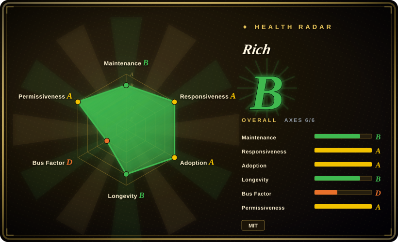
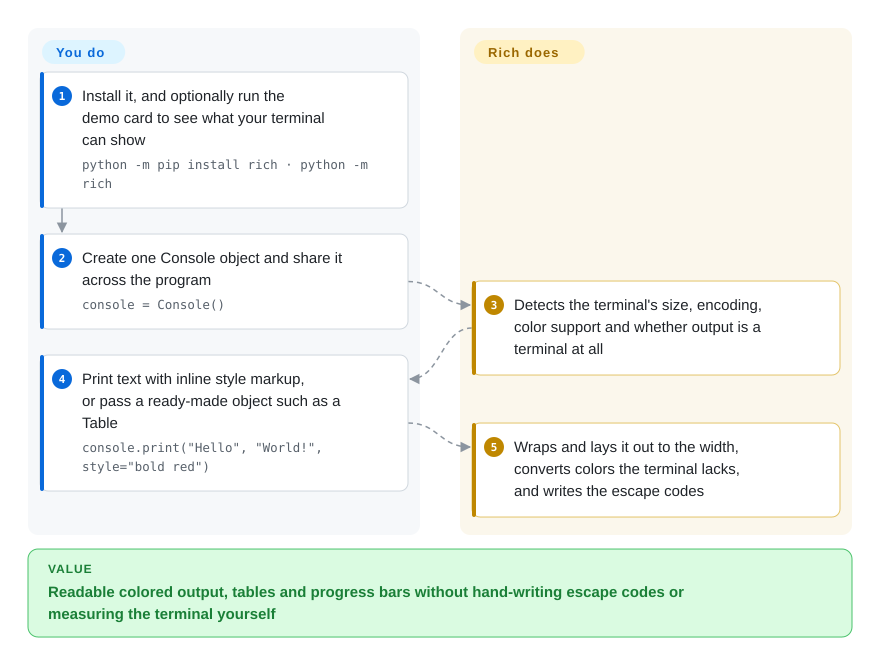

# Rich

Your Python script's output is a wall of same-colored text: errors look like log lines, a table is a column of misaligned `print`s, and a crash dumps a traceback nobody can read. Rich gives you one `print`-like call that adds color, wraps to the terminal width, and draws tables, progress bars, highlighted code and readable tracebacks — then quietly drops the decoration when the output is not a terminal.

## When to use

You maintain a Python command-line tool — a deploy script, a data-pipeline runner, an internal admin CLI — and its output has grown into something like `Processing 4123 rows... done` followed by a raw dict dump and, on failure, forty lines of grey traceback. You want the failed step in red, a summary table whose columns line up, a progress bar for the slow loop, and tracebacks that show the surrounding code. Hand-writing ANSI escape codes (`\033[1;31m`) gives you color but not layout, and breaks the moment someone pipes the output into a file.

You reach for Rich because it covers all of that from one dependency with a `print`-shaped API: `console.print(...)` with `[bold red]...[/bold red]` markup, `Table`, `track()` for progress, `rich.traceback.install()` for crashes, and a `logging` handler for existing log calls. It beats a tiny color helper (colorama, termcolor) when you need *layout* and not just color, and it beats a full TUI framework (Textual, urwid) when output simply scrolls past and the user never needs to click or type into it. It is so widely used that pip itself vendors a copy.

## How it works

Everything goes through a `Console` object — Rich's stand-in for the terminal. When you create it, **Rich works out the facts about where the output is going**: the window's width and height, the text encoding, which color standard the terminal speaks (16 colors, 256, or full "true color"), and whether it is a terminal at all rather than a file or a pipe. You then hand it either text with inline style tags — a markup borrowed from forum bbcode, like `[bold cyan]Will[/bold cyan]` — or a *renderable*, an object such as `Table`, `Markdown` or `Syntax` that knows how to lay itself out at a given width. **You decide what to show; Rich decides how it fits**: it wraps and measures to the width, swaps colors the terminal cannot display for the nearest it can, and only then writes the escape codes. Progress bars and spinners use a "live" display that redraws the same lines in place, which is why they need a real terminal; standard environment variables (`NO_COLOR`, `FORCE_COLOR`, `TERM=dumb`) override the detection.

<!-- flow-steps:begin (generated from flows/rich.json by tools/flow_card.py — do not edit) -->

Text version of the flow

1. **You**: Install it, and optionally run the demo card to see what your terminal can show — `python -m pip install rich · python -m rich`
2. **You**: Create one Console object and share it across the program — `console = Console()`
3. **Rich**: Detects the terminal's size, encoding, color support and whether output is a terminal at all
4. **You**: Print text with inline style markup, or pass a ready-made object such as a Table — `console.print("Hello", "World!", style="bold red")`
5. **Rich**: Wraps and lays it out to the width, converts colors the terminal lacks, and writes the escape codes

**Value**: Readable colored output, tables and progress bars without hand-writing escape codes or measuring the terminal yourself

<!-- flow-steps:end -->

## When NOT to use

- **Users must interact with the screen** — navigate lists, click buttons, fill forms. Rich prints and redraws output; it has no event loop. Use [Textual](textual.md), built by the same author on top of Rich, or prompt_toolkit for line-editing prompts.
- **You only need colors to work on old Windows consoles.** That needs a stdlib-only shim, not a rendering library: use [colorama](colorama.md) (no dependencies) or termcolor and print escape codes yourself.
- **A progress bar is the only feature you want.** [tqdm](../dev-utilities/data-tools/tqdm.md) is a smaller dependency with a one-call wrapper and pandas/notebook integration; reach for `rich.progress` when you already depend on Rich or need several bars and columns at once.
- **Your output is parsed by other programs.** Rich word-wraps to the terminal width and highlights numbers, paths and repr output by default, which changes the text a machine reads. Write machine-facing output with plain `print`/`json.dumps`, or `Console(highlight=False, soft_wrap=True)`, and keep Rich for the human-facing stream.
- **Startup time or dependency count is tight** — tiny Lambda-style scripts, environments that forbid third-party packages. Rich pulls in `pygments` and `markdown-it-py`; recent releases added lazy loading to cut import time, but the stdlib (`print`, `logging`, `curses`) costs nothing.
- **You are on Python 3.8.** Rich 15.0.0 (2026-04) dropped 3.8; pin `rich<15` there, and do not trust the README's "3.8 or later" line.

## Comparison

| Alternative | In index | Our verdict | Tradeoff |
|---|---|---|---|
| [Textual](textual.md) | ✅ | For formatted output that scrolls past, pick Rich; pick Textual once the user has to navigate, click or type inside the UI. | Textual adds layout, events and widgets on top of Rich at the cost of an app architecture; Rich is a print-style library with almost no learning curve. |
| [colorama](colorama.md) | ✅ | For color alone with zero dependencies — especially on legacy Windows consoles — pick colorama; pick Rich once you need tables, wrapping, progress or tracebacks. | colorama only translates escape codes and has had no release since 2022; Rich is far larger but does layout and terminal detection itself. |
| [tqdm](../dev-utilities/data-tools/tqdm.md) | ✅ | For a single progress bar with the lightest footprint and pandas/notebook hooks, pick tqdm; pick `rich.progress` when the CLI already uses Rich or needs multi-bar, multi-column displays. | tqdm is one focused tool; Rich's progress is one feature inside a broader rendering library. |
| termcolor | 未收录 | For a few colored words in a script that must stay tiny, pick termcolor; pick Rich when output structure, not just color, is the problem. | termcolor is a minimal color helper with no layout, width detection or renderables. |
| prompt_toolkit | 未收录 | For interactive input — autocompletion, key bindings, line editing — pick prompt_toolkit; pick Rich for output. | prompt_toolkit owns the input side; Rich's `Prompt` only covers simple questions. The two are often used together. |

## Tech stack

- **Language:** pure Python, fully type-annotated (`py.typed`, mypy strict in CI); requires Python ≥ 3.9 as of v15.0.0.
- **Rendering model:** a `Console` that detects terminal capabilities and renders *renderables* (anything implementing Rich's console protocol) into styled segments, then into escape codes; legacy Windows consoles are handled by Rich's own Windows path, limited to 16 colors.
- **Built-in renderables:** Table, Tree, Columns, Panel, Markdown, Syntax, Progress/Live/Status, Traceback, pretty-printing, plus a `logging.Handler` (`RichHandler`).
- **Packaging:** Poetry project, published to PyPI as `rich`; MIT license.

## Dependencies

- **Runtime:** `pygments` (syntax highlighting) and `markdown-it-py` (Markdown parsing); `ipywidgets` only for the optional `jupyter` extra.
- **Environment:** a terminal for the full experience; it also works in Jupyter without extra configuration, and degrades to plain text when output is redirected. Truecolor and emoji need a modern terminal (on Windows, Windows Terminal rather than the classic console).
- **External services:** none.

## Ops difficulty

**Low.** It is a library: `pip install rich` and import it. The operational care is in version and output hygiene: pin a major version, because Rich has shipped two major versions (14.0, 15.0) in about a year and v15 dropped Python 3.8; check CI and log collectors, which are not terminals, so progress bars disappear and wrapping/highlighting can alter log lines unless you set `NO_COLOR`/`TERM=dumb` or configure the `Console`; and keep machine-readable output on a separate, undecorated stream.

## Health & viability

- **Maintenance (2026-10), grade B.** v15.0.0 shipped 2026-04-12 after a run of 14.x point releases; the last default-branch commit was 2026-06-23, so it has been quiet for about three and a half months — the scorer applies its mature-library allowance rather than penalizing the pause.
- **Responsiveness, grade A.** New issues typically get a first response within about a day and a half (median 30.3 h over the scored window).
- **Governance, grade D.** Will McGugan wrote roughly nine in ten recent commits. Textualize, the company that funded full-time work on Rich and Textual, announced on 2025-05-07 that it was wrapping up; the author said he would keep maintaining both as open-source projects. Bus factor is effectively one.
- **Age & Lindy, longevity B.** Created 2019-11, about seven years old and still releasing — a solid Lindy prior for a library whose job (terminal formatting) is stable.
- **Adoption, grade A.** Hundreds of millions of PyPI downloads a month and tens of thousands of dependent repositories; pip vendors it, and many CLI frameworks and tools build on it. It is effectively infrastructure for the Python CLI ecosystem.
- **Risk flags, license A.** MIT, no relicensing. The risk to watch is one-person maintenance after the company closed, not licensing; the API is mature enough that a slowdown would hurt less than for a young library.

## Caveats (unverified)

- [未验证] ~57.5k stars, ~2.4k forks and ~380 open issues/PRs as of 2026-10-08 — date-sensitive, indicative only.
- [推断] "Bus factor effectively one" comes from the contributor share (top contributor ~90% of commits in the scoring window) and the 2025 company wind-down post; how much review help other contributors provide was not measured.
- [推断] "Many CLI frameworks build on it" rests on pip's vendored copy and the dependent-repository count; individual downstream projects were not enumerated.
- [未验证] Import-time cost and the exact effect of the 14.3.4 lazy-loading change were not measured here.
- [推断] Highlighting and wrapping altering machine-read output is a consequence of the documented defaults (`highlight`, width-based wrapping); the specific breakage depends on how your consumer parses lines.
