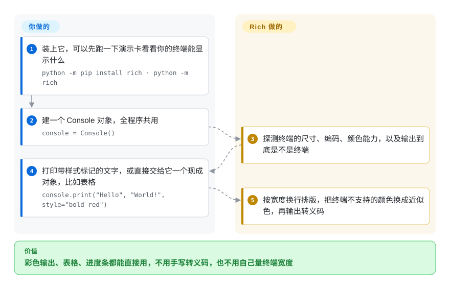

# Rich

你的 Python 脚本输出是一整片同色文字：报错和普通日志长得一样，表格是一列对不齐的 `print`，一崩溃就甩出一大段没人看得懂的 traceback。Rich 给你一个用法像 `print` 的调用：自动上色、按终端宽度换行，还能画表格、进度条、高亮代码和好读的报错栈——输出不是终端时，它会自己把这些装饰去掉。

## 何时使用

你维护一个 Python 命令行工具——部署脚本、数据管道的启动器、内部运维 CLI——它的输出已经长成这样：`Processing 4123 rows... done`，接着一大坨原样打印的 dict，失败时再来四十行灰色 traceback。你想让失败的那一步变红、汇总表的列能对齐、慢循环有个进度条、报错栈能带上出错位置附近的代码。手写 ANSI 转义码（`\033[1;31m`）只能给你颜色，给不了排版，而且别人一把输出重定向到文件就乱了。

你选 Rich，是因为一个依赖就把这些全包了，API 还长得像 `print`：`console.print(...)` 配 `[bold red]...[/bold red]` 标记、`Table` 画表、`track()` 出进度条、`rich.traceback.install()` 接管崩溃输出，再加一个接现有 `logging` 调用的 handler。需要的是**排版**而不只是颜色时，它胜过 colorama、termcolor 这类小颜色工具；输出只是往上滚、用户从不需要在里面点击或输入时，它又胜过 Textual、urwid 这类完整 TUI 框架。它用得广到连 pip 自己都内置了一份。

## 怎么用起来

所有输出都经过一个 `Console` 对象——它是 Rich 眼里的“终端”。创建它的时候，**Rich 自己去摸清输出要去哪儿**：窗口多宽多高、文字编码是什么、终端支持哪一档颜色（16 色、256 色，还是“真彩色”）、以及输出到底是不是终端，还是文件或管道。然后你交给它的，要么是带行内样式标签的文字——借用论坛 bbcode 的写法，比如 `[bold cyan]Will[/bold cyan]`——要么是一个**可渲染对象**，比如 `Table`、`Markdown`、`Syntax`，它们知道自己在给定宽度下该怎么排。**显示什么由你定，怎么塞进屏幕由 Rich 定**：它按宽度测量、换行，把终端显示不了的颜色换成最接近的那个，最后才输出转义码。进度条和转圈动画用的是“实时显示”，在原地反复重画同几行，所以必须有真终端；`NO_COLOR`、`FORCE_COLOR`、`TERM=dumb` 这些通用环境变量可以覆盖它的自动判断。

<!-- flow-steps:begin (generated from flows/rich.json by tools/flow_card.py — do not edit) -->

流程文字版

1. **你**：装上它，可以先跑一下演示卡看看你的终端能显示什么 — `python -m pip install rich · python -m rich`
2. **你**：建一个 Console 对象，全程序共用 — `console = Console()`
3. **Rich**：探测终端的尺寸、编码、颜色能力，以及输出到底是不是终端
4. **你**：打印带样式标记的文字，或直接交给它一个现成对象，比如表格 — `console.print("Hello", "World!", style="bold red")`
5. **Rich**：按宽度换行排版，把终端不支持的颜色换成近似色，再输出转义码

**价值**：彩色输出、表格、进度条都能直接用，不用手写转义码，也不用自己量终端宽度

<!-- flow-steps:end -->

## 何时不用

- **用户要在屏幕上交互**——翻列表、点按钮、填表单。Rich 只负责打印和重画输出，没有事件循环。改用 [Textual](textual.zh.md)（同一作者在 Rich 之上做的），或者用 prompt_toolkit 做可编辑的命令行输入。
- **你只要颜色在老 Windows 控制台上能用。** 这只需要一个纯标准库的垫片，用不着一个渲染库：用 [colorama](colorama.zh.md)（零依赖）或 termcolor，自己打印转义码。
- **你只想要一个进度条。** [tqdm](../dev-utilities/data-tools/tqdm.zh.md) 依赖更小，一行包装就能用，还带 pandas / notebook 集成；已经依赖 Rich、或要同时显示多条多列进度时，再用 `rich.progress`。
- **你的输出要被别的程序解析。** Rich 默认按终端宽度换行，并高亮数字、路径和 repr 输出，这会改动机器读到的文本。给机器看的输出用普通 `print` / `json.dumps`，或 `Console(highlight=False, soft_wrap=True)`，Rich 只留给给人看的那条输出流。
- **对启动时间或依赖数量卡得很紧**——极小的 Lambda 式脚本、禁止第三方包的环境。Rich 会带进 `pygments` 和 `markdown-it-py`；近期版本加了懒加载来压导入时间，但标准库（`print`、`logging`、`curses`）是零成本的。
- **你还在用 Python 3.8。** Rich 15.0.0（2026-04）去掉了对 3.8 的支持；在 3.8 上请锁 `rich<15`，别信 README 里那句“3.8 及以上”。

## 横向对比

| 替代品 | 是否收录 | 我们的评价 | 取舍 |
|---|---|---|---|
| [Textual](textual.zh.md) | ✅ | 输出只是往上滚的格式化内容，选 Rich；用户要在界面里导航、点击或输入时，选 Textual。 | Textual 在 Rich 之上加了布局、事件和控件，代价是要按应用架构来写；Rich 是 print 式的库，几乎没有学习成本。 |
| [colorama](colorama.zh.md) | ✅ | 只要颜色、要零依赖——尤其要照顾老 Windows 控制台——选 colorama；一旦需要表格、换行、进度或报错栈，选 Rich。 | colorama 只翻译转义码，2022 年后再没发版；Rich 大得多，但排版和终端探测都自己做。 |
| [tqdm](../dev-utilities/data-tools/tqdm.zh.md) | ✅ | 只要一个进度条、要最轻的依赖和 pandas / notebook 钩子，选 tqdm；CLI 已经用 Rich、或要多条多列进度时，选 `rich.progress`。 | tqdm 是专做一件事的工具；Rich 的进度条只是一个更大的渲染库里的一项功能。 |
| termcolor | 未收录 | 脚本必须保持极小、只需给几个词上色时，选 termcolor；问题出在输出结构而不只是颜色时，选 Rich。 | termcolor 是极简的上色工具，没有排版、宽度探测或可渲染对象。 |
| prompt_toolkit | 未收录 | 要交互式输入——自动补全、快捷键、行编辑——选 prompt_toolkit；输出交给 Rich。 | prompt_toolkit 管输入那一侧；Rich 的 `Prompt` 只能问些简单问题。两者常常一起用。 |

## 技术栈

- **语言：** 纯 Python，全量类型标注（带 `py.typed`，CI 跑 mypy strict）；自 v15.0.0 起要求 Python ≥ 3.9。
- **渲染模型：** 一个会探测终端能力的 `Console`，把**可渲染对象**（任何实现了 Rich 控制台协议的对象）渲染成带样式的片段，再转成转义码；老式 Windows 控制台走 Rich 自己的 Windows 渲染路径，只有 16 色。
- **内置可渲染对象：** Table、Tree、Columns、Panel、Markdown、Syntax、Progress / Live / Status、Traceback、美化打印，外加一个 `logging.Handler`（`RichHandler`）。
- **打包：** Poetry 项目，以 `rich` 发布到 PyPI；MIT 许可。

## 依赖

- **运行时：** `pygments`（语法高亮）和 `markdown-it-py`（解析 Markdown）；`ipywidgets` 只在可选的 `jupyter` extra 里。
- **环境：** 完整效果要终端；在 Jupyter 里无需额外配置也能用，输出被重定向时退化成纯文本。真彩色和 emoji 要新式终端（Windows 上要用 Windows Terminal，而不是经典控制台）。
- **外部服务：** 无。

## 运维难度

**低。** 它是个库：`pip install rich` 后 import 即可。要操心的是版本和输出卫生：锁住大版本，因为 Rich 大约一年里发了两个大版本（14.0、15.0），而且 v15 去掉了 Python 3.8；留意 CI 和日志采集器——它们不是终端，进度条会消失，换行和高亮也可能改动日志行，除非你设 `NO_COLOR` / `TERM=dumb` 或配置好 `Console`；给机器读的输出另走一条不加装饰的流。

## 健康度与可持续性

- **维护（2026-10），B 级。** v15.0.0 于 2026-04-12 发布，此前是一串 14.x 小版本；默认分支最后一次提交在 2026-06-23，已安静约三个半月——评分器按“成熟库”给了宽限，没有因为这段停顿扣分。
- **响应速度，A 级。** 新 issue 通常一天半左右就有第一条回复（统计窗口内中位数 30.3 小时）。
- **治理，D 级。** 近期约九成提交出自 Will McGugan 一人。资助 Rich 和 Textual 全职开发的公司 Textualize 在 2025-05-07 宣布收尾；作者表示会继续以开源项目的方式维护两者。bus factor 实际为一。
- **年龄与 Lindy，长寿度 B 级。** 2019-11 创建，约七年仍在发版——对一个解决稳定问题（终端格式化）的库来说，这是扎实的 Lindy 先验。
- **采用度，A 级。** PyPI 月下载量以亿计，依赖它的仓库数以万计；pip 内置了一份，很多 CLI 框架和工具建在它之上。它实际上已是 Python CLI 生态的基础设施。
- **风险标记，许可 A 级。** MIT，没有改过许可。要盯的风险是公司关闭后的一人维护，而不是许可；API 已经足够成熟，真放缓了，伤害也比年轻库小。

## 存疑（未验证）

- [未验证] 截至 2026-10-08 约 57.5k star、约 2.4k fork、约 380 个未关闭 issue/PR——对时间敏感，仅供参考。
- [推断] “bus factor 实际为一”来自贡献占比（评分窗口内头号贡献者约占九成提交）和 2025 年公司收尾的公告；其他贡献者在代码评审上帮了多少，没有测。
- [推断] “很多 CLI 框架建在它之上”依据的是 pip 内置副本和依赖仓库数量；没有逐个列举下游项目。
- [未验证] 导入耗时，以及 14.3.4 懒加载改动的实际效果，这里没有测量。
- [推断] 高亮和换行会改动机器读取的输出，是由文档里的默认值（`highlight`、按宽度换行）推出来的；具体会坏成什么样，取决于下游怎么按行解析。
