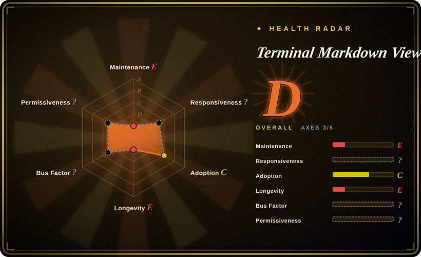
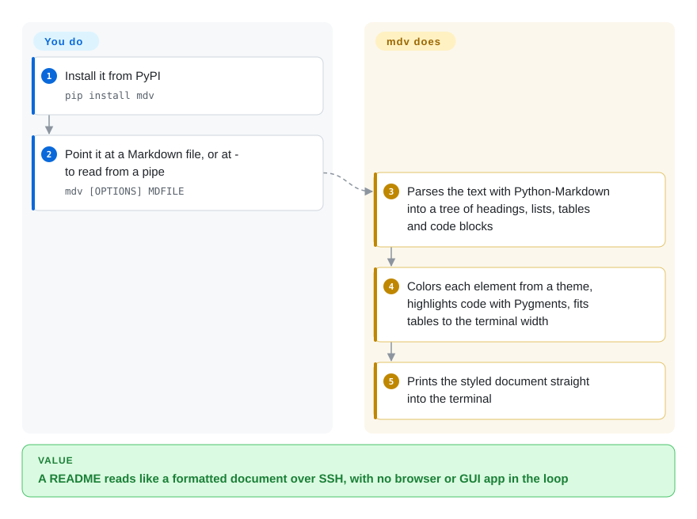

# Terminal Markdown Viewer (mdv)

A Python CLI (`mdv`) that renders Markdown into styled, colourised, terminal-friendly text — tables, code blocks with syntax highlighting, admonitions and themes — so you can read `.md` files in a plain terminal.

## When to use

You're working over SSH on a headless box, or living in a tmux pane, and you want to actually *read* a README or a docs `.md` file without it being a wall of raw `#`, `*` and backticks. You don't have (or don't want) a browser or a GUI Markdown app in the loop. You run `mdv README.md` and get the document rendered with headings, colour, indented/boxed code blocks, syntax-highlighted snippets, tables and lists, themed to your taste — all as ANSI in the terminal. It can also take Markdown on stdin, so you can pipe documentation or generated Markdown straight into it as a pager-style viewer.

You reach for it when the job is specifically *one-shot, read-only rendering of Markdown to a terminal*: previewing a file, glancing at a changelog, eyeballing generated docs in CI logs, or wiring it into a script as the "show this markdown nicely" step. It's a focused viewer/formatter, not an editor and not a TUI app.

## How it works

mdv borrows a ready-made Markdown parser (the Python-Markdown library) to turn your file into a tree of headings, paragraphs, lists, tables and code blocks — the same intermediate step a website takes before producing HTML. Instead of HTML, mdv walks that tree and prints each piece with ANSI color codes (the invisible instructions that tell a terminal "switch to bold blue"), picking colors from one of its 200-plus bundled themes and handing code blocks to Pygments for syntax highlighting. **Parsing, coloring and table layout are all mdv's job; you only choose the file and, if you like, a theme (`-t`) or a fixed width (`-c`).** It asks the `stty` tool for the terminal width and falls back to 80 columns when you pipe into it. The same module also works as a library function that returns the colored string, and it can watch a file or directory and re-render on every change, but those are side doors off the one-shot viewer.

<!-- flow-steps:begin (generated from flows/terminal-markdown-viewer.json by tools/flow_card.py — do not edit) -->

Text version of the flow

1. **You**: Install it from PyPI — `pip install mdv`
2. **You**: Point it at a Markdown file, or at - to read from a pipe — `mdv [OPTIONS] MDFILE`
3. **Terminal Markdown Viewer (mdv)**: Parses the text with Python-Markdown into a tree of headings, lists, tables and code blocks
4. **Terminal Markdown Viewer (mdv)**: Colors each element from a theme, highlights code with Pygments, fits tables to the terminal width
5. **Terminal Markdown Viewer (mdv)**: Prints the styled document straight into the terminal

**Value**: A README reads like a formatted document over SSH, with no browser or GUI app in the loop

<!-- flow-steps:end -->

## When NOT to use

- **You need a maintained tool — it is effectively unmaintained.** The last commit on `master` is from 2023-10 and the last PyPI release is 1.7.5 (2023-10), with no activity since (as of 2026-10-08). For a long-term dependency use glow or mdcat as a standalone viewer, or [Rich](rich.md)'s `Markdown` inside a Python program.
- **You want a scrollable pager / interactive browser.** mdv renders to a stream; if you want paging, search, and file navigation inside the terminal, glow's TUI mode or piping into `less -R` plus a renderer fits better.
- **You're already in a Python app and just need Markdown→ANSI.** `rich` renders Markdown as part of a broader styling library you may already depend on — one fewer standalone tool.
- **You need faithful rendering of complex Markdown.** The author calls mdv "a proof of concept hack" that does well on simple structures but not complex ones, and says inline HTML "simply fails". For GitHub-flavored READMEs full of HTML badges and nested lists, use glow or mdcat.
- **You need Windows support or zero Python.** The README says nothing was tested on Windows and the package classifiers list POSIX only; terminal width comes from the Unix `stty` tool. A single-binary Go renderer (glow) avoids both the Python runtime and that gap.

## Comparison

| Alternative | In index | Our verdict | Tradeoff |
|---|---|---|---|
| glow | 未收录 | Choose glow when you need a Go single-binary Markdown renderer with a TUI browser/pager and themes. | Go single-binary Markdown renderer with a TUI browser/pager and themes (Charm); actively maintained, no Python runtime — generally the modern default for terminal Markdown reading. |
| bat | 未收录 | Choose bat when you need a `cat` clone with syntax highlighting and paging. | A `cat` clone with syntax highlighting and paging; shows Markdown *source* highlighted rather than rendering it, but ubiquitous and fast. |
| [rich (Markdown)](rich.md) | ✅ | Choose rich when Markdown rendering is part of a larger Python styled-terminal-output toolkit. | Python library that renders Markdown to styled terminal output as part of a larger toolkit; library-first, not a standalone CLI. |
| mdcat | 未收录 | Choose mdcat when you need a Rust CLI that renders Markdown to the terminal, including inline images on supporting terminals. | Rust CLI that renders Markdown to the terminal, including inline images on supporting terminals; single binary, active. |
| pandoc + pager | 未收录 | Choose pandoc + pager when you need heavyweight general-purpose conversion across many formats. | Converts Markdown to many formats (heavyweight, general-purpose); overkill for "just show this .md in my terminal". |

## Tech stack

- **Language:** Python (CLI entry point `mdv`); packaged via `setup.py`/`setup.cfg` and installable from PyPI.
- **Rendering:** Python-Markdown parses the source; a custom tree-processor in one module (`mdv/markdownviewer.py`) walks the resulting element tree and emits ANSI-styled text — headings, themed colours, boxed/indented code, Pygments syntax highlighting, tables (via a vendored copy of `tabulate`), lists and admonitions.
- **Input:** file argument or stdin; theme selection and configuration options.
- **Packaging:** a `Dockerfile` is present for a containerised run path alongside pip install.

## Dependencies

- **Runtime:** Python (classifiers list 2.7 and 3.6–3.12) plus two pip dependencies, `markdown` and `pygments`; `pyyaml` is an optional extra for YAML config. The README's longer list (docopt, tabulate) is outdated — the code replaces docopt and vendors tabulate.
- **Terminal:** an ANSI-capable terminal for colour/styling output, and the `stty` command for width detection (otherwise it assumes 80 columns).
- **No external services or datastore** — it's a local CLI that reads files/stdin and writes to the terminal.

## Ops difficulty

**Low.** It's a single-purpose CLI: `pip install` (or run the Docker image) and invoke `mdv file.md`. Nothing to deploy, no service, no state. The only friction is environment-level — getting the Python version/dependencies right, and accepting that terminal rendering of complex Markdown is approximate, so you may tweak themes or fall back to source view for edge cases.

## Health & viability

- **Responsiveness**: Cannot be scored — no_traffic.
- **Maintenance (2026-10), grade E.** Last commit on `master` 2023-10-06 and last PyPI release 1.7.5 in the same week; GitHub's 2024-05 `pushed_at` matches no commit on either branch. Three years without a commit reads as **unmaintained** — usable as-is, but nothing will be fixed. Not archived.
- **Governance / backing.** Owned by the Axiros organization (a company), with a small contributor tail. Org ownership is a mild positive over a personal account, but activity, not ownership, is the live signal here. [推断]
- **Age & Lindy verdict.** ~11 years old (created 2015-07) but inactive since 2023, so Lindy **does not apply** — age without ongoing activity is staleness, not durability.
- **Adoption.** ~1.9k stars; a known older entry in the terminal-Markdown niche, now competing with newer Go/Rust renderers (glow, mdcat). [未验证]
- **Risk flags.** Abandonment is the main flag. License is BSD 3-clause (read from the repo's `LICENSE` / `LICENSE.txt`, Axiros GmbH; GitHub reports `NOASSERTION`). No relicense history found.

## Caveats (unverified)

- [推断] License recorded as BSD-3-Clause from reading `LICENSE` (three clauses incl. the non-endorsement clause), not from GitHub's `NOASSERTION` badge; the repo carries two near-identical copies with different copyright years.
- [未验证] ~1.9k stars as of 2026-10-08; star counts drift — indicative only.
- [推断] "Unmaintained" is inferred from three years without a commit or release, not from a maintainer statement.
- [未验证] Python 3.13+ compatibility was not tested; the classifiers stop at 3.12 and newer Python-Markdown releases could break the custom tree-processor.
- [未验证] Rendering failures on complex Markdown are the author's own description in the README, not a measured defect list.
