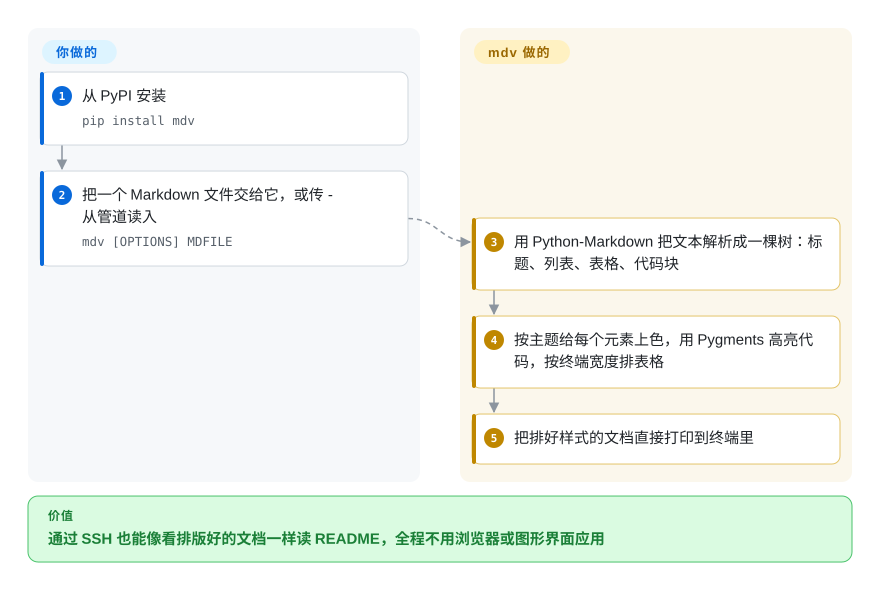

# Terminal Markdown Viewer (mdv)

一个 Python CLI（`mdv`），把 Markdown 渲染成带样式、彩色、适合终端阅读的文本——表格、带语法高亮的代码块、提示框和主题——让你在纯终端里读 `.md` 文件。

## 何时使用

你在通过 SSH 操作一台无界面机器，或常驻在某个 tmux 分屏里，想要真正*读*一份 README 或文档 `.md`，而不是看一墙原始的 `#`、`*` 和反引号。链路里没有（也不想要）浏览器或 GUI Markdown 应用。你运行 `mdv README.md`，文档就被渲染出来：标题、颜色、缩进/带框的代码块、语法高亮片段、表格和列表，按你喜好套主题——全是终端里的 ANSI。它也能从 stdin 读 Markdown，所以你可以把文档或生成的 Markdown 直接管道喂给它，当成 pager 式查看器用。

当任务正是*一次性、只读地把 Markdown 渲染到终端*时你会选它：预览一个文件、瞄一眼 changelog、在 CI 日志里看生成的文档，或在脚本里把它接成“把这段 markdown 漂亮地显示出来”那一步。它是个聚焦的查看器/格式化器，不是编辑器，也不是 TUI 应用。

## 怎么用起来

mdv 借用一个现成的 Markdown 解析器（Python-Markdown 库），先把你的文件变成一棵由标题、段落、列表、表格、代码块组成的树——网站生成 HTML 之前走的也是这一步。mdv 不生成 HTML，而是顺着这棵树，给每一块打上 ANSI 颜色码（夹在文字里、告诉终端“接下来变成粗体蓝色”的隐形指令）再打印出来，颜色取自它自带的两百多套主题之一，代码块交给 Pygments 做语法高亮。**解析、上色、表格排版都是 mdv 的事；你只管挑文件，愿意的话再指定一个主题（`-t`）或固定宽度（`-c`）。** 终端宽度是它向 `stty` 工具问来的，用管道喂给它时就按 80 列算。同一个模块也能当库函数用、返回上好色的字符串，还能盯着某个文件或目录、一有改动就重新渲染，但这些都是一次性查看之外的旁路。

<!-- flow-steps:begin (generated from flows/terminal-markdown-viewer.json by tools/flow_card.py — do not edit) -->

流程文字版

1. **你**：从 PyPI 安装 — `pip install mdv`
2. **你**：把一个 Markdown 文件交给它，或传 - 从管道读入 — `mdv [OPTIONS] MDFILE`
3. **Terminal Markdown Viewer (mdv)**：用 Python-Markdown 把文本解析成一棵树：标题、列表、表格、代码块
4. **Terminal Markdown Viewer (mdv)**：按主题给每个元素上色，用 Pygments 高亮代码，按终端宽度排表格
5. **Terminal Markdown Viewer (mdv)**：把排好样式的文档直接打印到终端里

**价值**：通过 SSH 也能像看排版好的文档一样读 README，全程不用浏览器或图形界面应用

<!-- flow-steps:end -->

## 何时不用

- **你需要一个有人维护的工具——它实际上已无人维护。** `master` 最后一次提交在 2023-10，PyPI 最新版本 1.7.5 也发布于 2023-10，此后再无动静（截至 2026-10-08）。要长期依赖，独立查看器用 glow 或 mdcat，Python 程序内部用 [Rich](rich.zh.md) 的 `Markdown`。
- **你想要可滚动的 pager / 交互式浏览器。** mdv 是渲染成一段流；如果你要终端内分页、搜索和文件导航，glow 的 TUI 模式或“渲染器 + `less -R`”更合适。
- **你已经在一个 Python 应用里、只需要 Markdown→ANSI。** `rich` 把 Markdown 渲染作为更大样式库的一部分，而你可能本就依赖它——少一个独立工具。
- **你需要忠实渲染复杂的 Markdown。** 作者自己称 mdv 是“概念验证式的 hack”：简单结构做得不错，复杂的就不行，遇到内嵌 HTML“直接失败”。满是 HTML 徽章和嵌套列表的 GitHub 风格 README，请用 glow 或 mdcat。
- **你需要 Windows 支持或完全不要 Python。** README 写明没在 Windows 上测过任何东西，打包分类也只列了 POSIX；终端宽度还是靠 Unix 的 `stty` 工具取的。单二进制的 Go 渲染器（glow）能同时省掉 Python 运行时、绕开这个缺口。

## 横向对比

| 替代品 | 是否收录 | 我们的评价 | 取舍 |
|---|---|---|---|
| glow | 未收录 | 需要 Go 单二进制 Markdown 渲染器，并带 TUI 浏览器/pager 和主题时，选 glow。 | Go 单二进制 Markdown 渲染器，带 TUI 浏览器/pager 和主题（Charm）；维护活跃、无 Python 运行时——通常是终端读 Markdown 的现代默认选择。 |
| bat | 未收录 | 需要带语法高亮和分页的 `cat` 替代品时，选 bat。 | 带语法高亮和分页的 `cat` 替代；显示的是高亮后的 Markdown *源码*而非渲染结果，但无处不在且快。 |
| [rich（Markdown）](rich.zh.md) | ✅ | Markdown 渲染只是更大 Python 终端样式输出工具集的一部分时，选 rich。 | Python 库，作为更大工具集的一部分把 Markdown 渲染成带样式的终端输出；库优先，不是独立 CLI。 |
| mdcat | 未收录 | 需要 Rust CLI 把 Markdown 渲染到终端，且支持终端内联图片时，选 mdcat。 | Rust CLI，把 Markdown 渲染到终端，在支持的终端上还能内联显示图片；单二进制、活跃。 |
| pandoc + pager | 未收录 | 需要跨多种格式的重量级通用转换时，选 pandoc + pager。 | 把 Markdown 转成多种格式（重量级、通用）；对“只想在终端里看这份 .md”来说是杀鸡用牛刀。 |

## 技术栈

- **语言：** Python（CLI 入口 `mdv`）；通过 `setup.py`/`setup.cfg` 打包，可从 PyPI 安装。
- **渲染：** 由 Python-Markdown 解析源文；一个模块（`mdv/markdownviewer.py`）里的自定义树处理器遍历解析出的元素树，输出 ANSI 样式文本——标题、主题色、带框/缩进代码、Pygments 语法高亮、表格（用仓库内置的一份 `tabulate`）、列表和提示框。
- **输入：** 文件参数或 stdin；可选主题和配置项。
- **打包：** 仓库带 `Dockerfile`，在 pip 安装之外提供容器化运行路径。

## 依赖

- **运行时：** Python（分类标签列了 2.7 和 3.6–3.12）加两个 pip 依赖：`markdown` 和 `pygments`；`pyyaml` 是读 YAML 配置的可选 extra。README 里更长的清单（docopt、tabulate）已经过时——代码里替换掉了 docopt，tabulate 则直接内置。
- **终端：** 一个支持 ANSI 的终端用于彩色/样式输出，外加用于探测宽度的 `stty` 命令（没有就按 80 列算）。
- **无外部服务或数据存储**——它是读文件/stdin、写终端的本地 CLI。

## 运维难度

**低。** 它是单一用途 CLI：`pip install`（或跑 Docker 镜像）后执行 `mdv file.md`。没有要部署的东西，无服务、无状态。唯一摩擦在环境层面——把 Python 版本/依赖弄对，并接受复杂 Markdown 的终端渲染是近似的，因此你可能要调主题或在边角情况下回退到看源码。

## 健康度与可持续性

- **响应速度**：无法计算——no_traffic。
- **维护（2026-10），E 级。** `master` 最后一次提交在 2023-10-06，PyPI 最后一个版本 1.7.5 也在同一周；GitHub 显示的 2024-05 `pushed_at` 在两个分支上都对应不到任何提交。三年没有提交，读作**无人维护**——现状能用，但不会再有人修。未归档。
- **治理 / 背书。** 归 Axiros 组织（一家公司）所有，外加一小撮贡献者尾巴。组织归属比个人账号略好，但这里的活信号是活跃度而非归属。[推断]
- **年龄与 Lindy 判断。** 约 11 年（2015-07 创建），但自 2023 年起不再活动，所以 Lindy **不适用**——没有持续活动的年龄是陈旧，不是耐久。
- **采用度。** 约 1.9k star；终端 Markdown 这一小众里一个为人知的老牌项目，如今与更新的 Go/Rust 渲染器（glow、mdcat）竞争。[未验证]
- **风险标记。** 弃坑是头号风险。许可为 BSD 三条款版（读自仓库的 `LICENSE` / `LICENSE.txt`，Axiros GmbH；GitHub 报 `NOASSERTION`）。未发现 relicense 历史。

## 存疑（未验证）

- [推断] 许可按读 `LICENSE` 原文（三条款，含“不得用名义背书”条款）记为 BSD-3-Clause，而非依据 GitHub 的 `NOASSERTION` 徽章；仓库里有两份几乎相同、版权年份不同的副本。
- [未验证] 截至 2026-10-08 约 1.9k star；star 数会漂移，仅供参考。
- [推断] “无人维护”是从三年无提交、无发版推断的，而非维护者声明。
- [未验证] 没测过 Python 3.13 及以上的兼容性；分类标签止于 3.12，较新的 Python-Markdown 版本可能弄坏它的自定义树处理器。
- [未验证] 复杂 Markdown 渲染失败是 README 里作者自己的说法，不是实测的缺陷清单。
