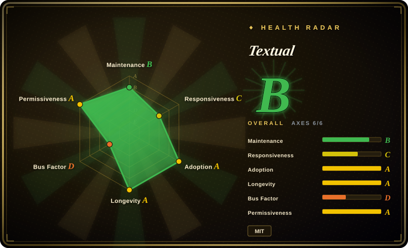
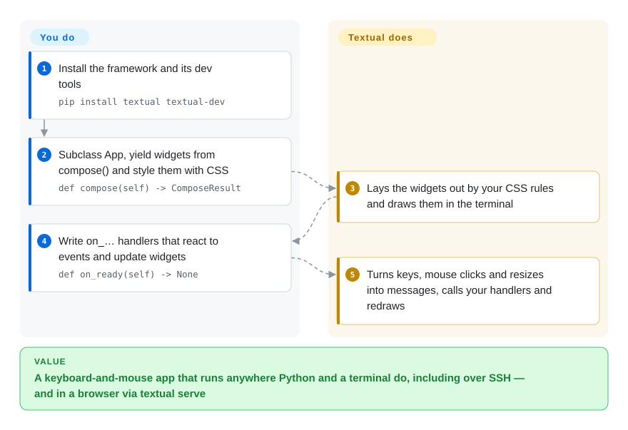

# Textual

Your Python script has grown fifteen flags, and the colleagues who run it keep getting `--since` wrong; a web UI would mean a server, a frontend and a login. Textual lets you turn the script into a full-screen terminal app — tables, forms, tabs, mouse and keyboard — written in plain Python and styled with CSS, which runs over SSH and can also be served to a browser.

## When to use

You're a Python developer or SRE with an internal tool that has outgrown `argparse`: people need to browse a list of jobs, filter it, open one, and press a button to retry it, and they do this on servers they reach over SSH where there is no browser. Building a web app for that means hosting, auth and a JavaScript frontend; raw `curses` means hand-placing every character and handling every resize yourself. With Textual you subclass `App`, compose ready-made widgets (`DataTable`, `Input`, `Tree`, `TextArea`, tabs, a `ctrl+p` command palette), lay them out with a CSS dialect, and get mouse support, theming and a headless test harness for free.

Pick it over [asciimatics](asciimatics.md) or urwid when you want a modern widget set, CSS-like layout and async integration rather than a curses-style API; over [Rich](rich.md) when the output has to be *interactive* rather than printed once; and over a web framework when your users live in terminals. The tradeoff: it is Python-only, its major version moves fast, and since the company behind it closed in 2025 it rests on one maintainer.

## How it works

Textual sits on top of [Rich](rich.md) (the same author's library for coloured terminal output) and adds the part a terminal lacks: an application loop. **You describe the screen** — an `App` subclass whose `compose()` method yields widgets, plus CSS rules for size, colour and layout — **and write handlers** named `on_<event>` that react to things happening. **Textual does the rest**: it computes the layout from the CSS, draws it with Rich, and turns every key press, mouse click and window resize into a *message* placed in a queue — like orders lined up at a restaurant counter that the chef cooks one by one — then calls your matching handler and redraws. The queue runs on Python's `asyncio`, so handlers can await network calls without freezing the UI, but plain synchronous code works too. The same app can be opened in a browser with `textual serve`, and `textual-dev` gives you a second-terminal console for `print` debugging, since the app itself occupies the screen.

<!-- flow-steps:begin (generated from flows/textual.json by tools/flow_card.py — do not edit) -->

Text version of the flow

1. **You**: Install the framework and its dev tools — `pip install textual textual-dev`
2. **You**: Subclass App, yield widgets from compose() and style them with CSS — `def compose(self) -> ComposeResult`
3. **Textual**: Lays the widgets out by your CSS rules and draws them in the terminal
4. **You**: Write on_… handlers that react to events and update widgets — `def on_ready(self) -> None`
5. **Textual**: Turns keys, mouse clicks and resizes into messages, calls your handlers and redraws

**Value**: A keyboard-and-mouse app that runs anywhere Python and a terminal do, including over SSH — and in a browser via textual serve

<!-- flow-steps:end -->

## When NOT to use

- **You only need prettier output** — coloured logs, a progress bar, a table printed once. Use [Rich](rich.md): Textual is the interactive layer on top of it, and a full-screen app is overkill for output that scrolls past.
- **You need prompts or a REPL inside the normal scrolling terminal** (autocomplete, history, multi-line input), not a full-screen app. Use prompt_toolkit (not indexed) or a prompt library built on it; Textual takes over the whole screen by default.
- **Your tool is not Python, or must ship as one static binary with instant start-up.** Use Ratatui (Rust) or Bubble Tea (Go) (both not indexed); a Textual app needs a Python 3.9+ runtime and its dependencies on every machine.
- **You want a multi-user web application.** Use a real web stack; `textual serve` and Textual Web are for putting a terminal app in a browser, not for building a scalable, authenticated site.
- **You cannot absorb API churn.** Textual went from 1.0 (2024-12) to 8.0 (2026-02) — eight major versions in about fourteen months. Pin the version and budget for upgrades, or pick a slower-moving library such as urwid (not indexed) or [asciimatics](asciimatics.md).
- **You need a vendor behind the dependency.** Textualize, the company, wound down in 2025; the framework is now maintained by its author as a community project with no commercial support. If an SLA or paid support matters, Textual cannot provide it — keep the UI layer thin enough to replace.

## Comparison

| Alternative | In index | Our verdict | Tradeoff |
|---|---|---|---|
| [Rich](rich.md) | ✅ | For formatted, non-interactive output (logs, tables, progress) pick Rich; pick Textual once users must navigate, click or type inside the UI. | Rich is a lightweight print-style library with almost no learning curve; Textual adds layout, events and widgets at the cost of an app architecture. |
| [asciimatics](asciimatics.md) | ✅ | For a new interactive Python TUI pick Textual for its CSS layout, async model and widget breadth; pick asciimatics for ASCII animation effects or when a curses-like API with very slow API churn matters more. | Textual is richer and better documented but changes major versions often; asciimatics is older-style and spartan, with infrequent PyPI releases. |
| urwid | not indexed | Pick urwid when you want a long-lived, slow-moving Python TUI toolkit and accept a callback-style, lower-level API; pick Textual when developer speed, CSS styling and built-in testing matter more. | urwid has a much longer history and fewer breaking releases; Textual is far more productive but younger and single-maintainer. |
| prompt_toolkit | not indexed | Pick prompt_toolkit for interactive prompts, REPLs and line editors that stay in the scrolling terminal; pick Textual for full-screen, multi-widget applications. | prompt_toolkit excels at input handling and keeps the shell flow; Textual owns the whole screen and gives you layout and widgets. |
| Ratatui | not indexed | Pick Ratatui when the tool is written in Rust or must be a single fast binary; pick Textual when your team and code are Python. | Ratatui gives native speed and easy distribution but is an immediate-mode drawing library you assemble yourself; Textual gives batteries-included widgets but needs a Python runtime. |

## Tech stack

- **Language:** Python (requires >= 3.9; classifiers list 3.9–3.14), fully typed (`py.typed`).
- **Rendering:** built on [Rich](rich.md) (`rich >= 14.2`) for styled text output to the terminal.
- **Runtime model:** `asyncio` — every app and widget has a message queue processed by an asyncio task.
- **Styling:** Textual CSS (TCSS), a CSS dialect for layout, sizing, colour and themes.
- **Other deps:** `markdown-it-py` + `mdit-py-plugins` (Markdown widget), `platformdirs`, `typing-extensions`; optional `syntax` extra pulls `tree-sitter` grammars (Python >= 3.10) for code highlighting in `TextArea`.
- **Tooling around it:** `textual-dev` (dev console, `textual run --dev`), `textual serve` / Textual Web for browser delivery, Poetry-based packaging.

## Dependencies

- **Runtime:** a Python 3.9+ interpreter and the pip packages above; no database or service.
- **Terminal:** any modern terminal emulator on macOS, Linux or Windows 10/11; colour, mouse and key handling quality depend on the emulator (the 8.2.x releases still fix extended-key parsing).
- **Optional:** `textual-dev` for development; `tree-sitter` extras for syntax highlighting; a browser if you use `textual serve`.

## Ops difficulty

**Low to run, medium to maintain.** Shipping a Textual tool is shipping a Python package: `pip install` (or `pipx`/`uv tool`) on each machine, no server. The real cost is upgrades — frequent major releases mean pinning `textual` and re-running your snapshot tests before bumping — and terminal variance: a layout that looks right in one emulator can differ in another, so test in the terminals your users actually have.

## Health & viability

- **Maintenance (2026-10), grade B.** v8.2.8 shipped 2026-06-30 and the last default-branch commit was 2026-07-11, so it has been quiet for about three months; the scorer gives it a mature-library allowance rather than penalising the pause. Before mid-2026 releases came every few weeks.
- **Responsiveness, grade C.** New issues wait several days for a first response — consistent with one person maintaining it after the company closed.
- **Governance, grade D.** Bus factor is essentially one: Will McGugan (creator of Rich) makes the vast majority of recent commits. Textualize, the company that funded full-time development, announced on 2025-05-07 it was wrapping up; the author committed to keep maintaining Textual and Rich as an open-source community project.
- **Age & Lindy, longevity A.** Created 2021-04 and still releasing five years later; the API is declared production/stable, but frequent major versions mean "stable" is about quality, not about API freeze.
- **Adoption, grade A.** Heavily downloaded from PyPI and used by a visible ecosystem of terminal apps (database clients, log viewers, API tools); ~37.4k stars.
- **Risk / license, grade A.** MIT, no relicensing. The risk to watch is maintenance capacity, not licensing — if commits stay sparse into 2027, treat it as coasting.

## Caveats (unverified)

- [未验证] The 2026-07 to 2026-10 commit pause may be temporary; whether active development resumes was not knowable on 2026-10-08.
- [未验证] Statements about urwid, prompt_toolkit and Ratatui in Comparison are general characterizations from their well-known scope, not re-read from their repositories in this pass.
- [推断] `textual serve` / Textual Web being unsuitable for a multi-user, authenticated web application is inferred from their stated purpose (sharing a terminal app in a browser); their scaling and auth model were not audited.
- [推断] "Ecosystem of terminal apps" rests on the docs' and community's showcased projects, not a dependents audit.
