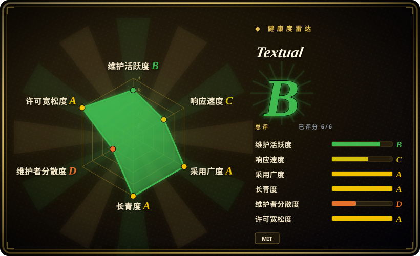
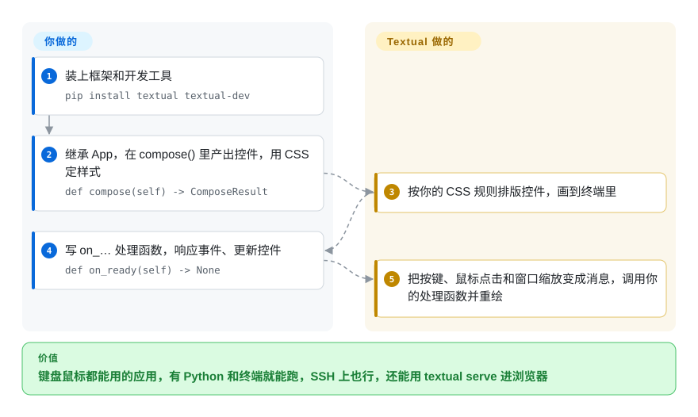

# Textual

你的 Python 脚本长出了十五个参数，跑它的同事老是把 `--since` 填错；可做个网页界面又意味着要服务器、前端和登录。Textual 让你把脚本变成一个全屏终端应用——表格、表单、标签页、鼠标键盘都能用——纯 Python 写、用 CSS 定样式，能在 SSH 上跑，也能放进浏览器。

## 何时使用

你是 Python 开发者或 SRE，手上有个内部工具已经超出了 `argparse` 能承受的范围：大家要浏览一列任务、筛选、点开其中一个、按个按钮重试，而且是在 SSH 登进去、没有浏览器的服务器上做这些事。为此做个网页应用，就得管托管、鉴权和一套 JavaScript 前端；直接用 `curses`，又得手工摆放每个字符、自己处理每一次窗口缩放。用 Textual，你继承 `App`，组合现成的控件（`DataTable`、`Input`、`Tree`、`TextArea`、标签页、`ctrl+p` 命令面板），用一种 CSS 方言排版，鼠标支持、主题和无界面测试工具都是白送的。

想要现代控件、类 CSS 排版和 async 集成，而不是 curses 风格的 API 时，选它而不是 [asciimatics](asciimatics.zh.md) 或 urwid；输出必须能*交互*、而不是打印一次就完时，选它而不是 [Rich](rich.zh.md)；用户都待在终端里时，选它而不是网页框架。代价是：只能用 Python，大版本变得快，而且背后的公司 2025 年关门后，它只靠一位维护者。

## 怎么用起来

Textual 建在 [Rich](rich.zh.md)（同一作者写的终端彩色输出库）之上，补上终端缺的那一块：应用的事件循环。**你负责描述界面**——一个 `App` 子类，它的 `compose()` 方法产出控件，再加几条管尺寸、颜色和布局的 CSS 规则——**再写处理函数**，名字叫 `on_<事件>`，对发生的事做出反应。**剩下的 Textual 来做**：按 CSS 算出布局，用 Rich 画出来，把每次按键、鼠标点击和窗口缩放变成一条*消息*放进队列——像餐馆柜台前排队的订单，厨师一单一单地做——然后调用你对应的处理函数并重绘。这个队列跑在 Python 的 `asyncio` 上，处理函数可以 await 网络请求而不卡住界面，但普通同步代码也照样能用。同一个应用可以用 `textual serve` 在浏览器里打开；因为应用本身占满了屏幕，`textual-dev` 另开一个终端当控制台，让你照样能 `print` 调试。

<!-- flow-steps:begin (generated from flows/textual.json by tools/flow_card.py — do not edit) -->

流程文字版

1. **你**：装上框架和开发工具 — `pip install textual textual-dev`
2. **你**：继承 App，在 compose() 里产出控件，用 CSS 定样式 — `def compose(self) -> ComposeResult`
3. **Textual**：按你的 CSS 规则排版控件，画到终端里
4. **你**：写 on_… 处理函数，响应事件、更新控件 — `def on_ready(self) -> None`
5. **Textual**：把按键、鼠标点击和窗口缩放变成消息，调用你的处理函数并重绘

**价值**：键盘鼠标都能用的应用，有 Python 和终端就能跑，SSH 上也行，还能用 textual serve 进浏览器

<!-- flow-steps:end -->

## 何时不用

- **你只想让输出好看点**——彩色日志、进度条、打印一次的表格。用 [Rich](rich.zh.md)：Textual 是建在它上面的交互层，对一闪而过的输出来说，全屏应用是杀鸡用牛刀。
- **你要的是留在普通滚动终端里的提示输入或 REPL**（自动补全、历史、多行输入），而不是全屏应用。用 prompt_toolkit（未收录）或基于它的提示库；Textual 默认会接管整个屏幕。
- **你的工具不是 Python 写的，或者必须是一个启动即用的静态二进制。** 用 Ratatui（Rust）或 Bubble Tea（Go）（都未收录）；Textual 应用要求每台机器都有 Python 3.9+ 运行时和它的依赖。
- **你要做多用户的网页应用。** 用正经的 Web 技术栈；`textual serve` 和 Textual Web 是把终端应用放进浏览器，不是用来搭可扩展、带鉴权的网站的。
- **你承受不了 API 频繁变动。** Textual 从 1.0（2024-12）走到 8.0（2026-02），大约十四个月出了八个大版本。锁定版本并预留升级成本，或者选变化更慢的库，比如 urwid（未收录）或 [asciimatics](asciimatics.zh.md)。
- **你需要依赖背后有厂商。** Textualize 这家公司 2025 年已经收尾；框架现在由作者以社区项目的方式维护，没有商业支持。如果 SLA 或付费支持是硬要求，Textual 给不了——把 UI 层做薄，保证以后能换。

## 横向对比

| 替代品 | 是否收录 | 我们的评价 | 取舍 |
|---|---|---|---|
| [Rich](rich.zh.md) | ✅ | 只要格式化的、不交互的输出（日志、表格、进度），选 Rich；一旦用户要在界面里移动、点击或输入，选 Textual。 | Rich 是轻量的打印式库，几乎没有学习成本；Textual 加上了布局、事件和控件，代价是要按应用架构来写。 |
| [asciimatics](asciimatics.zh.md) | ✅ | 新写一个交互式 Python TUI，选 Textual，图它的 CSS 布局、async 模型和控件广度；要 ASCII 动画特效，或更看重 curses 式 API、几乎不变的接口时，选 asciimatics。 | Textual 更丰富、文档更好，但大版本换得勤；asciimatics 风格老、控件朴素，PyPI 发版很少。 |
| urwid | 未收录 | 想要历史长、变化慢的 Python TUI 工具包，并接受回调式的低层 API，选 urwid；更看重开发速度、CSS 样式和内置测试，选 Textual。 | urwid 历史长得多、破坏性发版少；Textual 生产力高得多，但更年轻、只有一位维护者。 |
| prompt_toolkit | 未收录 | 做留在滚动终端里的交互提示、REPL 和行编辑器，选 prompt_toolkit；做全屏、多控件的应用，选 Textual。 | prompt_toolkit 擅长输入处理、不打断 shell 流程；Textual 占满整个屏幕，给你布局和控件。 |
| Ratatui | 未收录 | 工具用 Rust 写，或必须是单个快速二进制，选 Ratatui；团队和代码都是 Python，选 Textual。 | Ratatui 有原生速度、分发简单，但它是要你自己拼装的即时模式绘制库；Textual 控件开箱即用，但需要 Python 运行时。 |

## 技术栈

- **语言：** Python（要求 >= 3.9；classifiers 列出 3.9～3.14），完整类型标注（`py.typed`）。
- **渲染：** 建在 [Rich](rich.zh.md)（`rich >= 14.2`）之上，负责向终端输出带样式的文字。
- **运行模型：** `asyncio`——每个应用和控件都有一条消息队列，由 asyncio 任务处理。
- **样式：** Textual CSS（TCSS），一种管布局、尺寸、颜色和主题的 CSS 方言。
- **其他依赖：** `markdown-it-py` + `mdit-py-plugins`（Markdown 控件）、`platformdirs`、`typing-extensions`；可选的 `syntax` extra 会装 `tree-sitter` 语法包（Python >= 3.10），给 `TextArea` 做代码高亮。
- **周边工具：** `textual-dev`（开发控制台、`textual run --dev`）、`textual serve`／Textual Web 负责浏览器分发，打包用 Poetry。

## 依赖

- **运行时：** Python 3.9+ 解释器和上面那些 pip 包；不需要数据库或常驻服务。
- **终端：** macOS、Linux 或 Windows 10／11 上任意现代终端模拟器；颜色、鼠标和按键处理的效果取决于终端（8.2.x 版本还在修扩展按键的解析）。
- **可选：** 开发时用 `textual-dev`；代码高亮用 `tree-sitter` extras；用 `textual serve` 时需要浏览器。

## 运维难度

**跑起来低，长期维护中等。** 分发一个 Textual 工具就是分发一个 Python 包：每台机器 `pip install`（或 `pipx`／`uv tool`），不需要服务器。真正的成本在升级——大版本发得勤，意味着要锁定 `textual` 版本，升级前重跑快照测试——以及终端差异：在一个终端里排得好好的布局，换个终端可能变样，所以要在用户真正用的终端里测。

## 健康度与可持续性

- **维护（2026-10），B 级。** v8.2.8 发布于 2026-06-30，默认分支最后一次提交是 2026-07-11，已经安静了大约三个月；评分器按成熟库的豁免处理，没有因为这段停顿扣分。2026 年年中以前，几周就发一版。
- **响应速度，C 级。** 新 issue 要等好几天才有第一次回复——和公司关门后一个人维护的状况相符。
- **治理，D 级。** bus factor 基本是 1：Will McGugan（Rich 的作者）贡献了最近绝大部分提交。出钱支持全职开发的 Textualize 公司在 2025-05-07 宣布收尾；作者承诺继续把 Textual 和 Rich 当作开源社区项目维护。
- **年龄与 Lindy，长青度 A 级。** 2021-04 创建，五年后仍在发版；API 标为 production／stable，但大版本换得勤，所以这里的“稳定”说的是质量，不是接口冻结。
- **采用，A 级。** PyPI 下载量很大，还有一批看得见的终端应用（数据库客户端、日志查看器、API 工具）基于它；约 37.4k star。
- **风险与许可，A 级。** MIT，没有改过许可。要盯的是维护力量而不是许可——如果到 2027 年提交仍然稀疏，就该把它当成“吃老本”。

## 存疑（未验证）

- [未验证] 2026-07 到 2026-10 的提交停顿可能只是暂时的；2026-10-08 这天无法判断开发是否会恢复。
- [未验证] 横向对比里关于 urwid、prompt_toolkit 和 Ratatui 的说法，是对它们广为人知的定位的概括，本轮没有重读它们的仓库。
- [推断] `textual serve`／Textual Web 不适合做多用户、带鉴权的网页应用，是从它们声明的用途（把终端应用分享到浏览器）推出来的；它们的扩展性和鉴权模型没有审计。
- [推断] “一批基于它的终端应用”依据的是文档和社区展示的项目，没有做依赖方审计。
