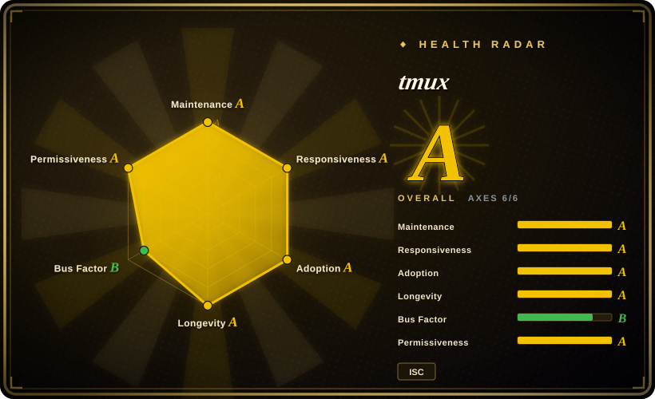
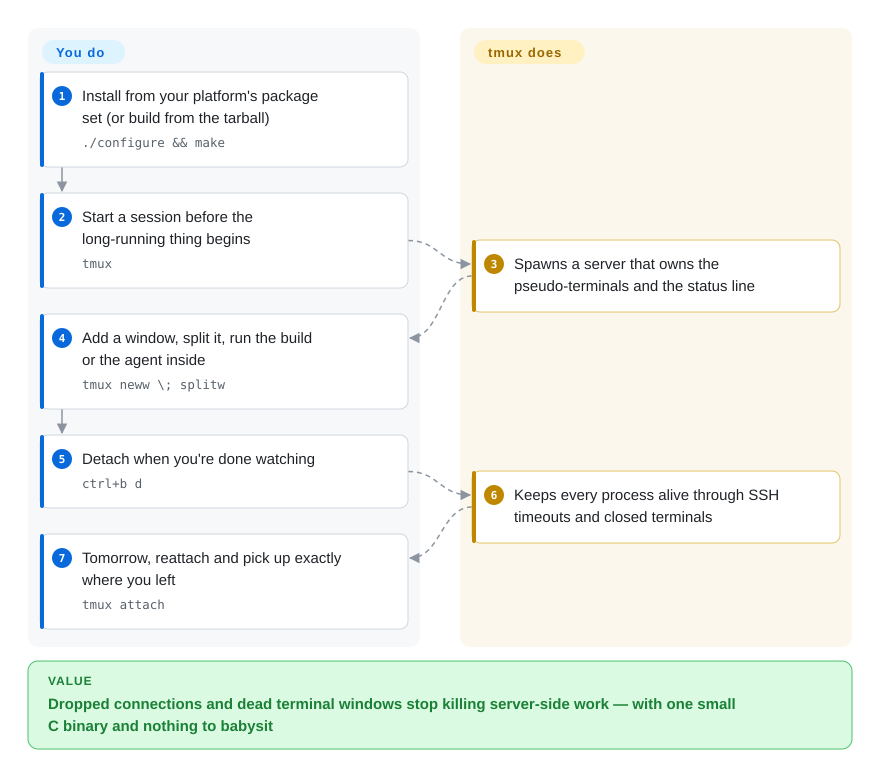

# tmux

You start a long build or a server over SSH, the connection blinks, and the process dies with your terminal. tmux keeps every program running inside a server you can detach from and reattach to: sessions, windows, and panes — with a scripting surface (the `tmux` command) that has become the default way scripts and, until recently, coding-agent harnesses drive terminals at all.

## When to use

You're on a remote box (or a laptop that closes), something long-running must not die when the terminal does — an overnight build, a training run, a dev server, an agent CLI — and you want the smallest, most universal piece of infrastructure that solves it. You reach for tmux because of the deciding tradeoffs: **it is everywhere** (every distro and BSD package set, no runtime beyond libevent/ncurses, ~20 years of unchanged core semantics since 2007 per the manpage copyright), and **it is scriptable by anyone already on the box** — `tmux new-window`, `send-keys`, `capture-pane` are POSIX-of-my-workplace verbs that other tools (including agent orchestrators that fan workers out in tmux panes) build on rather than competing with.

Against [zellij](zellij.md), you pick tmux when muscle memory, server fleet uniformity, and scripts matter more than a discoverable UI (zellij shows its mode hints; tmux asks you to learn `C-b`). Against agent-aware multiplexers like [herdr](../agent-frameworks/coding-agents/orchestration-and-review/herdr.md), you pick tmux when you want boring infrastructure you can bet a decade on, and don't need the multiplexer to know which pane is a blocked coding agent — you'll watch it yourself.

## How it works

tmux is a client/server multiplexer written in C: when you run it, it starts a server that owns every pseudo-terminal (the man page's own words: a session is "a single collection of pseudo terminals under the management of tmux"), and your terminal becomes just an attached client. Each session holds windows (full-screen, numbered), and a window splits into panes. The prefix key — default `C-b` — arms one action: `%` and `"` split, `d` detaches, and once all sessions are killed the server exits. Detached sessions "survive accidental disconnection (such as ssh connection timeout) or intentional detaching (with C-b d)", and `tmux attach` rejoins them. State is minimal: a config file (`~/.tmux.conf`), the server process, and nothing else — the same `tmux` binary doubles as the CLI that scripts drive the running server with (chaining commands with `;`, e.g. `tmux neww \; splitw` straight from the man page's examples). The boundary is yours: you define layout, keys, status bar; tmux guarantees the processes and the pipes.

<!-- flow-steps:begin (generated from flows/tmux.json by tools/flow_card.py — do not edit) -->

Text version of the flow

1. **You**: Install from your platform's package set (or build from the tarball) — `./configure && make`
2. **You**: Start a session before the long-running thing begins — `tmux`
3. **tmux**: Spawns a server that owns the pseudo-terminals and the status line
4. **You**: Add a window, split it, run the build or the agent inside — `tmux neww \; splitw`
5. **You**: Detach when you're done watching — `ctrl+b d`
6. **tmux**: Keeps every process alive through SSH timeouts and closed terminals
7. **You**: Tomorrow, reattach and pick up exactly where you left — `tmux attach`

**Value**: Dropped connections and dead terminal windows stop killing server-side work — with one small C binary and nothing to babysit

<!-- flow-steps:end -->

## When NOT to use

- **You supervise coding agents and want to know which one is stuck.** tmux badges nothing — no working/blocked/idle; you poll with `capture-pane` or add glue yourself. For agent-aware supervision use [herdr](../agent-frameworks/coding-agents/orchestration-and-review/herdr.md) (at the cost of a 6-month-old pre-1.0 tool), or a cockpit like [CloudCLI](../agent-tooling/supervision-surfaces/claudecodeui.md).
- **You need onboarding to work.** New teammates will not remember `C-b %`. [zellij](zellij.md) ships visible mode hints, mouse-friendly defaults, layouts-as-config and a web client out of the box.
- **You're on native Windows.** The README lists OpenBSD, FreeBSD, NetBSD, Linux, macOS and Solaris — Windows only via WSL/compat layers. If native Windows is the fleet, weigh the platform support stories of [herdr](../agent-frameworks/coding-agents/orchestration-and-review/herdr.md) (beta) or Windows Terminal + WSL tmux.
- **You want browser/phone access built in.** tmux has no web server; [zellij](zellij.md) ships an authenticated web client, [CloudCLI](../agent-tooling/supervision-surfaces/claudecodeui.md) is a web app.
- **You want modern conveniences without writing them.** Plugins (tpm is third-party), true multi-user spaces, floating/stacked panes: [zellij](zellij.md) includes these as first-class. tmux will do most of it via config — you pay in `.tmux.conf` maintenance.
- **You need GUI-grade rendering** (fonts per pane, images, ligatures): that's terminal-emulator territory — [Alacritty](alacritty.md) deliberately delegates multiplexing *to* tmux, [Warp](warp.md) is a proprietary app — so tmux is only ever half the stack there.

## Comparison

| Alternative | In index | Our verdict | Tradeoff |
|---|---|---|---|
| [zellij](zellij.md) | ✅ | Pick tmux for a 20-year substrate, script-everything ergonomics and everywhere-packaged deployment; pick zellij when discoverability (hint bar, mouse, layouts, WASM plugins, web client) is worth learning a different key model. | tmux: prefix-key grammar you memorize, config in its own mini-language, minimal deps (C). zellij: batteries included, Rust, per-mode UX, still no notion of what a pane runs. |
| [herdr](../agent-frameworks/coding-agents/orchestration-and-review/herdr.md) | ✅ | Choose herdr over tmux only for coding-agent supervision: state badges, `agent wait/prompt` APIs, per-agent session restore, machine federation. Choose tmux for everything that isn't that, because its behavior is a citable constant. | herdr: young (6 months, pre-1.0) but agent-aware. tmux: agent-blind, and for shells/builds/logs that blindness is the safety property — nothing to keep up to date. |
| GNU Screen | not indexed | Use Screen only where tmux genuinely isn't installable (ancient systems); its ergonomics and release activity are one era behind. | Real project, deliberately left unindexed — tmux supersedes it for every 2026 workload we route through this index. |
| Byobu | not indexed | If the pain is only "tmux looks bare" (status bar, presets), a cosmetic wrapper is the weakest fix — prefer learning tmux's own config or taking zellij's batteries; the wrapper hides the very verbs your scripts use. | A real project (developed on Launchpad; the GitHub-side mirrors are not the canonical repo), deliberately left unindexed: it adds no multiplexer to select against — the substrate under it is this page's subject. |

## Tech stack

- **C** (BSD-liked **ISC** license, read from the man-page copyright header and repo LICENSE), built with autoconf/automake; yacc (bison or yacc), pkg-config, a C compiler — per the README build section.
- **Runtime libraries:** [libevent](https://libevent.org) 2.x and [ncurses](https://www.gnu.org/software/ncurses/) (README "Dependencies"); optional `utempter` for utmp(5) updates.
- No interpreter, no daemon manager, no database: server + client are one binary; socket-based control; terminfo from the system.

## Dependencies

- **None the user must operate.** tmux needs libevent + ncurses present (distro packages do this); it runs wherever those exist.
- **Platforms:** OpenBSD, FreeBSD, NetBSD, Linux, macOS, Solaris (README, 2026-09) — no native Windows.
- Works with any terminal emulator (Alacritty's own page tells you to pair it with tmux); the mouse can be used for select/resize/copy via the `mouse` option (man page KEY BINDINGS notes on mouse defaults).

## Ops difficulty

**Low — the floor of the category.** One small C binary, packaged by every OS you care about; upgrade is `apt upgrade`-shaped; config is one text file; failure domain is one user-level server process (kill it and the panes die — which is also the restore caveat: tmux does *not* survive a machine reboot, it survives terminal death). The real cost is not ops but **learning**: the prefix-key model and `~/.tmux.conf` customization are where people actually spend time.

## Health & viability

- **Maintenance (2026-09).** Steady and release-disciplined: 3.7c shipped as a GitHub release 2026-08-17, 3.8-rc2 tagged 2026-09-24; master pushed 2026-09-26. The man page `$OpenBSD: tmux.1,v 1.1174 2026-09-25 nicm Exp` shows doc-level activity in the same week.
- **Governance / bus factor.** Two-commit-author reality: nicm (Nicholas Marriott, the original author) 8,646 commits, ThomasAdam 2,153, everyone else far behind (contributors API, 2026-09-27). It has survived ~19 years as effectively that pattern, but it *is* still a small-core model; discussion routes through the tmux-users Google Group / GitHub issues rather than a foundation.
- **Backing & age × Lindy.** No corporation, no foundation — but the Lindy prior is the strongest in its field: started 2007 (copyright date), still *active* in 2026, bundled in OpenBSD base and in every distro's default repos. Age alone wouldn't help; age × still-active is what this index's heuristic rewards. [推断] for the OpenBSD-base bundling claim — widely documented but not re-verified from an OpenBSD tree here.
- **Adoption & ecosystem.** Effectively universal among terminal power users; decades of tutorials, tpm plugin ecosystem, and *other tools scripting it* (agent harnesses fan workers out "under tmux"). Measured pull (2026-09-27): ~159k Homebrew installs/90d, ~4.87M cumulative GitHub release downloads, issue-triage median ~2.2h — 49.5k stars understate it; stars measure GitHub-era hype, not installed base.
- **Risk flags.** No notable relicense history (ISC throughout). Concentration on one very long-tenured author is the main structural risk; the 42 open GitHub issues at check time reflect an issues-are-screened culture more than neglect (CONTRIBUTING.md steers questions to discussions). [推断]

## Caveats (unverified)

- [未验证] "Bundled in OpenBSD base system" — stated from memory/common knowledge, not verified against an OpenBSD source tree in this sitting.
- [推断] Reading "42 open issues + CONTRIBUTING.md" as screened-issue culture rather than low usage.
- [未验证] Frontmatter `upstream.default_branch_sha: 3.8-rc2` records the tag at check time; the actual master SHA should be taken by `upstream_snapshot.py` (it will overwrite this placeholder).
- [推断] "tmux does not survive a machine reboot" — derived from the design (user-level server process, no documented restore mechanism); no resurrection feature exists in the docs read, but I did not exhaustively check.
- [推断] The claim that other tools "build on tmux rather than compete" is an index-internal observation (e.g. oh-my-claudecode, Hermes Workspace dispatch panes through tmux), not a survey.
