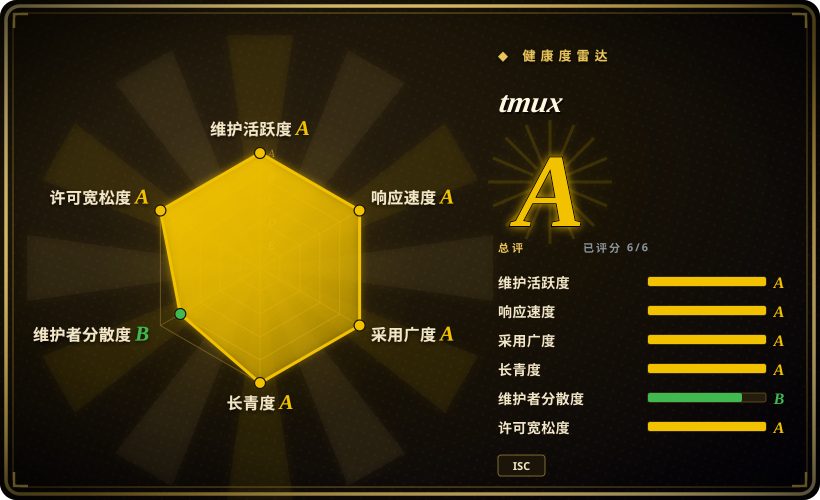
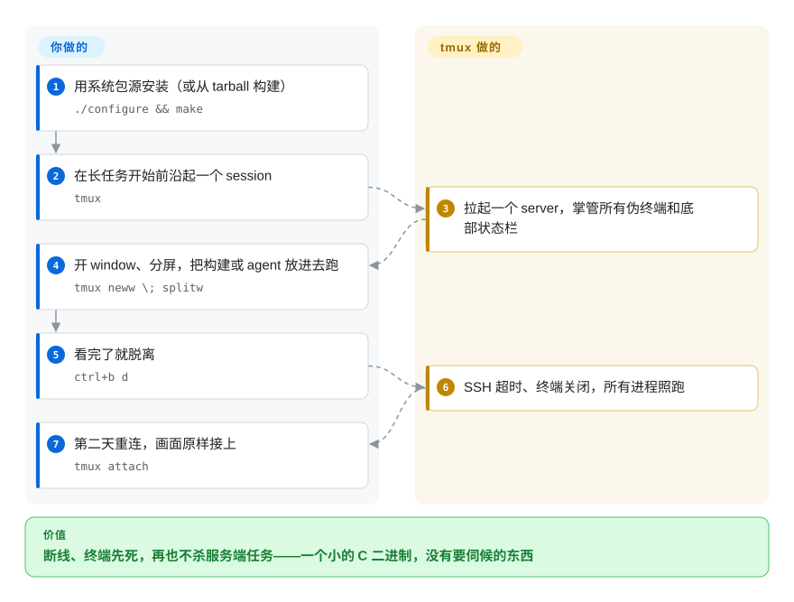

# tmux

你在 SSH 上开了个长构建或者起了个服务，网络一晃，进程随终端一起死掉。tmux 把所有程序装进一个可以脱离、可以再连回来的 server：session、window、pane 三层结构，外加一套 `tmux` 命令脚本接口——近二十年来，它已经是“脚本怎么驱动终端”这个词的默认写法，连各类 agent 编排器都在它上面盖房子而不是和它竞争。

## 何时使用

你在远程机器（或一台会合盖的笔记本）上，有东西必须比终端活得长——通宵构建、训练任务、dev server、agent CLI——而你想要的是解决这件事最小、最通用的基础设施。你会选 tmux，因为决定性取舍在这里：**它无处不在**（每个发行版和 BSD 的默认包源，除了 libevent/ncurses 没有运行时依赖，按 manpage 版权头自 2007 年起核心语义二十年未变），而且**机器上人人会让脚本调它**——`tmux new-window`、`send-keys`、`capture-pane` 是你工作环境里的 POSIX，别的工具（包括在 tmux pane 里扇出 worker 的 agent 编排器）在它上面盖楼而不是另起炉灶。

对比 [zellij](zellij.zh.md)：肌肉记忆、服务器机群一致性、脚本优先时选 tmux；可发现性更重要时选 zellij（zellij 把模式提示亮给你看，tmux 要求你先背下 `C-b`）。对比 agent 感知的复用器 [herdr](../agent-frameworks/coding-agents/agent-multiplexers/herdr.zh.md)：你要的是一个可以押十年的无聊基建、不需要复用器知道哪个 pane 里卡着个编程 agent 时，选 tmux——你自己盯。

## 怎么用起来

tmux 是 C 写的 client/server 多路复用器：你敲下 `tmux`，它拉起一个 server，server 掌管每一个伪终端（manpage 原话：session 是“a single collection of pseudo terminals under the management of tmux”），你的终端只是附着上去的 client。每个 session 里有若干 window（全屏、带编号），window 可以切成 pane。前缀键（默认 `C-b`）武装一个动作：`%` 和 `"` 分屏，`d` 脱离；所有 session 被杀光，server 才退出。脱离后的 session “survive accidental disconnection (such as ssh connection timeout) or intentional detaching (with C-b d)”，回来用 `tmux attach`。状态极少：一个配置文件（`~/.tmux.conf`）、一个 server 进程，没了——同一个 `tmux` 二进制又是脚本驱动活 server 的 CLI（用 `;` 串联命令，比如 manpage 示例里的 `tmux neww \; splitw`）。边界在你这边：布局、按键、状态栏都归你定义；tmux 只承诺进程和管道活着。

<!-- flow-steps:begin (generated from flows/tmux.json by tools/flow_card.py — do not edit) -->

流程文字版

1. **你**：用系统包源安装（或从 tarball 构建） — `./configure && make`
2. **你**：在长任务开始前沿起一个 session — `tmux`
3. **tmux**：拉起一个 server，掌管所有伪终端和底部状态栏
4. **你**：开 window、分屏，把构建或 agent 放进去跑 — `tmux neww \; splitw`
5. **你**：看完了就脱离 — `ctrl+b d`
6. **tmux**：SSH 超时、终端关闭，所有进程照跑
7. **你**：第二天重连，画面原样接上 — `tmux attach`

**价值**：断线、终端先死，再也不杀服务端任务——一个小的 C 二进制，没有要伺候的东西

<!-- flow-steps:end -->

## 何时不用

- **你在盯编程 agent、想知道哪个卡住了。** tmux 不打任何标记——没有 working/blocked/idle；要么自己 `capture-pane` 轮询，要么自己搭胶水。要 agent 感知监管用 [herdr](../agent-frameworks/coding-agents/agent-multiplexers/herdr.zh.md)（代价是 6 个月大的 pre-1.0 工具），或者用 [CloudCLI](../agent-tooling/supervision-surfaces/claudecodeui.zh.md) 这类驾驶舱。
- **你要新人当天上手。** 新同事记不住 `C-b %`。[zellij](zellij.zh.md) 开箱自带可见模式提示条、鼠标友好、布局即配置、web client。
- **你在原生 Windows。** README 的平台列表是 OpenBSD、FreeBSD、NetBSD、Linux、macOS、Solaris——Windows 只能走 WSL/兼容层。机群以原生 Windows 为主，就去看 [herdr](../agent-frameworks/coding-agents/agent-multiplexers/herdr.zh.md) 的平台支持叙事（beta）或 Windows Terminal + WSL 里的 tmux。
- **你要内置浏览器/手机接入。** tmux 没有 web server；[zellij](zellij.zh.md) 自带鉴权 web client，[CloudCLI](../agent-tooling/supervision-surfaces/claudecodeui.zh.md) 本身就是 web 应用。
- **你想要现代便利但不想自己写出来。** 插件（tpm 是第三方）、真正的多人空间、浮动/堆叠 pane：[zellij](zellij.zh.md) 把这些当一等公民。tmux 大多能靠配置做到——你付出的代价是 `.tmux.conf` 的长期维护。
- **你要 GUI 级渲染**（每 pane 字体、图片、连字）：那是终端模拟器的事——[Alacritty](alacritty.zh.md) 明确把复用*让给* tmux，[Warp](warp.zh.md) 是专有应用——tmux 在那里永远只是半个栈。

## 横向对比

| 替代品 | 是否收录 | 我们的评价 | 取舍 |
|---|---|---|---|
| [zellij](zellij.zh.md) | ✅ | 要二十年底座、脚本一切的人体工学、到处都有包的部署，选 tmux；可发现性（提示条、鼠标、布局、WASM 插件、web client）值得换一套按键模型，选 zellij。 | tmux：要背的前缀键语法、自成一家的配置语言、依赖极简（C）。zellij：开箱电池全含、Rust、按模式分键，但同样不知道 pane 里跑的是什么。 |
| [herdr](../agent-frameworks/coding-agents/agent-multiplexers/herdr.zh.md) | ✅ | 只有为“监管编程 agent”（状态标记、`agent wait/prompt` API、按 agent 的会话恢复、多机联邦）才用 herdr 替代 tmux；其余场景选 tmux，因为它的行为是可以引用的常量。 | herdr：年轻（6 个月、pre-1.0）但感知 agent。tmux：对 agent 无知，而对 shell/构建/日志来说这份“无知”恰是安全属性——没有需要追新的东西。 |
| GNU Screen | 未收录 | 只有在 tmux 真的装不出来的老系统上才值得用 Screen；它的操作手感和发布活跃度落后一个时代。 | 真实项目，有意不收录——本索引路由的 2026 工作负载里 tmux 全面取代它。 |
| Byobu | 未收录 | 如果痛点只是“tmux 太素”，Byobu 这类预设是化妆；要么学 tmux 配置，要么直接上 zellij 的开箱电池，别套一层把脚本要用的动词挡在外面的壳。 | 真实项目（主源在 Launchpad，非 GitHub 规范仓库），有意不收录：薄封装层，底层还是 tmux——它解决的问题是装饰性的，不是架构性的。 |

## 技术栈

- **C**，许可证 **ISC**（读自 manpage 版权头与仓库 LICENSE），autoconf/automake 构建；需要 yacc（bison 或 yacc）、pkg-config、C 编译器——按 README 构建章节。
- **运行时库：** [libevent](https://libevent.org) 2.x 与 [ncurses](https://www.gnu.org/software/ncurses/)（README“Dependencies”）；可选 `utempter` 更新 utmp(5)。
- 无解释器、无服务管理器、无数据库：server 和 client 是同一个二进制；控制走本地 socket；terminfo 用系统的。

## 依赖

- **用户不需要额外运维任何东西。** tmux 只需要系统里有 libevent + ncurses（发行版包都会安排好）；这俩在的地方它就能跑。
- **平台：** OpenBSD、FreeBSD、NetBSD、Linux、macOS、Solaris（README，2026-09）——无原生 Windows。
- 与任何终端模拟器配合（Alacritty 的页面自己说复用交给 tmux）；开 `mouse` 选项后可用鼠标选区、缩放、复制（manpage 键绑定章节的鼠标默认说明）。

## 运维难度

**低——本类别的地板。** 一个小的 C 二进制，你在意的每个 OS 都打包；升级是 `apt upgrade` 的形状；配置是一个纯文本文件；故障域是一个用户级 server 进程（杀掉它，pane 全灭——这也是恢复的另一面：tmux *不*扛机器重启，它扛的是终端先死）。真实成本不在运维而在**学习**：前缀键模型和 `~/.tmux.conf` 定制才是人真正花时间的地方。

## 健康度与可持续性

- **维护（2026-09）。** 稳定且有发布纪律：3.7c 于 2026-08-17 发 GitHub release（tag 2026-07-23），3.8-rc2 于 2026-09-24 打 tag；master 推送 2026-09-26。manpage 头 `$OpenBSD: tmux.1,v 1.1174 2026-09-25 nicm Exp` 显示文档在同一周也在动。
- **治理 / bus factor。** 事实上的双作者结构：nicm（Nicholas Marriott，原作者）8,646 commits，ThomasAdam 2,153，其余人差一个量级（contributors API，2026-09-27）。这个模式已经扛了约 19 年，但它*仍然*是小核心模型；讨论走 tmux-users Google Group / GitHub issues，而非基金会。
- **后盾与年龄 × Lindy。** 没有公司也没有基金会——但 Lindy 先验在同类里最强：2007 年起步（版权年份），2026 年*仍在活跃*，进了 OpenBSD 基础系统和各发行版默认源。单看年龄不加分；本索引的启发式认的是“年龄 × 仍活跃”。OpenBSD 基础系统内置一说为 [推断]——广为记载，但本次未对着 OpenBSD 源码树复核。
- **采用度与生态。** 终端重度用户里近乎标配；二十年的教程存量、tpm 插件生态、以及*被别的工具当脚本底座*（agent 编排器“under tmux”扇 worker）。实测拉力（2026-09-27）：Homebrew 90 天约 159k 次安装、GitHub release 累计下载约 487 万次、issue 首次响应中位数约 2.2 小时——49.5k stars 其实低估了它——stars 度量的是 GitHub 时代的热度，不是装机量。
- **风险信号。** 无许可证变更史（一贯 ISC）。结构性风险主要是单一超长任期作者集中；查检时 42 个 open issues 更多反映“issue 有筛选”的文化（CONTRIBUTING.md 把提问引向 discussions）而非无人使用。[推断]

## 存疑（未验证）

- [未验证]“进入 OpenBSD 基础系统”——依据常识/常见记载，本次未对着 OpenBSD 源码树核实。
- [推断]把“42 open issues + CONTRIBUTING.md”读作有筛选的 issue 文化而非使用量低。
- [推断]“tmux 不扛机器重启”——由设计推出（用户级 server 进程，文档无恢复机制）；读过的文档里没有任何复活特性，但未做穷尽检索。
- [推断]“别的工具在它上面盖楼而非竞争”是索引内观察（如 oh-my-claudecode、Hermes Workspace 经由 tmux 派发 pane），不是调查结论。
- [未验证] star 数、commit 数、维护者集中度均为 2026-09-27 的 GitHub API 输出；squash-merge 可能扭曲按人归因。
