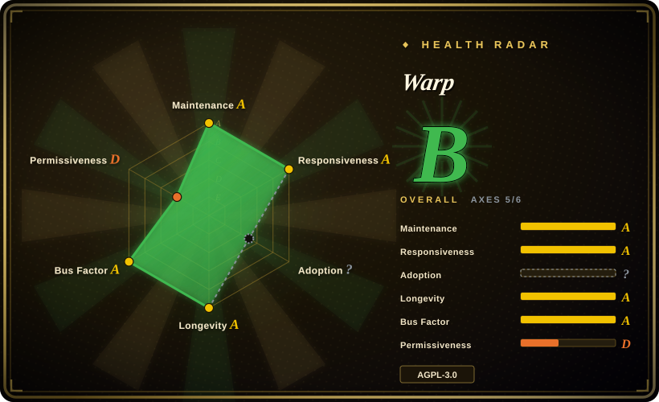
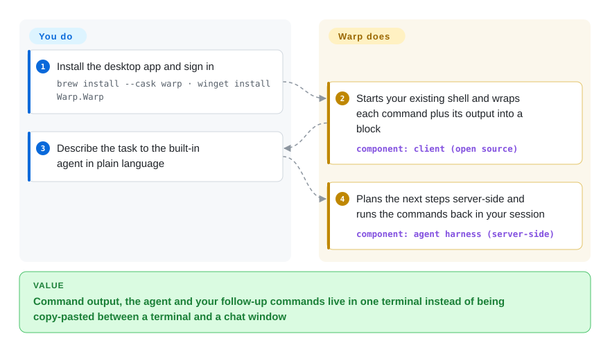

# Warp

Your terminal is one long scroll of text: finding where the last failing command's output starts, then copying it into a chat window for an AI to read, is manual work every time. Warp groups each command and its output into a selectable block and puts a coding agent next to it — the desktop client has been open source (AGPL) since April 2026, but the agent backend and cloud sync are still Warp's proprietary servers.

## When to use

You are a developer who spends the day in a terminal and increasingly hands work to coding agents. A typical loop: `cargo test` prints 600 lines, you scroll up hunting for the first `error[E0308]`, copy it, switch to a browser chat, paste, and copy the suggested fix back. You want the terminal itself to know where each command's output begins and ends, and to let an agent read it and run the follow-up commands in the same session.

You pick Warp over Alacritty or Ghostty because those are fast, plain emulators with no notion of a command block and no agent. You pick it over iTerm2 because you also work on Linux or Windows, and Warp ships one app for macOS, Linux and Windows. You pick it over an editor's embedded terminal because the terminal, not the editor, is where you want the agent to live — and you can still run Claude Code, Codex or Gemini CLI inside Warp if you prefer them to its built-in agent. The deciding tradeoff: you accept a vendor account and a hosted agent backend in exchange for blocks and an integrated agent workflow.

## How it works

Warp is a desktop app written in Rust on its own GPU-drawn UI framework (WarpUI); it does not replace your shell — it starts your bash, zsh, fish or PowerShell and sits in front of it. Because it controls the input editor and the output pane, it can cut the stream into blocks — one command plus everything it printed — which you can select, search, copy or share as a unit. When you ask for help in plain language, the request goes to Warp's built-in agent, whose harness (the planning loop that decides which command to run next) runs on Warp's servers, not on your machine; it then acts inside your terminal session. What Warp does for you: the block model, completions, the agent loop and the hosted models behind it. What stays yours: the shell and its config, the commands you approve, and — if you prefer — your own CLI agent running in a Warp tab instead of the built-in one. The open-source repository is the client only; the server, the Warp Drive sync backend and the Oz orchestration layer are not in it.

<!-- flow-steps:begin (generated from flows/warp.json by tools/flow_card.py — do not edit) -->

Text version of the flow

1. **You**: Install the desktop app and sign in — `brew install --cask warp · winget install Warp.Warp`
2. **Warp**: Starts your existing shell and wraps each command plus its output into a block — component: `client (open source)`
3. **You**: Describe the task to the built-in agent in plain language
4. **Warp**: Plans the next steps server-side and runs the commands back in your session — component: `agent harness (server-side)`

**Value**: Command output, the agent and your follow-up commands live in one terminal instead of being copy-pasted between a terminal and a chat window

<!-- flow-steps:end -->

## When NOT to use

- **You need the whole stack to be open source or self-hostable.** Use Alacritty (with your own CLI agent) instead, because only Warp's client is open: its FAQ states the server, the Drive backend, hosted auth and Oz orchestration remain proprietary, so the agent and sync features cannot be run on your own infrastructure.
- **You cannot sign in to a vendor cloud or send terminal context off-machine.** Use Alacritty or iTerm2 instead, because the built-in agent's harness runs server-side and features such as Drive sync and hosted-model agents require Warp's backend; Warp's own FAQ says the fully local surface is still being clarified.
- **You want to use your existing Claude or OpenAI subscription inside Warp's built-in agent.** Run that vendor's CLI agent (Claude Code, Codex) in any terminal instead, because the FAQ says bringing your own model subscription to Warp's agent is not supported today (ACP support is only on the roadmap).
- **You want a minimal, instant-start terminal with no network calls.** Use Alacritty instead, because Warp is a full application with an account system, cloud features and an agent UI, not a thin emulator.
- **You plan to fork or embed the client inside a closed-source product.** Pick an Apache-licensed terminal such as Alacritty instead, because Warp's app code is AGPL-3.0 (only the `warpui` / `warpui_core` UI crates are MIT), so derivative clients must stay open.
- **Your terminal work is mostly inside a long-lived multiplexer on remote servers.** Use [tmux](tmux.md) or [Zellij](zellij.md) on the server instead, because Warp's blocks and agent attach to the local session you start in Warp, not to an existing multiplexer session on a remote host. [推断]

## Comparison

| Alternative | In index | Our verdict | Tradeoff |
|---|---|---|---|
| [Alacritty](alacritty.md) | ✅ | Choose Alacritty when you want a fast, fully open-source emulator with zero cloud dependency and you bring your own agent CLI; choose Warp when command blocks and an integrated agent matter more than a fully local stack. | Apache-2.0, minimal and local, but no blocks, no agent and no account features — you assemble the workflow yourself. |
| iTerm2 | 未收录 | Choose iTerm2 when you only use macOS and want a mature, GPL terminal with deep macOS integration and no account; choose Warp when you need the same tool on Linux and Windows plus an agent built in. | macOS-only and long-established, but no block model and AI is an add-on rather than the core workflow. |
| Ghostty | 未收录 | Choose Ghostty for a native-feeling, GPU-accelerated open-source emulator without accounts or a hosted backend; choose Warp when you want agent features shipped in the terminal itself. | Fast and fully local, but no command blocks or agent harness; agent work happens in whatever CLI you run inside it. |
| WezTerm | 未收录 | Choose WezTerm when you want a cross-platform open-source terminal you script and configure in Lua, including its own multiplexing; choose Warp when you prefer an opinionated UI over configuration. | Highly configurable and self-contained, but no built-in agent and a steeper config curve. |
| Tabby | 未收录 | Choose Tabby when you need an open-source terminal with an integrated SSH/serial client and connection manager; choose Warp when local agent-assisted development is the main use. | Strong remote-connection tooling, but heavier Electron app and no integrated coding agent. |

## Tech stack

- **Rust** for the client — a Cargo workspace with dozens of crates (`app/` plus `crates/`).
- **WarpUI** — Warp's own UI framework (`warpui`, `warpui_core`), GPU-rendered through `wgpu` with WGSL shaders; the same core also drives a headless TUI front-end (`crates/warp_tui`).
- **Terminal parsing** via a Warp fork of `vte`; `tokio` for async I/O; `diesel` for local persistence.
- **Proprietary backend** — the server, Warp Drive backend, hosted auth and the Oz agent orchestration are not in the repository.

## Dependencies

- **Operating system:** macOS 10.14+, Linux (`.deb`, `.rpm`, Arch, AppImage) or Windows 10/11 (x64/ARM64), per the download page.
- **A shell you already use:** bash, zsh, fish or PowerShell.
- **A Warp account and network access** for the built-in agent, hosted models, Drive sync and team features.
- **Optional:** your own CLI agent (Claude Code, Codex, Gemini CLI) with its own API key or subscription.
- **To build from source:** the Rust toolchain plus `./script/bootstrap` for platform setup.

## Ops difficulty

**Low for an individual, medium for a company.** Installing is a normal desktop-app install (`brew install --cask warp`, `winget install Warp.Warp`, or a Linux package), with no server to run. The organizational cost is elsewhere: terminal context sent to a vendor-hosted agent needs a data-handling review, the agent features depend on Warp's service availability and pricing, and the update cadence is Warp's, not yours. Building the open-source client yourself is possible but gives you only the client — it still talks to Warp's backend for cloud and agent features.

## Health & viability

- **Maintenance (as of 2026-10-08):** very active — commits every week of the last quarter and a last commit the same day; GitHub pre-release tags stop in June 2026, so product releases are tracked on warp.dev rather than in GitHub Releases.
- **Responsiveness:** first responses on issues are effectively immediate, but much of that is Warp's own triage agents (a bot account is the top contributor), so read it as automation throughput, not human support depth.
- **Governance & backing:** a single venture-backed vendor (Warp) owns the roadmap; 90+ people committed in the last year and contributions go through a spec-PR plus agent-and-staff review flow. OpenAI is named in the README as the founding sponsor of the open-source repository.
- **Age / Lindy:** the repository is about five years old, but it was an issues-only tracker until the client code was published on 2026-04-28 — the open-source codebase itself has only months of public history, so the Lindy prior applies to the product, not to the community project.
- **Adoption:** ~65k GitHub stars, most of them accumulated while the repo was an issue tracker; there is no package registry signal, so the scorer leaves adoption unscored.
- **Risk flags:** AGPL-3.0 on the client (MIT only for the UI crates) and a proprietary backend that holds the agent and sync features — the open client does not remove vendor dependence.

## Caveats (unverified)

- [推断] The claim that Warp's blocks and agent do not attach to an existing remote multiplexer session is inferred from the client-side architecture, not tested.
- [未验证] Which features work fully offline / without sign-in: the FAQ only says "some functionality works fully locally" and that the boundary is still being clarified.
- [未验证] Pricing, free-tier limits and data-retention terms for the hosted agent were not reviewed; check warp.dev before sending company code through it.
- [未验证] The weekly product release cadence comes from earlier README text; current GitHub pre-release tags stopped in 2026-06 and the release channel was not otherwise confirmed.
- [推断] Star count (~65k on 2026-10-08) mostly predates the 2026-04-28 code release, so it measures product interest rather than open-source community size.
- [未验证] Comparison facts about iTerm2, Ghostty, WezTerm and Tabby (licenses, feature sets) are from general knowledge, not re-read for this sync.
