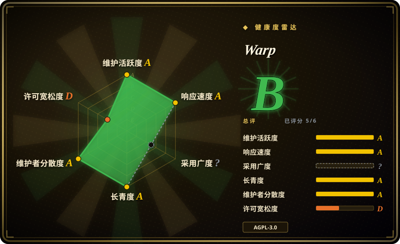
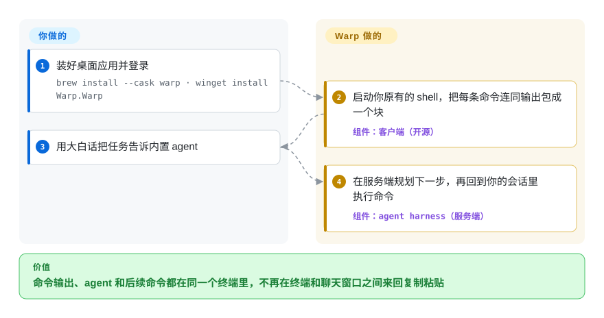

# Warp

终端输出是一整条往上滚的长文本：想找到上一条失败命令的输出从哪开始，再复制进聊天窗口让 AI 看，每次都得手工来。Warp 把每条命令和它的输出切成一个可选中的“块”，旁边直接放一个编码 agent——桌面客户端自 2026 年 4 月起以 AGPL 开源，但 agent 后端和云同步仍跑在 Warp 自家的闭源服务器上。

## 何时使用

你是一名整天泡在终端里的开发者，越来越多的活交给编码 agent 去做。典型的一轮：`cargo test` 打出 600 行，你往上翻找第一个 `error[E0308]`，复制，切到浏览器里的聊天窗口粘贴，再把建议的修法抄回来。你希望终端自己知道每条命令的输出从哪到哪，并让 agent 读到它、在同一个会话里接着跑后续命令。

你选 Warp 而不选 Alacritty 或 Ghostty，是因为它们是快而朴素的终端模拟器，没有“命令块”的概念，也没有 agent。你选它而不选 iTerm2，是因为你还要在 Linux 或 Windows 上干活，而 Warp 在 macOS、Linux、Windows 上是同一个应用。你选它而不选编辑器内嵌终端，是因为你想让 agent 住在终端里而不是编辑器里——如果你更信得过 Claude Code、Codex 或 Gemini CLI，也可以直接在 Warp 里跑它们，不用内置 agent。真正的取舍是：你接受一个厂商账号和托管的 agent 后端，换来命令块和一体化的 agent 工作流。

## 怎么用起来

Warp 是一个用 Rust 写的桌面应用，界面由它自研的 GPU 绘制 UI 框架（WarpUI）画出来；它不替换你的 shell，而是启动你的 bash、zsh、fish 或 PowerShell，然后站在它前面。因为输入编辑器和输出区都归它管，它能把输出流切成“块”——一条命令加上它打印的全部内容——你可以把块当成一个整体来选中、搜索、复制或分享。你用大白话求助时，请求会发给 Warp 的内置 agent，它的 harness（决定下一步跑哪条命令的规划循环）运行在 Warp 的服务器上，而不是你的机器上，然后回到你的终端会话里执行。Warp 替你做的：块模型、补全、agent 循环以及背后的托管模型。留给你的：shell 和它的配置、你放行的命令，以及——如果你愿意——在 Warp 标签页里跑你自己的 CLI agent 来代替内置那个。开源仓库只有客户端；服务器、Warp Drive 同步后端和 Oz 编排层都不在里面。

<!-- flow-steps:begin (generated from flows/warp.json by tools/flow_card.py — do not edit) -->

流程文字版

1. **你**：装好桌面应用并登录 — `brew install --cask warp · winget install Warp.Warp`
2. **Warp**：启动你原有的 shell，把每条命令连同输出包成一个块 — 组件：`客户端（开源）`
3. **你**：用大白话把任务告诉内置 agent
4. **Warp**：在服务端规划下一步，再回到你的会话里执行命令 — 组件：`agent harness（服务端）`

**价值**：命令输出、agent 和后续命令都在同一个终端里，不再在终端和聊天窗口之间来回复制粘贴

<!-- flow-steps:end -->

## 何时不用

- **你要求整套栈都开源或能自托管。** 改用 Alacritty（再配你自己的 CLI agent），因为 Warp 只开放了客户端：它的 FAQ 写明服务器、Drive 后端、托管认证和 Oz 编排仍是闭源的，agent 和同步功能没法跑在你自己的基础设施上。
- **你不能登录厂商云，或不能把终端上下文发出本机。** 改用 Alacritty 或 iTerm2，因为内置 agent 的 harness 在服务端运行，Drive 同步、托管模型 agent 等功能都依赖 Warp 后端；Warp 自己的 FAQ 也承认“哪些能完全本地用”还在梳理。
- **你想在 Warp 内置 agent 里用自己现有的 Claude 或 OpenAI 订阅。** 改为在任意终端里直接跑该厂商的 CLI agent（Claude Code、Codex），因为 FAQ 说目前不支持把自带的模型订阅接进 Warp 的 agent（ACP 支持还只在路线图上）。
- **你要一个极简、秒开、不发网络请求的终端。** 改用 Alacritty，因为 Warp 是带账号体系、云功能和 agent 界面的完整应用，不是薄薄一层模拟器。
- **你打算 fork 客户端或把它嵌进闭源产品。** 改选 Alacritty 这类 Apache 许可的终端，因为 Warp 的应用代码是 AGPL-3.0（只有 `warpui` / `warpui_core` 两个 UI crate 是 MIT），衍生客户端必须继续开源。
- **你的终端工作主要发生在远程服务器上一个常驻的复用器会话里。** 改在服务器上用 [tmux](tmux.zh.md) 或 [Zellij](zellij.zh.md)，因为 Warp 的块和 agent 挂在你从 Warp 本地启动的会话上，而不是远端已有的复用器会话。[推断]

## 横向对比

| 替代品 | 是否收录 | 我们的评价 | 取舍 |
|---|---|---|---|
| [Alacritty](alacritty.zh.md) | ✅ | 想要快速、完全开源、零云依赖的终端，并自己带 agent CLI 时选 Alacritty；命令块和一体化 agent 比“全本地”更重要时选 Warp。 | Apache-2.0、极简、全本地，但没有块、没有 agent、没有账号功能——工作流要你自己拼。 |
| iTerm2 | 未收录 | 只用 macOS、想要成熟的 GPL 终端、深度集成 macOS 且不要账号时选 iTerm2；同一个工具还要跑在 Linux 和 Windows 上并自带 agent 时选 Warp。 | 只有 macOS、历史悠久，但没有块模型，AI 是附加功能而不是核心工作流。 |
| Ghostty | 未收录 | 想要原生手感、GPU 加速、无账号无托管后端的开源终端时选 Ghostty；想让 agent 功能直接长在终端里时选 Warp。 | 快且全本地，但没有命令块也没有 agent harness；agent 的活由你在里面跑的 CLI 来做。 |
| WezTerm | 未收录 | 想要跨平台、用 Lua 脚本配置、自带复用功能的开源终端时选 WezTerm；更喜欢开箱即用的界面而不是写配置时选 Warp。 | 可配置性强、自成一体，但没有内置 agent，配置门槛更高。 |
| Tabby | 未收录 | 需要集成 SSH/串口客户端和连接管理器的开源终端时选 Tabby；主要场景是本地 agent 辅助开发时选 Warp。 | 远程连接工具链强，但它是更重的 Electron 应用，也没有集成编码 agent。 |

## 技术栈

- **Rust** 写的客户端——一个由几十个 crate 组成的 Cargo workspace（`app/` 加 `crates/`）。
- **WarpUI**——Warp 自研的 UI 框架（`warpui`、`warpui_core`），经 `wgpu` 和 WGSL 着色器做 GPU 渲染；同一套核心还驱动一个无头 TUI 前端（`crates/warp_tui`）。
- **终端解析**用 Warp fork 的 `vte`；异步 I/O 用 `tokio`；本地持久化用 `diesel`。
- **闭源后端**——服务器、Warp Drive 后端、托管认证和 Oz agent 编排都不在仓库里。

## 依赖

- **操作系统：** macOS 10.14+、Linux（`.deb`、`.rpm`、Arch、AppImage）或 Windows 10/11（x64/ARM64），以下载页为准。
- **你已经在用的 shell：** bash、zsh、fish 或 PowerShell。
- **Warp 账号和网络连接：** 内置 agent、托管模型、Drive 同步和团队功能都需要。
- **可选：** 你自己的 CLI agent（Claude Code、Codex、Gemini CLI），配它自己的 API 密钥或订阅。
- **从源码构建时：** Rust 工具链，外加用 `./script/bootstrap` 做平台准备。

## 运维难度

**个人用低，公司用中。** 安装就是普通桌面应用（`brew install --cask warp`、`winget install Warp.Warp` 或 Linux 安装包），没有服务器要跑。真正的成本在组织层面：发往厂商托管 agent 的终端上下文需要过数据合规审查，agent 功能依赖 Warp 服务的可用性和定价，更新节奏由 Warp 决定而不是你。你可以自己从源码构建开源客户端，但得到的只是客户端——云功能和 agent 功能照样要连 Warp 的后端。

## 健康度与可持续性

- **维护活跃度（截至 2026-10-08）：** 非常活跃——上个季度每周都有提交，最近一次提交就在当天；GitHub 上的预发布 tag 停在 2026 年 6 月，产品版本发布以 warp.dev 为准，而不是 GitHub Releases。
- **响应速度：** issue 的首次响应几乎是即时的，但其中很大一部分来自 Warp 自己的分诊 agent（贡献者第一名是一个 bot 账号），应把它理解为自动化吞吐，而不是人工支持的深度。
- **治理与背书：** 由单一的风投支持厂商（Warp）掌握路线图；过去一年有 90 多人提交过代码，贡献走“先提 spec PR，再经 agent 加员工双重评审”的流程。README 写明 OpenAI 是这个开源仓库的创始赞助方。
- **年龄 / Lindy：** 仓库约五年，但在 2026-04-28 公开客户端代码之前它一直只是 issue 跟踪器——开源代码库本身只有几个月的公开历史，所以 Lindy 先验适用于这款产品，而不适用于这个社区项目。
- **采用广度：** GitHub 约 6.5 万 star，大部分是仓库还只是 issue 跟踪器时攒下的；没有包仓库下载信号，评分器把采用度留为未评。
- **风险信号：** 客户端是 AGPL-3.0（只有 UI crate 是 MIT），而 agent 和同步功能握在闭源后端手里——开源客户端并没有消除对厂商的依赖。

## 存疑（未验证）

- [推断] “Warp 的块和 agent 不会挂到远端已有复用器会话上”是从客户端架构推出来的，没有实测。
- [未验证] 哪些功能能完全离线 / 不登录使用：FAQ 只说“部分功能可完全本地运行”，边界仍在梳理。
- [未验证] 托管 agent 的定价、免费额度和数据留存条款没有审阅；把公司代码交给它之前先去 warp.dev 核对。
- [未验证] “每周发布”的节奏来自早先的 README 文字；GitHub 预发布 tag 在 2026-06 之后就停了，当前发布渠道没有另行确认。
- [推断] star 数（2026-10-08 约 6.5 万）大部分早于 2026-04-28 的代码公开，衡量的是产品关注度而不是开源社区规模。
- [未验证] 对 iTerm2、Ghostty、WezTerm、Tabby 的对比事实（许可证、功能）来自一般认知，本次同步没有重读。
