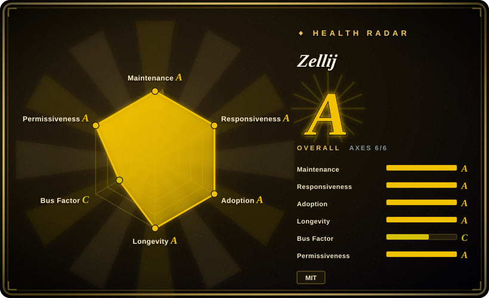
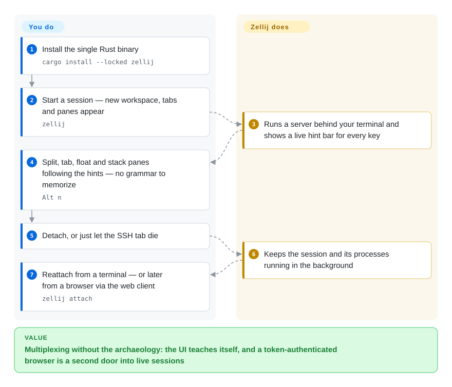

# Zellij

tmux does everything but looks like 2007, asks you to memorize a prefix-key grammar first, and gives a new teammate nothing to click on. Zellij is a terminal multiplexer built backwards from that experience: tabs, panes, floating and stacked layouts with a clickable status bar and on-screen keybinding hints, session persistence that survives your SSH drop — plus a built-in, token-authenticated web client so the same sessions are reachable from a browser or phone.

## When to use

You work in a team (or with your future self) where "just learn `C-b %`" is a real onboarding cost, and you want the persistence benefits of a multiplexer *without* the archaeology: you run `zellij`, and the hint bar at the bottom tells you what every key does right now. You pick Zellij over [tmux](tmux.md) when discoverability, mouse-friendly defaults, declarative session layouts (KDL files that describe "this tab is the editor, that one the server"), and out-of-the-box extras — floating panes, stacked panes, multiplayer session sharing, WASM plugins — outweigh tmux's twenty years of frozen behavior and every-script-writes-`tmux`-subcommands ecosystem. You pick it over [herdr](../agent-frameworks/coding-agents/agent-multiplexers/herdr.md) when your panes hold humans, not supervised coding agents: Zellij deliberately does not model *what* a pane is running, so it has no blocked/working notion; in exchange it gives a first-class browser client with hashed login tokens and read-only tokens, which herdr does not run at all.

## How it works

Like tmux, Zellij is client/server: running `zellij` starts a detached session server that owns the PTYs, and clients (terminal, or the built-in web server at `127.0.0.1:8082`) attach to it; the session survives your terminal dying, and `zellij attach` (or the bookmarked URL `http://host:8082/my-session`) puts you back exactly where you left — the URL scheme even *resurrects* an exited session. The UX layer is the differentiator: input is grouped into **modes** (normal, pane, tab, resize, scroll, locked) and the status bar always shows what each key will do in the current mode, so there is no hidden grammar to memorize — the defaults you'll actually see in `default.kdl` include `Alt n` for a new pane and `Ctrl p` to enter pane mode. Everything at that layer is pluggable: personal automation via declarative **layouts**, UI extensions as **plugins compiled to WebAssembly** (any language that hits the WASM target), and sharing via the web server, which enforces HTTPS outside localhost and keeps login tokens hashed-and-shown-once (docs recommend a reverse proxy for untrusted networks, since the server has no rate limiting of its own). The line between you and it: you keep deciding layouts and keys; Zellij keeps the sessions, the modes, and the browser door open.

<!-- flow-steps:begin (generated from flows/zellij.json by tools/flow_card.py — do not edit) -->

Text version of the flow

1. **You**: Install the single Rust binary — `cargo install --locked zellij`
2. **You**: Start a session — new workspace, tabs and panes appear — `zellij`
3. **Zellij**: Runs a server behind your terminal and shows a live hint bar for every key
4. **You**: Split, tab, float and stack panes following the hints — no grammar to memorize — `Alt n`
5. **You**: Detach, or just let the SSH tab die
6. **Zellij**: Keeps the session and its processes running in the background
7. **You**: Reattach from a terminal — or later from a browser via the web client — `zellij attach`

**Value**: Multiplexing without the archaeology: the UI teaches itself, and a token-authenticated browser is a second door into live sessions

<!-- flow-steps:end -->

## When NOT to use

- **Your workload is supervising coding agents.** No pane gets badged working/blocked/idle — Zellij doesn't know or care what runs inside. For "which agent is waiting for me right now" use [herdr](../agent-frameworks/coding-agents/agent-multiplexers/herdr.md), or a cockpit like [CloudCLI](../agent-tooling/supervision-surfaces/claudecodeui.md).
- **Your servers run tmux and your muscle memory does too.** Fleet-wide scripts, tpm ecosystems, and `C-b` are social infrastructure at this point; [tmux](tmux.md)'s two-decade stability is the feature, and Zellij's different key model is pure cost.
- **You need the smallest possible surface.** Zellij is one Rust binary but a much bigger feature surface (web server, plugin runtime, WASM toolchains under the hood). If the policy is "no web server may ever bind on this box", that has to be compiled out (`zellij-no-web` builds exist precisely for this) — versus [tmux](tmux.md), which simply has nothing to disable.
- **You want instant answers on bugs.** 1,938 open issues at check time (2026-09-27, GitHub API) on a ~6-year-old project with an indie-owner governance shape means triage latency; tmux's screened-issues culture and herdr's author-response tempo are different trades. [推断] on the "latency" reading.
- **You need the web client on an untrusted network without extra work.** The docs themselves recommend a reverse proxy because the built-in server does no rate-limiting, and HTTPS outside 127.0.0.1 is a hard requirement — budget real TLS ops, not a checkbox.

## Comparison

| Alternative | In index | Our verdict | Tradeoff |
|---|---|---|---|
| [tmux](tmux.md) | ✅ | Pick Zellij when the team should *see* what the keys do (modes + hint bar, mouse, layouts, plugins, web client) and you can accept a 6-year-old project's churn; pick tmux when the requirement is a substrate nobody has re-learned since 2007 and scripts that already exist. | Zellij: batteries included, one Rust binary, web access built in. tmux: minimal C, universal, agent-blind *and* human-guide-blind — you are the UI layer. |
| [herdr](../agent-frameworks/coding-agents/agent-multiplexers/herdr.md) | ✅ | Choose herdr when panes contain coding agents whose state (blocked? done?) should drive notifications and scripts; choose Zellij when they contain people — and when browser/phone reach in via tokens matters (herdr ships no web server). | herdr: 6 months, pre-1.0, agent-aware. Zellij: 6 years, MIT, human-first, deliberately pane-content-blind. |
| GNU Screen | not indexed | Zellij (or tmux) for anything you're choosing today; Screen's role is legacy systems where neither installs. | Real project, deliberately unindexed — superseded; see the tmux page's row for the same reasoning. |
| [Warp](warp.md) | ✅ | If "modern terminal UX" is the whole wish and multiplexing/persistence isn't required, Warp packages blocks and AI in an app; Zellij is the open, composable layer that runs inside whatever terminal you already have — and survives the emulator going closed-source on you. | Warp: proprietary product (repo is issues-only); polished but not scriptable infrastructure. Zellij: open source end to end, self-hosted reach-in. |

## Tech stack

- **Rust** workspace split into `zellij-server`, `zellij-client`, `zellij-utils`, `zellij-tile` (plugin API) — directory listing, 2026-09-27.
- **Config & layouts: KDL** (`.kdl` config and layout files; `default.kdl` ships as the keybinding reference).
- **Plugins: WebAssembly** — "any language that compiles to WebAssembly" per the README; plugins subscribe to Zellij's events/pane APIs via zellij-tile.
- **Web client:** built-in webserver (off by default) serving a PWA — installable from Chromium/Firefox/Safari with a dedicated mobile interface; a `zellij-no-web` binary variant omits the feature entirely.
- Terminal-emulator-agnostic; mouse support and themes built in (README feature list).

## Dependencies

- **None for the core loop.** One binary; sessions are user-level processes like tmux's server.
- **Only for the web client path:** the built-in server defaults to `http://127.0.0.1:8082`; beyond localhost HTTPS is required (user-provided cert via `web_server_cert`/`web_server_key`), and the docs advise a reverse proxy (e.g. nginx) for untrusted networks since the server has no rate limiting.
- Login tokens are created via `zellij web --create-token` / `--create-read-only-token`, hashed in a local DB, shown once, revocable — no external auth system.

## Ops difficulty

**Low for terminal use; medium if you turn on the web door.** Install from a package or `cargo install --locked zellij`; day-to-day it's a personal tool with a config file and a `--session` habit. Ops weight appears when the web server is exposed: TLS certs, token lifecycle (hashed once-shown, revoke-not-recover), reverse-proxy advice from the project's own security section. Release cadence is regular-but-not-frantic (v0.45.1 2026-08-28 after v0.44.x through spring), still pre-1.0 versioning, so occasional keybinding/config format shifts are normal. [推断] on "occasional shifts" being felt, based on 0.x semver rather than a specific incident.

## Health & viability

- **Maintenance (2026-09).** Active with a steady train: v0.45.0 (2026-08-20) and v0.45.1 (2026-08-28) after 0.44.x through Apr–May 2026; `main` pushed 2026-09-25. Churn is real but release-disciplined.
- **Governance / bus factor.** Community-shaped org (`zellij-org`) with a `GOVERNANCE.md` in the repo root; contribution spread: imsnif (Aram Drevekenin) 1,518 commits, a-kenji 532, TheLostLambda 253 (contributors API, 2026-09-27) — a lead plus a genuine second ring, not a one-person repo. But `funding.json` names the owner entity as an *individual* ("Aram Drevekenin, indie developer"), so roadmap gravity stays personal.
- **Backing & age × Lindy.** Repo created 2020-09 (~6 years), still active — accumulating Lindy credit, no foundation/corporate umbrella; README shows sponsor logos (e.g. G-Research) and the project runs a funding manifest. Younger than tmux by 13+ years; the bet is on the community org outliving its founder's interest. [推断]
- **Adoption & ecosystem.** ~35.6k stars (2026-09-27), packaged across distros (Repology grid in docs), Discord + Matrix communities, plugin ecosystem on the WASM side; measured: ~396k crates.io downloads/month and ~13.7k Homebrew installs/90d (2026-09-27). It is the default "friendlier than tmux" recommendation in most terminal threads — qualitative, not a census. [推断] Caveat: 0 dependent repos in the crates.io reverse graph — heavy *human* usage, little library-style dependency.
- **Risk flags.** 1,938 open issues (2026-09-27) is the honest backlog signal; pre-1.0 forever-versioning; the web server enlarges the attack surface though it ships fail-safe defaults (off by default, HTTPS required beyond localhost, tokens hashed). No relicense history — MIT throughout (LICENSE.md read via repo listing).

## Caveats (unverified)

- [未验证] Native Windows status: the repo carries a `wix/` packaging directory but the README I read doesn't state a Windows support policy; I did not confirm current Windows behavior.
- [未验证] "Plugins subscribe to pane events" is the README/docs framing of zellij-tile; the exact data plugins can read (visible content vs events) was not audited — treat WASM plugins as in-scope-for-screen-text until proven otherwise. [推断]
- [推断] Reading the 1,938-issue backlog as triage latency rather than abandonment — based on the same-day release activity, not an issue-by-issue pass.
- [推断] "Occasional keybinding/config shifts" from pre-1.0 semver, not from a tracked breaking incident.
- [未验证] Sponsor logos (G-Research), PWA/mobile claims, and `zellij-no-web` binary availability are from the README and the official web-client docs, not re-tested here.
- [未验证] Commit-count authorship shares can be skewed by squash-merges and bots; GitHub API reading dated 2026-09-27.
- [推断] Positioning "humans-in-panes vs agents-in-panes" as the Zellij/herdr fork in the road is this index's framing, not either project's stated positioning.
