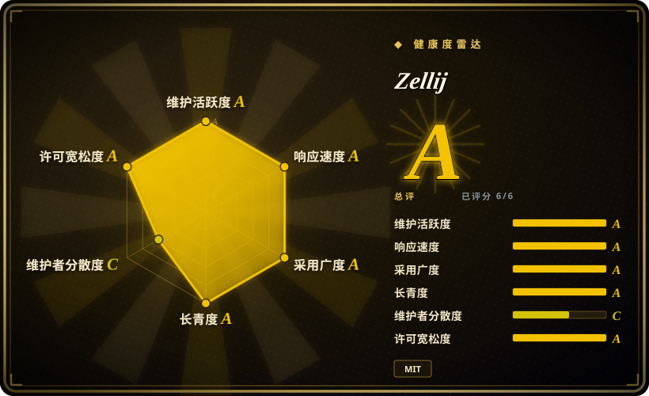
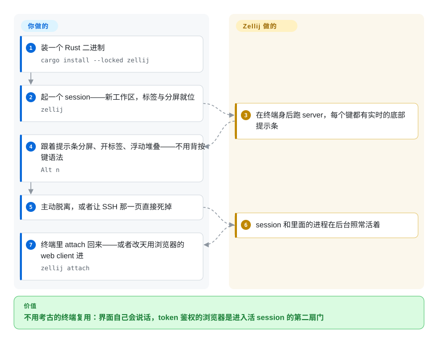

# Zellij

tmux 什么都能干，但长得像 2007 年的东西，逼你先背一套前缀键语法，还给新同事留了一个可以点击的地方都没有。Zellij 是从那个体验反着设计的终端多路复用器：标签、分屏、浮动与堆叠布局，配一条可点击的状态栏和随按键场景变化的提示条；SSH 掉了 session 照样活着——外加内置的、token 鉴权的 web client，浏览器和手机也能进同一批 session。

## 何时使用

你在一个团队里干活（或者要跟未来的自己配合），“先学会 `C-b %`“是真实的 onboarding 成本，而你想要复用器的持久化能力却不想做考古。你敲 `zellij`，屏幕底部的提示条实时告诉你每个键此刻是干什么的。相对 [tmux](tmux.zh.md)，你选 Zellij 是因为可发现性、鼠标友好、声明式 session 布局（KDL 文件写明“这个标签是编辑器、那个是 server”）和开箱的额外件——浮动 pane、堆叠 pane、多人共享 session、WASM 插件——价值超过了 tmux 二十年冻结的行为和“什么脚本都调 `tmux` 子命令“的生态。相对 [herdr](../agent-frameworks/coding-agents/agent-multiplexers/herdr.zh.md)，你选它是因为 pane 里装的是人不是被监管的编程 agent：Zellij 刻意不建模 pane 里*跑的是什么*，所以没有 blocked/working 概念；换来的是带哈希登录 token 和只读 token 的一等公民浏览器接入——herdr 根本不跑 web 服务。

## 怎么用起来

和 tmux 一样，Zellij 是 client/server：敲下 `zellij` 会拉起一个脱离终端的 session server，由它掌管 PTY，client（终端，或内置的 `127.0.0.1:8082` web server）附着上去；session 扛得住你的终端先死，`zellij attach`（或收藏的 URL `http://host:8082/my-session`）把你原样放回去——URL 方案甚至能*复活*已退出的 session。体验层才是差异点：输入被分成**模式**（normal、pane、tab、resize、scroll、locked），状态栏永远显示当前模式下每个键会干什么，所以没有要背的隐藏语法——`default.kdl` 里你真会看到的默认包括 `Alt n` 开新 pane、`Ctrl p` 进 pane 模式。这一层全部可扩：个人自动化用声明式**布局**，UI 扩展用**编译成 WebAssembly 的插件**（任何能出 WASM 的语言），共享走 web server——localhost 之外强制 HTTPS，登录 token 哈希存储、只显示一次、可撤销（官方文档对不可信网络建议再套反向代理，因为 server 自身没有限流）。你和它的分工：布局、按键永远归你决定；Zellij 负责 session 活着、模式不迷路、浏览器那扇门常开。

<!-- flow-steps:begin (generated from flows/zellij.json by tools/flow_card.py — do not edit) -->

流程文字版

1. **你**：装一个 Rust 二进制 — `cargo install --locked zellij`
2. **你**：起一个 session——新工作区，标签与分屏就位 — `zellij`
3. **Zellij**：在终端身后跑 server，每个键都有实时的底部提示条
4. **你**：跟着提示条分屏、开标签、浮动堆叠——不用背按键语法 — `Alt n`
5. **你**：主动脱离，或者让 SSH 那一页直接死掉
6. **Zellij**：session 和里面的进程在后台照常活着
7. **你**：终端里 attach 回来——或者改天用浏览器的 web client 进 — `zellij attach`

**价值**：不用考古的终端复用：界面自己会说话，token 鉴权的浏览器是进入活 session 的第二扇门

<!-- flow-steps:end -->

## 何时不用

- **你的负载是监管编程 agent。** 没有 pane 会被打 working/blocked/idle 标记——Zellij 不知道也不关心里面跑什么。要“哪个 agent 此刻在等我”，用 [herdr](../agent-frameworks/coding-agents/agent-multiplexers/herdr.zh.md)，或 [CloudCLI](../agent-tooling/supervision-surfaces/claudecodeui.zh.md) 这类驾驶舱。
- **你的服务器跑的是 tmux，你的肌肉记忆也是。** 全机群脚本、tpm 生态、`C-b` 如今已是社会基础设施；[tmux](tmux.zh.md) 的二十年稳定就是功能本身，Zellij 的另一套按键模型是纯成本。
- **你要尽可能小的攻击面。** Zellij 是一个 Rust 二进制，但功能面大得多（web server、插件运行时、底下的一整套 WASM 机制）。如果机器的规矩是“这里永远不许 bind web 端口”，得编译掉（`zellij-no-web` 变体就是为此存在）——而 [tmux](tmux.zh.md) 是压根没有东西可关。
- **你要 bug 有人秒回。** 查检时（2026-09-27，GitHub API）1,938 个 open issues，挂在一个 6 岁、个人主导治理的项目上，意味着分诊延迟；tmux 的筛选文化、herdr 作者的响应节奏是另一种取舍。“延迟”这个读法是 [推断]。
- **你不想为 web 接入做真运维。** 官方文档自己建议套反向代理（内置 server 无限流），localhost 之外 HTTPS 是硬要求——预算真证书，不是打个勾。

## 横向对比

| 替代品 | 是否收录 | 我们的评价 | 取舍 |
|---|---|---|---|
| [tmux](tmux.zh.md) | ✅ | 团队应该*看见*按键在干什么（模式 + 提示条、鼠标、布局、插件、web client），且你能接受 6 年项目的动荡，选 Zellij；要求是“自 2007 年起没人重学过”的底座和已存在的脚本，选 tmux。 | Zellij：电池全含，一个 Rust 二进制，自带浏览器接入。tmux：极简 C，无处不在，对 agent 失明、对新人指引也失明——UI 那层由你自己充当。 |
| [herdr](../agent-frameworks/coding-agents/agent-multiplexers/herdr.zh.md) | ✅ | pane 里是编程 agent、其状态（blocked？done？）应当驱动通知与脚本时选 herdr；pane 里是人、且需要 token 控制的浏览器/手机接入时选 Zellij（herdr 没有 web server）。 | herdr：6 个月、pre-1.0、感知 agent。Zellij：6 年、MIT、人本位、刻意对 pane 内容失明。 |
| GNU Screen | 未收录 | 今天做选择就选 Zellij（或 tmux）；Screen 的角色是两者都装不进的老系统。 | 真实项目，有意不收录——已被取代；同样论证见 tmux 页的对比行。 |
| [Warp](warp.zh.md) | ✅ | 如果全部愿望就是“现代终端 UX”而并不需要复用与持久化，Warp 把命令块和 AI 装进一个应用；Zellij 是开源、可组合的一层，跑在你已有的任何终端里——而且不会因为模拟器转闭源而翻车。 | Warp：专有产品（仓库只有 issue 区），打磨好但不可脚本化的基建。Zellij：端到端开源，接入自建自管。 |

## 技术栈

- **Rust** workspace，按目录拆为 `zellij-server`、`zellij-client`、`zellij-utils`、`zellij-tile`（插件 API）——仓库目录清单，2026-09-27。
- **配置与布局：KDL**（`.kdl` 配置与布局文件；`default.kdl` 即按键参考）。
- **插件：WebAssembly**——README 原话“任何可编译为 WebAssembly 的语言”；插件通过 zellij-tile 订阅 Zellij 的事件/pane API。
- **Web client：** 内置 webserver（默认关闭）提供 PWA——可从 Chromium/Firefox/Safari 安装，含专门的移动端界面；另有完全去掉该特性的 `zellij-no-web` 二进制变体。
- 不绑定特定终端模拟器；鼠标支持与主题内置（README 特性列表）。

## 依赖

- **核心回路无外部依赖。** 单二进制；session 是用户级进程，和 tmux 的 server 同形。
- **只有 web client 路线要东西：** 内置 server 默认 `http://127.0.0.1:8082`；localhost 之外 HTTPS 为硬性要求（用户提供证书，经 `web_server_cert`/`web_server_key`），官方安全章节对不可信网络建议再套 nginx 等反向代理（server 自身无限流）。
- 登录 token 由 `zellij web --create-token` / `--create-read-only-token` 创建，哈希存本地库、只显示一次、只可撤销——不接外部认证系统。

## 运维难度

**终端用法很轻；打开 web 那扇门就变中等。** 从包管理器装或 `cargo install --locked zellij`；日常就是个人工具 + 一个配置文件 + `--session` 习惯。运维重量出现在暴露 web server 时：TLS 证书、token 生命周期（哈希、一次性显示、撤销即永久）、以及项目文档自己给出的反向代理建议。发布节奏规律但不疯狂（0.44.x 贯穿春夏之后 v0.45.0/0.45.1 在 8 月下旬），仍是 pre-1.0 版本号，所以偶发的按键/配置格式变化是正常预期。“变化会被感知到”是 [推断]，依据是 0.x 语义化版本而非具体事故。

## 健康度与可持续性

- **维护（2026-09）。** 活跃且有节奏：v0.45.0（2026-08-20）、v0.45.1（2026-08-28），此前 0.44.x 贯穿 2026 年 4–5 月；`main` 推送 2026-09-25。动荡真实存在，但发布有纪律。
- **治理 / bus factor。** 社区形态组织（`zellij-org`），仓库根有 `GOVERNANCE.md`；贡献分布：imsnif（Aram Drevekenin）1,518 commits、a-kenji 532、TheLostLambda 253（contributors API，2026-09-27）——一位牵头 + 真实的第二圈层，不是单人仓库。但 `funding.json` 把 owner entity 写成*个人*（“Aram Drevekenin, indie developer”），路线图的引力仍是人格化的。
- **后盾与年龄 × Lindy。** 建仓 2020-09（约 6 年）且仍活跃——Lindy 信用在积累；无基金会/公司伞；README 挂赞助方 logo（如 G-Research），项目维护 funding manifest。比 tmux 年轻 13+ 年；赌注在社区组织能否活过创始人的兴趣。[推断]
- **采用度与生态。** 约 35.6k stars（2026-09-27），各发行版均有打包（docs 里的 Repology 墙），Discord + Matrix 社区，WASM 侧插件生态；实测：crates.io 月下载约 39.6 万次、Homebrew 90 天约 1.37 万次安装（2026-09-27）。它是终端话题里默认的“比 tmux 友好”推荐——定性观察，非普查。[推断] 注脚：crates.io 反向依赖图里 0 个依赖仓库——*人*用得多，作为库被依赖几乎没有。
- **风险信号。** 1,938 个 open issues（2026-09-27）是诚实的积压信号；pre-1.0 的永久版本号；web server 扩大了攻击面，尽管出厂默认偏保守（默认关闭、localhost 外强制 HTTPS、token 哈希）。无许可证变更史——一贯 MIT（经仓库清单读 LICENSE.md）。

## 存疑（未验证）

- [未验证] 原生 Windows 状态：仓库里有 `wix/` 打包目录，但我读过的 README 没有写明 Windows 支持策略；未实测当前 Windows 行为。
- [未验证]“插件订阅 pane 事件”来自 README/文档对 zellij-tile 的表述；插件实际能读到什么（可见内容还是仅事件）未做审计——在证实之前，请把 WASM 插件按“可读屏文本”纳入风险范围。[推断]
- [推断]把 1,938 的 issue 积压读作分诊延迟而非无人维护——依据是同周的发布活动，不是逐 issue 审查。
- [推断]“偶发的按键/配置变化”由 pre-1.0 语义化版本推出，并非追踪到具体破坏性事故。
- [未验证] 赞助 logo（G-Research）、PWA/移动端能力、`zellij-no-web` 变体的可得性，均来自 README 与官方 web-client 文档，本次未复测。
- [未验证] 按作者的 commit 占比会被 squash-merge 与机器人扭曲；读数为 2026-09-27 的 GitHub API。
- [推断]“人住 pane 选 Zellij、agent 住 pane 选 herdr”这条路标是本索引的框架，两个项目自己都没有这样表述。
