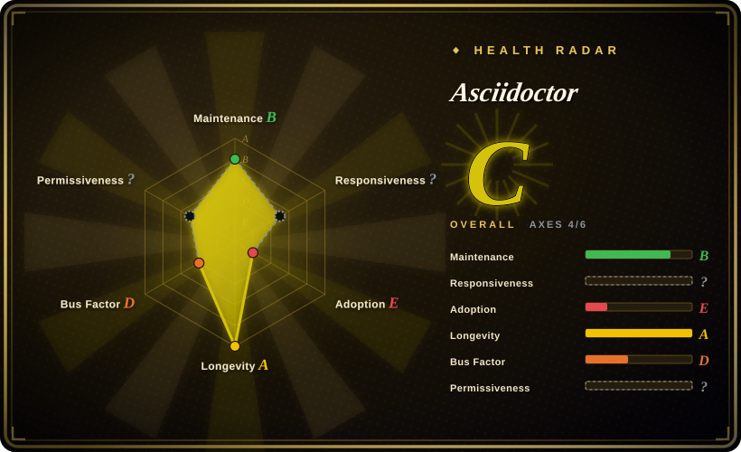
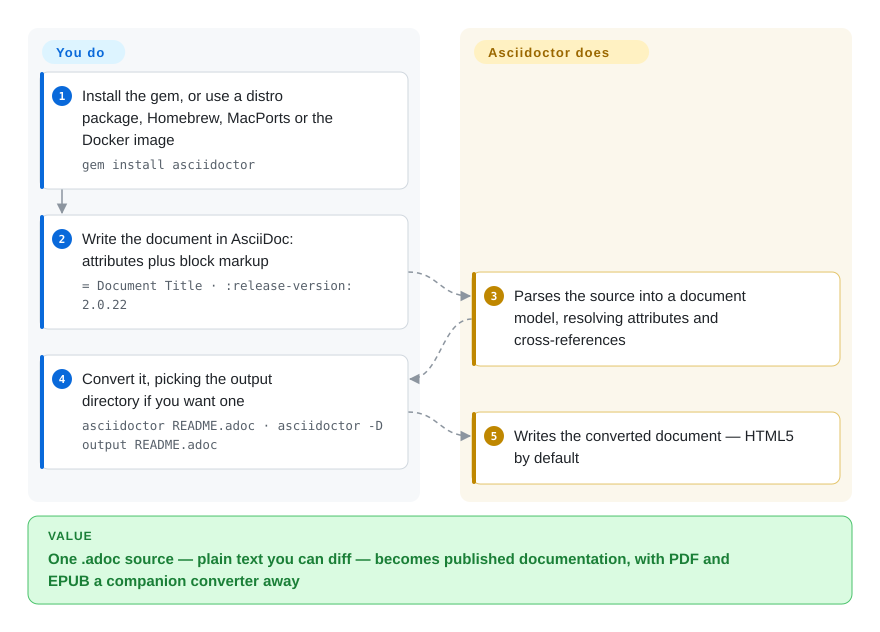

# Asciidoctor

A Ruby text processor that parses AsciiDoc into a document model and converts it to HTML5, DocBook 5, man pages and — through companion converters — PDF and EPUB 3; the AsciiDoc language specification now lives with the Eclipse Foundation.

## When to use

You are producing technical documentation rather than a paper: a reference manual, a book, a set of related guides, and you want the source to be plain text that reads well in a diff. You need more structure than Markdown offers — admonitions, callouts on code blocks, include-based reuse, tables with real column control, cross-references and auto-numbering — but you do not need a typesetting engine and you are not writing math-heavy prose.

Reach for Asciidoctor when the deliverable set is documentation-shaped and **multi-format output from one source** is the point: the same `.adoc` file becomes a chunked or single-page website, a DocBook/EPUB book, man pages, or a PDF via a companion converter. Against [Quarkdown](quarkdown.md) the tradeoff is maturity and licensing versus a scripting layer and a modern single-binary feel — Asciidoctor has shipped since 2012 under MIT with an AsciiDoc specification behind the language, while Quarkdown is younger, copyleft-encumbered at the CLI and much faster-moving. Against [LaTeX](latex.md) you give up typesetting fidelity and math, and in exchange get a source language non-specialists can edit, plus an HTML story that actually works.

## How it works

You write an `.adoc` file: AsciiDoc markup for structure (headings, block delimiters, attribute references like `{release-version}`) and attributes for configuration. **Asciidoctor parses that into a document model and hands the model to a converter; you pick which converter by how you run it.** The default path is the CLI — the gem installs an `asciidoctor` command, and `asciidoctor README.adoc` writes a `.html` file derived from the source name, with `-D` choosing an output directory. **You write markup and run one command; Asciidoctor does the parsing, the document model, the cross-references and the conversion.** The same parser is reachable from other runtimes (AsciidoctorJ on the JVM, Asciidoctor.js in JavaScript) and from a Ruby API, which is how build tooling embeds it; the repo's own README is itself an AsciiDoc document, converted by the tool it documents.

<!-- flow-steps:begin (generated from flows/asciidoctor.json by tools/flow_card.py — do not edit) -->

Text version of the flow

1. **You**: Install the gem, or use a distro package, Homebrew, MacPorts or the Docker image — `gem install asciidoctor`
2. **You**: Write the document in AsciiDoc: attributes plus block markup — `= Document Title · :release-version: 2.0.22`
3. **Asciidoctor**: Parses the source into a document model, resolving attributes and cross-references
4. **You**: Convert it, picking the output directory if you want one — `asciidoctor README.adoc · asciidoctor -D output README.adoc`
5. **Asciidoctor**: Writes the converted document — HTML5 by default

**Value**: One .adoc source — plain text you can diff — becomes published documentation, with PDF and EPUB a companion converter away

<!-- flow-steps:end -->

## When NOT to use

- **You need a typesetting engine — print-quality pagination, precise math, journal-grade output.** Use [LaTeX](latex.md) for the print path or [Typst](typst.md) if you can choose the language; Asciidoctor's PDF output comes from a separate companion converter, not from a typesetting core.
- **You want a Markdown-superset language with scripting, built-in slides and a docs target from one binary.** Use [Quarkdown](quarkdown.md); AsciiDoc is not Markdown and has no equivalent scripting layer.
- **Your team will not accept a Ruby runtime and you do not want to drag in JRuby or a JavaScript build.** Quarkdown (JVM) and Typst (Rust) are alternatives, though neither is AsciiDoc; if the source language is negotiable, deciding on the *language* first is the honest order.
- **You want to stay on GitHub-flavored Markdown so files render in place.** AsciiDoc does not render on GitHub the way `.md` does, so repository-hosted docs lose their inline preview — use [MDX](../markdown-tools/mdx.md) or [Quarkdown](quarkdown.md) if in-place rendering matters.
- **You need to contribute a change to the parser quickly.** The implementation has been led by one person for its entire life (see `Health & viability`); if your roadmap depends on merging changes upstream, a bus factor of one is the risk to price in.
- **You want a release-cadence guarantee.** The last tagged release is `v2.0.26` from 2025-10-24; commits continue, but the release line is slow. If you need frequent versioned drops, plan to track the source rather than the gem.
- **You only need to convert formats you already have.** Use [Pandoc](../markdown-tools/pandoc.md).

## Comparison

| Alternative | In index | Our verdict | Tradeoff |
|---|---|---|---|
| [Quarkdown](quarkdown.md) | ✅ | Choose Asciidoctor when you want a mature, MIT-licensed documentation toolchain with an external language specification; choose Quarkdown when you want Markdown-legible source, a scripting layer and slides from the same file. | Asciidoctor gains 14 years of releases, MIT licensing and three runtime targets; it pays with a slower release line, a Ruby-shaped install, and no built-in presentation format. Quarkdown gains modern tooling and a JavaScript-free render; it pays with copyleft CLI licensing and a much younger project. |
| [LaTeX](latex.md) | ✅ | Choose LaTeX when the document needs a typesetting engine or a venue class file; choose Asciidoctor when the corpus is documentation published to HTML, DocBook and EPUB. | Asciidoctor gains an editable plain-text source for non-specialists plus working HTML output; it pays with no native pagination engine and a separate component for PDF. |
| [Typst](typst.md) | ✅ | Choose Typst when the output is a paginated document with real math; choose Asciidoctor when the output is a documentation set in several publishing formats. | Typst gains a purpose-built typesetting engine and a single binary; it pays with a bespoke markup language and a thin documentation-publishing story. |
| [MDX](../markdown-tools/mdx.md) | ✅ | Choose MDX when the docs live inside a React app and components are the point; choose Asciidoctor when the docs must publish as standalone HTML, DocBook, EPUB or man pages. | MDX gains component embedding and the npm ecosystem; it pays with a Node/React runtime and no book or man-page output. |
| [Pandoc](../markdown-tools/pandoc.md) | ✅ | Choose Pandoc when you are converting between existing formats and want the broadest matrix; choose Asciidoctor when you are *authoring* structured documentation and want a document model with semantics. | Pandoc gains format breadth; it pays with a thinner authoring experience — AsciiDoc's semantic blocks and cross-references are the part a generic converter does not provide. |

## Tech stack

- **Language:** Ruby. The gem is `asciidoctor` on RubyGems; the README notes the docs set also ships in Chinese, German, French and Japanese translations.
- **Runtimes:** Ruby is native; the same processor is available on the JVM via AsciidoctorJ and in JavaScript via Asciidoctor.js (built with Opal), and the parser exposes a Ruby API for build-tool integration.
- **Converters:** HTML5, DocBook 5 and man pages ship with the core; PDF and EPUB 3 come from companion converters in the same organization rather than from this repository.
- **Packaging:** RubyGems, a Docker image, distribution packages (Alpine, Arch and others), Homebrew and MacPorts are all documented install paths.
- **Language governance:** the AsciiDoc Language specification is a project at the Eclipse Foundation; the repository that served as its initial contribution (`asciidoctor/asciidoc-docs`) is archived, which is why the spec and the implementation now live in different places.

## Dependencies

- **A Ruby runtime** (or JRuby, or a JavaScript environment for Asciidoctor.js). The README recommends installing Ruby in user space via RVM rather than using the system Ruby, and warns against installing gems system-wide.
- **For PDF and EPUB:** additional Asciidoctor converters outside this repository; a plain Asciidoctor install does not produce a PDF.
- **No service, no database, no network dependency at conversion time.** The CLI is local; rendering is a function of the source file and the AsciiDoc attributes you set.
- **No account or hosted layer.** Asciidoctor is a library and CLI, not a platform; hosted documentation products that use it are separate services.

## Ops difficulty

**Low.** Install a Ruby (ideally via RVM in user space), `gem install asciidoctor`, and convert with one command; the Docker image removes even the Ruby setup if you prefer a container. The operational realities are version pinning for reproducible output, choosing per-format converters for PDF/EPUB, and the fact that a mid-life documentation corpus tends to grow custom extensions — which are Ruby code you then own. There is no server to run.

## Health & viability

- **Maintenance — maintained but with a slow release line (as of 2026-09-20).** `pushed_at` 2026-09-01T19:14:46Z, so development continues; the most recent tagged release is `v2.0.26` from 2025-10-24, roughly eleven months before this review, following a cluster of releases in October 2025. Not archived.
- **Governance and bus factor — one person has written almost all of it.** The repository belongs to the `asciidoctor` organization, but contribution totals are 5,031 for `mojavelinux` against 126 for the next contributor. The organization spreads maintenance of *companion* projects, but the parser itself is effectively a single-maintainer effort — the weakest axis on this page.
- **Backing and Lindy — old and still active, which is the useful part.** Created 2012-06-01, about 14 years old as of 2026-09, with continuous commits and a specification that has been handed to a foundation. Age plus continued activity is the Lindy signal that matters here; the foundation involvement applies to the *language*, not to this implementation.
- **Adoption and ecosystem — deep in one niche.** AsciiDoc is the documentation format for a number of large projects and vendors, and the toolchain has converters, build plugins and JVM/JS runtimes. It is much narrower than Markdown, which is a fit-for-purpose observation rather than a defect.
- **Three card readings need decoding: two `?` and one `E`.** Responsiveness is unscored because the scorer found no qualifying first-response window; risk_license is unscored because GitHub's license API reports `NOASSERTION`, so the license text could not be resolved automatically even though the `LICENSE` file is plainly MIT. Adoption grades `E` from a **dependency-graph** signal (0 dependent repos) while the same measurement shows **56,047,687 downloads in the last month** — a gem that people install directly has no package depending on it, so the graph tier is the wrong lens here. `[推断]`
- **Risk flags — slow releases and a copyleft-free license.** MIT (read from the `LICENSE` file; GitHub's license API reports `NOASSERTION` for this repo), no relicense history found. The main risk is release latency and bus factor, not licensing.

## Caveats (unverified)

- `[未验证]` **Whether the slow release cadence reflects maintenance mode or deliberate stability.** Commits continue after the last tag; the intent behind the cadence was not established from project communications.
- `[未验证]` **The `NOASSERTION` discrepancy.** GitHub's license API does not recognize this repo's license, while the `LICENSE` file reads as the MIT License; the dual reading is recorded rather than resolved.
- `[未验证]` **Eclipse Foundation governance over the AsciiDoc specification** is taken from the archived initial-contribution repository's own description; the current scope of that project was not read from its own charter.
- `[未验证]` **PDF and EPUB output quality.** Both come from companion converters that were not examined here; this page asserts only that they live outside this repository.
- `[未验证]` **Performance on large corpora** is not measured; Typst's incremental compilation is a real advantage for big single documents, but no head-to-head was run.
- `[未验证]` **The Ruby version floor and JRuby/Node compatibility matrix.** The README prescribes a user-space Ruby install but no supported-version table was read.
- `[推断]` **A single maintainer for 14 years implies a succession risk** that the organization structure only partly mitigates, since companion projects have other maintainers while the parser does not.
