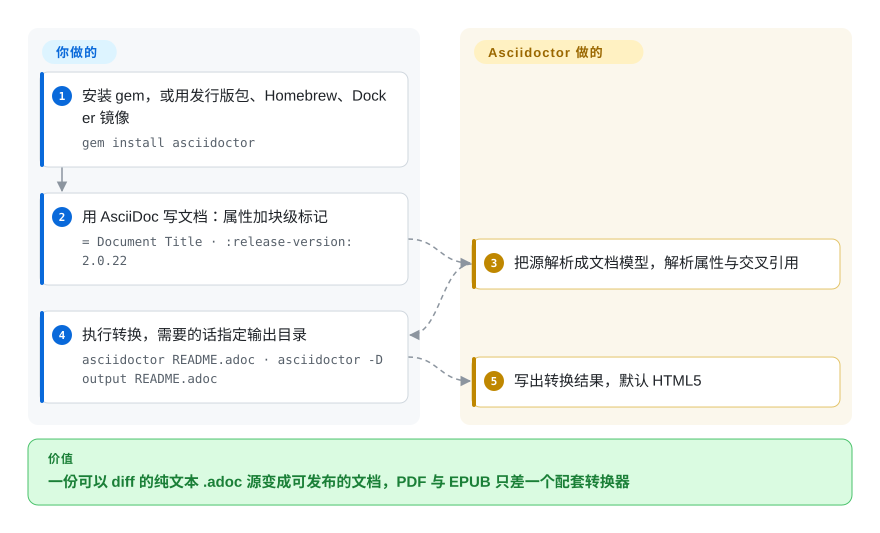

# Asciidoctor

用 Ruby 写的文本处理器：把 AsciiDoc 解析成文档模型，再转换成 HTML5、DocBook 5、man page，并通过配套转换器输出 PDF 与 EPUB 3；AsciiDoc 语言规范现在归 Eclipse 基金会。

## 何时使用

你产出的是技术文档而不是论文：参考手册、书、一组成套的指南，而且你希望源文件是纯文本、在 diff 里也读得下去。你需要比 Markdown 更多的结构——警示块、代码块上的标注、用 include 复用、真正能控列的表格、交叉引用与自动编号——但你不需要排版引擎，也不写公式密集的正文。

当交付物是文档形态、且**一份源多格式输出**是重点时，选 Asciidoctor：同一个 `.adoc` 文件可以变成分章或单页的网站、DocBook／EPUB 图书、man page，或经配套转换器得到 PDF。相对 [Quarkdown](quarkdown.zh.md)，取舍是成熟度与许可对上一套脚本层与现代单二进制体验——Asciidoctor 自 2012 年起在 MIT 下持续发布，语言背后还有 AsciiDoc 规范；Quarkdown 更年轻、CLI 带 copyleft、迭代也快得多。相对 [LaTeX](latex.zh.md)，你放弃排版保真度与数学排版，换来一门非专业人员也能改的源语言，以及一条真能用的 HTML 路径。

## 怎么用起来

你写一个 `.adoc` 文件：用 AsciiDoc 标记写结构（标题、块分隔符、`{release-version}` 这类属性引用），用属性做配置。**Asciidoctor 把它解析成文档模型，再把模型交给某个转换器；选哪个转换器取决于你怎么运行它。** 默认路径是 CLI——gem 会装上 `asciidoctor` 命令，`asciidoctor README.adoc` 会按源文件名生成对应的 `.html`，用 `-D` 指定输出目录。**你写标记、跑一条命令；解析、文档模型、交叉引用与转换都由 Asciidoctor 完成。** 同一个解析器还能在别的运行时里使用（JVM 上的 AsciidoctorJ、JavaScript 里的 Asciidoctor.js），也提供 Ruby API 供构建工具嵌入；本仓库的 README 本身就是一份 AsciiDoc 文档，由它所描述的这个工具转换而成。

<!-- flow-steps:begin (generated from flows/asciidoctor.json by tools/flow_card.py — do not edit) -->

流程文字版

1. **你**：安装 gem，或用发行版包、Homebrew、Docker 镜像 — `gem install asciidoctor`
2. **你**：用 AsciiDoc 写文档：属性加块级标记 — `= Document Title · :release-version: 2.0.22`
3. **Asciidoctor**：把源解析成文档模型，解析属性与交叉引用
4. **你**：执行转换，需要的话指定输出目录 — `asciidoctor README.adoc · asciidoctor -D output README.adoc`
5. **Asciidoctor**：写出转换结果，默认 HTML5

**价值**：一份可以 diff 的纯文本 .adoc 源变成可发布的文档，PDF 与 EPUB 只差一个配套转换器

<!-- flow-steps:end -->

## 何时不用

- **你需要排版引擎——印刷级分页、精确数学、期刊级输出。** 印刷路径改用 [LaTeX](latex.zh.md)；若语言可自选，用 [Typst](typst.zh.md)。Asciidoctor 的 PDF 输出来自一个独立的配套转换器，而不是排版内核。
- **你想要一门可脚本化的 Markdown 超集语言，并内置幻灯片与文档站目标、单一二进制。** 改用 [Quarkdown](quarkdown.zh.md)；AsciiDoc 不是 Markdown，也没有等价的脚本层。
- **你的团队不接受 Ruby 运行时，也不想拖进 JRuby 或一套 JavaScript 构建。** 替代品有 Quarkdown（JVM）与 Typst（Rust），但两者都不是 AsciiDoc；如果源语言可商量，先定**语言**才是诚实的顺序。
- **你想留在 GitHub 风格的 Markdown 上，让文件就地渲染。** AsciiDoc 在 GitHub 上不会像 `.md` 那样渲染，放在仓库里的文档会失去行内预览——若就地渲染重要，用 [MDX](../markdown-tools/mdx.zh.md) 或 [Quarkdown](quarkdown.zh.md)。
- **你需要快速把改动合进解析器。** 这套实现从诞生至今一直由一个人主导（见「健康度与可持续性」）；如果你的路线图依赖上游合并你的改动，单一维护者这个风险要算进去。
- **你需要发布节奏上的保证。** 最近一个带标签的版本是 2025-10-24 的 `v2.0.26`；提交仍在继续，但发布线很慢。如果你需要频繁的版本化发布，就要准备跟源码而不是跟 gem。
- **你只是想把手上的格式互转。** 改用 [Pandoc](../markdown-tools/pandoc.zh.md)。

## 横向对比

| 替代品 | 是否收录 | 我们的评价 | 取舍 |
|---|---|---|---|
| [Quarkdown](quarkdown.zh.md) | ✅ | 当你想要成熟、MIT 许可、且语言规范独立于实现的文档工具链时选 Asciidoctor；当你想要保持 Markdown 可读性的源、一套脚本层、并从同一份文件出幻灯片时选 Quarkdown。 | Asciidoctor 换来 14 年的发布历史、MIT 许可与三种运行时；代价是较慢的发布线、Ruby 形态的安装，以及没有内置演示格式。Quarkdown 换来现代工具链与不需要 JavaScript 的渲染；代价是 CLI 的 copyleft 许可，以及年轻得多的项目。 |
| [LaTeX](latex.zh.md) | ✅ | 当文档需要排版引擎或投稿方 class 文件时选 LaTeX；当文档集是要发布成 HTML、DocBook 与 EPUB 的技术文档时选 Asciidoctor。 | Asciidoctor 换来非专业人员可编辑的纯文本源以及可用的 HTML 输出；代价是没有原生分页引擎，PDF 要另配组件。 |
| [Typst](typst.zh.md) | ✅ | 当产物是带真实公式的成品文档时选 Typst；当产物是以多种出版格式输出的文档集时选 Asciidoctor。 | Typst 换来专门打造的排版引擎与单一二进制；代价是一门专有标记语言，以及薄弱的文档出版能力。 |
| [MDX](../markdown-tools/mdx.zh.md) | ✅ | 当文档活在 React 应用里、组件本身是重点时选 MDX；当文档必须作为独立 HTML、DocBook、EPUB 或 man page 发布时选 Asciidoctor。 | MDX 换来组件嵌入与 npm 生态；代价是 Node／React 运行时，以及没有图书或 man page 输出。 |
| [Pandoc](../markdown-tools/pandoc.zh.md) | ✅ | 当你是在已有格式之间互转、想要最广的矩阵时选 Pandoc；当你是在**创作**结构化文档、想要带语义的文档模型时选 Asciidoctor。 | Pandoc 换来格式广度；代价是创作体验更薄——AsciiDoc 的语义块与交叉引用正是通用转换器给不了的部分。 |

## 技术栈

- **语言：** Ruby。gem 名为 RubyGems 上的 `asciidoctor`；README 提到这套文档还有中文、德文、法文与日文译本。
- **运行时：** Ruby 是原生路径；同一个处理器可通过 AsciidoctorJ 跑在 JVM 上、通过 Asciidoctor.js（用 Opal 构建）跑在 JavaScript 里，解析器也暴露 Ruby API 供构建工具集成。
- **转换器：** HTML5、DocBook 5 与 man page 随核心一起提供；PDF 与 EPUB 3 来自同一组织下的配套转换器，不在本仓库内。
- **打包：** RubyGems、Docker 镜像、发行版包（Alpine、Arch 等）、Homebrew 与 MacPorts 都是有文档的安装途径。
- **语言治理：** AsciiDoc 语言规范是 Eclipse 基金会下的项目；作为其初始贡献的仓库（`asciidoctor/asciidoc-docs`）已归档，所以规范与实现在今天分处两地。

## 依赖

- **一个 Ruby 运行时**（或用 JRuby；Asciidoctor.js 则需要 JavaScript 环境）。README 建议用 RVM 在用户空间安装 Ruby，而不是用系统 Ruby，并明确不要用 gem 装全局包。
- **要 PDF 与 EPUB：** 需要本仓库之外的额外 Asciidoctor 转换器；只装 Asciidoctor 本身不会产出 PDF。
- **转换时不依赖服务、数据库或网络。** CLI 是本地程序；渲染结果只是源文件与你所设 AsciiDoc 属性的函数。
- **无账号、无托管层。** Asciidoctor 是库与 CLI，不是平台；使用它的托管文档产品是另外的服务。

## 运维难度

**低。** 装一个 Ruby（最好用 RVM 装进用户空间）、`gem install asciidoctor`，一条命令完成转换；用 Docker 镜像连 Ruby 都省了。真正的运维现实是：为了输出可复现要钉住版本、PDF／EPUB 要另选转换器，以及一个中年期的文档库往往会养出自定义扩展——那些是你自己要维护的 Ruby 代码。这里没有服务要跑。

## 健康度与可持续性

- **维护活跃度——在维护，但发布线很慢（截至 2026-09-20）。** `pushed_at` 为 2026-09-01T19:14:46Z，开发仍在继续；最近一个带标签的版本是 2025-10-24 的 `v2.0.26`，距本次审查约十一个月，此前在 2025 年 10 月有一串集中发布。未归档。
- **治理与维护者分散度——几乎全部由一个人写成。** 仓库属于 `asciidoctor` 组织，但贡献数是 `mojavelinux` 5,031 对第二名 126。组织确实分摊了**配套**项目的维护，但解析器本身实质上仍是单维护者工程——这是本页最弱的一轴。
- **背书与寿命——又老又仍然活跃，这才是有用的部分。** 创建于 2012-06-01，截至 2026-09 约 14 年，提交持续，语言规范已交给基金会。这里起作用的 Lindy 信号是「年龄 + 持续活跃」；基金会的介入适用于**语言**，不适用于这套实现。
- **采用与生态——在一个细分领域里扎得很深。** AsciiDoc 是不少大型项目与厂商的文档格式，工具链有转换器、构建插件以及 JVM／JS 运行时。它比 Markdown 窄得多，但这是「是否契合用途」的观察，不是缺陷。
- **卡片上有三项读法需要解码：两个 `?` 与一个 `E`。** 响应速度未评分，因为评分器找不到合格的首次响应窗口；risk_license 未评分，因为 GitHub 的 license API 报 `NOASSERTION`，许可文本无法被自动解析——尽管 `LICENSE` 文件明明白白就是 MIT。采用广度评为 `E` 来自**依赖图**信号（依赖方数量为 0），而同一次测量显示**上个月下载量为 56,047,687**——一个大家直接安装的 gem 不会有别的包依赖它，所以依赖图这个视角在这里并不适用。`[推断]`
- **风险旗标——发布慢与许可干净。** MIT（读自 `LICENSE` 文件；GitHub 的 license API 对本仓库报 `NOASSERTION`），未发现换证历史。主要风险是发布时延与维护者分散度，而不是许可。

## 存疑（未验证）

- `[未验证]` **发布慢到底是维护模式还是刻意的稳定性。** 最近标签之后仍有提交；这种节奏背后的意图没有从项目沟通中确认。
- `[未验证]` **`NOASSERTION` 的差异。** GitHub 的 license API 不识别本仓库的许可，而 `LICENSE` 文件读起来就是 MIT 许可；本文只记录两种读法，没有判定谁对。
- `[未验证]` **Eclipse 基金会对 AsciiDoc 规范的治理**取自那份已归档的初始贡献仓库自我描述；该项目当前的章程范围没有从它的正式文件里读取。
- `[未验证]` **PDF 与 EPUB 的输出质量。** 两者都来自本文没有检查的配套转换器；本页只主张它们在本仓库之外。
- `[未验证]` **大文档集上的性能**没有测量；对大型单文档而言 Typst 的增量编译是真实优势，但没有做过正面对比。
- `[未验证]` **Ruby 版本下限与 JRuby／Node 兼容矩阵。** README 给出了用户空间安装 Ruby 的建议，但没有读到受支持版本的表格。
- `[推断]` **单一维护者持续 14 年意味着接班风险**，而组织结构只能部分缓解它——配套项目有别的维护者，解析器没有。
