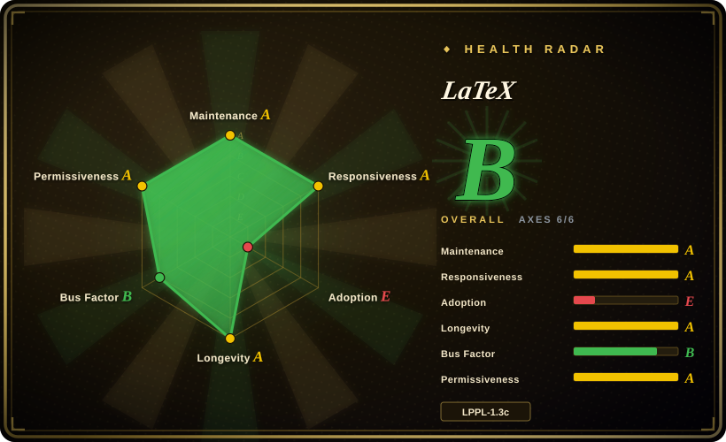
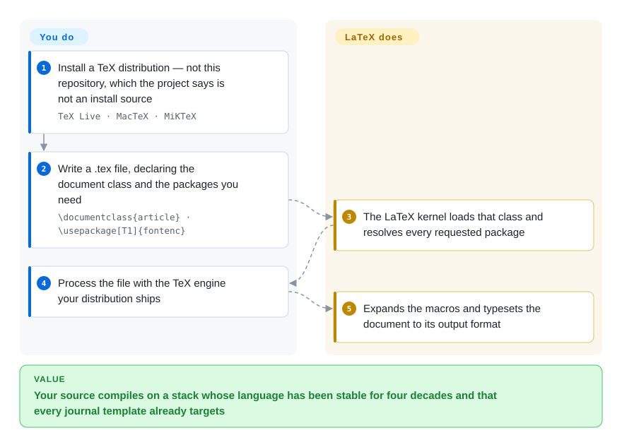

# LaTeX

The document preparation system for scientific and technical publishing, layered on Knuth's TeX: you declare a document class and packages in a `.tex` file, and a TeX distribution's engine typesets it. This page is anchored on the official LaTeX2e kernel repository — which is **not** how anyone installs LaTeX.

## When to use

You are writing for a venue, a thesis office, or a journal that hands you a `.cls` file and a submission checklist, and the question is not "which typesetting system is nicest" but "which one will the copy-editor accept". Or you are maintaining a document whose source must still compile in ten years, whose math and cross-references must be exactly right, and whose authors were taught LaTeX in graduate school.

Reach for LaTeX when **ecosystem obligation** decides the choice: journal classes, `biblatex` styles, `tikz`, beamer, the accumulated answers on TeX Stack Exchange, and a source language that has been stable for decades. Against [Typst](typst.md) you buy forty years of packages, classes and institutional acceptance, and you pay with a steep learning curve, slow builds, famously unhelpful error messages, and no way to get a decent web page out of the same source. Against [Quarkdown](quarkdown.md) and [Asciidoctor](asciidoctor.md) you buy print maturity and pay with a source format that only typesetting people can read fluently.

## How it works

**You do not install LaTeX from this repository.** The kernel repo holds the unpackaged sources of LaTeX2e and its own README says plainly that building a working version from it "is a non-trivial exercise" and that the normal way to obtain LaTeX is through CTAN or a TeX distribution. In practice: **you install a TeX distribution — TeX Live, MacTeX or MiKTeX — which bundles the LaTeX format, thousands of packages, fonts, and configuration and update utilities.** You then write a `.tex` file whose first non-comment line declares a class (`\documentclass{article}`) and whose preamble pulls in packages (`\usepackage[T1]{fontenc}`); the LaTeX kernel loads that class and resolves each requested package, and the distribution's TeX engine expands the macros and typesets the document to its output. **You declare the structure and the packages; the distribution supplies the engine, the fonts and the vast majority of the code that actually runs.**

<!-- flow-steps:begin (generated from flows/latex.json by tools/flow_card.py — do not edit) -->

Text version of the flow

1. **You**: Install a TeX distribution — not this repository, which the project says is not an install source — `TeX Live · MacTeX · MiKTeX`
2. **You**: Write a .tex file, declaring the document class and the packages you need — `\documentclass{article} · \usepackage[T1]{fontenc}`
3. **LaTeX**: The LaTeX kernel loads that class and resolves every requested package
4. **You**: Process the file with the TeX engine your distribution ships
5. **LaTeX**: Expands the macros and typesets the document to its output format

**Value**: Your source compiles on a stack whose language has been stable for four decades and that every journal template already targets

<!-- flow-steps:end -->

## When NOT to use

- **You intend to write your document in Markdown and keep it legible to non-typesetters.** Use [Quarkdown](quarkdown.md) for a Markdown-superset that also emits HTML, slides and a docs site, or [Asciidoctor](asciidoctor.md) for a plain-text publishing toolchain — do not hand-roll a Markdown-to-LaTeX pipeline you then have to maintain.
- **You are choosing a language today and nobody is forcing LaTeX on you.** Use [Typst](typst.md): comparable output quality for most documents, a much shorter learning curve, faster builds, readable errors, and an Apache-2.0 license instead of the LPPL.
- **You want one source to also drive a website, slides or a wiki.** LaTeX has no HTML story worth using; [Quarkdown](quarkdown.md) and [Asciidoctor](asciidoctor.md) both own that case.
- **You were about to clone the kernel repo and build it as your LaTeX install.** Do not: both the repo README and the project's own "Getting LaTeX" page say the Git repository is not an install source for users. Get a TeX distribution instead. (Cloning is legitimate if you are contributing to the kernel, which is the only thing this repo is for.)
- **You need a permissive license for redistribution.** LaTeX is LPPL-1.3c, a copyleft-flavoured license with specific rules about renamed files and derived works. If your product must embed the toolchain under MIT/Apache terms, [Typst](typst.md) (Apache-2.0) or [Asciidoctor](asciidoctor.md) (MIT) are the right picks.
- **You want to propose a quick patch to the core.** The project's own getting-started page says pull requests to the kernel are usually a poor fit and often rejected, because core stability is deliberately conservative; discussion has to come first.
- **You want format conversion rather than authoring.** Use [Pandoc](../markdown-tools/pandoc.md).

## Comparison

| Alternative | In index | Our verdict | Tradeoff |
|---|---|---|---|
| [Typst](typst.md) | ✅ | Choose LaTeX when a venue's class file or the package archive decides acceptance; choose Typst when you are free to pick the language and want faster builds with a fraction of the learning curve. | LaTeX gains unmatched ecosystem obligation — journal classes, `tikz`, `biblatex`, two generations of institutional knowledge; it pays with build speed, error quality, LPPL terms, and a source only specialists read fluently. |
| [Quarkdown](quarkdown.md) | ✅ | Choose Quarkdown when the source must stay Markdown and the same file must also produce a web page, slides and a docs site; choose LaTeX when print fidelity and formal submission requirements lead. | Quarkdown gains multi-target output, scripting and a shallow learning curve; it pays with a PDF produced by the browser's print pipeline and a young, single-maintainer project behind it. |
| [Asciidoctor](asciidoctor.md) | ✅ | Choose Asciidoctor when the deliverable is technical documentation published to HTML, DocBook or EPUB under MIT; choose LaTeX when the deliverable is a typeset PDF with real math. | Asciidoctor gains maturity, permissive licensing and multi-format publishing; it pays with no native typesetting engine and a separate converter for PDF. |
| [Pandoc](../markdown-tools/pandoc.md) | ✅ | Choose Pandoc when you are converting existing documents between formats; choose LaTeX when you are authoring the document and need to control its layout. | Pandoc gains breadth and convenience; it pays with no layout engine — PDF output is delegated to exactly the TeX (or Typst) engine that LaTeX owns. |

## Tech stack

- **Implementation language:** TeX (the kernel is written in TeX macro code; GitHub reports the repo's language as TeX). The `latex2e` repo contains the kernel (`base`), the required bundle (`tools`, `graphics`, `amsmath`, `firstaid`, `latex-lab`) and documentation (`doc`).
- **Programming layer:** since 2020 the L3 programming layer ships as part of the format; its sources live in the sibling `latex3/latex3` repository, and Babel lives in `latex3/babel` — the LaTeX project is a family of repositories, not one.
- **Versioning is date-based:** the version lives in `ltvers.dtx` as `\fmtversion` plus a `\patch@level`, where a negative patch level marks a candidate release that is not distributed. The current tree declares `\fmtversion` `2026-11-01` at patch level `-2`.
- **Deliberate stability:** the project's own docs state that kernel changes are conservative by design and that discussion must precede a change, which is what makes a 1985-era format still viable.

## Dependencies

- **A TeX distribution, and that is the real dependency.** TeX Live (all platforms), MacTeX (macOS) or MiKTeX (Windows, with on-demand package installation) provide the LaTeX format, the package archive, fonts and an update mechanism. None of it comes from this repository.
- **A TeX engine** to process the file. Which engine and how to invoke it depend on the distribution; engines differ in their output format and font handling, and choosing among them is part of setting up the distribution.
- **A huge but loosely-coupled package surface.** The LaTeX Project maintains the kernel and a small required bundle; the thousands of other packages are maintained by individuals and third parties, and the project's README explicitly says bug reports for those belong to their maintainers, not to `latex3/latex2e`.
- **No account, no service, no telemetry.** Everything is local; online options (Overleaf, Papeeria, CoCalc) are separate commercial or hosted services.

## Ops difficulty

**Medium to high, and the difficulty is installation and drift, not running.** Running the engine is a command; getting a coherent TeX installation is the project. Distributions are large, package sets drift between releases, the version of LaTeX inside a distribution can lag what you need (the project says so, and provides CTAN as the top-up path), and reproducibility across machines generally means pinning the distribution generation. Nothing here needs a server, but there is no single-binary story either: the operational unit is a TeX distribution plus whatever engine and package pins your document assumes.

## Health & viability

- **Maintenance — active (as of 2026-09-20).** `pushed_at` 2026-09-19T22:24:53Z, development tags through 2026-09-15, and the tree is currently at a candidate release (`\fmtversion` 2026-11-01, patch level `-2`). Not archived.
- **Governance and bus factor — a project team, not a person.** The repo is owned by the `latex3` organization and The LaTeX Project lists a named team of roughly a dozen current members on its site; repository contribution totals are spread across several long-serving maintainers (roughly 2,373 / 2,165 / 1,302 / 852 for the top four). This is the strongest governance shape in this category.
- **Backing and Lindy — the strongest Lindy signal here, with a caveat about what the radar measures.** LaTeX was first developed in 1985 and has been maintained continuously since; the format is embedded in academic publishing and in every major TeX distribution. Note that the health card's `longevity` axis is computed from the **GitHub repository's** age (created 2017-11-02), which understates a forty-year-old project — read the card's grade together with this sentence, not instead of it. `[推断]`
- **Adoption and ecosystem — as large as it gets in typesetting.** Every TeX distribution, every journal template, thousands of third-party packages, and a two-decade backlog of community answers. The cost side is that most of that surface is not maintained by the LaTeX Project.
- **The card's adoption grade (`E`) is a measurement artifact — do not read it as the ecosystem verdict.** The radar derives adoption from a package registry, and LaTeX has no canonical registry package (`registry: null`, `dependent_repos_count: 0`), so the axis drops to its floor. The paragraph above is the real reading; the letter is not. `[推断]`
- **Risk flags — LPPL copyleft and a conservative change process.** LPPL-1.3c is not a permissive license and carries specific conditions around derived files; the kernel's deliberate conservatism means fixes can be slow, and it explicitly discourages drive-by pull requests. No relicense history found.

## Caveats (unverified)

- `[未验证]` **The exact currently distributed LaTeX version.** The tree declares `\fmtversion` `2026-11-01` at patch level `-2`, which `ltvers.dtx`'s own comment describes as a candidate that is not distributed; the last *official* release date was not read from the release notes.
- `[未验证]` **Engine invocation commands.** No `pdflatex` / `lualatex` / `latexmk` command appears in the sources read (the repo README, `CONTRIBUTING.md`, `ltnews.tex`, `usrguide.tex`, and the project's Get/Documentation pages), so the flow deliberately states the engine step without a command token. Check your distribution's documentation before scripting a build.
- `[推断]` **The health card understates LaTeX's longevity**, because the scorer derives project age from the GitHub repository created in 2017 rather than from LaTeX's 1985 origin. The governance and longevity grades should be read with that offset in mind.
- `[未验证]` **Bug-report and fix latency.** The project's process is documented as deliberate and discussion-first; the resulting median time-to-fix for kernel bugs was not measured.
- `[未验证]` **Which third-party packages matter for a given field** (and whether they are actively maintained) is application-specific and was not surveyed here.
- `[未验证]` **LPPL-1.3c's practical obligations for a specific redistribution plan** were not analysed; the license text was read only to confirm the identifier, not interpreted for a use case.
- `[未验证]` **The `latex3/latex2e` repository was treated as the anchor for a page about LaTeX as a whole.** It is the official kernel repository the project points users to, but LaTeX-as-a-product is the distribution; the repo's metadata therefore describes only part of the thing this page is about.
