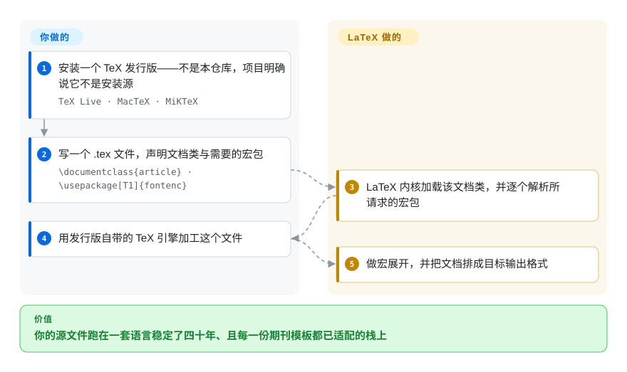

# LaTeX

科学与技术出版用的文档准备系统，建立在 Knuth 的 TeX 之上：你在 `.tex` 文件里声明文档类与宏包，由 TeX 发行版里的引擎完成排版。本页锚定在官方 LaTeX2e 内核仓库上——而它**不是**任何人安装 LaTeX 的途径。

## 何时使用

你在为某个期刊、学位办或会议写作，对方直接给你一个 `.cls` 文件和一份投稿检查清单；此时问题不是「哪套排版系统最好看」，而是「文字编辑会收哪一套」。或者你在维护一份十年后仍要能原样编译的文档，其中的公式与交叉引用必须分毫不差，而作者们都是在研究生阶段学的 LaTeX。

当**生态义务**决定选择时，选 LaTeX：期刊 class 文件、`biblatex` 样式、`tikz`、beamer、TeX Stack Exchange 上积累多年的问答，以及一门几十年稳定的源语言。相对 [Typst](typst.zh.md)，你换来四十年的宏包、class 与机构认可，付出的是陡峭的学习曲线、缓慢的构建、出名难读的报错，以及无法从同一份源得到像样的网页。相对 [Quarkdown](quarkdown.zh.md) 与 [Asciidoctor](asciidoctor.zh.md)，你换来印刷成熟度，付出的是只有排版圈内人能流利阅读的源格式。

## 怎么用起来

**你不是从这个仓库安装 LaTeX 的。** 内核仓库保存的是 LaTeX2e 未打包的源码，它自己的 README 说得很直白：从源码构建出一个可用版本「是件不平凡的事」，获得 LaTeX 的正常途径是 CTAN 或 TeX 发行版。实际操作是：**你安装一个 TeX 发行版——TeX Live、MacTeX 或 MiKTeX——它把 LaTeX 格式、成千上万个宏包、字体以及配置与更新工具打在一起。** 然后你写一个 `.tex` 文件，首个非注释行声明文档类（`\documentclass{article}`），导言区引入宏包（`\usepackage[T1]{fontenc}`）；LaTeX 内核加载该文档类并逐个解析所请求的宏包，发行版里的 TeX 引擎做宏展开并把文档排成产物。**你声明结构与宏包；引擎、字体以及真正运行起来的绝大多数代码，都由发行版提供。**

<!-- flow-steps:begin (generated from flows/latex.json by tools/flow_card.py — do not edit) -->

流程文字版

1. **你**：安装一个 TeX 发行版——不是本仓库，项目明确说它不是安装源 — `TeX Live · MacTeX · MiKTeX`
2. **你**：写一个 .tex 文件，声明文档类与需要的宏包 — `\documentclass{article} · \usepackage[T1]{fontenc}`
3. **LaTeX**：LaTeX 内核加载该文档类，并逐个解析所请求的宏包
4. **你**：用发行版自带的 TeX 引擎加工这个文件
5. **LaTeX**：做宏展开，并把文档排成目标输出格式

**价值**：你的源文件跑在一套语言稳定了四十年、且每一份期刊模板都已适配的栈上

<!-- flow-steps:end -->

## 何时不用

- **你打算用 Markdown 写作，并让源文件对非排版人员也可读。** 改用 [Quarkdown](quarkdown.zh.md)（Markdown 超集，同时产出 HTML、幻灯片与文档站），或用 [Asciidoctor](asciidoctor.zh.md)（纯文本出版工具链）——不要硬搭一条 Markdown 到 LaTeX 的管线然后再自己维护它。
- **今天由你自己选语言，而且没有人在逼你用 LaTeX。** 改用 [Typst](typst.zh.md)：对多数文档而言输出质量相当，学习曲线短得多、构建更快、报错可读，许可是 Apache-2.0 而不是 LPPL。
- **你想让一份源同时驱动网站、幻灯片或 wiki。** LaTeX 没有值得一用的 HTML 路径；这个场景由 [Quarkdown](quarkdown.zh.md) 与 [Asciidoctor](asciidoctor.zh.md) 各自承担。
- **你正准备 clone 内核仓库、把它构建成你的 LaTeX 安装。** 不要这么做：仓库 README 与项目自己的「Getting LaTeX」页面都写明 Git 仓库不是给用户用的安装源。请安装 TeX 发行版。（如果你是要给内核做贡献——这是本仓库唯一的用途——那 clone 是正当的。）
- **再分发布局下你需要宽松许可。** LaTeX 是 LPPL-1.3c，一种带 copyleft 性质的许可，对改名文件与派生作品有专门规定。若你的产品必须按 MIT／Apache 条款嵌入整套工具链，请选 [Typst](typst.zh.md)（Apache-2.0）或 [Asciidoctor](asciidoctor.zh.md)（MIT）。
- **你想给内核提个快速补丁。** 项目自己的入门页面说，对内核而言 pull request 通常不是合适的做法、且常被拒绝，因为内核稳定性是刻意保守的，必须先有讨论。
- **你要的是格式转换而不是创作。** 改用 [Pandoc](../markdown-tools/pandoc.zh.md)。

## 横向对比

| 替代品 | 是否收录 | 我们的评价 | 取舍 |
|---|---|---|---|
| [Typst](typst.zh.md) | ✅ | 当投稿方的 class 文件或宏包库决定能否被接收时选 LaTeX；当你能自由选语言、想要更快构建和低得多的学习成本时选 Typst。 | LaTeX 换来无可比拟的生态义务——期刊 class、`tikz`、`biblatex`、两代人的机构知识；代价是构建速度、报错质量、LPPL 条款，以及只有专业人才读得流畅的源文件。 |
| [Quarkdown](quarkdown.zh.md) | ✅ | 当源文件必须保持 Markdown、且同一份文件还要产出网页、幻灯片与文档站时选 Quarkdown；当印刷保真度与正式投稿要求优先时选 LaTeX。 | Quarkdown 换来多目标输出、脚本能力与浅学习曲线；代价是 PDF 由浏览器打印流水线产出，以及背后年轻且单维护者的项目。 |
| [Asciidoctor](asciidoctor.zh.md) | ✅ | 当交付物是发布成 HTML／DocBook／EPUB 的技术文档、且要 MIT 许可时选 Asciidoctor；当交付物是带真实公式排版的成品 PDF 时选 LaTeX。 | Asciidoctor 换来成熟度、宽松许可与多格式出版；代价是没有原生排版引擎，PDF 要另配转换器。 |
| [Pandoc](../markdown-tools/pandoc.zh.md) | ✅ | 当你在把已有文档互相转换时选 Pandoc；当你是在创作文档、需要控制版式时选 LaTeX。 | Pandoc 换来广度与便利；代价是没有排版引擎——它的 PDF 输出正是委托给 LaTeX（或 Typst）所拥有的那类引擎。 |

## 技术栈

- **实现语言：** TeX（内核用 TeX 宏代码写成；GitHub 把该仓库的语言标为 TeX）。`latex2e` 仓库包含内核（`base`）、必需组件包（`tools`、`graphics`、`amsmath`、`firstaid`、`latex-lab`）与文档（`doc`）。
- **编程层：** 自 2020 年起 L3 编程层作为格式的一部分发布，其源码在同门的 `latex3/latex3` 仓库；Babel 在 `latex3/babel`——LaTeX 项目是一组仓库，而不是一个。
- **版本按日期：** 版本写在 `ltvers.dtx` 的 `\fmtversion` 加上 `\patch@level`，其中负的 patch level 表示尚未分发的候选版本。当前树声明 `\fmtversion` 为 `2026-11-01`、patch level 为 `-2`。
- **刻意的稳定性：** 项目自己的文档说明内核变更以保守为原则、必须先讨论再动手——这正是这套 1985 年诞生的格式今天仍然可用的原因。

## 依赖

- **一个 TeX 发行版，这才是真正的依赖。** TeX Live（全平台）、MacTeX（macOS）或 MiKTeX（Windows，支持按需安装宏包）提供 LaTeX 格式、宏包库、字体与更新机制。这些没有一样来自本仓库。
- **一个 TeX 引擎**来加工文件。用哪个引擎、怎么调用，取决于发行版；不同引擎在输出格式与字体处理上各有差异，选引擎本身就是发行版配置的一部分。
- **巨大但松耦合的宏包面。** LaTeX 项目只维护内核与一小撮必需组件，其余成千上万个宏包由个人与第三方维护；项目 README 明确说明这些宏包的 bug 应报给各自的维护者，而不是 `latex3/latex2e`。
- **无账号、无服务、无遥测。** 一切都在本地；在线方案（Overleaf、Papeeria、CoCalc）是彼此独立的商业或托管服务。

## 运维难度

**中到高，而且难度在安装与漂移，不在运行。** 运行引擎只是一条命令；搭出一套自洽的 TeX 安装才是工程。发行版体积很大，同一发行版不同版本之间宏包集合会漂移，发行版内置的 LaTeX 版本可能落后于你需要的版本（项目自己承认这点，并提供 CTAN 作为补装途径），而跨机器可复现通常意味着钉住发行版的 generation。这里没有任何服务端需求，但也没有单二进制的方案：运维单位是一整套 TeX 发行版，加上你所依赖的引擎与宏包版本钉法。

## 健康度与可持续性

- **维护活跃度——活跃（截至 2026-09-20）。** `pushed_at` 为 2026-09-19T22:24:53Z，开发标签一直更新到 2026-09-15，当前树处于候选发布状态（`\fmtversion` 2026-11-01，patch level `-2`）。未归档。
- **治理与维护者分散度——是项目团队，不是个人。** 仓库属于 `latex3` 组织，The LaTeX Project 在其官网列出约十几位现任团队成员；仓库贡献数分散在多位长期维护者身上（前四位约 2,373／2,165／1,302／852）。这是本分类里治理形态最强的一个。
- **背书与寿命——这里是 Lindy 信号最强的一个，但要说明雷达量的是什么。** LaTeX 于 1985 年首次开发，此后持续维护；这套格式已经嵌入学术出版与所有主流 TeX 发行版。注意：健康卡上的 `longevity` 轴是按 **GitHub 仓库**的年龄算的（创建于 2017-11-02），这会低估一个四十年的项目——请把卡片评级与这句话放在一起读，而不是只看卡片。`[推断]`
- **采用与生态——排版领域里能有多大就有多大。** 每一个 TeX 发行版、每一份期刊模板、成千上万个第三方宏包，以及长达二十年的社区问答积累。成本面是：这其中的绝大部分并不由 LaTeX 项目维护。
- **卡片上采用广度评级为 `E`，这是度量假象——不要把它当作生态结论。** 雷达依据包注册表推导采用广度，而 LaTeX 没有规范意义上的注册表包（`registry: null`、`dependent_repos_count: 0`），该轴因此落到最低档。上一段才是真实读法，这个字母不是。`[推断]`
- **风险旗标——LPPL 的 copyleft 与保守的变更流程。** LPPL-1.3c 不是宽松许可，对派生文件有专门条件；内核刻意保守意味着修复可能很慢，而且它明确不鼓励顺手提的 pull request。未发现换证历史。

## 存疑（未验证）

- `[未验证]` **当前正式分发的 LaTeX 具体版本。** 当前树声明 `\fmtversion` 为 `2026-11-01`、patch level 为 `-2`，而 `ltvers.dtx` 自己的注释说明负的 patch level 是尚未分发的候选版本；最近一次**正式**发布的日期没有从发布说明中读取。
- `[未验证]` **引擎调用命令。** 在所读的源里（仓库 README、`CONTRIBUTING.md`、`ltnews.tex`、`usrguide.tex`，以及项目的 Get／Documentation 页面）没有出现 `pdflatex`／`lualatex`／`latexmk` 这类命令，因此流程图有意只描述引擎这一步而不给命令。写构建脚本前请查你所装发行版的文档。
- `[推断]` **健康卡低估了 LaTeX 的寿命**，因为评分器按 GitHub 仓库（2017 年创建）计算项目年龄，而不是按 LaTeX 的 1985 年起算。治理与寿命两项评级需要带着这个偏差来读。
- `[未验证]` **报 bug 与修复的时延。** 项目流程被文档描述为刻意、先讨论后动手；内核 bug 的中位修复时间没有度量。
- `[未验证]` **某个具体领域里哪些第三方宏包要紧**（以及它们是否仍在维护）是依场景而定的，本文没有普查。
- `[未验证]` **LPPL-1.3c 对一个具体再分发方案的实际义务**没有分析；只读了许可文件以确认标识符，没有针对某种用法作解释。
- `[未验证]` **本页把 `latex3/latex2e` 仓库当作整个 LaTeX 的锚点。** 它是项目引导用户去看的官方内核仓库，但 LaTeX 作为产品其实是那个发行版；因此该仓库的元数据只描述了本页主题的一部分。
