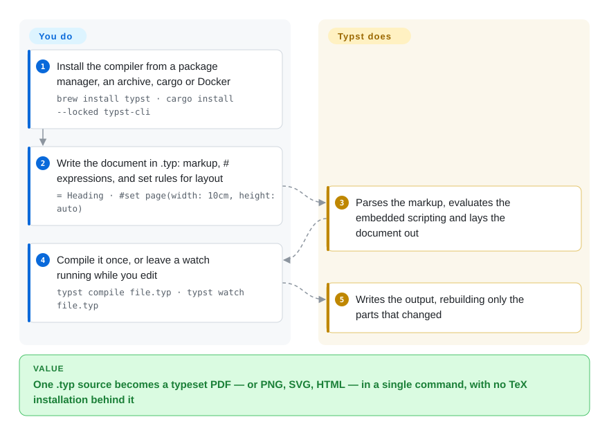

# Typst

A markup-based typesetting system written in Rust: its own concise markup plus an integrated scripting language, compiling `.typ` sources to PDF, PNG, SVG or HTML with incremental rebuilding.

## When to use

You have to produce a real typeset document — a paper, a thesis, a technical report, a CV — and you have concluded that LaTeX is the wrong learning curve for the people who will maintain the source. You do not need the LaTeX ecosystem; you need good page layout, working math, a bibliography, and a build that finishes while you are still looking at the screen.

Reach for Typst when the document *is* the product and you are free to choose the source language. Against LaTeX the deciding tradeoff is learnability plus build speed plus Apache-2.0 licensing, paid for with ecosystem maturity: LaTeX has forty years of journal class files and packages, Typst has a compact standard library, a package registry of its own, and a language that is still 0.x. Against [Quarkdown](quarkdown.md) the tradeoff reverses — Quarkdown keeps your source as Markdown and emits HTML, slides and a docs site from the same file, while Typst gives you a purpose-built typesetting engine and one self-contained Rust binary at the cost of learning a new markup language. Pick Typst when print fidelity leads and source familiarity is secondary.

## How it works

A `.typ` file is markup plus expressions. Plain lines are content; `= Heading` is a heading; `$ ... $` is math; a `#` starts code, so `#let` defines a variable or function and `#f(x)` calls one. Two rule types do the layout work: **set rules** (`#set page(...)`, `#set heading(numbering: "1.")`) configure an element's properties, and **show rules** redefine how an element is rendered entirely. **You write markup and declarations; Typst parses them into a document tree, evaluates the embedded scripting, lays the result out, and exports it — and it does so incrementally, so recompiles only touch what changed.** One CLI invocation turns a source file into a PDF; `--font-path`/`TYPST_FONT_PATHS` adds project fonts, and `typst fonts` lists what the compiler actually discovered.

<!-- flow-steps:begin (generated from flows/typst.json by tools/flow_card.py — do not edit) -->

Text version of the flow

1. **You**: Install the compiler from a package manager, an archive, cargo or Docker — `brew install typst · cargo install --locked typst-cli`
2. **You**: Write the document in .typ: markup, # expressions, and set rules for layout — `= Heading · #set page(width: 10cm, height: auto)`
3. **Typst**: Parses the markup, evaluates the embedded scripting and lays the document out
4. **You**: Compile it once, or leave a watch running while you edit — `typst compile file.typ · typst watch file.typ`
5. **Typst**: Writes the output, rebuilding only the parts that changed

**Value**: One .typ source becomes a typeset PDF — or PNG, SVG, HTML — in a single command, with no TeX installation behind it

<!-- flow-steps:end -->

## When NOT to use

- **Your venue mandates a LaTeX class file (`elsarticle`, `IEEEtran`, a journal `.cls`) or your collaborators' workflow is LaTeX.** Use [LaTeX](latex.md): no reimplementation of someone else's class in Typst will be accepted by a copy-editor, and the package archive is unmatched.
- **You need the source language frozen for years.** Typst is 0.x and minors have carried breaking changes; if a document must compile unchanged in 2035, either pin the compiler version with the document or choose [LaTeX](latex.md), whose stability is the point.
- **You want the source to stay Markdown and one file to also produce a website, slides and a docs wiki.** Use [Quarkdown](quarkdown.md), which is exactly that, or [Asciidoctor](asciidoctor.md) if plain-text publishing matters more than scripting.
- **You want to write content as Markdown plus React components.** Use [MDX](../markdown-tools/mdx.md) instead: Typst has no component model and no JS ecosystem.
- **Your output target is a web page, not a page.** Typst does export HTML, but it is a typesetting engine first; for a documentation site driven by Markdown, [Quarkdown](quarkdown.md) or [MDX](../markdown-tools/mdx.md) fit the job better.
- **You plan to contribute fixes yourself and your workflow is agent-driven.** Typst's `CONTRIBUTING.md` states outright that contributions implemented by an AI model will not be accepted, so agent-authored patches cannot be upstreamed here. `[未验证]` This is the policy text; it was not tested against a real PR.
- **You need a large first-party support organization.** The repo carries ~1.3k open issues against a small core team (see `Health & viability`); if you need vendor-grade support, the commercial Typst offering is the path, not the OSS repo.

## Comparison

| Alternative | In index | Our verdict | Tradeoff |
|---|---|---|---|
| [LaTeX](latex.md) | ✅ | Choose LaTeX when a venue's class file, a decades-old package archive, or absolute source stability decides the outcome; choose Typst when you can pick the language and want faster builds, better error messages and an Apache-2.0 toolchain. | Typst gains a modern incremental compiler, readable errors and a permissive license; it pays with a young ecosystem, no journal class files, and a 0.x language that still changes. LaTeX is the inverse. |
| [Quarkdown](quarkdown.md) | ✅ | Choose Quarkdown when one Markdown-legible source must also yield a website, slides and a docs site; choose Typst when the output is a print-quality document and layout control outranks source familiarity. | Typst gains a purpose-built typesetting engine (pagination, math) and a single Rust binary; it pays with a bespoke markup language and no HTML/slides/docs targets worth the name. |
| [Asciidoctor](asciidoctor.md) | ✅ | Choose Asciidoctor when the deliverable is technical documentation published to HTML/DocBook/EPUB and you want an MIT-licensed, mature toolchain; choose Typst when the deliverable is a paginated typeset PDF with real math. | Asciidoctor gains a mature publishing toolchain, an AsciiDoc spec and Ruby/Java/JS runtimes; it pays with no native typesetting engine and a separate component for PDF. |
| [Pandoc](../markdown-tools/pandoc.md) | ✅ | Choose Pandoc when you are converting between formats you already have; choose Typst when you are *authoring* the document and need a layout engine. | Pandoc gains breadth of formats and templates; it pays with no layout engine of its own — it delegates PDF output to a TeX or Typst engine, which is exactly the part Typst owns. |

## Tech stack

- **Language:** Rust, organized as a workspace whose crate names spell out the pipeline: `typst-syntax` (parsing), `typst-eval` (scripting), `typst-realize` and `typst-layout` (layout), then `typst-pdf`, `typst-svg`, `typst-render` (raster) and `typst-html` (HTML export) as output backends. `typst-library` holds the standard library; `typst-cli` is the binary; `typst-ide` backs editor tooling.
- **Incremental compilation** is a first-class design goal rather than an add-on; the README credits it for fast recompiles.
- **Also compiles to WebAssembly**, which is how the browser-based editor runs the same compiler.
- **Documentation:** the reference and tutorial live at `typst.app/docs`; the online editor and the OSS compiler share the codebase.

## Dependencies

- **Nothing beyond the binary for the core path.** The CLI ships prebuilt archives per platform, Homebrew (`brew install typst`), winget (`winget install --id Typst.Typst`), cargo (`cargo install --locked typst-cli`), Nix, and a Docker image (`ghcr.io/typst/typst`). `typst update` self-updates an archive install.
- **Fonts are the real dependency.** Typst embeds the fonts it uses; system fonts are discovered automatically and project fonts are added with `--font-path` or `TYPST_FONT_PATHS`, with `typst fonts` to see the resolved set. Reproducible output across machines means pinning the font set.
- **No account, no network call, no service.** The online editor at typst.app is a separate product; the compiler in this repo is local and offline.
- **`typst watch`** is the iteration loop and is incremental, so it can stay running while you edit.

## Ops difficulty

**Low.** One static-ish binary, no runtime, no service, no database. Install via a package manager or unpack an archive; compile with one command. The operational work is version pinning and fonts: because the language is 0.x and minor releases have broken syntax, a document that must keep compiling belongs next to a pinned compiler version, and CI should install the same version it was written against. Nothing here needs a container orchestration story.

## Health & viability

- **Maintenance — very active (as of 2026-09-20).** `pushed_at` 2026-09-18T17:51:39Z; latest release v0.15.1 on 2026-07-17 and v0.15.0 on 2026-06-15; actively developed, not archived.
- **Governance and bus factor — a small but genuinely shared core, and the card agrees.** The repo belongs to the `typst` organization (created 2020-06-29, 35 public repos). Measured over the trailing 12 months there are **43 active contributors** with a **top-1 share of 0.414** and a **top-3 share of 0.681**; all-time totals run `laurmaedje` (2,551), `reknih` (215), `saecki` (193). Founder-dominated by history, materially shared by recent activity — a stronger shape than a single-maintainer project, and why this axis grades `B` rather than `D`.
- **Backing and longevity — a company, not a foundation.** Typst is developed by the team behind `typst.app`, whose online editor is the commercial product and which lists open roles; the compiler is Apache-2.0. The Lindy read is mixed but favourable overall: the project has been active since 2019 (about 7 years as of 2026-09) and has not stalled, yet it is still 0.x, so neither age nor version number alone proves stability. `[推断]`
- **Adoption and ecosystem — the strongest signal on this page.** ~56.1k stars and ~1.7k forks, a package registry, editor integrations, and broad use in academic and technical writing. Popularity is not correctness, but here it is corroborated by an active release line rather than by a single spike.
- **Risk flags — 0.x churn and a large open-issue count.** ~1.3k open issues on a small core team is a support-load signal, and minor versions have shipped breaking changes. Apache-2.0, no relicense history found.

## Caveats (unverified)

- `[未验证]` **"As powerful as LaTeX while being much easier to learn"** is the README's own framing; no independent comparison of output quality was performed here.
- `[未验证]` **The specific breaking changes between recent minor versions** were not enumerated; the 0.x churn warning rests on the pre-1.0 version line plus the project's own compatibility notes, not on a changelog audit.
- `[未验证]` **The AI-contribution policy's practical effect.** The sentence in `CONTRIBUTING.md` is quoted accurately, but whether maintainers reject every such PR, and how they detect one, was not tested.
- `[推断]` **HTML export maturity.** `typst-html` exists as a backend, but how complete it is relative to the PDF path was not assessed; treat HTML output as the secondary target.
- `[未验证]` **Package-registry size and quality.** Typst has its own package ecosystem; the number of packages and their maintenance state were not measured.
- `[未验证]` **The 1.3k open issues** are read as a raw count from the GitHub API; the split between bugs, feature requests and stale entries was not analysed.
- `[未验证]` **Company funding and its effect on the OSS compiler** — whether typst.app's commercial interests could pull features out of the open repo (open-core risk) was not investigated.
