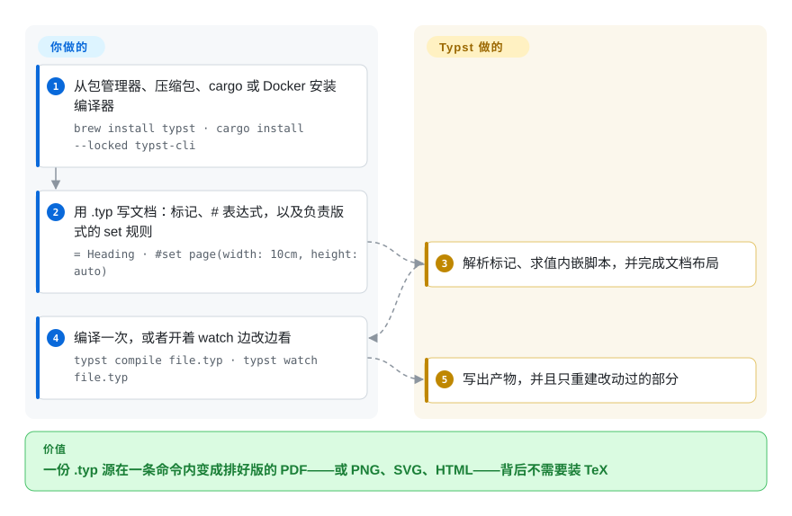

# Typst

用 Rust 写的标记式排版系统：自有的简洁标记语言加上一套内嵌脚本语言，把 `.typ` 源编译成 PDF、PNG、SVG 或 HTML，并且是增量重建。

## 何时使用

你必须产出真正的排版成品——论文、学位论文、技术报告、简历——而你判断 LaTeX 对将来要维护这份源文件的人来说学习曲线不对。你不需要 LaTeX 生态，你需要的是好用的分页版式、能用的数学排版、可用的参考文献，以及一次在你还没离开屏幕时就编译完的构建。

当**文档本身就是产品**、而且你可以自由选择源语言时，选 Typst。相对 LaTeX，决定性的取舍是「易学 + 编译快 + Apache-2.0 许可」，代价是生态成熟度：LaTeX 有四十年的期刊 class 文件与宏包，Typst 有紧凑的标准库、自己的一套包注册表，以及一门仍然处于 0.x 的语言。相对 [Quarkdown](quarkdown.zh.md)，取舍正好反转——Quarkdown 让源文件保持 Markdown，并从同一份文件产出 HTML、幻灯片与文档站；Typst 给你专门打造的排版引擎和一个自包含的 Rust 二进制，代价是你得学一门新的标记语言。印刷保真度优先、源文件熟悉度次要时，选 Typst。

## 怎么用起来

`.typ` 文件是标记加表达式。普通行就是内容；`= 标题` 是标题；`$ ... $` 是数学；`#` 开始一段代码，于是 `#let` 定义变量或函数，`#f(x)` 调用函数。做版式布局的是两类规则：**set 规则**（`#set page(...)`、`#set heading(numbering: "1.")`）配置元素的属性，**show 规则**则彻底重定义某个元素如何渲染。**你写标记与声明；Typst 把它们解析成文档树、求值其中的脚本、完成布局再导出——而且它是增量的，所以重编译只碰改动过的部分。** 一条 CLI 命令就能把源文件变成 PDF；`--font-path`／`TYPST_FONT_PATHS` 用来补项目字体，`typst fonts` 列出编译器实际识别到的字体。

<!-- flow-steps:begin (generated from flows/typst.json by tools/flow_card.py — do not edit) -->

流程文字版

1. **你**：从包管理器、压缩包、cargo 或 Docker 安装编译器 — `brew install typst · cargo install --locked typst-cli`
2. **你**：用 .typ 写文档：标记、# 表达式，以及负责版式的 set 规则 — `= Heading · #set page(width: 10cm, height: auto)`
3. **Typst**：解析标记、求值内嵌脚本，并完成文档布局
4. **你**：编译一次，或者开着 watch 边改边看 — `typst compile file.typ · typst watch file.typ`
5. **Typst**：写出产物，并且只重建改动过的部分

**价值**：一份 .typ 源在一条命令内变成排好版的 PDF——或 PNG、SVG、HTML——背后不需要装 TeX

<!-- flow-steps:end -->

## 何时不用

- **投稿方指定了 LaTeX class 文件（`elsarticle`、`IEEEtran`、期刊 `.cls`），或者协作者的工作流就是 LaTeX。** 改用 [LaTeX](latex.zh.md)：把别人的 class 在 Typst 里重实现一遍，文字编辑不会接受，而那个宏包库也无出其右。
- **你需要源语言多年不变。** Typst 还是 0.x，minor 版本出现过破坏性变更；如果一份文档必须到 2035 年仍能原样编译，要么把编译器版本和文档钉在一起，要么选以稳定性为立身之本的 [LaTeX](latex.zh.md)。
- **你希望源文件保持 Markdown，并且同一份文件还要出网站、幻灯片与文档 wiki。** 改用 [Quarkdown](quarkdown.zh.md)——它做的正是这件事；如果纯文本出版比脚本能力更重要，则用 [Asciidoctor](asciidoctor.zh.md)。
- **你想用 Markdown 加 React 组件写内容。** 改用 [MDX](../markdown-tools/mdx.zh.md)：Typst 没有组件模型，也没有 JS 生态。
- **你的目标产物是网页，而不是纸页。** Typst 确实能导出 HTML，但它首先是排版引擎；由 Markdown 驱动的文档站用 [Quarkdown](quarkdown.zh.md) 或 [MDX](../markdown-tools/mdx.zh.md) 更贴合。
- **你打算自己提修复，而且工作流是 agent 驱动的。** Typst 的 `CONTRIBUTING.md` 明确写着不接受由 AI 模型实现的贡献，所以 agent 写的补丁在这里进不了上游。`[未验证]` 这是政策原文；没有拿真实 PR 验证过它的执行力度。
- **你需要有规模的一线支持团队。** 仓库上有约 1.3k 个未关闭 issue，核心团队却很小（见「健康度与可持续性」）；要厂商级支持，走 Typst 的商业产品，而不是这个开源仓库。

## 横向对比

| 替代品 | 是否收录 | 我们的评价 | 取舍 |
|---|---|---|---|
| [LaTeX](latex.zh.md) | ✅ | 当投稿方的 class 文件、几十年的宏包库或绝对的源码稳定性决定结果时选 LaTeX；当你能自己选语言、想要更快的构建、更好的报错和 Apache-2.0 工具链时选 Typst。 | Typst 换来现代增量编译器、可读的报错与宽松许可；代价是生态年轻、没有期刊 class 文件、语言仍在 0.x 且会变。LaTeX 正好相反。 |
| [Quarkdown](quarkdown.zh.md) | ✅ | 当一份保持 Markdown 可读性的源还要产出网站、幻灯片和文档站时选 Quarkdown；当产物是印刷级文档、版式控制优先于源文件熟悉度时选 Typst。 | Typst 换来专门打造的排版引擎（分页、数学）与单一 Rust 二进制；代价是一门专有标记语言，以及拿不出手的 HTML／幻灯片／文档站目标。 |
| [Asciidoctor](asciidoctor.zh.md) | ✅ | 当交付物是发布成 HTML／DocBook／EPUB 的技术文档、且你想要 MIT 许可的成熟工具链时选 Asciidoctor；当交付物是带真实数学排版的成品 PDF 时选 Typst。 | Asciidoctor 换来成熟的出版工具链、AsciiDoc 规范以及 Ruby／Java／JS 运行时；代价是没有原生排版引擎，导出 PDF 要另配组件。 |
| [Pandoc](../markdown-tools/pandoc.zh.md) | ✅ | 当你只是把手上已有的格式互转时选 Pandoc；当你是在**创作**文档、需要排版引擎时选 Typst。 | Pandoc 换来格式与模板的广度；代价是自身没有排版引擎——它的 PDF 输出要委托给 TeX 或 Typst 引擎，而那正是 Typst 拥有的部分。 |

## 技术栈

- **语言：** Rust，组织成一个 workspace，crate 名字直接说明了流水线：`typst-syntax`（解析）、`typst-eval`（脚本求值）、`typst-realize` 与 `typst-layout`（布局），之后是 `typst-pdf`、`typst-svg`、`typst-render`（位图）与 `typst-html`（HTML 导出）这些输出后端。`typst-library` 放标准库；`typst-cli` 是二进制；`typst-ide` 支撑编辑器工具。
- **增量编译**是设计目标而非附加功能；README 把快速重编译归功于它。
- **同时能编译成 WebAssembly**，浏览器里的在线编辑器跑的就是同一个编译器。
- **文档：** 参考手册与教程在 `typst.app/docs`；在线编辑器与开源编译器共用同一套代码。

## 依赖

- **核心路径上除二进制之外没有别的依赖。** CLI 按平台发布预编译包，也有 Homebrew（`brew install typst`）、winget（`winget install --id Typst.Typst`）、cargo（`cargo install --locked typst-cli`）、Nix，以及 Docker 镜像（`ghcr.io/typst/typst`）。压缩包安装可用 `typst update` 自更新。
- **字体才是真正的依赖。** Typst 会内嵌它用到的字体；系统字体会被自动发现，项目字体用 `--font-path` 或 `TYPST_FONT_PATHS` 添加，`typst fonts` 可查看解析结果。要让不同机器的输出可复现，就必须钉住字体集合。
- **无账号、无网络调用、无服务。** typst.app 上的在线编辑器是另一个产品；本仓库里的编译器是本地、离线的。
- **`typst watch`** 是迭代回路，因为是增量的，可以一直开着边改边看。

## 运维难度

**低。** 一个近乎静态的二进制，没有运行时、没有服务、没有数据库。用包管理器装或解压压缩包，一条命令编译。运维工作只有版本钉住与字体：因为语言处于 0.x、minor 版本出现过破坏性变更，必须长期能编译的文档应该和钉住的编译器版本放在一起，CI 也要装与写作时相同的版本。这里没有任何需要容器编排的部分。

## 健康度与可持续性

- **维护活跃度——非常活跃（截至 2026-09-20）。** `pushed_at` 为 2026-09-18T17:51:39Z；最新版本 v0.15.1 发布于 2026-07-17，v0.15.0 发布于 2026-06-15；在持续开发中，未归档。
- **治理与维护者分散度——核心很小但确实共享，卡片也是这个结论。** 仓库属于 `typst` 组织（建于 2020-06-29，35 个公开仓库）。按最近 12 个月测量有 **43 位活跃贡献者**，**top1 占比 0.414**、**top3 占比 0.681**；历史总贡献前三为 `laurmaedje`（2,551）、`reknih`（215）、`saecki`（193）。历史上创始人主导，近期活跃度上则确实共享——比单维护者项目更结实，也是这一轴评为 `B` 而不是 `D` 的原因。
- **背书与寿命——公司而非基金会。** Typst 由 `typst.app` 背后的团队开发，在线编辑器是其商业产品，站点上还挂着招聘；编译器本身是 Apache-2.0。Lindy 的读法是混合但总体有利：项目自 2019 年起持续活跃（截至 2026-09 约 7 年）且没有停滞，但它仍是 0.x，所以无论年龄还是版本号本身都不构成稳定性证明。`[推断]`
- **采用与生态——本页最强的信号。** 约 56.1k star、约 1.7k fork、有自己的包注册表、有编辑器集成，并在学术与技术写作中被广泛使用。流行不等于正确，但这里它被一条持续活跃的发布线所印证，而不是一次孤立的热度。
- **风险旗标——0.x 变动与大额未关闭 issue。** 小型核心团队对应约 1.3k 个未关闭 issue，是支持负载信号；minor 版本也出现过破坏性变更。Apache-2.0，未发现换证历史。

## 存疑（未验证）

- `[未验证]` **「和 LaTeX 一样强大，但好学得多」是 README 的自述框架**；本文没有对输出质量做独立对比。
- `[未验证]` **近期各 minor 版本的具体破坏性变更没有逐条列举**；关于 0.x 变动的警告依据的是 1.0 之前的版本线以及项目自身的兼容性说明，不是 changelog 审计。
- `[未验证]` **AI 贡献政策的实际效果。** `CONTRIBUTING.md` 里那句话是准确引用的，但维护者是否拒收每一个此类 PR、以及如何识别，都没有实测过。
- `[推断]` **HTML 导出的成熟度。** `typst-html` 作为后端确实存在，但它相对 PDF 路径的完整程度没有评估；请把 HTML 输出当作次要目标。
- `[未验证]` **包注册表的规模与质量。** Typst 有自己的包生态，但包的数量与维护状态没有统计。
- `[未验证]` **1.3k 个未关闭 issue** 只是 GitHub API 的原始计数；其中 bug、功能请求与陈旧条目的比例没有分析。
- `[未验证]` **公司融资及其对开源编译器的影响**——typst.app 的商业利益是否可能把功能从开源仓库抽走（open-core 风险），本文没有调查。
