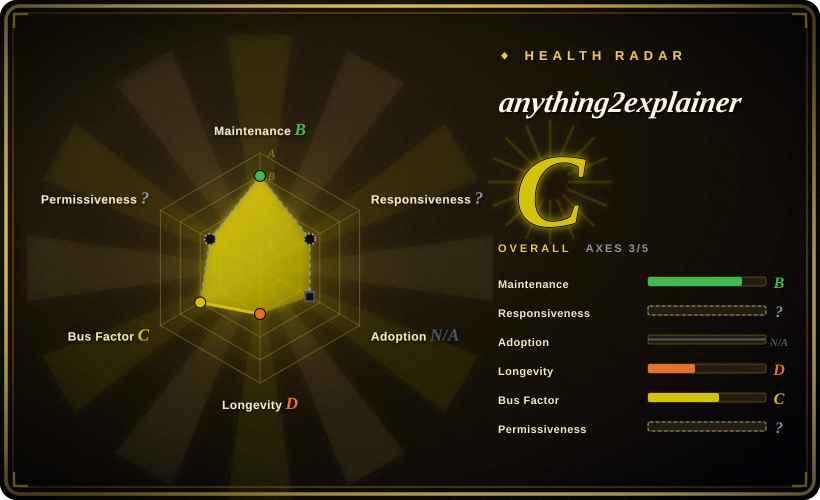

# anything2explainer

A Claude Code / Codex skill-pack that turns a topic into a narrated motion-graphics explainer video (Chinese or English) — every frame drawn in code with Remotion, driven through a 9-stage multi-agent pipeline with 4 mandatory human checkpoints and quantitative QC.

## When to use

You're a developer or technical writer who needs a narrated explainer video about a concept ("explain vector databases") but doesn't want to learn video editing or prompt a black-box video generator. You already run Claude Code or Codex. You say "make me an explainer video about X" and the skill walks a full production pipeline: research with sourced citations, narration script, TTS voiceover with word-level timing, storyboard, parallel build agents writing one Remotion component per shot, then QC agents scoring rendered frames against written criteria — with you consulted at exactly four checkpoints (length/language, script sign-off, voice preference, 30-second pilot).

Pick this over the broader agentic-video pipelines when what you want is a *governed, reproducible method* rather than a freestyle generator: the repo ships a complete reference film with its full paper trail (research doc → narration → storyboard → per-shot source → QC reports) as the quality bar, quantitative checks (`motion_check.py`, `frame_metrics.py`), and fact discipline (every on-screen number needs a source URL). The deciding tradeoff vs. OpenMontage is a fixed visual system (black-canvas MG, white line art + purple accents) with explicit human gates vs. a wider but looser prompt-to-video scope; vs. HyperFrames, this is a full pipeline with methodology, not a rendering engine you build your own process around.

## When NOT to use

- **Any commercial use without the author's authorization.** The license is PolyForm Noncommercial 1.0 — the toolkit is free for noncommercial use only, and commercial use requires prior authorization; two licensing-inquiry issues were already opened and closed. If you need a commercially safe default, pick Apache-2.0 [HyperFrames](hyperframes.md) (engine + skills) or AGPL-3.0 [OpenMontage](open-montage.md) (copyleft but permits commercial use), because PolyForm's noncommercial gate applies to the toolkit itself regardless of how little of it you reuse.
- **You need generative footage, real presenters, or stock video.** Every frame is code-drawn line art in one fixed visual style — for photoreal or avatar-based output use a closed SaaS like Runway or HeyGen (未收录), which trade pipeline control for one-click generation.
- **You need your own visual identity.** The look is deliberately fixed (black canvas, star-field or dot-field backdrop, white line art + purple accents, 44px subtitles); for bespoke branding write Remotion (未收录) components directly and skip the skill.
- **You're not on Claude Code or Codex.** It activates through those harnesses' skill-loading mechanisms; on any other agent the markdown alone won't fire — for a harness-agnostic path, use Remotion or HyperFrames as libraries instead.
- **Windows-only environment.** The scripts are zsh + Python 3, developed and verified on macOS; Linux (including Raspberry Pi 5) is documented, Windows is explicitly untested — on Windows prefer HyperFrames' npm-based toolchain.
- **You want a quick clip, not a film.** The pipeline targets 2–8 minute videos at roughly 1–3 hours of wall clock with 4–14 parallel build agents and ~2–3 GB disk per film; for a fast 30-second asset that's pure overhead — go straight to Remotion templates or a SaaS generator.
- **You need a dependency you can bet on long-term.** The repo was created 2026-09-08 — days old, no releases, single author; see Health & viability before adopting it into anything repeatable.

## Comparison

| Alternative | In index | Our verdict | Tradeoff |
|---|---|---|---|
| [OpenMontage](open-montage.md) | ✅ | Pick OpenMontage when you need a broader prompt-to-video scope (trailers, documentary montage) or AGPL's commercial-use permission; pick anything2explainer when a fixed MG explainer style with human checkpoints and quantitative QC is exactly the job. | OpenMontage covers more genres with a governed pipeline but AGPL-3.0 copyleft and a heavier toolchain; anything2explainer is narrower, lighter to adopt (symlink install), and PolyForm-noncommercial-gated. |
| [HyperFrames](hyperframes.md) | ✅ | Pick HyperFrames when you want a deterministic HTML-to-MP4 rendering engine to build your own pipeline on, or need Apache-2.0; pick anything2explainer when you want the whole production method — research, narration, storyboard, QC — already worked out. | HyperFrames is the engine layer with 20 agent skills and a permissive license but no end-to-end film methodology; anything2explainer bundles the methodology yet locks you into one visual system and a noncommercial license. |
| Remotion (未收录) | ❌ | Pick Remotion directly when you need full control over visuals and composition and will write your own components; anything2explainer already sits on Remotion, so adopting it means accepting its fixed style. | Direct Remotion gives unlimited visual freedom under its own source-available license with a revenue threshold, at the cost of building the research/narration/QC pipeline yourself. |
| Manim (未收录) | ❌ | Pick Manim when your content is math/algorithm animation and you want the classic programmatic scene library with a decade of community examples; pick anything2explainer when you want an agent to run the whole production including voiceover and storyboard. | Manim is a mature MIT-licensed engine with deep ecosystem but no agent pipeline, TTS, or QC — you orchestrate everything yourself. |
| Runway / HeyGen (未收录) | ❌ | Pick these closed SaaS tools when you need one-click generative footage or avatars and don't need source-level control; anything2explainer wins when the output must be reproducible, code-reviewable, and locally rendered. | SaaS generators are faster to first pixel but closed, per-render-priced, and non-customizable; the skill-pack is slower (hours) yet fully transparent and rerunnable. |

## Health & viability

- **Maintenance (2026-09):** hyper-new but active — created 2026-09-08, last push 2026-09-13, ~20 commits, no releases or tags yet. Too young to have a cadence; treat every claim as a snapshot.
- **Governance / bus factor:** single-author (`User`-owned) repo, 2 contributors total. The roadmap, style rules, and QC criteria are one person's distilled workflow — a bus-factor flag, and also why the internal quality bar is unusually coherent. [推断]
- **Age & Lindy (2026-09):** 8 days old as of verification — the worst possible Lindy position. ~1.4k stars in the first week is attention, not validation; there are no third-party reproduction reports yet (the only open issue is one user testing it inside another harness). Adopt for learning or one-off use, not as infrastructure.
- **Risk flags:** **PolyForm Noncommercial 1.0 — not OSI open source.** Videos you produce belong to you, but commercial use of the toolkit needs the author's authorization; two licensing-inquiry issues (#5, #6) were closed with the author's answer being "email me with your scope" — a contact channel exists, but no published pricing or terms. Bundled fonts are separately SIL OFL-1.1. English TTS defaults pin fragile dependencies (edge-tts pinned to 7.2.8 because it tracks a Microsoft endpoint; kokoro is hard to install on ARM).
- **Adoption & ecosystem:** README documents macOS verification and a Raspberry Pi 5 Linux path; Windows untested. No package-registry presence, no community plugins, no HN discussion found as of 2026-09-16. [未验证]

## Caveats (unverified)

- [未验证] Stars (~1.4k) / forks (~233) per GitHub API on 2026-09-16; extremely date-sensitive on a repo this young.
- [未验证] Harness support (Claude Code and Codex skill loading) is from the README; activation fidelity not independently confirmed.
- [未验证] Linux/ARM support (Raspberry Pi 5, chromium executable override, piper/kokoro-onnx fallbacks) is author-reported; no third-party confirmation.
- [未验证] Wall-clock (≈1–3 h), disk (≈2–3 GB), and parallel-agent counts per film are the author's own measurements from the reference production, not benchmarked independently.
- Verified (2026-09-17): commercial licensing goes through emailing the author (his reply on issue #5: `vincentwei1021@gmail.com`); no published pricing or terms.
- [推断] The fixed visual style is explicitly inspired by a Douyin creator (@图灵宇宙) per the README acknowledgment; frames are code-drawn originals, but style-parity claims are the author's own.
- [推断] Single-author coherence is a strength now and a continuity risk later; with ~20 commits there is no evidence yet of how the project handles external contributions.
