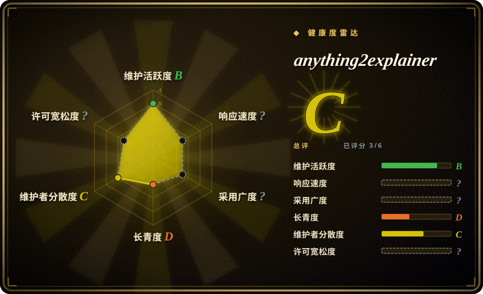

# anything2explainer

一个 Claude Code / Codex skill-pack：给一个主题，产出一条带配音的 MG 风格科普讲解视频（中文或英文）——每一帧都由 Remotion 代码绘制，由 9 阶段多 agent 流水线驱动，带 4 个强制人工确认点和量化 QC。

## 何时使用

你是开发者或技术写作者，需要给某个概念做一条带配音的讲解视频（「讲一下向量数据库」），但不想学视频剪辑，也不想用黑盒视频生成器。你已经在用 Claude Code 或 Codex。说一句「把 X 做成一条讲解视频」，skill 就会走完整制作流水线：带来源引用的调研、解说词、带逐词时间轴的 TTS 配音、分镜、并行构建 agent 为每个镜头写一个 Remotion 组件、QC agent 按书面判据给渲染帧打分——全程只在四个确认点找你（时长与语言、文案定稿、配音偏好、30 秒样片）。

当你要的是一套**有治理、可复现的方法**而不是自由发挥的生成器时，选它而不是更宽泛的 agentic 视频流水线：仓库附带一条完整样片及其全链路纸迹（调研文档→解说词→分镜→每镜头源码→QC 报告）作为质量标尺、量化检查（`motion_check.py`、`frame_metrics.py`），以及事实纪律（画面上每个数字必须有来源 URL）。与 OpenMontage 的取舍是：固定视觉体系（黑底 MG、白线条+紫色点缀）加明确人工闸门，换取更窄但更稳的产出；与 HyperFrames 的取舍是：这是带方法论的完整流水线，而不是要自己搭流程的渲染引擎。

## 何时不用

- **任何未经作者授权的商用。** 许可证是 PolyForm Noncommercial 1.0——工具包仅非商用免费，商用需事先取得作者授权；已有两个咨询商业授权的 issue 开了又关。需要商用安全默认选 Apache-2.0 的 [HyperFrames](hyperframes.zh.md)（引擎+技能）或 AGPL-3.0 的 [OpenMontage](open-montage.zh.md)（copyleft 但允许商用），因为 PolyForm 的非商用闸门针对工具包本身，与你复用多少无关。
- **需要生成式画面、真人出镜或实拍素材。** 每一帧都是代码绘制的线条画，且只有一种固定视觉风格；要写实或数字人产出就用 Runway、HeyGen 这类闭源 SaaS（未收录），它们用流水线可控性换一键生成。
- **需要自己的视觉品牌。** 视觉是刻意固定的（黑底、星点或点阵波幕底、白线条+紫色重点、44px 字幕）；要定制品牌就直接写 [Remotion](remotion.zh.md) 组件，跳过这个 skill。
- **不在 Claude Code 或 Codex 上。** 它靠这两个 harness 的 skill 加载机制激活；其它 agent 上 markdown 本身不会自动触发——要 harness 无关的路径就把 Remotion 或 HyperFrames 当库用。
- **只有 Windows 环境。** 脚本是 zsh + Python 3，在 macOS 上开发验证；Linux（含树莓派 5）有文档，Windows 明确未测试——Windows 上优先 HyperFrames 的 npm 工具链。
- **只要一条快剪短片而不是一部片子。** 流水线面向 2–8 分钟视频，墙钟约 1–3 小时、4–14 个并行构建 agent、每片约 2–3 GB 磁盘；做 30 秒素材纯属 overhead——直接用 Remotion 模板或 SaaS 生成器。
- **需要一个能长期押注的依赖。** 仓库创建于 2026-09-08——以天计龄、无 release、单作者；把它纳入任何可重复流程前先看「健康度与可持续性」。

## 横向对比

| 替代品 | 是否收录 | 我们的评价 | 取舍 |
|---|---|---|---|
| [OpenMontage](open-montage.zh.md) | ✅ | 需要更宽的 prompt 到成片题材（预告片、纪录蒙太奇）或 AGPL 的商用许可时选 OpenMontage；固定 MG 讲解风格加人工确认点和量化 QC 恰好就是你要的活儿时选 anything2explainer。 | OpenMontage 题材覆盖更广且有治理流水线，但带 AGPL-3.0 copyleft 和更重的工具链；anything2explainer 更窄、接入更轻（软链安装），但被 PolyForm 非商用卡住。 |
| [HyperFrames](hyperframes.zh.md) | ✅ | 想要一个确定性的 HTML 到 MP4 渲染引擎来搭自己的流水线、或需要 Apache-2.0 时选 HyperFrames；想要整套制作方法——调研、解说词、分镜、QC——都已经趟好时选 anything2explainer。 | HyperFrames 是引擎层，带 20 个 agent 技能和宽松许可证但没有端到端成片方法论；anything2explainer 打包了方法论，却把你锁进一种视觉体系和一个非商用许可证。 |
| [Remotion](remotion.zh.md) | ✅ | 需要完全掌控画面与合成、愿意自己写组件时直接用 Remotion；anything2explainer 本就架在 Remotion 上，采用它即接受其固定风格。 | 直接用 Remotion 视觉自由度无限，但它自身也是 source-available（有营收门槛），且调研/配音/QC 流水线要你自己搭。 |
| Manim（未收录） | ❌ | 内容是数学/算法动画、想要有十年社区积累的经典程序化场景库时选 Manim；想让 agent 跑完包括配音和分镜在内的整个制作时选 anything2explainer。 | Manim 是 MIT 许可的成熟引擎、生态深厚，但没有 agent 流水线、TTS 和 QC——编排全靠你自己。 |
| Runway / HeyGen（未收录） | ❌ | 需要一键生成式画面或数字人、且不需要源码级控制时选这些闭源 SaaS；要求产出可复现、可代码审查、本地渲染时选 anything2explainer。 | SaaS 生成器出第一帧更快，但闭源、按次计费、不可定制；skill-pack 更慢（数小时）但完全透明、可重跑。 |

## 健康度与可持续性

- **维护（2026-09）：** 极新但活跃——创建于 2026-09-08，最近 push 2026-09-13，约 20 个 commit，尚无 release 或 tag。太新，谈不上节奏；所有事实都当快照看。
- **治理 / 巴士因子：** 单作者（`User` 所有）仓库，共 2 个 contributor。路线图、风格规则、QC 判据都是一个人蒸馏出的工作流——这是巴士因子警示，也正是内部质量标尺异常自洽的原因。[推断]
- **年龄与 Lindy（2026-09）：** 验证时仅 8 天——Lindy 视角下最差的位置。首周约 1.4k star 是关注度而非验证；目前还没有第三方复现报告（唯一的 open issue 是有用户在另一个 harness 里试用）。适合学习和一次性使用，不适合当基础设施。
- **风险标记：** **PolyForm Noncommercial 1.0——不是 OSI 定义的开源。** 你产出的视频归你所有，但工具包的商用需作者授权；两个商业授权咨询 issue（#5、#6）的关闭方式是作者答复「发邮件说明商用范围」——渠道存在，但无公开的定价与条款。打包字体单独以 SIL OFL-1.1 授权。英文配音默认依赖较脆（edge-tts 因跟踪微软接口而 pin 在 7.2.8；kokoro 在 ARM 上难装）。
- **采用与生态：** README 记录了 macOS 验证和树莓派 5 的 Linux 路径；Windows 未测试。无包仓库发布、无社区插件；截至 2026-09-16 未找到 HN 讨论。[未验证]

## 存疑（未验证）

- [未验证] star（约 1.4k）/ fork（约 233）来自 2026-09-16 的 GitHub API；在如此年轻的仓库上对日期极度敏感。
- [未验证] harness 支持（Claude Code 与 Codex 的 skill 加载）来自 README；激活保真度未独立确认。
- [未验证] Linux/ARM 支持（树莓派 5、chromium 可执行文件覆盖、piper/kokoro-onnx 备选）为作者自述；无第三方确认。
- [未验证] 墙钟（约 1–3 小时）、磁盘（约 2–3 GB）、每片并行 agent 数是作者基于样片制作的实测，未经独立基准验证。
- 已核实（2026-09-17）：商业授权渠道是给作者发邮件（他在 issue #5 的回复：`vincentwei1021@gmail.com`）；无公开定价与条款。
- [推断] 固定视觉风格据 README 致谢明确受抖音创作者@图灵宇宙启发；画面为代码原创，但风格一致性的说法是作者自己的口径。
- [推断] 单作者的自洽性当下是优点、长期是连续性风险；约 20 个 commit 的体量还看不出项目如何处理外部贡献。
