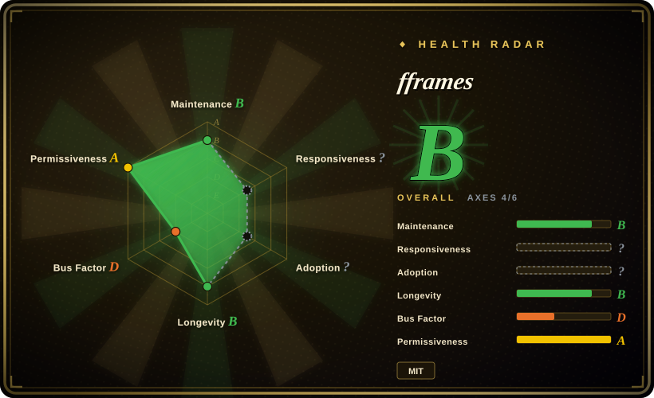
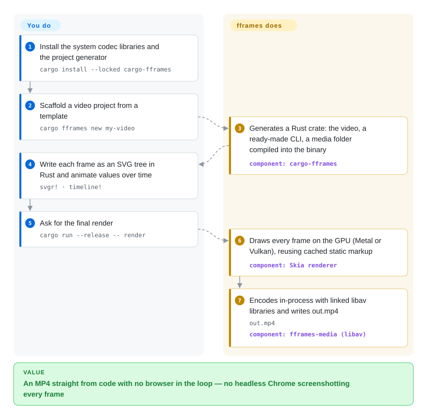

# fframes

Rendering a two-minute motion-graphics video from code usually means a headless Chrome screenshotting every frame, and a coding agent that wrote the video still can't tell whether a headline got cut off at the edge. fframes has you (or your agent) write each frame as an SVG tree in Rust, draws it on the GPU and encodes it in-process with ffmpeg's libraries — and every project ships commands that turn the video into PNG contact sheets and numbers an agent can check.

## When to use

You're a developer — or you're briefing a coding agent — and the job is recurring code-made video: a launch clip rebuilt every release, one splash screen per conference talk, a podcast visualizer, a data explainer whose numbers change weekly. With a browser-based renderer the loop is slow (bundle, launch Chrome, screenshot 300 frames, encode), and the agent that wrote the composition is blind: it hands you `out.mp4` without knowing the title reads `Quarterly revenu` because the text ran off the canvas.

You reach for fframes when you're willing to pay a Rust + native toolchain cost for two things: a renderer with no browser in it (Skia on Metal/Vulkan draws the SVG, ffmpeg's libav libraries are linked in rather than shelled out to), and a per-project CLI built for an author that cannot watch — `inspect` reports clipped text, missing fonts and invalid SVG with time and scene and exits 2 on errors, `strip`/`onion`/`frame` write PNGs, `audio analyze` reports LUFS and clipping. The deciding tradeoff vs [Remotion](remotion.md) and [HyperFrames](hyperframes.md): those let you write React or HTML and inherit the browser's layout engine and ecosystem; fframes makes you write explicit, verbose Rust (the author says that verbosity is why it stayed unreleased for years and why agents now make it viable) in exchange for native speed — its own benchmark measures 1.5× faster than Remotion's best settings at x264 `medium`, 2.85× at `ultrafast` — and an MIT license with no company-size threshold.

## How it works

Your video is a Rust struct: it declares FPS, size, duration and an audio map, and implements `render_frame`, which for any frame index returns an SVG tree written with the `svgr!` macro — think of it as JSX, except the output is SVG and the `{expressions}` are Rust. Motion comes from `timeline!` and spring helpers that turn "at 2 s move from here to there with this easing" into a value for the current frame. What fframes does for you: scaffold the crate and its command line (`cargo fframes new`), hash the static parts of your markup at compile time so they are not rebuilt every frame, rasterize each frame through Skia on the GPU (or a CPU fallback), mix the audio, and encode through statically linked ffmpeg libraries into `out.mp4`. What you do: install the native codec packages, write the frames, and run the CLI. The agent path is the same code with a different author — `npx skills add https://fframes.studio` installs a skill that walks an agent from an empty folder through `timeline` → `inspect` → `strip` → `render`, reading PNGs and numbers instead of watching; `preview` opens a real-time GPU window with sound for the human, and a WebAssembly browser editor gives a scrubbable timeline.

<!-- flow-steps:begin (generated from flows/fframes.json by tools/flow_card.py — do not edit) -->

Text version of the flow

1. **You**: Install the system codec libraries and the project generator — `cargo install --locked cargo-fframes`
2. **You**: Scaffold a video project from a template — `cargo fframes new my-video`
3. **fframes**: Generates a Rust crate: the video, a ready-made CLI, a media folder compiled into the binary — component: `cargo-fframes`
4. **You**: Write each frame as an SVG tree in Rust and animate values over time — `svgr! · timeline!`
5. **You**: Ask for the final render — `cargo run --release -- render`
6. **fframes**: Draws every frame on the GPU (Metal or Vulkan), reusing cached static markup — component: `Skia renderer`
7. **fframes**: Encodes in-process with linked libav libraries and writes out.mp4 — `out.mp4` — component: `fframes-media (libav)`

**Value**: An MP4 straight from code with no browser in the loop — no headless Chrome screenshotting every frame

<!-- flow-steps:end -->

## When NOT to use

- **Your team (or agent) writes the web, not Rust.** A frame here is Rust code with an SVG macro; there is no HTML/CSS layout, no npm component ecosystem, no DOM. Use [HyperFrames](hyperframes.md) (plain HTML + seekable animation libraries, Apache-2.0) or [Remotion](remotion.md) (React components, the largest ecosystem), because reusing web UI, CSS flexbox/grid and existing React charts in a video is worth more than a 1.5–3× render speedup for most teams.
- **You need cloud-scale fan-out rendering today.** fframes renders on the machine it runs on; it ships no distributed renderer. Use [Remotion](remotion.md) (`@remotion/lambda`) or [HyperFrames](hyperframes.md) (its AWS Lambda package) when thousands of variants must render in parallel on infrastructure you don't babysit.
- **Your build machines can't take a native C/C++ toolchain.** Every project links Skia and ffmpeg: macOS/Linux on arm64/x86_64 download prebuilt libraries (about a minute), other targets or feature mixes compile them from source (up to ~20 minutes), Windows needs a separately downloaded FFmpeg 9 shared build plus LLVM, and a cached source build moved to another CPU can crash with `SIGILL` unless you enable `build-portable`. The issue history is mostly build breakage (ffmpeg 5 headers, Xcode 27 `_Traits`). If your CI is a locked-down container, a Node renderer ([HyperFrames](hyperframes.md)) is the lighter install.
- **You will ship the compiled renderer to customers and cannot accept GPL obligations.** fframes itself is MIT, but a generated project on macOS/Linux turns on `h264` + `libav-agree-gpl`, statically linking libx264 into the binary. Distributing that binary brings GPL terms with it [推断]; build without GPL codecs (VPX/Opus, or platform encoders like VideoToolbox) or keep rendering server-side, and take it to legal review.
- **You need math/diagram animation with a teaching vocabulary.** Manim (未收录) has LaTeX, graph and geometry primitives and a large education community; fframes gives you raw SVG and a timeline, so you would rebuild those primitives yourself.
- **You mainly cut and assemble existing footage.** fframes composes frames from code; for trimming, concatenating and overlaying recorded clips use [MoviePy](../media-processing/video-audio/editing-and-cutting/moviepy.md) or drive [FFmpeg](../media-processing/video-audio/transcoding-and-pipelines/ffmpeg.md) directly.
- **You need a multi-maintainer, long-stable API to bet a product on.** 1.0 shipped on 2026-09-28 and the license changed twice before that (see Health); one author holds ~90% of commits. Pin an exact version and budget for API churn, or choose [Remotion](remotion.md), whose paid-license company has kept a v4 release train running for years.

## Comparison

| Alternative | In index | Our verdict | Tradeoff |
|---|---|---|---|
| [Remotion](remotion.md) | ✅ | When a React team wants the most proven code-to-video engine with Lambda fan-out and a component ecosystem, pick Remotion; pick fframes when you render on your own GPU machines, want an MIT license with no company-size threshold, and care more about render time than reusing web components, because fframes swaps the browser for Skia + linked libav. | Remotion gives six years of stability, React reuse and cloud rendering but carries a source-available license gate and Chrome's per-frame screenshots; fframes' own benchmark shows 1.41× default-vs-default and 1.5× best-vs-best at x264 `medium` (2.85× at `ultrafast`), paid for in Rust verbosity and native build friction. |
| [HyperFrames](hyperframes.md) | ✅ | When a coding agent should author video in plain HTML that it already writes fluently and render it in CI or on Lambda under Apache-2.0, pick HyperFrames; pick fframes when the agent's output must be checked without a browser and rendered natively fast, because fframes ships `inspect`/`strip`/`audio analyze` as first-class CLI commands inside every project. | HyperFrames keeps the web's layout engine, animation libraries and a Node-only install; fframes drops the browser for speed and gets a Rust/C toolchain in return. Both are agent-first; HyperFrames is vendor-backed (HeyGen), fframes is a single author. |
| Motion Canvas | 未收录 | When you hand-craft explanatory animations and want a TypeScript generator API with a live visual editor, pick Motion Canvas; pick fframes when output must be batch-rendered by code or an agent at native speed with audio analysis built in, because Motion Canvas centres on an interactive editor-driven workflow. Not added in this tab batch. | Motion Canvas (MIT, ~19k stars, last push 2026-07) is friendlier for TS users and designers; fframes is faster to render headlessly but has no comparable visual authoring tool beyond its WASM timeline editor. |
| Manim | 未收录 | When the video is maths or algorithm explanation that needs LaTeX, plots and geometry primitives, pick Manim; pick fframes for branded motion graphics, social clips and data videos with soundtracks, because Manim's scene vocabulary is built for teaching and fframes gives you raw SVG. Not added in this tab batch. | Manim (MIT, ~41k stars, active) has a large education community and Python ergonomics; fframes has GPU rendering, in-process encoding and agent QA tooling but no maths primitives. |
| [MoviePy](../media-processing/video-audio/editing-and-cutting/moviepy.md) | ✅ | When the task is scripting edits of existing clips — cut, concatenate, overlay text — pick MoviePy; pick fframes when every frame is generated from code, because fframes is a frame renderer and MoviePy is an editing library over decoded footage. | MoviePy is pure-Python with a gentle learning curve but slow for heavy per-frame drawing; fframes is fast for generated graphics and pays in Rust and native build setup. |

## Tech stack

- Rust workspace (edition 2024 in generated projects): `fframes` core crate (video/scene/timeline/audio API, `fframes::cli`), `svgr-macro` (compile-time SVG macro), `fframes-media` (ffmpeg bindings via `ffmpeg-sys-fframes`), `fframes-skia-renderer`, `fframes-native-player` (real-time preview), `cargo-fframes` (project generator), `webvtt-parser`.
- Rendering: Skia on Metal (macOS) or Vulkan (Linux/Windows), plus a CPU backend; SVG parsing/rendering through `svgr`/`usvgr` 0.46, the author's MPL-2.0 fork of linebender/resvg. Shader layers accept SkSL or pasted Shadertoy GLSL.
- Encoding: ffmpeg's libav linked statically (prebuilt FFmpeg archives for macOS/Linux arm64/x86_64; source build elsewhere; shared FFmpeg 9 on Windows). Codecs chosen by Cargo features (`h264`, `h265`, `vpx`, `opus`, `aac`, hardware `videotoolbox`/`vaapi`/`nvidia`/`qsv`), with explicit `libav-agree-gpl` / `libav-agree-nonfree` opt-ins.
- Editor: browser editor in ReScript/TypeScript running the video compiled to WebAssembly (Node + pnpm needed only to work on the editor).
- Agent surface: `skills/fframes-video` (SKILL.md + API, design and audio references), installable with `npx skills add https://fframes.studio`.

## Dependencies

- Rust toolchain (rustup) and Cargo; `cargo install --locked cargo-fframes`.
- System packages the linked ffmpeg needs — macOS: `pkg-config ffmpeg x264 x265 opus nasm ninja` (Homebrew); Debian: `yasm nasm ffmpeg libx264-dev libx265-dev libopus-dev libclang-dev clang ninja-build libvpx-dev libasound2-dev`; Windows: an FFmpeg 9 shared build via `FFMPEG_DIR` or vcpkg, plus LLVM (`LIBCLANG_PATH`).
- A GPU with Metal or Vulkan for the default Skia backend and the preview window; `--backend cpu` works without one (no preview, slower).
- Network on first build to fetch prebuilt Skia/FFmpeg archives (otherwise a long source build).
- No server, database or cloud account; rendering is a local binary.

## Ops difficulty

**Medium.** Day to day it is `cargo run --release -- <command>` in one crate, and later builds take seconds. The cost is the native layer: codec packages per OS, a first build that is fast only on the prebuilt targets, Windows-specific FFmpeg/LLVM wiring, `build-portable` to avoid `SIGILL` when caching builds across CPUs, and GPU drivers for Metal/Vulkan. Toolchain upgrades have broken builds before (Xcode 27 `_Traits` in the Skia bindings, fixed in 1.0.3 by shipping prebuilt Metal binaries). There is no service to operate, but reproducing renders on another machine means reproducing that toolchain.

## Health & viability

- **Maintenance (2026-09-30):** very active right now — v1.0.0 through v1.1.0 published 2026-09-28 → 2026-09-30, last push 2026-09-30, three open issues, same-day maintainer replies on the new ones. Earlier years were a long private-feeling beta (crates.io betas from 2024-04, multi-month gaps), so the current pace is launch-week energy, not a proven cadence [推断].
- **Governance / bus factor:** a personal repo (owner type User); dmtrKovalenko has 208 of the 228 default-branch commits, with a long tail of one- or two-commit contributors. The renderer rests on the author's own resvg fork (`svgr`), which he says needs upstream fixes re-applied by hand. Bus factor is 1.
- **Backing & Lindy:** repo created 2021-11 (first commit a 2021-09 "POC"), so ~5 years of intermittent development but only two days of a stable API. By this index's prior that is young as a product — age of the idea is not age of the contract. Funding is a GitHub Sponsor link; no company or foundation behind it.
- **Adoption:** 1,231 stars / 20 forks; `fframes` on crates.io has 38k total downloads (inflated by dozens of pre-release versions) and ~1k in the last 90 days; `cargo-fframes` was first published 2026-09-28. No notable production users documented beyond the author's own videos and examples.
- **Risk flags:** license history — GPLv3 (2022) → a BSD-3 variant with a no-rebranding clause (2025-02) → MIT (2026-09-28, PR #144), so a pinned pre-1.0 beta may sit under different terms than today's release. The default generated project links GPL x264. Open bugs touch output correctness (H.264 B-frame input losing final frames, BT.709 colors) and an audio buzz reported in 2025 is still open.

## Caveats (unverified)

- [未验证] Benchmark figures (1.50× vs Remotion's best at x264 `medium`, 2.85× at `ultrafast`, 1.41× default-vs-default) come from the project's own `render-bench/vs-remotion` run on one Apple M4 Max; not reproduced here, and the README itself notes Linux/x86 may differ.
- [未验证] README claims Skia is "about 10x faster than the built-in CPU backend"; the project's own text-heavy benchmark shows the CPU backend nearly as fast (6.80 s vs 6.29 s), so the gap depends heavily on scene content.
- [未验证] "Vibed in 48 minutes and rendered in 36 seconds" for the 128-second launch video, and "render --draft encodes one scene at half size in about a second", are author claims not reproduced.
- [推断] That distributing a binary built from the default template (`h264` + `libav-agree-gpl`, static libx264) triggers GPL obligations is a reading of the feature flags and FFmpeg's licensing, not legal advice; rendered video files themselves are not what the GPL covers.
- [推断] "Launch-week energy, not a proven cadence" is inferred from the release dates clustering at 2026-09-28..30 against sparse beta publishes before; future cadence is unknown.
- [未验证] Windows support was read from the README only (shared FFmpeg 9, codec features off); not tested.
- [未验证] Emoji rendering was a known issue in 2024 (#65, closed); current emoji support was not tested.
- [未验证] Star, fork, download and commit counts are point-in-time readings from GitHub and crates.io on 2026-09-30.
- [未验证] The radar's adoption axis is `?` because the scorer found several candidate packages and none cleared its noise filter; the `fframes` crate's own crates.io figures (38,170 total, 1,038 recent downloads) are quoted in Health but were not fed back into the machine grade.
