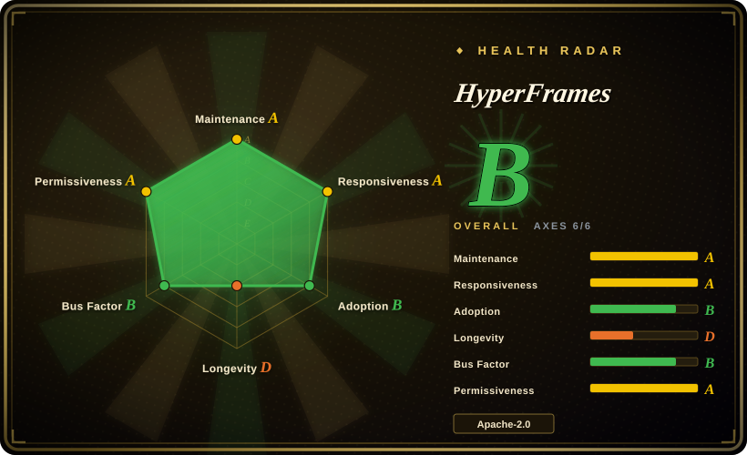

# HyperFrames

An open-source framework that turns HTML/CSS/media plus seekable animations into deterministic MP4 videos — headless Chrome seeks each frame, FFmpeg encodes — with a CLI and 20 agent skills so coding agents can produce videos end to end.

## When to use

You're building an automated video pipeline — release-announcement clips, product tours, data-viz animations, podcast recuts — and the two existing options both fail you: a human editor in Premiere can't produce 50 variants a week, and an AI video model (SeedDance/Sora class) can't guarantee the text says what you wrote or let you fix one caption without re-rolling the whole clip. You need video that is *code*: reviewable in a diff, reproducible in CI, cheap to re-render when data changes.

You reach for HyperFrames because its bet is that agents and humans both write HTML more easily than React or a proprietary timeline. A composition is a plain `index.html` with `data-*` timing attributes — no build step — animated with seekable GSAP/CSS/Lottie/Three.js timelines; the renderer seeks headless Chrome to each frame timestamp and FFmpeg encodes, so the same input yields byte-stable output. The deciding tradeoff vs its closest rival: where Remotion requires a React/bundler project and ships under a source-available license, HyperFrames is framework-free HTML under Apache-2.0, and it ships 20 skills (`/pr-to-video`, `/product-launch-video`, `/talking-head-recut`, `/media-use`…) that teach a coding agent the whole production loop, from brief to rendered MP4, locally or on AWS Lambda.

## When NOT to use

- **You need photorealistic or live-action-looking footage.** HyperFrames renders browser layouts — typography, charts, UI tours, motion graphics — not neural pixels. Use a video-generation model (SeedDance, Sora, Runway — 未收录) when the *visual itself* must be hallucinated, because no amount of HTML will give you a realistic human or a physical scene.
- **You want a one-off, cinematic, hand-crafted edit.** Use DaVinci Resolve or Premiere Pro (未收录) with a human editor; a code-first deterministic pipeline pays off only when videos are repeated, parameterized, or regenerated — for a single hero film it adds tooling without saving time.
- **Your team is React-first and already invested in Remotion.** [Remotion](remotion.md) has a more mature cloud renderer (Remotion Lambda) and a larger ecosystem; HyperFrames' HTML authoring is its own bet, and porting a Remotion composition is one-way. Note the license flip: Remotion is source-available with fees above a revenue threshold, HyperFrames is Apache-2.0 — pick Remotion for ecosystem depth, HyperFrames for licensing freedom and agent ergonomics.
- **You want the whole production pipeline orchestrated for you — research, scripting, asset generation, budget gates.** HyperFrames is the rendering engine plus agent skills, not a governed pipeline; [OpenMontage](open-montage.md) embeds engines like this one into an end-to-end agent-driven workflow with approval gates.
- **Your runtime can't host Node 22+, FFmpeg, and headless Chrome.** Lightweight edge/serverless HTTP handlers won't fit; for pure server-side mux/filter work without a browser, drive FFmpeg directly or use a cloud render API (未收录), because the Chrome seek-render step is the heart of the design.

## Comparison

| Alternative | In index | Our verdict | Tradeoff |
|---|---|---|---|
| [Remotion](remotion.md) | ✅ | When your team already thinks in React components and needs the most mature Lambda rendering, pick Remotion; pick HyperFrames when you want build-step-free HTML that agents edit reliably and an Apache-2.0 license with no revenue threshold, because Remotion's source-available license and bundler requirement are exactly the two costs HyperFrames was designed to remove. | Remotion offers ecosystem depth and proven cloud rendering; HyperFrames offers simpler authoring and licensing, but is pre-1.0 with a younger catalog. |
| [OpenMontage](open-montage.md) | ✅ | When you want a governed end-to-end pipeline (research → script → assets → render with approval gates), pick OpenMontage; pick HyperFrames directly when you already have an agent workflow and just need the rendering engine plus production skills, because OpenMontage embeds engines like this one rather than replacing them. | OpenMontage adds orchestration and gates on top of an engine; using HyperFrames directly keeps full control but you own the pipeline discipline. |
| Motion Canvas | 未收录 | When you want a TSX/Canvas-based programmatic animation tool with a visual editor for handcrafted motion pieces, pick Motion Canvas; pick HyperFrames when output volume and agent authorship matter more than a visual editor, because plain HTML compositions are what coding agents already write fluently. | Motion Canvas gives a dedicated editor and canvas API; HyperFrames gives determinism, skills, and Lambda rendering, with no visual timeline editor (its Studio is still evolving). |
| Runway / Pika (SaaS) | 未收录 | When you need generative footage (people, places, physics) with zero code, pick a generative SaaS; pick HyperFrames when every pixel must be controllable and re-renderable in CI, because a prompt-rolled clip cannot guarantee your caption text or survive a data correction without a full re-generation. | SaaS generation is instant and photoreal but uncontrollable and per-render priced; HyperFrames is fully controllable and free to render but only produces graphics-style video. |

## Tech stack

- TypeScript monorepo (Bun workspace, Node.js >= 22 required at runtime).
- Rendering: Puppeteer-driven headless Chrome seeks the page per frame; `@hyperframes/engine` captures, `@hyperframes/producer` encodes and mixes audio via FFmpeg.
- Animation adapters: GSAP, CSS/WAAPI, Lottie, Three.js, Anime.js, TypeGPU — anything seekable.
- Distribution: `hyperframes` CLI on npm (init/preview/lint/render/publish), `@hyperframes/aws-lambda` for distributed renders, browser Studio, `<hyperframes-player>` web component.
- 20 published agent skills + skills.sh plugin packaging for Claude Code, Cursor, Codex, Gemini CLI.

## Dependencies

- Node.js 22+ and FFmpeg (hard requirements); headless Chrome via Puppeteer.
- For development clones: Git LFS (~240 MB of golden regression MP4 baselines).
- Optional: AWS account for Lambda rendering; API keys for media-generation models only if `/media-use` generates BGM/voice/images.
- No database or always-on server; the CLI, preview server, and Studio are local.

## Ops difficulty

**Low to medium.** Local use is `npx hyperframes init/preview/render` — the only environmental pain is keeping Node 22, FFmpeg, and headless Chrome present (Chrome-in-CI and Docker are the usual friction points). Deterministic output makes regression testing cheap. Medium kicks in only if you deploy the AWS Lambda render stack (distributed infrastructure you then own). Pre-1.0 versioning (0.8.x) means CLI/skill surfaces can shift between minor releases.

## Health & viability

- **Maintenance (2026-09):** extremely active — created 2026-03, last push 2026-09-15, ~4.3k commits, npm releases running at near-weekly cadence (v0.8.40 published 2026-09-14). The churn cuts both ways: rapid improvement, unstable surfaces.
- **Governance / bus factor:** Organization-owned by HeyGen, used in production inside HeyGen itself, ~30 contributors; roadmap is a single vendor's, with real commercial incentive to keep the engine healthy — but also to steer it toward HeyGen's hosted services (cloud render, Studio).
- **Age & Lindy (2026-09):** ~6 months old with 50.3k stars — an extreme young-and-hyped profile; age-based longevity is unproven. The mitigating signal is production use at the backing company plus named adopters (tldraw, TanStack) [未验证]; the risk is that hype outpaces the pre-1.0 API's stability.
- **Adoption & ecosystem:** 50.3k stars / 4.6k forks, Discord, docs site, community playground, block catalog, ADOPTERS.md; skills.sh distribution gives it reach into multiple coding agents.
- **Risk flags:** Apache-2.0 with no relicense history and no per-render fees; 143 open issues / 117 open PRs signal a backlog growing with attention; vendor-backed open-source always carries a future open-core pivot risk [推断], currently contradicted by the license choice.

## Caveats (unverified)

- [未验证] Star/fork counts (50.3k / 4.6k, 2026-09), contributor count (~30), and commit count (~4.3k) are point-in-time GitHub figures; volatile.
- [未验证] Named adopters (tldraw, TanStack) are listed in the repo's own ADOPTERS.md; independent confirmation of production usage was not sought.
- [未验证] The Remotion license comparison ("source-available, fees above a revenue threshold") reflects the Remotion license as generally known; verify current terms before making a licensing decision.
- [未验证] Claim of byte-stable deterministic output across machines; determinism is stated as same-input-same-frames, but font/GPU differences across platforms can still shift pixels in browser rendering [推断].
- [未验证] Windows support of the full CLI/render path; requirements list Node 22 + FFmpeg but platform-specific rendering behavior was not tested here.
- [推断] Release cadence described as "near-weekly" is inferred from 30 GitHub releases and npm v0.8.40 published ~6 months after first publish (2026-03-23); not a measured interval.
- [推断] The skills ecosystem's quality (20 skills, router, workflows) was assessed from the README structure, not from executing a full video production run.
