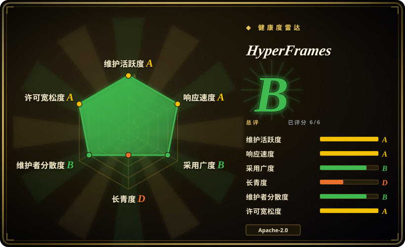

# HyperFrames

一个开源框架，把 HTML／CSS／媒体加可寻址动画确定性地渲染成 MP4 视频——headless Chrome 逐帧 seek、FFmpeg 编码——自带 CLI 和 20 个 agent skill，让 coding agent 端到端产出视频。

## 何时使用

你在搭一条自动化视频流水线——发版宣传短片、产品巡演、数据可视化动画、播客二剪——而现有的两个选项都不成立：人类剪辑师在 Premiere 里没法一周出 50 个变体；AI 视频模型（SeedDance／Sora 类）既保证不了字幕文字和你写的一致，也没法只改一条字幕而不整段重摇。你需要的是**代码形态**的视频：能在 diff 里 review、能在 CI 里复现、数据变了重渲染一遍就完事。

这时你选 HyperFrames，因为它赌的是：不管对人还是对 agent，写 HTML 都比写 React 组件或私有时间线格式更容易。一个 composition 就是一个带 `data-*` 时间属性的普通 `index.html`——没有构建步骤——用可寻址的 GSAP／CSS／Lottie／Three.js 时间线做动画；渲染器把 headless Chrome seek 到每一帧的时间戳，FFmpeg 编码，同一输入产出稳定一致的输出。相对最近对手的决定性取舍：Remotion 要求 React＋打包器项目、且采用 source-available 许可证，HyperFrames 是无框架 HTML 加 Apache-2.0，并随仓库带 20 个 skill（`/pr-to-video`、`/product-launch-video`、`/talking-head-recut`、`/media-use`……），把从需求简述到渲染出 MP4 的整条生产回路教给 coding agent，本地或 AWS Lambda 皆可。

## 何时不用

- **你需要写实或真人感的画面。** HyperFrames 渲染的是浏览器排版——文字版式、图表、UI 巡演、动效图形——不是神经网络像素。当**画面本身**必须靠幻觉生成时，请用视频生成模型（SeedDance、Sora、Runway，均未收录），因为再多 HTML 也变不出逼真的人或物理场景。
- **你只要一条一次性的、手工精修的电影感片子。** 请用 DaVinci Resolve 或 Premiere Pro（未收录）配人类剪辑师；代码优先的确定性流水线只有在视频被重复、参数化、反复重新生成时才回本——单条大片只会多一套工具链，省不了时间。
- **你的团队是 React 优先、且已经投入 Remotion 生态。** [Remotion](remotion.zh.md) 有更成熟的云渲染（Remotion Lambda）和更大的生态；HyperFrames 的 HTML 创作模型是它自己的赌注，且 Remotion composition 迁移过来是单向的。注意许可证反转：Remotion 是 source-available、超过收入阈值要付费，HyperFrames 是 Apache-2.0——要生态深度选 Remotion，要许可证自由和 agent 人体工学选 HyperFrames。
- **你想要整条生产管线被编排好——调研、脚本、素材生成、预算闸门。** HyperFrames 是渲染引擎加 agent skill，不是带治理的流水线；[OpenMontage](open-montage.zh.md) 把这类引擎嵌进端到端的 agent 驱动工作流，带审批闸门。
- **你的运行时装不下 Node 22+、FFmpeg 和 headless Chrome。** 轻量边缘／serverless HTTP 处理器放不下这个组合；如果只需要服务端纯拼接／滤镜、不要浏览器，直接驱动 FFmpeg 或用云渲染 API（未收录），因为 Chrome seek-render 这一步是整个设计的核心。

## 横向对比

| 替代品 | 是否收录 | 我们的评价 | 取舍 |
|---|---|---|---|
| [Remotion](remotion.zh.md) | ✅ | 如果你的团队本来就以 React 组件思考、且要最成熟的 Lambda 渲染，选 Remotion；如果你想要无构建步骤、agent 能可靠编辑的 HTML，以及没有收入阈值的 Apache-2.0 许可证，选 HyperFrames，因为 Remotion 的 source-available 许可证和打包器要求正是 HyperFrames 设计要去掉的两个成本。 | Remotion 给生态深度和被验证的云渲染；HyperFrames 给更简单的创作模型和许可证，但它是 pre-1.0，catalog 更年轻。 |
| [OpenMontage](open-montage.zh.md) | ✅ | 如果你要一条带治理的端到端管线（调研→脚本→素材→渲染、带审批闸门），选 OpenMontage；如果你已有 agent 工作流、只缺渲染引擎加生产技能，直接用 HyperFrames，因为 OpenMontage 是把这类引擎嵌入其中，而不是替代它们。 | OpenMontage 在引擎之上加编排与闸门；直接用 HyperFrames 保留完全控制，但管线纪律要自己扛。 |
| Motion Canvas | 未收录 | 如果你想要 TSX／Canvas 的编程动画工具、带可视化编辑器来手工打磨动效作品，选 Motion Canvas；如果产出量和 agent 创作比可视化编辑器更重要，选 HyperFrames，因为纯 HTML composition 正是 coding agent 本来就写得溜的东西。 | Motion Canvas 给专用编辑器和 canvas API；HyperFrames 给确定性、skill 体系和 Lambda 渲染，但没有可视化时间线编辑器（其 Studio 还在演进）。 |
| Runway／Pika（SaaS） | 未收录 | 如果你要零代码的生成式画面（人、场景、物理），选生成式 SaaS；如果每个像素都必须可控、可在 CI 里重渲染，选 HyperFrames，因为 prompt 摇出来的片段保证不了你的字幕文字，也扛不住一次数据修正——只能整段重生成。 | SaaS 生成即时且写实，但不可控、按次计费；HyperFrames 完全可控、渲染免费，但只产出图形动画风格的视频。 |

## 技术栈

- TypeScript monorepo（Bun workspace，运行时要求 Node.js >= 22）。
- 渲染：Puppeteer 驱动 headless Chrome 逐帧 seek 页面；`@hyperframes/engine` 负责采集，`@hyperframes/producer` 用 FFmpeg 编码并混音。
- 动画适配器：GSAP、CSS／WAAPI、Lottie、Three.js、Anime.js、TypeGPU——任何可寻址（seekable）的动画运行时。
- 分发：npm 上的 `hyperframes` CLI（init／preview／lint／render／publish）、`@hyperframes/aws-lambda` 分布式渲染、浏览器 Studio、`<hyperframes-player>` Web Component。
- 20 个已发布 agent skill 加 skills.sh 插件打包，覆盖 Claude Code、Cursor、Codex、Gemini CLI。

## 依赖

- Node.js 22+ 与 FFmpeg（硬性要求）；headless Chrome 由 Puppeteer 提供。
- 开发克隆需要 Git LFS（约 240 MB 黄金回归测试 MP4 基线）。
- 可选：AWS 账号（Lambda 渲染）；仅当 `/media-use` 需要生成 BGM／配音／配图时才需要媒体生成模型的 API key。
- 无数据库、无常驻服务器；CLI、预览服务器和 Studio 都是本地的。

## 运维难度

**低到中等。** 本地使用就是 `npx hyperframes init/preview/render`——环境上唯一的麻烦是保持 Node 22、FFmpeg 和 headless Chrome 在位（CI 里的 Chrome 和 Docker 是常见摩擦点）。确定性输出让回归测试很便宜。升到「中等」只在你部署 AWS Lambda 渲染栈时发生（那是你要自己拥有的分布式基础设施）。pre-1.0 版本（0.8.x）意味着 CLI／skill 表面在 minor 版本间可能变动。

## 健康度与可持续性

- **维护（2026-09）：** 极其活跃——2026-03 创建，最近推送 2026-09-15，约 4.3k commit，npm 以接近每周的节奏发版（v0.8.40 发布于 2026-09-14）。高频变动是双刃剑：改进快，表面也不稳。
- **治理／bus factor：** HeyGen 组织账号持有，且在 HeyGen 自家生产环境使用，约 30 个贡献者；路线图是单一厂商的——商业公司有真实动机保持引擎健康，但也有动机把它往自家托管服务（云渲染、Studio）引导。
- **年龄与 Lindy（2026-09）：** 约 6 个月大、50.3k stars——极端的年轻高热画像，按年龄的持续性未经验证。缓解信号是背书公司自家生产在用，加上有名 adopters（tldraw、TanStack）[未验证]；风险是热度跑在 pre-1.0 API 稳定性前面。
- **采用与生态：** 50.3k stars／4.6k forks、Discord、文档站、社区 playground、block catalog、ADOPTERS.md；经 skills.sh 分发触达多个 coding agent。
- **风险标记：** Apache-2.0，无改许可证历史、无按渲染收费；143 个 open issue／117 个 open PR 说明积压随关注度同步增长；厂商背书的开源永远存在未来转向 open-core 的风险 [推断]，目前被许可证选择所否证。

## 存疑（未验证）

- [未验证] star／fork 数（50.3k／4.6k，2026-09）、贡献者数（约 30）、commit 数（约 4.3k）均为 GitHub 时点数据，易波动。
- [未验证] 有名 adopters（tldraw、TanStack）来自仓库自己的 ADOPTERS.md，未独立核实其生产使用情况。
- [未验证] Remotion 许可证对比（「source-available、超收入阈值付费」）基于一般认知，做许可证决策前请核对当前条款。
- [未验证] 「跨机器字节级稳定输出」一说；项目宣称同输入同帧，但浏览器渲染在跨平台字体／GPU 差异下像素仍可能漂移 [推断]。
- [未验证] CLI／渲染全链路的 Windows 支持；要求只列了 Node 22＋FFmpeg，平台相关的渲染行为未实测。
- [推断] 「接近每周发版」是从 30 个 GitHub release 和 npm v0.8.40（首次发布 2026-03-23 后约 6 个月）推得的，非实测间隔。
- [推断] skill 生态质量（20 个 skill、路由器、工作流）仅依据 README 结构评估，未实际跑过一条完整视频生产流程。
