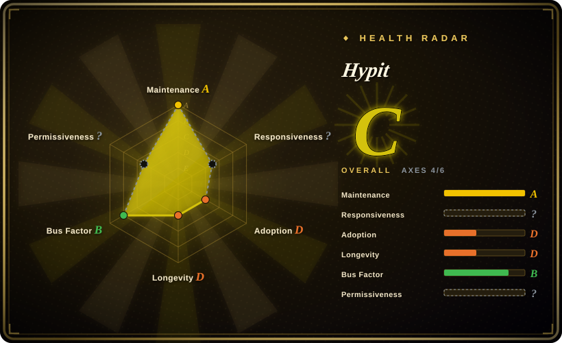

# Hypit

An agent-first video production system built around SVML, a video markup language anchored to words instead of seconds: a coding agent clones a viral video into an editable, re-runnable workflow (footage, captions, B-roll, effects) and ships batch variants by swapping the parts that change.

## When to use

You run paid-social or TikTok Shop content ops. You found a viral format that converts, and you need 50 variants this week — different hooks, products, hosts, languages — then fresh openings every two weeks as the ad fatigues. Hand-editing in CapCut doesn't scale, and raw generation models give you one-off clips you can't revise: change one caption and the whole roll is re-rolled.

You reach for Hypit because its unit of reuse is the *whole workflow*, not a script or a clip. Drop in the reference video and your agent (Claude Code / Codex, via the `/hypit` skill) decomposes it into SVML — captions anchored to word-level WhisperX alignment, A-roll/B-roll slots bound to pluggable generation providers (Seedance, GPT Image, MiniMax H3…), code-rendered boards and karaoke captions compiled locally through headless Chromium + FFmpeg. Cloning swaps only the changed slots and reuses the rest, so variant #50 costs generation fees only for its deltas (author-reported example runs: $1.07–$1.15 per finished video). The deciding tradeoff vs its closest substitutes: [MoneyPrinterTurbo](moneyprinter-turbo.md) generates *a* video from a topic but can't clone *that specific* viral structure; [HyperFrames](hyperframes.md)/[Remotion](remotion.md) give you a code-render engine but leave the whole generation-and-alignment pipeline to you; Hypit wires clone → generate → align → render into one agent-driven loop — at the cost of a non-OSI license and a very young codebase.

## When NOT to use

- **You need real product footage, real UI screencasts, or brand-strict corporate video.** Hypit's pipeline is optimized for AI-generated material (faces, scenes, B-roll). For real-footage brand work use a human editor with DaVinci Resolve / Premiere Pro (未收录), because generated footage can't stand in for the actual product.
- **You want one polished video, once.** The setup (coding agent + model API keys + local runtime) only pays off when a workflow is reused into variants. For a single video, CapCut / 剪映 (未收录) or a generation SaaS is cheaper in time and money.
- **Long-form content (YouTube deep dives, documentaries).** The design center is ~20-second vertical short-form — word-anchored karaoke captions, hook swaps, beat-synced cuts. For long-form narration pipelines use [OpenMontage](open-montage.md) or a human edit.
- **You're building a multi-tenant SaaS or redistributing it commercially.** The license forbids both without a paid commercial agreement, and the producer can change terms unilaterally. Build on an Apache-2.0 engine like [HyperFrames](hyperframes.md) instead and own the orchestration yourself.
- **You need deterministic, generation-free rendering in CI.** Hypit *can* compile code-rendered visuals without model calls, but if that's all you need, its SVML layer is extra indirection — drive [HyperFrames](hyperframes.md) or [Remotion](remotion.md) directly.
- **Compliance-sensitive use of real people's faces.** Cloning a real creator's viral video swaps faces/voices via generation models; most platforms impose AI-disclosure or likeness rules [推断] — check platform policy before shipping.

## Comparison

| Alternative | In index | Our verdict | Tradeoff |
|---|---|---|---|
| [MoneyPrinterTurbo](moneyprinter-turbo.md) | ✅ | When you need volume from *topics* (daily narrated stock-footage shorts, near-zero cost, WebUI for non-coders), pick MoneyPrinterTurbo; pick Hypit when you need to clone a *specific* viral structure and swap faces/words/B-roll across variants, because MPT's stock-footage slideshow style cannot reproduce a reference video's composition. | MPT is self-contained, MIT, and cheap but generic-looking; Hypit is structure-faithful and agent-editable but needs paid generation APIs and a coding agent. |
| [HyperFrames](hyperframes.md) | ✅ | When you only need deterministic HTML→MP4 rendering (captions, motion graphics, data-viz) with no generative footage, pick HyperFrames; pick Hypit when the video needs generated A-roll/B-roll and word-level alignment wired into the same workflow, because HyperFrames is the engine layer and leaves that pipeline to you. | HyperFrames is Apache-2.0 and CI-friendly; Hypit adds the generation/clone loop but brings a non-OSI license and vendor-hosted-service funnel. |
| [Remotion](remotion.md) | ✅ | When your team is React-first and wants a 6-year-proven programmatic-video framework with a mature Lambda renderer, pick Remotion; pick Hypit when the entry point is "clone this viral video" rather than "author components", because Remotion has no clone/alignment pipeline and its license charges companies >3 employees. | Remotion offers longevity and ecosystem depth; Hypit offers the clone-to-variants loop but is 7 weeks old at verification time. |
| [OpenMontage](open-montage.md) | ✅ | When you want a governed end-to-end pipeline (research → script → assets → render) with approval gates for explainer-style videos, pick OpenMontage; pick Hypit when the source of truth is an existing viral video to clone, not a topic to research, because OpenMontage composes from scratch while Hypit decomposes a reference. | OpenMontage gives gates and AGPL openness; Hypit gives structure cloning and batch variants under a restrictive license. |
| Runway / Pika / HeyGen (SaaS) | 未收录 | When you need one-off photoreal generation with zero code, pick a generation SaaS; pick Hypit when you need the *workflow* to be editable, re-runnable, and unwatermarked at scale, because SaaS outputs are one-shot renders with per-render pricing and no composition source. | SaaS is instant and polished per clip; Hypit is compounding — the workflow asset appreciates with each variant — but requires agent + API plumbing. |

## Tech stack

- TypeScript monorepo (Node.js ≥ 22.15, pnpm 10.33, ~130 workspace packages), distributed as a coding-agent skill (`npx skills add hypit-ai/hypit`) plus a `hypit` CLI; npm package `@hypit/hypit`.
- SVML: the project's video markup language; compositions anchor events to words, not timestamps. A compiler/elaborator chain turns SVML into renderable frames.
- Rendering: local "HyperFrames" renderer (in-house, browser-frame based — same name as, but no code relationship found to, HeyGen's [HyperFrames](hyperframes.md) [推断]) driving headless Chromium (README claims 64 concurrent processes) + FFmpeg composition.
- Local services (Python 3.10–3.13, uv): WhisperX word-level alignment, OpenCV image ops, yt-dlp reference-video download.
- Generation via a pluggable Model–Provider–Endpoint system: bundled providers for HypiHub (vendor's hosted service), TokenDance, HiAPI, Pollo, Monid; per-model packages for Seedance, Seedream, GPT Image, Nano Banana, Grok Imagine, MiniMax H3, Wan, Pixverse; TTS via ElevenLabs / FishAudio / Mimo. Self-deployed models connect through the same interface.

## Dependencies

- Hard: Node.js 22.15+, pnpm; FFmpeg; Chrome/Chromium (downloaded by `hypit runtime up`).
- For live builds: Python 3.10–3.13 + uv (WhisperX/OpenCV services); WhisperX alignment is the word-anchor backbone.
- A coding agent (Claude Code / Codex class) is the intended operator — the skill assumes an agent session, not a standalone GUI.
- Paid model API access for any generated footage (HypiHub, partner gateways, your own keys, or self-deployed models). Only code-rendered visuals skip this.
- No database or always-on server; SQLite-backed local store, filesystem workspace.

## Ops difficulty

**Medium.** The CLI itself is local-first (`hypit runtime up`, `hypit doctor`) with no server fleet to run — but the chain is long: coding agent + Node runtime + Python sidecar services + FFmpeg + Chromium + external API keys, and each link is a setup failure point. Pre-1.0 with an extreme release cadence (v0.2.2→v0.2.6 in two days, 2026-09) means CLI/skill surfaces shift under you; pin versions. GPU is not required but WhisperX on CPU slows the alignment step [推断]. Cost ops matter: batch variants spend real generation fees per run.

## Health & viability

- **Maintenance (2026-09):** extremely active — created 2026-07-29, ~1,361 commits in 7 weeks, v0.2.6 released 2026-09-18 with five releases in two days. The churn cuts both ways: fast improvement, unstable surfaces.
- **Governance / bus factor:** two contributors dominate (818 + 499 of ~1,360 commits, 2026-09) — effective bus factor ≈ 2 [推断]. Org-owned by Hypit.AI, a startup; roadmap steers toward its HypiHub hosted service and API-reseller partners.
- **Backing & Lindy:** ~7 weeks old with 9.6k stars / 1.2k forks — an extreme young-and-hyped profile; the Lindy prior is very low and the star count is a hype signal, not durability proof. No foundation backing; single-vendor monetization.
- **Adoption & ecosystem:** Trendshift #1 repo of the day; heavy growth marketing in README (launch-partner ads, free-avatar Google Drive link). Real production adoption beyond the vendor's own examples is unconfirmed.
- **Risk flags:** non-OSI license — no multi-tenant SaaS, no commercial redistribution, logo/copyright retention required, producer may change terms unilaterally; open-core-style funnel to HypiHub [推断]; outputs (your videos) are explicitly yours with no conditions, which is a genuine positive.

## Caveats (unverified)

- [未验证] Author-reported example costs ($1.07–$1.15 per finished video) and "64 headless Chromium processes" concurrency — not reproducible here without model accounts and a render run.
- [未验证] Whether self-deployed open-weight models (e.g. local Wan) work well through the provider path — docs say any inference service connects, but no bundled local-generation provider exists to confirm quality/cost.
- [未验证] Star/fork/commit/contributor counts (9.6k / 1.2k / ~1,361 / top-2 shares) are point-in-time GitHub figures (2026-09-18); volatile.
- [未验证] Platform policy exposure for face-swapped clones of real creators' videos (AI-disclosure, likeness rights) — varies by platform and jurisdiction; check before shipping.
- [推断] The in-house "HyperFrames" renderer shares its name with HeyGen's HyperFrames but the workspace package is private with no npm dependency on it and no code-search hits for HeyGen; treated as an unrelated in-house implementation.
- [推断] Bus factor ≈ 2 inferred from commit-share dominance; actual team size behind the org is unknown.
- [推断] "License may be tightened" risk inferred from the clause letting the producer adjust terms; no relicense has happened yet (project is 7 weeks old).
