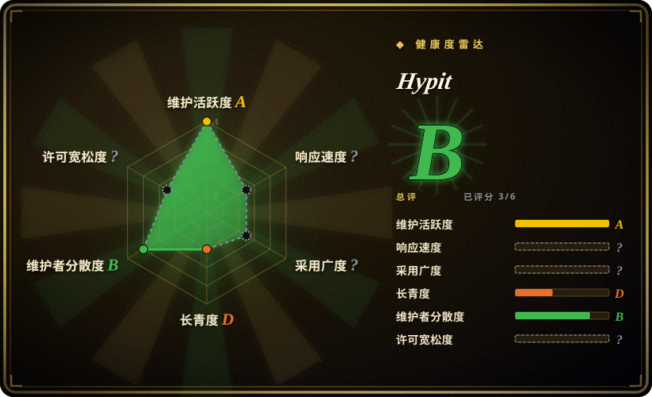

# Hypit

一个 agent 优先的视频制作系统，核心是 SVML——一门把事件锚定到「词」而非「秒」的视频标记语言：coding agent 把爆款视频克隆成可编辑、可重跑的完整 workflow（画面、字幕、B-roll、特效），只换变化的部分就能批量出变体。

## 何时使用

你在做付费投流或 TikTok Shop 的内容运营。你找到了一条能转化的爆款结构，这周要出 50 个变体——换 hook、换产品、换主持人、换语言——广告两周疲劳后还要再换开头重跑。在剪映里手剪撑不起这个量，而裸调生成模型只能得到不可修改的一次性成片：改一句字幕就得整段重摇。

这时你选 Hypit，因为它的复用单元是**整条 workflow**，不是脚本也不是单条片段。把参考视频丢进去，你的 agent（Claude Code / Codex，经 `/hypit` skill）把它分解成 SVML——字幕锚定在 WhisperX 词级对齐上，A-roll/B-roll 槽位绑定可插拔的生成 provider（Seedance、GPT Image、MiniMax H3 等），排行榜板、卡拉 OK 字幕等代码渲染元素经本地 headless Chromium + FFmpeg 编译成片。克隆只替换变化的槽位、复用其余部分，所以第 50 个变体只为增量付生成费（作者报告的示例成本：每条成片 $1.07–$1.15）。相对最近替代品的决定性取舍：[MoneyPrinterTurbo](moneyprinter-turbo.zh.md) 能从主题生成「一条」视频，但克隆不了「那一条特定爆款」的结构；[HyperFrames](hyperframes.zh.md)/[Remotion](remotion.zh.md) 给你代码渲染引擎，但整条生成与对齐管线要自己搭；Hypit 把克隆→生成→对齐→渲染接成一个 agent 驱动的闭环——代价是非 OSI 许可证和非常年轻的代码库。

## 何时不用

- **你需要真实产品镜头、真实 UI 录屏或品牌规范严格的企业视频。** Hypit 的管线是围绕 AI 生成素材（人脸、场景、B-roll）优化的。真实素材的品牌片请用人类剪辑师配 DaVinci Resolve / Premiere Pro（未收录），因为生成画面替代不了产品本身。
- **你只要一条精致视频，就一次。** 整套环境（coding agent + 模型 API key + 本地运行时）只有在 workflow 被复用成变体时才回本。单条视频用剪映 / CapCut（未收录）或生成类 SaaS，时间和钱都更省。
- **长视频（YouTube 深度内容、纪录片）。** 它的设计中心是 20 秒级竖屏短视频——词锚定卡拉 OK 字幕、hook 替换、卡点剪辑。长视频叙事管线请用 [OpenMontage](open-montage.zh.md) 或人工剪辑。
- **你要做多租户 SaaS 或商业再分发。** 许可证对两者都要求另行付费获得商业授权，且 producer 可单方面修改条款。请改用 Apache-2.0 引擎（如 [HyperFrames](hyperframes.zh.md)）自己搭编排层。
- **你需要 CI 里确定性、零生成模型的渲染。** Hypit 也能不调模型纯代码渲染，但如果只要这个，SVML 层就是多余的间接层——直接驱动 [HyperFrames](hyperframes.zh.md) 或 [Remotion](remotion.zh.md)。
- **涉及真人脸的合规敏感场景。** 克隆真人创作者的爆款意味着经生成模型换脸/换声；多数平台有 AI 披露或肖像权规则 [推断]——上线前先查平台政策。

## 横向对比

| 替代品 | 是否收录 | 我们的评价 | 取舍 |
|---|---|---|---|
| [MoneyPrinterTurbo](moneyprinter-turbo.zh.md) | ✅ | 如果你要的是从「主题」批量出片（每日口播素材流短视频、近零成本、非程序员可用 WebUI），选 MoneyPrinterTurbo；如果你要克隆「某一条特定爆款」的结构并跨变体换脸/换词/换 B-roll，选 Hypit，因为 MPT 的素材库幻灯片风格复现不了参考视频的构图。 | MPT 自包含、MIT、便宜，但画面同质化；Hypit 结构忠实、agent 可编辑，但要付费生成 API 和 coding agent。 |
| [HyperFrames](hyperframes.zh.md) | ✅ | 如果你只需要确定性 HTML→MP4 渲染（字幕、动效图形、数据可视化）、不要生成式画面，选 HyperFrames；如果视频需要生成的 A-roll/B-roll 和词级对齐接进同一条 workflow，选 Hypit，因为 HyperFrames 是引擎层，那段管线要你自己搭。 | HyperFrames 是 Apache-2.0、CI 友好；Hypit 多了生成/克隆闭环，但带来非 OSI 许可证和向厂商托管服务的导流。 |
| [Remotion](remotion.zh.md) | ✅ | 如果你的团队 React 优先、要一个 6 年验证的程序化视频框架加成熟 Lambda 渲染，选 Remotion；如果你的入口是「克隆这条爆款」而非「写组件」，选 Hypit，因为 Remotion 没有克隆/对齐管线，且其许可证对 3 人以上公司收费。 | Remotion 给长期验证和生态深度；Hypit 给克隆到变体的闭环，但验证时仅 7 周龄。 |
| [OpenMontage](open-montage.zh.md) | ✅ | 如果你要带审批闸门的端到端治理管线（调研→脚本→素材→渲染）做解说类视频，选 OpenMontage；如果你的事实源是一条待克隆的现成爆款而非待调研的主题，选 Hypit，因为 OpenMontage 从零合成，Hypit 分解参考片。 | OpenMontage 给闸门和 AGPL 开放性；Hypit 给结构克隆和批量变体，但许可证受限。 |
| Runway / Pika / HeyGen（SaaS） | 未收录 | 如果你要零代码的一次性写实生成，选生成类 SaaS；如果你要 workflow 本身可编辑、可重跑、规模化无水印，选 Hypit，因为 SaaS 产出是按次计价的一次性渲染，没有可改的合成源。 | SaaS 单条即得且精致；Hypit 是复利型——workflow 资产随变体增多而增值——但要 agent + API 管线。 |

## 技术栈

- TypeScript monorepo（Node.js ≥ 22.15、pnpm 10.33、约 130 个 workspace 包），以 coding-agent skill（`npx skills add hypit-ai/hypit`）加 `hypit` CLI 分发；npm 包名 `@hypit/hypit`。
- SVML：项目自有的视频标记语言，合成事件锚定到词而非时间戳；compiler/elaborator 链把 SVML 编译成可渲染帧。
- 渲染：本地「HyperFrames」渲染器（自研、基于浏览器帧——与 HeyGen 的 [HyperFrames](hyperframes.zh.md) 同名，但未发现代码关联 [推断]）驱动 headless Chromium（README 称 64 进程并发）+ FFmpeg 合成。
- 本地服务（Python 3.10–3.13、uv）：WhisperX 词级对齐、OpenCV 图像处理、yt-dlp 下载参考视频。
- 生成层走可插拔的 Model–Provider–Endpoint 体系：内置 HypiHub（厂商托管服务）、TokenDance、HiAPI、Pollo、Monid 的 provider；Seedance、Seedream、GPT Image、Nano Banana、Grok Imagine、MiniMax H3、Wan、Pixverse 各有独立模型包；TTS 走 ElevenLabs / FishAudio / Mimo。自部署模型经同一接口接入。

## 依赖

- 硬依赖：Node.js 22.15+、pnpm；FFmpeg；Chrome/Chromium（`hypit runtime up` 自动下载）。
- 实跑生成需要：Python 3.10–3.13 + uv（WhisperX/OpenCV 服务）；WhisperX 对齐是词锚定的骨架。
- 预期操作者是 coding agent（Claude Code / Codex 级）——skill 假设你在 agent 会话里，不是独立 GUI。
- 任何生成式画面都要付费模型 API（HypiHub、合作网关、自备 key 或自部署模型）；只有纯代码渲染可免。
- 无数据库、无常驻服务；本地 SQLite 存储 + 文件系统 workspace。

## 运维难度

**中等。** CLI 本身本地优先（`hypit runtime up`、`hypit doctor`），没有服务器集群要养——但链路很长：coding agent + Node 运行时 + Python 边车服务 + FFmpeg + Chromium + 外部 API key，每一环都是安装失败点。pre-1.0 且发版极快（2026-09 两天内 v0.2.2→v0.2.6），CLI/skill 接口会漂移，务必锁版本。不强制 GPU，但 CPU 跑 WhisperX 会拖慢对齐步骤 [推断]。成本运维要紧：批量变体每跑一次都是真金白银的生成费。

## 健康度与可持续性

- **维护（2026-09）：** 极度活跃——创建于 2026-07-29，7 周约 1,361 次 commit，v0.2.6 于 2026-09-18 发布，两天五个 release。高流转是双刃剑：迭代快，接口不稳。
- **治理 / bus factor：** 两名贡献者主导（约 1,360 次 commit 中占 818 + 499，2026-09）——有效 bus factor ≈ 2 [推断]。组织 hypit-ai（初创公司）持有，路线图向其 HypiHub 托管服务和 API 转售伙伴倾斜。
- **背书与 Lindy（2026-09）：** 约 7 周龄、9.6k stars / 1.2k forks——典型「年轻爆火」画像；Lindy 先验极低，star 数是热度信号而非耐久性证明。无基金会背书，单一厂商变现。
- **采用与生态：** Trendshift 日榜第一；README 营销味重（launch partner 广告、免费头像 Google Drive 链接）。厂商示例之外的真实生产采用未获确认。
- **风险信号：** 非 OSI 许可证——禁多租户 SaaS、禁商业再分发、须保留 LOGO/版权信息、producer 可单方面改条款；向 HypiHub 的 open-core 式导流 [推断]。正面一条：产出（你的视频）明确归你、无任何附加条件。

## 存疑（未验证）

- [未验证] 作者报告的示例成本（每条成片 $1.07–$1.15）与「64 个 headless Chromium 进程」并发——没有模型账号和实跑环境，无法在此复现。
- [未验证] 自部署开源权重模型（如本地 Wan）经 provider 路径的实际可用性——文档称任何推理服务可接入，但内置没有本地生成 provider，质量/成本无从确认。
- [未验证] star/fork/commit/贡献者数字（9.6k / 1.2k / 约 1,361 / 前二占比）为 GitHub 时点数据（2026-09-18），易变。
- [未验证] 换脸克隆真人创作者视频的平台政策风险（AI 披露、肖像权）——因平台和法域而异，上线前自查。
- [推断] 自研「HyperFrames」渲染器与 HeyGen 的 HyperFrames 同名，但其 workspace 包为 private、无对 hyperframes npm 包的依赖、代码搜索无 HeyGen 命中；按无关的自研实现处理。
- [推断] bus factor ≈ 2 由 commit 占比推断；组织背后实际团队规模未知。
- [推断] 「许可证可能收紧」由 producer 可调整条款的条文推断；尚未发生 relicense（项目仅 7 周龄）。
