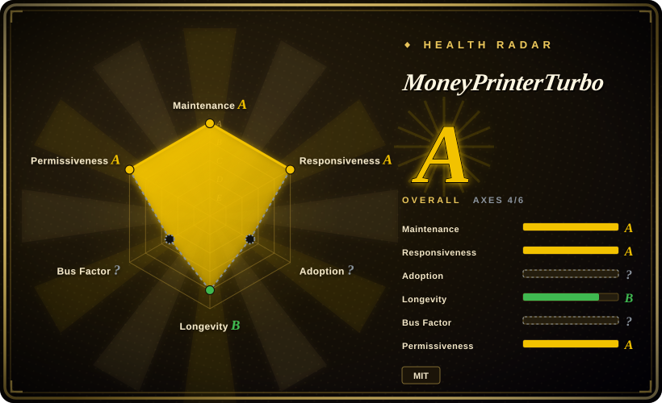

# MoneyPrinterTurbo

A one-stop AI short-video generator: give it a topic or keyword and it writes the script (LLM), matches stock footage (Pexels/Pixabay/Coverr or AI text-to-video), adds TTS narration, subtitles, and BGM, and composes an HD vertical short — served as a Streamlit WebUI plus a FastAPI HTTP API, MIT-licensed.

## When to use

You're a solo content operator or small matrix-account team that needs a daily stream of narrated short videos — knowledge explainers, top-10 lists, news commentary, quote compilations — and you have no editor, no agent pipeline, and near-zero budget per video. You want to type a topic into a web form and get a publishable 30–60 second short with voiceover and captions, and you want the option to run the whole thing self-hosted under MIT with free ingredients (Edge TTS needs no API key; Pexels/Pixabay stock is free).

You reach for MoneyPrinterTurbo because it is a *finished appliance*, not a framework: WebUI for humans, HTTP API for automation, every stage (script → footage → voice → subtitles → BGM → compose) overridable with your own content. The deciding tradeoff vs [Hypit](hypit.md): MPT generates *a* video from *a topic* in generic stock-footage-slideshow style — it cannot clone a specific viral video's structure, faces, or timing, and it has no word-anchored editable workflow; in exchange it costs minutes to set up, runs without a coding agent, and its marginal cost per video can be literally zero. If generic-but-cheap volume is the job, that trade is worth it.

## When NOT to use

- **You need to clone a specific viral video's structure and ship swap-variants.** MPT composes from stock footage around a script; it has no reference-video decomposition or word-level alignment. Use [Hypit](hypit.md), whose entire design is clone → swap slots → re-render.
- **You need deterministic, brand-exact motion graphics or data-driven visuals.** Stock-footage slideshows can't carry brand systems; use [Remotion](remotion.md) or [HyperFrames](hyperframes.md) and render your designs as code.
- **You want an agent-orchestrated pipeline with research and approval gates.** MPT is a fixed workflow with knobs, not a governed agent pipeline; use [OpenMontage](open-montage.md) or [anything2explainer](anything2explainer.md) when the process itself needs checkpoints and quality gates.
- **Real footage, real product, or a human on camera.** MPT's material layer is stock or generated; for real-footage brand work use a human editor with an NLE (DaVinci Resolve / Premiere Pro — 未收录).
- **You can't tolerate single-maintainer risk in a dependency.** The top contributor holds ~380 of ~923 commits (≈41%, 2026-09) and the next holds 36; if it stalls, there's no foundation or company behind it — pin versions and keep an exit plan [推断].

## Comparison

| Alternative | In index | Our verdict | Tradeoff |
|---|---|---|---|
| [Hypit](hypit.md) | ✅ | When you need volume from topics at near-zero marginal cost with a WebUI non-coders can drive, pick MoneyPrinterTurbo; when you need to clone a specific viral structure with generated hosts/faces and word-anchored variants, pick Hypit, because MPT's stock-slideshow output cannot reproduce a reference composition — and Hypit's agent + paid-API + restrictive-license overhead is real money MPT doesn't spend. | MPT: free ingredients, MIT, appliance-simple, generic output; Hypit: structure-faithful variants, but agent-driven, API-billed, 7 weeks old. |
| [OpenMontage](open-montage.md) | ✅ | When you want a governed agent pipeline (research → script → assets → render with approval gates) producing bespoke explainers, pick OpenMontage; pick MPT when the same narrated-short format repeated across many topics is the product, because MPT's fixed pipeline is faster and cheaper per video than an agent session. | OpenMontage: per-video craft and gates, agent cost each run; MPT: throughput and uniformity, no per-video judgment. |
| [anything2explainer](anything2explainer.md) | ✅ | When you want narrated motion-graphics explainers with a multi-agent QC pipeline (and accept its fixed black-canvas style and noncommercial license), pick anything2explainer; pick MPT when you need a self-hosted MIT appliance with a WebUI/API for high-volume narrated shorts, because MPT is deployable by non-programmers and commercially unrestricted. | anything2explainer: MG craft + quality gates, PolyForm noncommercial; MPT: MIT + UI + API, stock-footage look. |
| [Remotion](remotion.md) | ✅ | When videos must be data-driven, brand-exact, and rendered from React code at scale, pick Remotion; pick MPT when the content is topic-driven narration over stock footage and no engineer should be in the loop, because Remotion requires a React codebase per template while MPT requires a config file and API keys. | Remotion: engineering-grade control, code per template; MPT: zero-code throughput, no visual control beyond knobs. |
| CapCut / 剪映 (app/SaaS) | 未收录 | When a human wants to hand-edit one polished short with rich templates, CapCut is faster and prettier; pick MPT when the requirement is unattended batch generation via API on your own server, because CapCut has no self-hosted automation surface and its cloud features carry their own terms. | CapCut: manual craft, no API; MPT: automatable, self-hosted, plainer output. |

## Tech stack

- Python 3.11+; Streamlit WebUI + FastAPI/uvicorn HTTP API; moviepy 2.x for composition.
- LLM scripting via openai / litellm / google-genai / dashscope clients (any OpenAI-compatible endpoint, Kimi/DeepSeek-class models advertised); faster-whisper for subtitle timing.
- TTS: Edge TTS (free, keyless) plus Azure Speech, SiliconFlow, Gemini, MiMo, MiniMax, ElevenLabs, Chatterbox, Kokoro, Fish Audio, VoxCPM adapters.
- Material: local uploads, Pexels / Pixabay / Coverr stock APIs (free keys), and text-to-video integrations (MiniMax H3, WaveSpeed, MuAPI, 胜算云) added through sponsor partnerships.
- Optional Redis for task state; config via `config.toml` generated from `config.example.toml`; Docker deployment supported.

## Dependencies

- Python 3.11+, FFmpeg (moviepy), optional Docker; optional Redis.
- At least one LLM API key for scripting (or supply your own script); free paths exist for TTS (Edge TTS) and stock (Pexels/Pixabay keys are free-tier).
- No GPU required for the cloud-LLM/cloud-TTS/online-stock path — README states CPU/RAM matter more than GPU; local models would change that.
- No database server required in the default local setup.

## Ops difficulty

**Low.** `uv sync` + `python main.py` (or docker-compose) gets the WebUI up; first run auto-creates `config.toml`, and keys are entered in the WebUI. The ongoing burden is not infrastructure but *third-party churn*: the material/TTS/LLM integrations track sponsor-partner APIs that change terms and endpoints, and the README is now dominated by sponsor/affiliate ads — expect config drift and read the actual code before trusting a documented integration [推断]. Single-maintainer release cadence (~monthly, v1.3.7 on 2026-09-13) means fixes arrive slowly for a 124.5k-star project.

## Health & viability

- **Maintenance (2026-09):** active — created 2024-03, pushed within days of verification, v1.3.7 released 2026-09-13, roughly monthly releases through 2026.
- **Governance / bus factor:** personally owned (harry0703, "Harry", no company listed); top contributor holds ~380 of ~923 commits (≈41%), next contributor 36 (≈4%) — effective bus factor ≈ 1 [推断]. No foundation or corporate backing.
- **Backing & Lindy:** ~2.5 years old and still active — it survived the 2024 AI-short-video hype wave and kept shipping, a moderate-positive Lindy signal; 124.5k stars / 19.3k forks make it one of the most-starred Chinese AI tools.
- **Adoption & ecosystem:** massive fork count suggests wide self-hosting; monetization is sponsor/affiliate ads in the README (Kimi, 火山引擎, API resellers) — sustainable for a solo maintainer but it bends the integration roadmap toward sponsors [推断].
- **Risk flags:** MIT license is clean; only 29 open issues for its size suggests aggressive triage or user attrition to forks [推断]; stock-footage output style has a low quality ceiling that platform dedup/quality systems may penalize at scale [推断].

## Caveats (unverified)

- [未验证] Star/fork/commit/contributor counts (124.5k / 19.3k / ~923 commits / top-1 ≈41%) are point-in-time GitHub figures (2026-09-18); the contributors endpoint caps at 30 entries, so commit-share math is approximate.
- [未验证] "Marginal cost per video can be zero" assumes free-tier Edge TTS + Pexels/Pixabay keys + a self-hosted or already-paid LLM; rate limits and quota changes were not tested.
- [未验证] Whether platform dedup systems flag stock-footage slideshow videos at volume — asserted nowhere by the project; a common operator concern that needs field data.
- [推断] "Integration roadmap bends toward sponsors" inferred from README sponsorship density and sponsor-branded text-to-video integrations; maintainer intent unknown.
- [推断] Release cadence "roughly monthly" inferred from v1.3.5→v1.3.7 dates (2026-08-22 → 2026-09-13); a short sample.
- [未验证] Quality/consistency of the newer text-to-video material paths (MiniMax H3, WaveSpeed, MuAPI) — feature-list claims, not exercised here.
