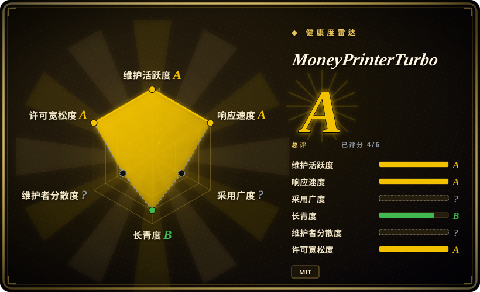

# MoneyPrinterTurbo

一站式 AI 短视频生成器：给一个主题或关键词，它自动写脚本（LLM）、匹配素材（Pexels/Pixabay/Coverr 库存或 AI 文生视频）、加 TTS 配音、字幕和背景音乐，合成高清竖屏短视频——以 Streamlit WebUI 加 FastAPI HTTP API 形态交付，MIT 许可证。

## 何时使用

你是个人内容运营者或小型矩阵号团队，每天需要一批口播短视频——知识科普、十大盘点、新闻点评、语录合集——没有剪辑师、没有 agent 管线、单条预算趋近于零。你想在网页表单里敲一个主题，就得到一条可发布的 30–60 秒带配音带字幕的短片，并且希望整套东西能自托管在 MIT 之下、用免费原料跑（Edge TTS 不需要 API key；Pexels/Pixabay 库存素材免费）。

这时你选 MoneyPrinterTurbo，因为它是一台**成品家电**而非框架：人用 WebUI，自动化用 HTTP API，每个环节（脚本→素材→配音→字幕→配乐→合成）都可以用你自己的内容覆盖。相对 [Hypit](hypit.zh.md) 的决定性取舍：MPT 从「主题」生成「一条」通用的库存素材幻灯片风格视频——它克隆不了某条特定爆款的结构、人脸或节奏，也没有词锚定的可编辑 workflow；作为交换，它几分钟就能装好、不需要 coding agent，单条视频的边际成本可以是字面意义的零。如果「通用但便宜的量」就是需求，这个交换划算。

## 何时不用

- **你要克隆某条特定爆款的结构并批量出替换变体。** MPT 围绕脚本用库存素材合成，没有参考视频分解和词级对齐。用 [Hypit](hypit.zh.md)，它的整个设计就是克隆→换槽位→重渲染。
- **你需要确定性的、品牌精确的动效图形或数据驱动画面。** 库存素材幻灯片承载不了品牌体系；用 [Remotion](remotion.zh.md) 或 [HyperFrames](hyperframes.zh.md)，把你的设计当代码渲染。
- **你想要带调研和审批闸门的 agent 编排管线。** MPT 是带旋钮的固定工作流，不是带治理的 agent 管线；流程本身需要检查点和质量门时用 [OpenMontage](open-montage.zh.md) 或 [anything2explainer](anything2explainer.zh.md)。
- **真实素材、真实产品或真人出镜。** MPT 的素材层是库存或生成的；真实素材的品牌片请用人类剪辑师配 NLE（DaVinci Resolve / Premiere Pro，未收录）。
- **你无法容忍依赖里的单维护者风险。** 一名贡献者占约 923 次 commit 中的 380（≈41%，2026-09），第二名占 36；如果项目停摆，背后没有基金会或公司——锁版本并留退出方案 [推断]。

## 横向对比

| 替代品 | 是否收录 | 我们的评价 | 取舍 |
|---|---|---|---|
| [Hypit](hypit.zh.md) | ✅ | 如果你要从主题近零边际成本地出量、且 WebUI 要让非程序员能开，选 MoneyPrinterTurbo；如果你要克隆特定爆款结构、用生成的主持人/人脸出词锚定变体，选 Hypit，因为 MPT 的库存幻灯片产出复现不了参考构图——而 Hypit 的 agent + 付费 API + 受限许可证开销是 MPT 不花的真钱。 | MPT：免费原料、MIT、家电级简单、画面通用；Hypit：结构忠实的变体，但 agent 驱动、按 API 计费、仅 7 周龄。 |
| [OpenMontage](open-montage.zh.md) | ✅ | 如果你要带治理的 agent 管线（调研→脚本→素材→渲染加审批闸门）产出定制解说片，选 OpenMontage；如果「同一种口播短片格式跨大量主题重复」本身就是产品，选 MPT，因为固定管线单条比一次 agent 会话更快更便宜。 | OpenMontage：单条精工加闸门，每跑一次都有 agent 成本；MPT：吞吐与均一，无单条判断。 |
| [anything2explainer](anything2explainer.zh.md) | ✅ | 如果你要多 agent QC 管线产出的口播 MG 讲解片（并接受固定黑底风格与非商用许可证），选 anything2explainer；如果你要可自托管、带 WebUI/API、可商用的 MIT 家电做大量口播短片，选 MPT，因为 MPT 非程序员可部署且无商用限制。 | anything2explainer：MG 工艺 + 质量门，PolyForm 非商用；MPT：MIT + UI + API，库存素材观感。 |
| [Remotion](remotion.zh.md) | ✅ | 如果视频必须数据驱动、品牌精确、由 React 代码规模化渲染，选 Remotion；如果内容是主题驱动的口播配库存素材、且不应有工程师在环，选 MPT，因为 Remotion 每个模板都要一个 React 代码库，MPT 只要一个配置文件加 API key。 | Remotion：工程级控制，模板即代码；MPT：零代码吞吐，旋钮之外无视觉控制。 |
| CapCut / 剪映（app/SaaS） | 未收录 | 如果人想手剪一条精致的模板化短片，剪映更快更好看；如果需求是在自己服务器上无人值守地经 API 批量生成，选 MPT，因为剪映没有自托管自动化接口，其云端功能另有条款。 | 剪映：手工技艺、无 API；MPT：可自动化、可自托管、观感更朴素。 |

## 技术栈

- Python 3.11+；Streamlit WebUI + FastAPI/uvicorn HTTP API；moviepy 2.x 合成。
- LLM 脚本经 openai / litellm / google-genai / dashscope 客户端（任何 OpenAI 兼容端点，宣传 Kimi/DeepSeek 级模型）；faster-whisper 做字幕 timing。
- TTS：Edge TTS（免费、无 key）外加 Azure Speech、SiliconFlow、Gemini、MiMo、MiniMax、ElevenLabs、Chatterbox、Kokoro、Fish Audio、VoxCPM 适配器。
- 素材：本地上传、Pexels / Pixabay / Coverr 库存 API（免费 key）、以及经赞助合作加入的文生视频集成（MiniMax H3、WaveSpeed、MuAPI、胜算云）。
- 可选 Redis 存任务状态；配置走 `config.example.toml` 自动生成的 `config.toml`；支持 Docker 部署。

## 依赖

- Python 3.11+、FFmpeg（moviepy）、可选 Docker；可选 Redis。
- 至少一个 LLM API key 用于写脚本（或自带脚本）；TTS 和库存素材有免费路径（Edge TTS；Pexels/Pixabay key 为免费档）。
- 云端 LLM/云 TTS/在线素材路径不需要 GPU——README 明言 CPU 与内存比 GPU 重要；跑本地模型则另当别论。
- 默认本地部署不需要数据库服务。

## 运维难度

**低。** `uv sync` + `python main.py`（或 docker-compose）即可拉起 WebUI；首次运行自动创建 `config.toml`，key 在 WebUI 里填。持续的负担不在基础设施而在**第三方流转**：素材/TTS/LLM 集成跟着赞助合作方的 API 走，条款和端点会变，且 README 现已被赞助/联盟广告占据——预期配置漂移，信任某个文档化集成前先读实际代码 [推断]。单维护者的发版节奏（约每月，v1.3.7 于 2026-09-13）对一个 124.5k star 的项目意味着修复来得慢。

## 健康度与可持续性

- **维护（2026-09）：** 活跃——创建于 2024-03，验证日前数天内仍有 push，v1.3.7 发布于 2026-09-13，2026 年约每月一版。
- **治理 / bus factor：** 个人持有（harry0703，「Harry」，未挂公司）；头号贡献者占约 923 次 commit 中的 380（≈41%），第二名 36（≈4%）——有效 bus factor ≈ 1 [推断]。无基金会或公司背书。
- **背书与 Lindy：** 约 2.5 年龄且仍活跃——挺过了 2024 年 AI 短视频热度潮并持续发版，Lindy 信号中等偏正；124.5k stars / 19.3k forks，是 star 数最高的中文 AI 工具之一。
- **采用与生态：** 巨大 fork 数说明自托管广泛；变现靠 README 里的赞助/联盟广告（Kimi、火山引擎、API 转售商）——对单维护者可持续，但会把集成路线图向赞助方弯曲 [推断]。
- **风险信号：** MIT 许可证干净；以体量而言仅 29 个 open issue，可能是强分诊、也可能是用户流失去 fork [推断]；库存素材风格的质量天花板低，规模化后可能被平台查重/质量系统降权 [推断]。

## 存疑（未验证）

- [未验证] star/fork/commit/贡献者数字（124.5k / 19.3k / 约 923 / 头号 ≈41%）为 GitHub 时点数据（2026-09-18）；contributors 端点上限 30 条，commit 占比为近似值。
- [未验证] 「单条边际成本可为零」假设免费档 Edge TTS + Pexels/Pixabay key + 自托管或已付费的 LLM；限流与配额变化未实测。
- [未验证] 平台查重系统是否会规模化标记库存素材幻灯片视频——项目方无此断言；这是运营者常见担忧，需要实盘数据。
- [推断] 「集成路线图向赞助方弯曲」由 README 赞助密度和赞助品牌文生视频集成推断；维护者意图未知。
- [推断] 「约每月一版」由 v1.3.5→v1.3.7 的日期（2026-08-22 → 2026-09-13）推断，样本很短。
- [未验证] 较新的文生视频素材路径（MiniMax H3、WaveSpeed、MuAPI）的质量/稳定性——功能清单声明，未在此实测。
