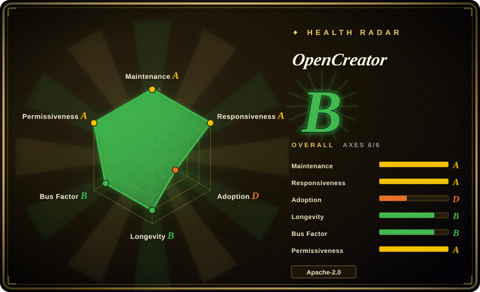
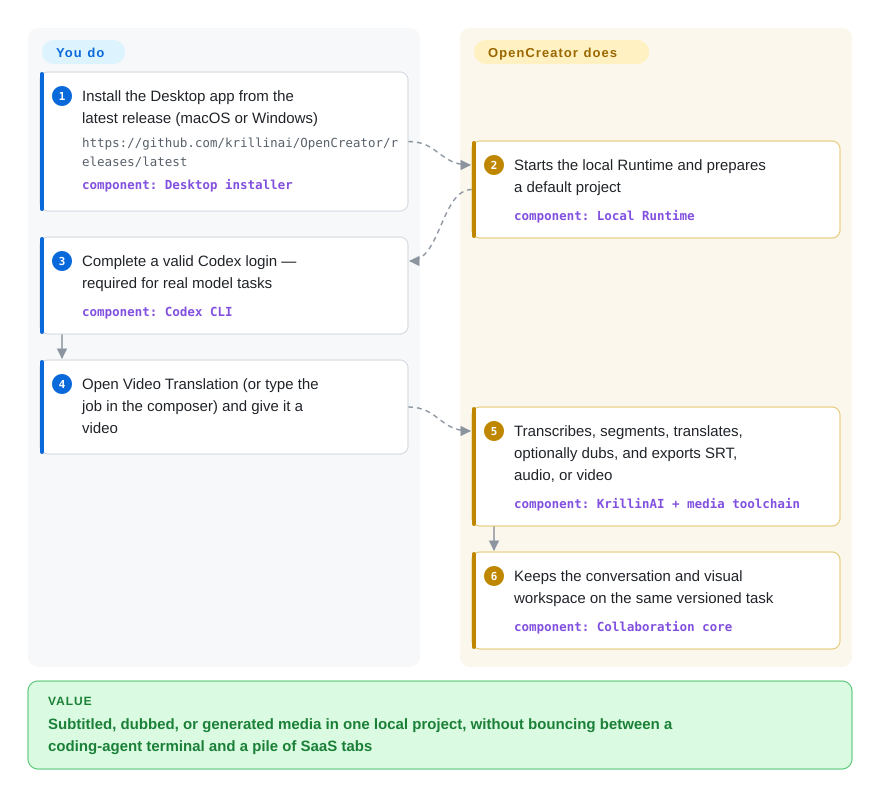

# OpenCreator

You have a finished video to subtitle, dub, or recut for another platform, plus a script and a thumbnail to ship in the same sitting — and today that means bouncing between a coding-agent terminal, a caption SaaS, and a generation tab. OpenCreator is a local desktop/web workspace that wraps Codex as the agent loop and the bundled KrillinAI CLI as the media pipeline, so translation, voice, generation, and files stay in one project.

## When to use

You run a bilingual channel or a localization desk. The recurring job is not "invent a film from a topic" — it is "this 46-minute talk needs Chinese/English subtitles that don't overlap, a dubbed track, and a portrait recut for Shorts," and tomorrow it is a Xiaohongshu post and a Seedance clip from the same brief. CapCut (not a repo) will do one polished cut by hand; a generation SaaS will give you a one-off clip you cannot re-run as a local project; [MoneyPrinterTurbo](moneyprinter-turbo.md) will mint a generic stock-footage short from a keyword and stop there.

You reach for OpenCreator because it is a *local creator appliance with an agent in the same window*: ten visual tools (video translation, downloader, thumbnails, image/video generation, article/Xiaohongshu/short-script writers, stick-figure animation, Smart Dubbing) share a Fastify Runtime, SQLite project store, and versioned revisions, while Codex CLI owns the agent loop, Skills, and MCP. The deciding tradeoff against [OpenMontage](open-montage.md) is surface, not slogans: OpenMontage is a coding-assistant pipeline that researches and renders a film from a prompt; OpenCreator is a desktop you sit in, whose strongest shipped path is still the KrillinAI translation/dubbing/portrait pipeline, with generation and writing tools bolted on. Against [Codex](../agent-frameworks/coding-agents/terminal-agents/codex.md) itself: Codex is the engine you already need; OpenCreator is the creator UI, media toolchain, and project memory around it.

## How it works

You do not run a second agent loop. The Desktop installer (or `pnpm web:dev` for the browser) starts a loopback Fastify daemon; the daemon owns projects, Runs, approvals, schedules, and SQLite under `.runtime/`, then talks to Codex CLI as the execution source of truth for reasoning, tool calls, Skills, and MCP. Creator tools are visual forms on the same state machine as the conversation — import a video, pick transcribe/translate/dub/export, and both the workspace and the chat show the same step, progress, and version. Media work is delegated: [yt-dlp](../media-download/yt-dlp.md) for public links, Whisper-family ASR (cloud or local faster-whisper / WhisperKit / whisper.cpp), LLM segmentation and translation, TTS/dubbing, [FFmpeg](../media-processing/video-audio/ffmpeg.md) for composition. Image/video generation is not local inference — it calls whatever you configured under Settings → AI Services (README examples: GPT Image, Seedance, Kling, Veo). Your side of the line is: install, Codex login, credentials, and the brief. Its side is: keep the project, drive Codex, run KrillinAI, and not overwrite yesterday's export when you regenerate.

<!-- flow-steps:begin (generated from flows/open-creator.json by tools/flow_card.py — do not edit) -->

Text version of the flow

1. **You**: Install the Desktop app from the latest release (macOS or Windows) — `https://github.com/krillinai/OpenCreator/releases/latest` — component: `Desktop installer`
2. **OpenCreator**: Starts the local Runtime and prepares a default project — component: `Local Runtime`
3. **You**: Complete a valid Codex login — required for real model tasks — component: `Codex CLI`
4. **You**: Open Video Translation (or type the job in the composer) and give it a video
5. **OpenCreator**: Transcribes, segments, translates, optionally dubs, and exports SRT, audio, or video — component: `KrillinAI + media toolchain`
6. **OpenCreator**: Keeps the conversation and visual workspace on the same versioned task — component: `Collaboration core`

**Value**: Subtitled, dubbed, or generated media in one local project, without bouncing between a coding-agent terminal and a pile of SaaS tabs

<!-- flow-steps:end -->

## When NOT to use

- **You refuse a Codex login, or you want Claude Code / OpenCode as the agent.** Real model tasks require a valid Codex CLI login; the Desktop package *includes* Codex CLI but does not replace it. Use [Codex](../agent-frameworks/coding-agents/terminal-agents/codex.md) in a terminal, or a Claude-hosted skill such as [anything2explainer](anything2explainer.md) / [video-shotcraft](video-shotcraft.md), because swapping the engine here means rewriting the session layer.
- **You need Linux Desktop.** v3.2.2 ships `OpenCreator-*-mac-*.dmg` and `OpenCreator-*-win-x64.exe` only; Linux assets are KrillinAI CLI/Server tarballs, not an Electron installer. Run from source (`pnpm web:dev`) or pick a CLI appliance like [MoneyPrinterTurbo](moneyprinter-turbo.md).
- **You need to clone a specific viral video into word-anchored variants.** OpenCreator localizes and generates; it does not decompose a reference into swap slots. Use [Hypit](hypit.md).
- **You need a governed research → script → QC film pipeline inside a coding assistant.** Use [OpenMontage](open-montage.md) or [anything2explainer](anything2explainer.md). Auto Clips and Digital Avatar are marked "In development" in the README tool table.
- **You need a timeline NLE — masks, keyframes, a human on the cut.** Use [Concat](../media-processing/video-editing/concat.md) or DaVinci Resolve / Premiere Pro (not a repo). OpenCreator exports files; it is not a frame-accurate editor.
- **You need topic → stock-footage shorts at near-zero cost with no agent.** Use [MoneyPrinterTurbo](moneyprinter-turbo.md) (Edge TTS, no Codex).
- **You cannot take a GPL-3.0 media core next to an Apache-2.0 shell.** Root `LICENSE` is Apache-2.0; `runtime/krillinai/LICENSE` is GNU GPL v3. If that mix is a hard no for redistribution, drive [FFmpeg](../media-processing/video-audio/ffmpeg.md) + [yt-dlp](../media-download/yt-dlp.md) yourself, or stay on MIT [MoneyPrinterTurbo](moneyprinter-turbo.md).
- **You need a multi-user team platform with RBAC.** The daemon binds `127.0.0.1` and stores one local SQLite. Use a chat platform such as [Open WebUI](../llm-chat-ui/open-webui.md), not this.

## Comparison

| Alternative | In index | Our verdict | Tradeoff |
|---|---|---|---|
| [MoneyPrinterTurbo](moneyprinter-turbo.md) | ✅ | When the product is unattended topic → narrated stock-footage shorts with a WebUI/API and no coding agent, pick MoneyPrinterTurbo; pick OpenCreator when the job is localizing *this* video (subtitles, dubbing, portrait recut) plus mixed writing/generation in one desktop, because MPT has no translation pipeline and OpenCreator has no zero-key stock-slideshow path. | MPT: MIT, cheap, generic, no Codex; OpenCreator: Codex-gated, stronger on localization, mixed GPL core. |
| [OpenMontage](open-montage.md) | ✅ | When a coding assistant should research, script, generate assets, and render a film with gates, pick OpenMontage; pick OpenCreator when a human sits in a visual workspace and the agent is a copilot on the same task, because OpenMontage has no desktop appliance and OpenCreator's shipped strength is translation/dubbing rather than from-scratch explainers. | OpenMontage: AGPL pipeline in the agent; OpenCreator: Apache-2.0 app wrapping Codex + GPL KrillinAI. |
| [Hypit](hypit.md) | ✅ | When you must clone one viral structure and ship face/word/B-roll variants, pick Hypit; pick OpenCreator when the source is a talk or show to subtitle and dub, because Hypit has no localization workspace and OpenCreator has no SVML clone loop. | Hypit: non-OSI, agent-first, paid generation; OpenCreator: Apache-2.0 desktop, Codex-mandatory, localization-first. |
| [Codex](../agent-frameworks/coding-agents/terminal-agents/codex.md) | ✅ | When you want a terminal coding agent and will wire media tools yourself, pick Codex; pick OpenCreator when you want the creator forms, KrillinAI pipeline, versioned workspace, and Electron host already around that loop, because OpenCreator does not replace Codex — it requires it. | Codex: engine, no creator UI; OpenCreator: UI + media toolchain + a Codex login as a hard dependency. |
| [Concat](../media-processing/video-editing/concat.md) | ✅ | When you need an offline native timeline you (or a script) cut by hand, pick Concat; pick OpenCreator when the work is AI translation/generation rather than frame-level editing, because Concat is an NLE and OpenCreator is not. | Concat: AGPL beta editor, no Codex; OpenCreator: creator workspace, no timeline. |

## Tech stack

- TypeScript pnpm monorepo (`opencreator-agent`, pnpm 9.15.0, Node 22+): `apps/web` (React 18, Vite, React Router), `apps/daemon` (Fastify, better-sqlite3, SSE Runtime API), `apps/desktop` (Electron, electron-builder, electron-updater), `apps/harness`.
- Shared packages: `@opencreator/protocol`, `@opencreator/skill-market`, `@opencreator/writing-templates`, `@opencreator/config`; stick-figure path uses `@opencreator/stickman-remotion` and the daemon depends on `@remotion/renderer`.
- Bundled Go media core: `runtime/krillinai` (`module krillin-ai`, Go 1.22, Gin, go-openai) shipped as KrillinAI CLI/Server archives beside the Desktop build.
- Agent engine: Codex CLI / app-server (Desktop bundles a platform Codex runtime under `resources/codex-runtime/`); MCP via `@modelcontextprotocol/sdk`.
- Media: yt-dlp (managed nightly, user-triggered updates), FFmpeg/ffprobe, Whisper / faster-whisper / WhisperKit / whisper.cpp; generation providers configured in Settings, not vendored models.

## Dependencies

- **Desktop path:** macOS Apple Silicon / Intel or Windows x64 installer from GitHub Releases; a valid Codex login for real model tasks. No Node/pnpm required for that path. Linux has no Desktop installer in v3.2.2.
- **Source / Web path:** Node.js 22+, pnpm 9.15.0 (`packageManager` pin), a `codex` executable on PATH, Codex login.
- **Media:** FFmpeg; yt-dlp (bundled/managed); optional local Whisper stacks; API keys for image/video/voice providers you actually use (Edge TTS is listed as keyless).
- **Data:** local SQLite + files under `.runtime/` (or `OPENCREATOR_DATA_DIR`); Codex sessions stay in `$CODEX_HOME` and must be backed up separately.
- **Not required:** a database server, GPU, or public inbound port — the daemon listens on `127.0.0.1` only.

## Ops difficulty

**Medium.** The happy path is "download the dmg/exe, log into Codex, paste keys in Settings." The burden is the *chain*: Codex account + media binaries + per-provider credentials + a ~580–650 MB Electron package, and Desktop packaging is a separate, hash-gated release path. Source development adds the pnpm workspace, Go KrillinAI build (`pnpm krillinai:build`), and Playwright e2e. Schedules own persistent conversations; rotating Codex threads is an operator concern (`OPENCREATOR_CODEX_THREAD_ROTATION_RUN_THRESHOLD`). There is no multi-tenant deploy story — this is a single-machine workspace, not a service you put behind nginx.

## Health & viability

Radar **A (5/6)** on 2026-09-22 (`adoption` is `?` / `no_package_structural` — apps with no canonical package leave that axis out). Do not read the green `risk_license` A as clearance for the nested GPL core; the scorer grades the root SPDX only.

- **Maintenance (A):** last commit 1 day, 8 active weeks in 13. Created 2024-12-17, default branch `master` at `a153ac073e6d` (2026-09-21), `pushed_at` 2026-09-22, latest tag **v3.2.2** (2026-09-21) after v3.2.1 / v3.2.0 the same month. Rename from KrillinAI landed at v3.0.0 (2026-09-05).
- **Governance (B):** 12 active maintainers in 12 months, top-1 share 0.32 / top-3 0.77 (scorer window). Personal GitHub user `krillinai`, not an organization. README names a four-person "Crew". Not a foundation.
- **Longevity (B):** 645 days old and still committing — a moderate-positive Lindy prior versus 2026 video-skill repos measured in weeks. 12,193 stars / 1,242 forks / 59 watchers (2026-09-22).
- **Adoption (`?`):** no npm/PyPI package to score; bilingual (10-locale) docs, Discord + QQ, Trendshift badge. Desktop v3.2.2 Windows exe had 534 GitHub asset downloads at verification; macOS arm64 dmg 86 — not unique installs.
- **Risk flags:** nested **GPL-3.0** under `runtime/krillinai/` while the repo advertises Apache-2.0 (open issue #326 asks for MIT/Apache; the Apache file already exists at root); hard Codex coupling; no Linux Desktop; Auto Clips / Digital Avatar unfinished.

## Caveats (unverified)

- [未验证] No Desktop, Web, or KrillinAI pipeline was executed here — translation quality, Seedance/Kling/Veo output, stick-figure renders, and "46-minute subtitle alignment in one run" are README/author-reported examples (some still branded KrillinAI).
- [未验证] Star/fork/watcher figures (12,193 / 1,242 / 59) are point-in-time GitHub API reads on 2026-09-22. The contributors-list top-1 of 304/770 is a different window from the health scorer's 12-month `top1_share` 0.32.
- [未验证] v3.2.2 GitHub `download_count` on release assets is not unique-install telemetry.
- [未验证] Whether distributing the Desktop binary's KrillinAI pieces creates GPL obligations for a downstream vendor — the nested `LICENSE` is GPL-3.0; this page does not give legal advice.
- [未验证] Codex-login requirement for "real model tasks" is README wording; which creator tools degrade how far without Codex was not mapped.
- [推断] Bus-factor and "Crew" mapping inferred from the contributors API plus the README table; employment/company backing behind the personal `krillinai` account is unknown.
- [推断] Star-to-watcher ratio (12.2k / 59) read as ranking-driven exposure rather than deep operator adoption; GitHub does not expose the acquisition channel.
- [未验证] Remotion's eligibility-gated licence exposure for stick-figure output — daemon depends on `@remotion/renderer` and `packages/stickman-remotion` exists; whether shipped animations are Remotion compositions the way [video-shotcraft](video-shotcraft.md) are was not traced through a render.
- [未验证] Local Whisper stacks (faster-whisper / WhisperKit / whisper.cpp) "where available" — platform matrix not verified.
- [推断] The health radar `risk_license` A scores the root `LICENSE` (Apache-2.0) only; it does not model `runtime/krillinai/LICENSE` (GPL-3.0).
