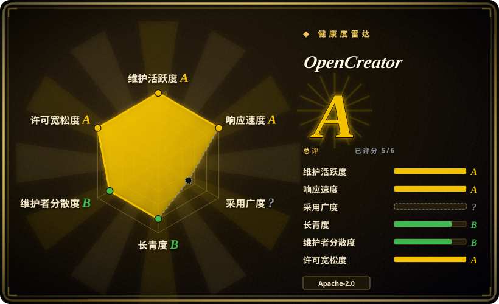
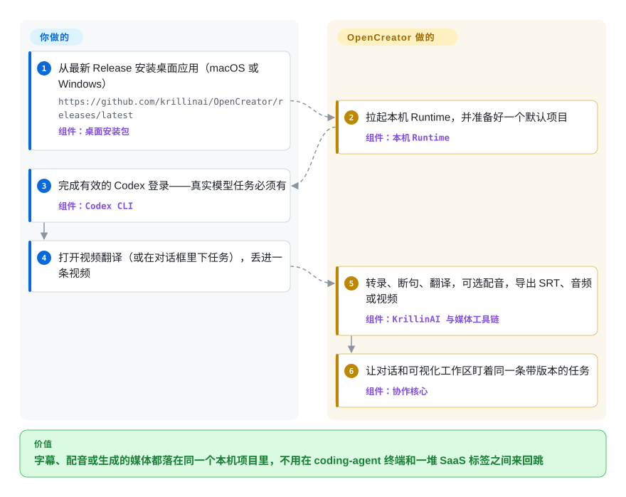

# OpenCreator

成品视频要配字幕、配音、再切一版竖屏，同一天还要写口播稿和封面——今天这件事通常是 coding-agent 终端、字幕 SaaS、生成页三个标签来回跳。OpenCreator 是本机桌面／网页工作区：用 Codex 当 agent 循环，用自带的 KrillinAI CLI 当媒体管线，翻译、配音、生成和文件都落在同一个项目里。

## 何时使用

你在做双语频道或本地化台。反复出现的活不是“从一个主题发明一支片子”——而是“这堂 46 分钟的演讲要中英字幕且不能叠字、要一条配音轨、还要切一版竖屏进 Shorts”，明天同一份素材还要出小红书文案和一条 Seedance 片子。CapCut（非仓库）能手搓一条精修；生成式 SaaS 给你一条无法当作本机项目再跑一遍的一次性成片；[MoneyPrinterTurbo](moneyprinter-turbo.zh.md) 能从关键词吐一条库存素材口播短视频，然后就停了。

选 OpenCreator，是因为它是*本机创作者家电，agent 就在同一扇窗口里*：十个可视化工具（视频翻译、下载、封面、图／视频生成、文章／小红书／短视频脚本、火柴人动画、智能配音）共用 Fastify Runtime、SQLite 项目库和带版本的修订；Codex CLI 负责 agent 循环、Skills 和 MCP。相对 [OpenMontage](open-montage.zh.md) 的取舍在界面，不在口号：OpenMontage 是 coding assistant 里从提示词研究并渲染成片的管线；OpenCreator 是你坐进去的桌面，目前最硬的已交付路径仍是 KrillinAI 那条翻译／配音／竖屏管线，生成和写作是后来接上的。相对 [Codex](../agent-frameworks/coding-agents/terminal-agents/codex.zh.md) 本身：Codex 是你本来就要的引擎；OpenCreator 是套在它外面的创作者界面、媒体工具链和项目记忆。

## 怎么用起来

你不会再跑第二条 agent 循环。桌面安装包（或源码的 `pnpm web:dev`）拉起只监听本机的 Fastify daemon；daemon 管项目、Run、审批、日程和 `.runtime/` 下的 SQLite，再把推理、工具调用、Skills、MCP 交给 Codex CLI 当执行真相源。创作者工具是同一台状态机上的可视化表单——导入视频、选转录／翻译／配音／导出，工作区和对话看到的是同一步骤、同一进度、同一个版本。媒体活外包：[yt-dlp](../media-download/yt-dlp.zh.md) 拉公开链接，Whisper 家族 ASR（云端或本机 faster-whisper／WhisperKit／whisper.cpp），LLM 断句和翻译，TTS／配音，[FFmpeg](../media-processing/video-audio/ffmpeg.zh.md) 合成。图／视频生成不是本机推理——它调用你在「设置 → AI 服务」里配的账号（README 举例：GPT Image、Seedance、可灵、Veo）。你这边：安装、Codex 登录、密钥、需求。它这边：保住项目、驱动 Codex、跑 KrillinAI，重新生成时不覆盖昨天的导出。

<!-- flow-steps:begin (generated from flows/open-creator.json by tools/flow_card.py — do not edit) -->

流程文字版

1. **你**：从最新 Release 安装桌面应用（macOS 或 Windows） — `https://github.com/krillinai/OpenCreator/releases/latest` — 组件：`桌面安装包`
2. **OpenCreator**：拉起本机 Runtime，并准备好一个默认项目 — 组件：`本机 Runtime`
3. **你**：完成有效的 Codex 登录——真实模型任务必须有 — 组件：`Codex CLI`
4. **你**：打开视频翻译（或在对话框里下任务），丢进一条视频
5. **OpenCreator**：转录、断句、翻译，可选配音，导出 SRT、音频或视频 — 组件：`KrillinAI 与媒体工具链`
6. **OpenCreator**：让对话和可视化工作区盯着同一条带版本的任务 — 组件：`协作核心`

**价值**：字幕、配音或生成的媒体都落在同一个本机项目里，不用在 coding-agent 终端和一堆 SaaS 标签之间来回跳

<!-- flow-steps:end -->

## 何时不用

- **你拒绝 Codex 登录，或想用 Claude Code／OpenCode 当 agent。** 真实模型任务必须有有效的 Codex CLI 登录；桌面包*内含* Codex CLI，但不能替换它。用终端里的 [Codex](../agent-frameworks/coding-agents/terminal-agents/codex.zh.md)，或 Claude 宿主上的 skill，例如 [anything2explainer](anything2explainer.zh.md)／[video-shotcraft](video-shotcraft.zh.md)——在这里换引擎等于重写会话层。
- **你需要 Linux 桌面版。** v3.2.2 只发 `OpenCreator-*-mac-*.dmg` 和 `OpenCreator-*-win-x64.exe`；Linux 资源是 KrillinAI CLI／Server 压缩包，不是 Electron 安装包。从源码跑 `pnpm web:dev`，或改用 CLI 家电 [MoneyPrinterTurbo](moneyprinter-turbo.zh.md)。
- **你要把某条爆款克隆成词锚定的批量变体。** OpenCreator 做本地化和生成，不把参考片拆成可替换槽位。用 [Hypit](hypit.zh.md)。
- **你要在 coding assistant 里跑带治理的「调研 → 脚本 → QC」成片管线。** 用 [OpenMontage](open-montage.zh.md) 或 [anything2explainer](anything2explainer.zh.md)。README 工具表里 Auto Clips 和数字人标成「开发中」。
- **你要时间线 NLE——蒙版、关键帧、人盯着剪。** 用 [Concat](../media-processing/video-editing/concat.zh.md)，或达芬奇／Premiere（非仓库）。OpenCreator 导出文件，不是帧级剪辑器。
- **你要从主题出库存素材短视频，近零成本、不要 agent。** 用 [MoneyPrinterTurbo](moneyprinter-turbo.zh.md)（Edge TTS，不需要 Codex）。
- **你不能接受 Apache-2.0 外壳旁边再塞一个 GPL-3.0 媒体核心。** 根目录 `LICENSE` 是 Apache-2.0；`runtime/krillinai/LICENSE` 是 GNU GPL v3。再分发过不了这关，就自己拼 [FFmpeg](../media-processing/video-audio/ffmpeg.zh.md) + [yt-dlp](../media-download/yt-dlp.zh.md)，或留在 MIT 的 [MoneyPrinterTurbo](moneyprinter-turbo.zh.md)。
- **你要带 RBAC 的多用户团队平台。** daemon 绑在 `127.0.0.1`，一份本地 SQLite。用聊天平台例如 [Open WebUI](../llm-chat-ui/open-webui.zh.md)，不是这个。

## 横向对比

| 替代品 | 是否收录 | 我们的评价 | 取舍 |
|---|---|---|---|
| [MoneyPrinterTurbo](moneyprinter-turbo.zh.md) | ✅ | 产品是无人值守的「主题 → 口播库存短视频」、只要 WebUI／API、不要 coding agent 时选 MPT；活是把*这一条*视频做字幕／配音／竖屏，外加同一桌面里的写作和生成时选 OpenCreator——MPT 没有翻译管线，OpenCreator 也没有零密钥的库存幻灯片路径。 | MPT：MIT、便宜、画面通用、不要 Codex；OpenCreator：绑 Codex、本地化更硬、媒体核是 GPL。 |
| [OpenMontage](open-montage.zh.md) | ✅ | coding assistant 要从提示词做调研、脚本、素材、渲染并带门禁时选 OpenMontage；人坐在可视化工作区、agent 当同一任务的副驾驶时选 OpenCreator——OpenMontage 没有桌面家电，OpenCreator 已交付的长处是翻译／配音而不是从零做讲解片。 | OpenMontage：AGPL 管线在 agent 里；OpenCreator：Apache-2.0 应用包着 Codex + GPL 的 KrillinAI。 |
| [Hypit](hypit.zh.md) | ✅ | 必须克隆一条爆款结构、再批量换脸／换词／换 B-roll 时选 Hypit；源是一场演讲或节目、要字幕和配音时选 OpenCreator——Hypit 没有本地化工作区，OpenCreator 没有 SVML 克隆环。 | Hypit：非 OSI、agent 优先、生成按 API 计费；OpenCreator：Apache-2.0 桌面、强制 Codex、本地化优先。 |
| [Codex](../agent-frameworks/coding-agents/terminal-agents/codex.zh.md) | ✅ | 只要终端 coding agent、媒体工具自己接时选 Codex；要创作者表单、KrillinAI 管线、带版本的工作区和 Electron 宿主已经套在这条循环上时选 OpenCreator——OpenCreator 不替代 Codex，它依赖 Codex。 | Codex：引擎，没有创作者界面；OpenCreator：界面 + 媒体工具链 + 硬依赖一次 Codex 登录。 |
| [Concat](../media-processing/video-editing/concat.zh.md) | ✅ | 需要离线原生时间线、人手（或脚本）去剪时选 Concat；活是 AI 翻译／生成而不是帧级剪辑时选 OpenCreator——Concat 是 NLE，OpenCreator 不是。 | Concat：AGPL 测试版剪辑器，不要 Codex；OpenCreator：创作者工作区，没有时间线。 |

## 技术栈

- TypeScript pnpm monorepo（`opencreator-agent`，pnpm 9.15.0，Node 22+）：`apps/web`（React 18、Vite、React Router），`apps/daemon`（Fastify、better-sqlite3、SSE Runtime API），`apps/desktop`（Electron、electron-builder、electron-updater），`apps/harness`。
- 共享包：`@opencreator/protocol`、`@opencreator/skill-market`、`@opencreator/writing-templates`、`@opencreator/config`；火柴人路径用 `@opencreator/stickman-remotion`，daemon 依赖 `@remotion/renderer`。
- 内嵌 Go 媒体核：`runtime/krillinai`（`module krillin-ai`，Go 1.22，Gin，go-openai），以 KrillinAI CLI／Server 压缩包和桌面构建一起发。
- Agent 引擎：Codex CLI／app-server（桌面在 `resources/codex-runtime/` 下带一份平台 Codex runtime）；MCP 走 `@modelcontextprotocol/sdk`。
- 媒体：yt-dlp（托管 nightly，用户点了才更新）、FFmpeg／ffprobe、Whisper／faster-whisper／WhisperKit／whisper.cpp；生成供应商在设置里配，不内置模型权重。

## 依赖

- **桌面路径：** 从 GitHub Releases 下 macOS Apple Silicon／Intel 或 Windows x64 安装包；真实模型任务要有效的 Codex 登录。这条路径不需要 Node／pnpm。v3.2.2 没有 Linux 桌面安装包。
- **源码／Web 路径：** Node.js 22+、pnpm 9.15.0（`packageManager` 钉死）、PATH 上有 `codex` 可执行文件、Codex 登录。
- **媒体：** FFmpeg；yt-dlp（捆绑／托管）；可选本机 Whisper 栈；你实际用到的图／视频／语音供应商的 API key（README 写 Edge TTS 可以不配 key）。
- **数据：** `.runtime/`（或 `OPENCREATOR_DATA_DIR`）下的本地 SQLite + 文件；Codex 会话留在 `$CODEX_HOME`，要单独备份。
- **不需要：** 数据库服务器、GPU、公网入站端口——daemon 只听 `127.0.0.1`。

## 运维难度

**中。** 顺路是「下 dmg／exe，登录 Codex，在设置里贴密钥」。负担在*链条*：Codex 账号 + 媒体二进制 + 各家密钥 + 约 580–650 MB 的 Electron 包，桌面打包还是一条单独的、按 hash 卡死的发布路径。源码开发再加 pnpm workspace、Go 的 KrillinAI 构建（`pnpm krillinai:build`）和 Playwright e2e。日程任务各自占一条持久对话；轮转 Codex thread 是运维事项（`OPENCREATOR_CODEX_THREAD_ROTATION_RUN_THRESHOLD`）。没有多租户部署故事——这是单机工作区，不是你丢到 nginx 后面的服务。

## 健康度与可持续性

雷达 **A（5/6）**，计算于 2026-09-22（`adoption` 为 `?`／`no_package_structural`——没有规范包名的 app 不计入该轴）。不要把绿色的 `risk_license` A 读成嵌套 GPL 核心已放行；评分器只看根目录 SPDX。

- **维护（A）：** 最后一次提交 1 天前，13 周里有 8 周活跃。2024-12-17 建仓，默认分支 `master` 在 `a153ac073e6d`（2026-09-21），`pushed_at` 2026-09-22，最新 tag **v3.2.2**（2026-09-21），同月还有 v3.2.1／v3.2.0。从 KrillinAI 改名落在 v3.0.0（2026-09-05）。
- **治理（B）：** 12 个月里 12 位活跃维护者，top-1 占比 0.32／top-3 0.77（评分窗口）。GitHub 个人账号 `krillinai`，不是 Organization。README 点名四人「Crew」。不是基金会。
- **寿命（B）：** 仓龄 645 天且仍在提交——相对那些按周计龄的 2026 视频 skill 仓，Lindy 先验中等偏正。12,193 star／1,242 fork／59 watcher（2026-09-22）。
- **采用（`?`）：** 没有可评分的 npm／PyPI 包；双语（10 个 locale）文档、Discord + QQ、Trendshift 徽章。验证时 Desktop v3.2.2 的 Windows exe GitHub 下载次数 534，macOS arm64 dmg 86——不是去重安装量。
- **风险标记：** `runtime/krillinai/` 套了 **GPL-3.0**，仓库对外写 Apache-2.0（开放 issue #326 在要 MIT／Apache；根目录 Apache 文件其实已经在）；硬绑 Codex；没有 Linux 桌面；Auto Clips／数字人未完成。

## 存疑（未验证）

- [未验证] 这里没有跑过 Desktop、Web 或 KrillinAI 管线——翻译质量、Seedance／可灵／Veo 成片、火柴人渲染，以及「46 分钟字幕一次对齐」都是 README／作者自述样例（有的还挂着 KrillinAI 牌子）。
- [未验证] star／fork／watcher（12,193／1,242／59）是 2026-09-22 的 GitHub API 瞬时值。contributors 列表里的 top-1 304／770 和健康度评分器 12 个月窗口的 `top1_share` 0.32 不是同一窗口。
- [未验证] v3.2.2 各 GitHub 资源的 `download_count` 不是去重安装量。
- [未验证] 再分发桌面二进制里的 KrillinAI 部件会不会触发 GPL 义务——嵌套 `LICENSE` 是 GPL-3.0；本页不提供法律意见。
- [未验证] 「真实模型任务需要 Codex 登录」是 README 原话；没有 Codex 时各创作者工具退化到哪一步，没有逐项对照。
- [推断] bus factor 和「Crew」对应关系来自 contributors API 加 README 表；个人账号 `krillinai` 背后的雇佣／公司背书未知。
- [推断] star 对 watcher（12.2k／59）读成排行榜曝光，而不是深度运营采用；GitHub 不暴露获客渠道。
- [未验证] 火柴人产出是否会带上 Remotion 那个按公司人数门槛的许可——daemon 依赖 `@remotion/renderer`，且存在 `packages/stickman-remotion`；是否像 [video-shotcraft](video-shotcraft.zh.md) 那样交出 Remotion composition，没有顺着一次渲染核对。
- [未验证] 本机 Whisper 栈（faster-whisper／WhisperKit／whisper.cpp）「在可用处」——平台矩阵未验证。
- [推断] 健康度雷达的 `risk_license` A 只给根目录 `LICENSE`（Apache-2.0）打分，不建模 `runtime/krillinai/LICENSE`（GPL-3.0）。
