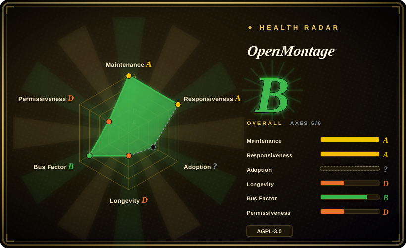
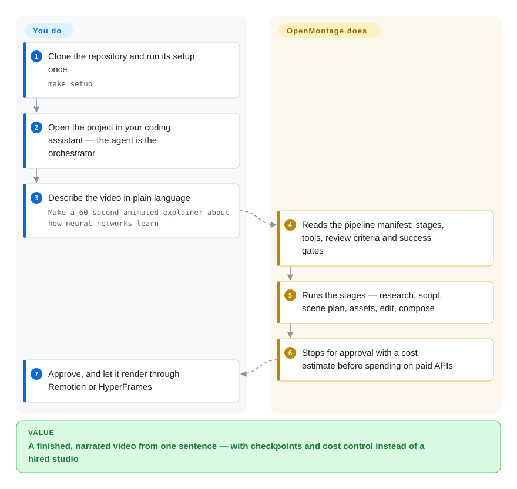

# OpenMontage

An agent-first video production system: YAML pipeline manifests declare the stages, Markdown director skills teach the agent how to run each one, and Python tools do the generation, retrieval, costing and encoding — 13 pipeline manifests, 157 skill documents and ~167 tool modules in-tree (checked 2026-09-21).

## When to use

You're a content creator, educator, or solo developer who needs to produce short-form videos — explainers, social clips, product teasers, documentary montages, or animated stories — but you don't have a video production team or After Effects skills. You do have an AI coding assistant (Claude Code, Cursor, Copilot, Windsurf, or Codex) and a modest budget for API calls. OpenMontage lets you describe the video in plain language — "Make a 60-second animated explainer about neural networks" — and the agent orchestrates the entire production pipeline: it researches your topic with live web search, writes a script, generates or sources visuals (AI images, stock footage, archival clips), narrates with TTS, finds royalty-free music, burns in word-level subtitles, and renders the final video through Remotion or HyperFrames. You stay in control at every creative decision point, with cost estimates and approval gates before the agent spends on APIs.

## How it works

There is deliberately **no code orchestrator**: your coding assistant is the orchestrator, and the repository supplies the three things it reads to act like a production studio. Layer one is the YAML pipeline manifests under `pipeline_defs/` — one per genre (animated explainer, documentary montage, clip factory, localisation/dub, …) declaring the stages, the tools each stage may call, its review criteria and its success gates. Layer two is the Markdown director skills under `skills/` that explain *how* to execute a stage. Layer three is the Python tools that do the work — provider selection, generation, stock retrieval, cost tracking, FFmpeg encoding — with Remotion or HyperFrames as the render backend. You clone once, run `make setup`, and then ask for a video in words; the agent reads the manifest, calls the tools, self-reviews against the written criteria, checkpoints state into a local `projects/<name>/` folder, and stops for your approval before spending on APIs. What stays your job: supplying API keys (or accepting the free-stock/no-key path), approving the creative decisions, and picking the pipeline that matches the brief.

<!-- flow-steps:begin (generated from flows/open-montage.json by tools/flow_card.py — do not edit) -->

Text version of the flow

1. **You**: Clone the repository and run its setup once — `make setup`
2. **You**: Open the project in your coding assistant — the agent is the orchestrator
3. **You**: Describe the video in plain language — `Make a 60-second animated explainer about how neural networks learn`
4. **OpenMontage**: Reads the pipeline manifest: stages, tools, review criteria and success gates
5. **OpenMontage**: Runs the stages — research, script, scene plan, assets, edit, compose
6. **OpenMontage**: Stops for approval with a cost estimate before spending on paid APIs
7. **You**: Approve, and let it render through Remotion or HyperFrames

**Value**: A finished, narrated video from one sentence — with checkpoints and cost control instead of a hired studio

<!-- flow-steps:end -->

## When NOT to use

- You need professional film post-production with frame-level manual control — use DaVinci Resolve or Premiere Pro instead. OpenMontage is agent-orchestrated, not a traditional NLE.
- You want a one-click web UI or SaaS without touching code or a coding agent — OpenMontage is a repo-first system that runs inside your AI coding assistant.
- The AGPL-3.0 strong copyleft is a deal-breaker for embedding into a closed-source product or service.
- You need a stable, battle-tested toolchain with a multi-year track record — this project is ~6 months old (created 2026-03-29) and pre-1.0, with no tagged release at all, so the only install path is the moving `main` branch and APIs, pipelines and skills may change under you.
- Your primary need is simple image-to-video or text-to-video generation without a full production pipeline (scripting, research, music, subtitles) — a standalone video model API or ComfyUI may be simpler and cheaper.
- Windows is your primary dev environment and you can't tolerate occasional Node.js toolchain quirks (`npx --yes npm install` may be needed as a fallback). [未验证]

## Comparison

| Alternative | In index | Our verdict | Tradeoff |
|---|---|---|---|
| [Open Design](../ai-design-generation/open-design.md) | ✅ | Pick Open Design when you need a lighter local-first desktop path for quick HTML-to-MP4 prototypes. | Open Design is a desktop studio for quick prototypes; OpenMontage is a full pipeline system with research, scripting, and 12 production pipelines. |
| [Remotion](remotion.md) | ✅ | Pick Remotion directly when programmatic React video composition is enough and agent orchestration is unnecessary. | OpenMontage embeds Remotion as one of two render backends; use Remotion directly if you only need programmatic React video composition. |
| HeyGen / Runway / Pika | 未收录 | Pick closed SaaS tools when speed for a single generated clip matters more than pipeline control and OSS extensibility. | Faster for a single clip, but no pipeline customization, no agent approval gates, no open-source extensibility, and ongoing subscription costs. |
| [FFmpeg](../media-processing/video-audio/transcoding-and-pipelines/ffmpeg.md) | ✅ | Pick FFmpeg when you need low-level media manipulation rather than an end-to-end production pipeline. | OpenMontage depends on FFmpeg for encoding and post-production; FFmpeg is the right tool when you need low-level media manipulation, not an end-to-end production pipeline. |
| [ComfyUI](../on-device-ml/comfyui.md) | ✅ | Pick ComfyUI when bespoke node-based diffusion workflows and local GPU inference matter more than agentic production governance. | More flexible for bespoke diffusion pipelines and local GPU inference, but lacks agentic orchestration, research, scripting, and budget governance. |

## Tech stack

- **Python 3.10+** — tool implementations, provider abstractions, cost tracking, pipeline loading, and checkpoint/state management.
- **Node.js 18+** — Remotion composition engine (React-based programmatic video) and HyperFrames (HTML/CSS/GSAP motion-graphics rendering).
- **FFmpeg** — system binary for encoding, muxing, subtitle burn-in, audio mixing, and color grading.
- **React / Remotion** — default render engine for data-driven explainers, stat reveals, TikTok-style word-level captions, and scene transitions.
- **HTML/CSS/GSAP (HyperFrames)** — alternative render engine for kinetic typography, product promos, launch reels, and rigged SVG character animation.
- **YAML** — pipeline manifests (`pipeline_defs/`) that declare stages, tools, review criteria, and success gates.
- **Markdown** — agent skills and stage director instructions (`skills/`) that teach the agent how to execute each production stage.
- **Pydantic** — configuration model validation and runtime config loading.

## Dependencies

- Python virtual environment with `pip` (installs via `requirements.txt`).
- Node.js runtime with `npm` (installs inside `remotion-composer/` and for HyperFrames via `npx`).
- FFmpeg installed system-wide (macOS: `brew install ffmpeg`; Linux: `sudo apt install ffmpeg`).
- Optional but recommended: Apple Silicon Mac or NVIDIA GPU for local video generation (WAN 2.1, Hunyuan, CogVideo, LTX-Video).
- Optional API keys for cloud providers: FAL (FLUX + video), Pexels/Pixabay/Unsplash (stock), Suno/ElevenLabs (music/voice), OpenAI/xAI/Google (images/TTS).
- An AI coding assistant (Claude Code, Cursor, Copilot, Windsurf, or Codex) — the agent is the orchestrator; there is no standalone GUI or web UI.

## Ops difficulty

**Medium.** Installation is `make setup` (or manual `pip install` + `npm install` + `pip install piper-tts`). You must maintain a dual Python/Node.js runtime and a system FFmpeg binary. The zero-API-key path works for basic narrated explainers with free stock footage, but unlocking full capability (AI-generated video clips, premium TTS, custom music) means managing 5–10 API keys and their budgets. Every production run is a local project folder (`projects/<name>/`) with checkpoints, decision logs, and renders — no hosted service, so you manage disk space and output files yourself. The built-in quality gates and self-review catch many failures before you see them, but understanding which pipeline to choose and which provider to configure requires reading the agent guide first. [推断]

## Health & viability

- **Maintenance (radar A, 2026-09-21):** very active — 281 commits since 2026-06-30 alone, last push 2026-09-06, last commit 15 days before scoring; the README carries a GitHub "Repository of the Day" badge. High velocity, but still no tagged release and no versioning discipline to pin against.
- **Responsiveness (radar A):** median first response 85.1 hours across 21 qualifying issues in the recent window — slower than the 29.1 h recorded in July, on a smaller sample.
- **Governance / bus factor (radar B):** founder-dominated rather than single-author. In the trailing 12 months there are 50 active maintainers, with the top-1 contributor at 56.9% of commits and the top-3 at 70.7% — external code is landing, but the direction is still one person's. [推断]
- **Backing & longevity (radar D):** 175 days old (created 2026-03-29), so the Lindy prior is still weak; funding is GitHub Sponsors plus a sponsor wall in the README, not a foundation or a committed vendor, and a viral star count is not a survival track record. [推断]
- **Adoption (radar ?):** structurally unscorable — no package registry. The visible signal is ~60.5k stars and ~7.7k forks at 2026-09-21, which is viral-level attention; actual production usage beyond demos and one-off videos is unverified, and 330 open issues against ~6 months of life describe an audience still finding breakage. [未验证]
- **Risk flags (radar D):** AGPL-3.0 strong network copyleft — a real constraint for embedding or offering it as a service; there is no relicense history yet and no CLA gating observed, but the README doubles as marketing (trending badge, sponsor wall, YouTube/X channels), so read its capability claims as promotion until reproduced. [推断]

## Caveats (unverified)

- [推断] ~60.5k stars in ~6 months may include significant hype-driven traffic; long-term retention and production-grade adoption are unproven.
- [未验证] Star / fork / open-issue / contributor counts (~60.5k / ~7.7k / 330 / 50) are point-in-time GitHub API values from 2026-09-21.
- [未验证] The in-tree counts in the TL;DR (13 pipeline manifests including one `framework-smoke`, 157 Markdown files under `skills/`, ~167 Python files under `tools/`) come from a recursive tree listing on 2026-09-21; the README's older "12 pipelines / 52 tools / 500+ agent skills" figures no longer appear and were not reconciled with these.
- [未验证] Windows installation path has known `npm install` quirks requiring `npx --yes npm install` as a fallback; full Windows compatibility is not battle-tested.
- [未验证] Provider pricing and availability (FAL, Suno, ElevenLabs, etc.) can change independently; the built-in cost estimator may drift from actual provider rates.
- [推断] The skill-pack and pipeline contract formats are pre-1.0 with no release tags; custom pipelines or tools you build today may need rewriting on the next breaking update, and there is no version to pin.
- [未验证] Nothing on this page was executed in a reproduction environment: pipeline behaviour, provider selection scoring, cost estimates and approval gates are read from the README and the repository tree.
