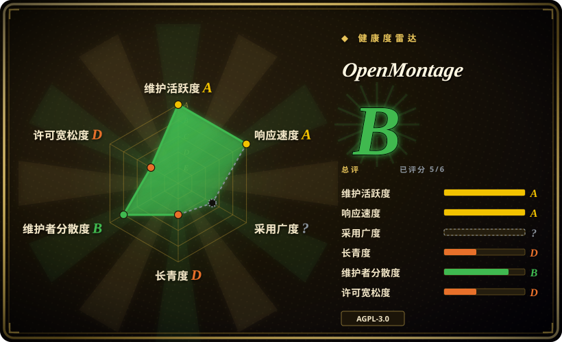
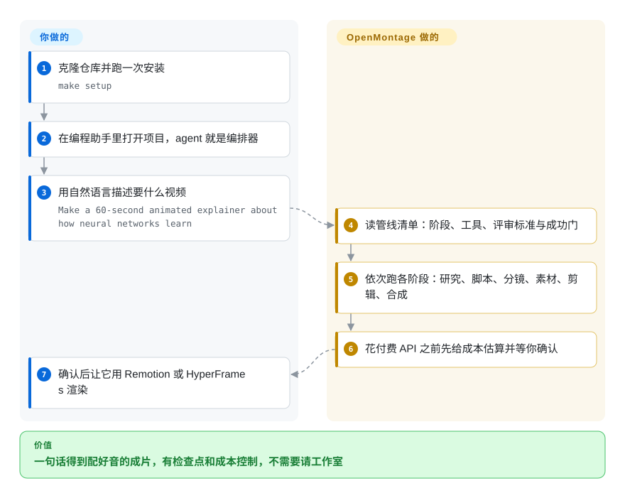

# OpenMontage

一个 agent 优先的视频制作系统：YAML 管线清单声明各阶段，Markdown 导演技能教 agent 怎么执行，Python 工具负责真正的生成、检索、成本核算与编码——仓库内有 13 份管线清单、157 份技能文档、约 167 个工具模块（2026-09-21 核对）。

## 何时使用

你是一名内容创作者、教育工作者或独立开发者，需要制作短视频——解说视频、社交切片、产品预告、纪录片蒙太奇或动画故事——但你没有视频制作团队，也不会用 After Effects。你手头有一台 AI 编程助手（Claude Code、Cursor、Copilot、Windsurf 或 Codex），并且愿意为 API 调用支付少量费用。OpenMontage 让你用自然语言描述想要的视频——“做一个 60 秒关于神经网络工作原理的动画解说”——Agent 便会自动编排整条生产管线：先用实时网页搜索研究主题，再撰写脚本，生成或检索视觉素材（AI 图像、库存 footage、档案素材），用 TTS 配音，自动寻找免版税音乐，烧录逐词字幕，最后通过 Remotion 或 HyperFrames 渲染成片。你在每一个创意决策点都保持控制权，Agent 在调用付费 API 之前会先给出成本估算并等待你的批准。

## 怎么用起来

它刻意**没有代码编排器**：你的编程助手就是编排器，仓库只提供它照着做的三层材料。第一层是 `pipeline_defs/` 下的 YAML 管线清单——每种体裁一份（动画解说、纪录片蒙太奇、切片工厂、本地化配音等），声明各阶段、每阶段可调用的工具、评审标准与成功门。第二层是 `skills/` 下的 Markdown 导演技能，讲清某个阶段**怎么做**。第三层是 Python 工具，负责实际工作——供应商选择、素材生成、库存检索、成本追踪、FFmpeg 编码——渲染后端是 Remotion 或 HyperFrames。你克隆一次、跑一遍 `make setup`，然后用自然语言提需求；agent 读清单、调工具、照着写死的标准自评、把状态存进本地 `projects/<name>/` 检查点，并在花钱之前停下来等你批准。留给你的：提供 API key（或接受零 key 的免费素材路径）、批准创意决策，以及挑一条匹配需求的管线。

<!-- flow-steps:begin (generated from flows/open-montage.json by tools/flow_card.py — do not edit) -->

流程文字版

1. **你**：克隆仓库并跑一次安装 — `make setup`
2. **你**：在编程助手里打开项目，agent 就是编排器
3. **你**：用自然语言描述要什么视频 — `Make a 60-second animated explainer about how neural networks learn`
4. **OpenMontage**：读管线清单：阶段、工具、评审标准与成功门
5. **OpenMontage**：依次跑各阶段：研究、脚本、分镜、素材、剪辑、合成
6. **OpenMontage**：花付费 API 之前先给成本估算并等你确认
7. **你**：确认后让它用 Remotion 或 HyperFrames 渲染

**价值**：一句话得到配好音的成片，有检查点和成本控制，不需要请工作室

<!-- flow-steps:end -->

## 何时不用

- 你需要专业电影级后期制作和逐帧手动控制——请用 DaVinci Resolve 或 Premiere Pro。OpenMontage 是 Agent 编排的，不是传统 NLE。
- 你想要一键即用的 Web UI 或 SaaS，不想接触代码或编程助手——OpenMontage 是 repo-first 的系统，运行在你的 AI 编程助手内部。
- AGPL-3.0 强 copyleft 对你来说是 deal-breaker，你需要将其嵌入闭源产品或服务中。
- 你需要稳定、经过多年验证的工具链——本项目已创建 175 天（2026-03-29）且 pre-1.0，连一个 tag 都没有，唯一的安装路径是持续变化的 `main` 分支，API、管线与技能都可能在你的脚下变。
- 你的需求只是简单的图生视频或文生视频，不需要完整的生产管线（脚本、研究、音乐、字幕）——独立视频模型 API 或 ComfyUI 可能更简单、更便宜。
- Windows 是你的主力开发环境，且你无法容忍 Node.js 工具链偶尔出现的异常（可能需要 `npx --yes npm install` 作为回退）。 [未验证]

## 横向对比

| 替代品 | 是否收录 | 我们的评价 | 取舍 |
|---|---|---|---|
| [Open Design](../ai-design-generation/open-design.zh.md) | ✅ | 需要更轻量的 local-first 桌面路径来做快速 HTML→MP4 原型时，选 Open Design。 | Open Design 是桌面 studio，适合快速原型；OpenMontage 是完整管线系统，含研究、脚本和 12 条生产管线。 |
| [Remotion](remotion.zh.md) | ✅ | 只需要程序化 React 视频合成、不需要 Agent 编排时，直接选 Remotion。 | OpenMontage 将 Remotion 内嵌为两个渲染后端之一；若只需要程序化 React 视频合成，可直接用 Remotion。 |
| HeyGen / Runway / Pika | 未收录 | 单个生成片段的速度比管线控制和开源扩展性更重要时，选闭源 SaaS。 | 单片段生成更快，但无管线定制、无 Agent 审批门、无开源扩展性，且需持续订阅费用。 |
| [FFmpeg](../media-processing/video-audio/ffmpeg.zh.md) | ✅ | 需要底层媒体处理 CLI，而不是端到端生产管线时，选 FFmpeg。 | OpenMontage 依赖 FFmpeg 做编码与后期；FFmpeg 适合需要底层媒体操作而非端到端生产管线的场景。 |
| [ComfyUI](../on-device-ml/comfyui.zh.md) | ✅ | 自定义节点式扩散工作流和本地 GPU 推理比 Agent 化生产治理更重要时，选 ComfyUI。 | 在自定义扩散管线与本地 GPU 推理上更灵活，但缺乏 Agent 编排、研究、脚本撰写和预算治理。 |

## 技术栈

- **Python 3.10+** — 工具实现、供应商抽象、成本追踪、管线加载、检查点与状态管理。
- **Node.js 18+** — Remotion 合成引擎（基于 React 的程序化视频）和 HyperFrames（HTML/CSS/GSAP 动态图形渲染）。
- **FFmpeg** — 系统二进制，用于编码、封装、字幕烧录、音频混音与调色。
- **React / Remotion** — 默认渲染引擎，用于数据驱动解说、统计揭示、TikTok 风格逐词字幕和场景过渡。
- **HTML/CSS/GSAP（HyperFrames）** — 替代渲染引擎，用于动态排版、产品推广、发布 reel 和绑定 SVG 角色动画。
- **YAML** — 管线清单（`pipeline_defs/`），声明阶段、工具、评审标准与成功门。
- **Markdown** — Agent 技能与阶段导演指令（`skills/`），教 Agent 如何执行每个生产阶段。
- **Pydantic** — 配置模型验证与运行时配置加载。

## 依赖

- 带 `pip` 的 Python 虚拟环境（通过 `requirements.txt` 安装）。
- 带 `npm` 的 Node.js 运行时（在 `remotion-composer/` 内安装，以及 HyperFrames 通过 `npx` 安装）。
- 系统级安装的 FFmpeg（macOS: `brew install ffmpeg`；Linux: `sudo apt install ffmpeg`）。
- 可选但推荐：Apple Silicon Mac 或 NVIDIA GPU，用于本地视频生成（WAN 2.1、Hunyuan、CogVideo、LTX-Video）。
- 可选的云供应商 API key：FAL（FLUX + 视频）、Pexels/Pixabay/Unsplash（库存素材）、Suno/ElevenLabs（音乐/语音）、OpenAI/xAI/Google（图像/TTS）。
- 一个 AI 编程助手（Claude Code、Cursor、Copilot、Windsurf 或 Codex）——Agent 本身就是编排器；没有独立 GUI 或 Web UI。

## 运维难度

**中等。** 安装方式是 `make setup`（或手动 `pip install` + `npm install` + `pip install piper-tts`）。你需要同时维护 Python 与 Node.js 双运行时，以及系统 FFmpeg 二进制。零 API key 路径可以运行基础解说视频和免费库存 footage，但解锁完整能力（AI 生成视频片段、高级 TTS、定制音乐）意味着管理 5–10 个 API key 及其预算。每次生产运行都是一个本地项目文件夹（`projects/<name>/`），内含检查点、决策日志和渲染输出——没有托管服务，因此你需要自行管理磁盘空间和输出文件。内置的质量门与自审会在你见到成品前拦截许多失败，但理解该选哪条管线、该配置哪个供应商，需要先阅读 Agent Guide。

## 健康度与可持续性

- **维护活跃度（雷达 A，2026-09-21）：** 非常活跃——仅 2026-06-30 以来就有 281 次提交，最后 push 2026-09-06，最后提交距评分 15 天；README 挂着 GitHub「Repository of the Day」徽章。速度很高，但依然没有 tag、没有任何可固定的版本纪律。
- **响应速度（雷达 A）：** 近期窗口中位首次响应 85.1 小时，基于 21 个 qualifying issues——比 7 月记录的 29.1 小时慢，样本也更小。
- **治理集中度（雷达 B）：** 是创始人主导，而不是单作者。近 12 个月有 50 位活跃维护者，第一贡献者占 56.9% 提交、前三占 70.7%——外部代码在进来，但方向仍由一个人决定。[推断]
- **长青度（雷达 D）：** 已创建 175 天（2026-03-29），Lindy 先验仍然很弱；资金来自 GitHub Sponsors 加 README 里的赞助墙，不是基金会或长期投入的厂商，病毒式星标也不等于生存履历。[推断]
- **采用广度（雷达 ?）：** 结构上无法评分——没有包注册表。可见信号是 2026-09-21 的约 60.5k stars 与 7.7k forks，属病毒级关注度；超出演示和一次性视频的真实生产使用仍未验证，330 个未关 issue 配 6 个月历史，说明受众自己也还在踩坑。[未验证]
- **风险标志（雷达 D）：** AGPL-3.0 强网络 copyleft——对嵌入或对外提供服务是真实约束；目前没有重新授权历史、也没观察到 CLA 限制，但 README 同时承担营销职能（trending 徽章、赞助墙、YouTube/X 频道），在复现之前应把它的能力描述当宣传读。[推断]

## 存疑（未验证）

- [推断] 约 6 个月内获得约 60.5k stars，可能包含大量 hype 驱动的流量；长期留存率和生产级采用尚未得到验证。
- [未验证] star / fork / 未关 issue / 贡献者数（约 60.5k / 约 7.7k / 330 / 50）是 2026-09-21 的 GitHub API 时点值。
- [未验证] TL;DR 里的仓内计数（13 份管线清单含一份 `framework-smoke`、`skills/` 下 157 份 Markdown、`tools/` 下约 167 个 Python 文件）来自 2026-09-21 的递归目录树；README 里旧的「12 条管线 / 52 个工具 / 500+ 技能」说法已不再出现，也未与这些计数对齐。
- [未验证] Windows 安装路径存在已知的 `npm install` 异常，需要 `npx --yes npm install` 作为回退；完整的 Windows 兼容性未经充分验证。
- [未验证] 供应商定价与可用性（FAL、Suno、ElevenLabs 等）可能独立变化；内置成本估算器可能与实际供应商价格产生偏差。
- [推断] 技能包与管线契约格式处于 pre-1.0 且没有任何 release tag；今天构建的自定义管线或工具可能需要在下一次破坏性更新时重写，而且没有版本可固定。
- [未验证] 本页没有在可复现环境里执行过任何流程：管线行为、供应商选择打分、成本估算与审批门都读自 README 与仓库目录树。
