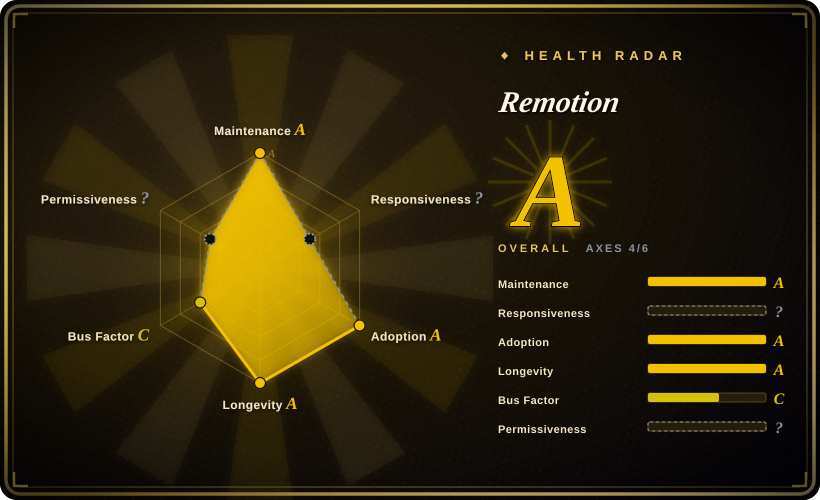

# Remotion

A React framework for making videos programmatically — compositions are React components, frames render locally through headless Chrome, and `@remotion/lambda` distributes renders across your own AWS account — under a source-available license that is free for individuals and companies up to 3 employees. It is a local developer framework, not a hosted cloud service and not an AI model: local rendering is the default, you bring your own infrastructure to scale, and "make videos with a coding agent" is one of three supported workflows rather than the project's origin.

## When to use

You're a React-first engineer building data-driven video at scale — personalized marketing clips per customer, sports highlight recaps per match, PR-to-video developer content, localized versions of one template in ten languages — and you need the video to be *code*: props in, MP4 out, reviewable in a diff, testable in CI. A human editor can't produce 10,000 parameterized variants, and a generation model can't guarantee your data renders exactly right.

You reach for Remotion because it is the most proven engine in this shape: 6+ years of continuous development, a huge catalog of composable APIs (`@remotion/player` for web preview, `@remotion/lambda` for distributed cloud renders, transitions, captions, GIFs, 3D via Three.js), and the ecosystem gravity that comes with 59.7k stars. The deciding tradeoff vs [HyperFrames](hyperframes.md): Remotion requires a React/bundler project and charges companies with >3 employees (Remotion License, company license needed above the threshold; terms change again in 5.0), while HyperFrames is build-step-free HTML under Apache-2.0 — pick Remotion for ecosystem depth and Lambda maturity, HyperFrames for licensing freedom and agent ergonomics. The workflow is not AI-specific — the same engine drives interactive editing in the bundled Studio and pure code-driven batch rendering; the official [Remotion Agent Skills](../agent-skills/vendor-collections/remotion-skills.md) bundle just adds the agent-facing entry point for writing the frame model correctly.

## When NOT to use

- **Your company has >3 employees and won't pay for a license.** The Remotion License is source-available, not open source; use [HyperFrames](hyperframes.md) (Apache-2.0, no revenue/size threshold) instead, because the free tier is eligibility-gated, not feature-gated, and legal review will flag it.
- **Your team doesn't think in React, or a coding agent authors the video.** Remotion compositions need a React/bundler project; agents and non-React teams write plain HTML more reliably — that's exactly the bet [HyperFrames](hyperframes.md) makes.
- **You need generated footage (photoreal people/scenes) or a clone-a-viral-video pipeline.** Remotion renders what you compose; it does not generate pixels or decompose a reference video. Use [Hypit](hypit.md) for clone-to-variants workflows, or a generation SaaS/model (Runway, Seedance — 未收录) when the visual itself must be hallucinated.
- **You want the whole production orchestrated — research, scripting, asset generation, approval gates.** Remotion is the render engine layer; [OpenMontage](open-montage.md) wraps engines of this class into a governed end-to-end pipeline.
- **You need a one-off hand-crafted cinematic edit.** Use DaVinci Resolve / Premiere Pro (未收录) with a human editor; a programmatic pipeline pays off only when videos are parameterized, repeated, or regenerated.
- **You want a fully managed rendering service.** Remotion has no hosted render cloud — local renders run on your machine and Lambda renders run in *your* AWS account, so you own the infrastructure, IAM, and cost. If you need a per-call API with no infrastructure to operate, use a hosted video-render API or a generation SaaS (Runway, 未收录) instead.

## Comparison

| Alternative | In index | Our verdict | Tradeoff |
|---|---|---|---|
| [HyperFrames](hyperframes.md) | ✅ | When you need license-free (Apache-2.0) HTML authoring that coding agents edit reliably without a bundler, pick HyperFrames; pick Remotion when React ecosystem depth, a web player component, and the battle-tested Lambda distributed renderer matter more, because Remotion's 6-year catalog and cloud-render maturity are what HyperFrames is still growing into. | Remotion: mature cloud rendering + ecosystem, paid above 3 employees; HyperFrames: free licensing + simpler authoring, pre-1.0 and younger. |
| [Hypit](hypit.md) | ✅ | When the entry point is "clone this viral video and ship 50 variants" with generated footage and word-level alignment, pick Hypit; pick Remotion when you author compositions yourself in React and need a stable 6-year framework, because Hypit is 7 weeks old at verification time with a restrictive license and paid generation dependencies. | Hypit brings the clone/generate/align loop; Remotion brings longevity, stability, and no model-API spend — but no generation pipeline. |
| [OpenMontage](open-montage.md) | ✅ | When you want an agent-driven pipeline with research, scripting, and approval gates producing explainer-style videos, pick OpenMontage; pick Remotion when you want direct engine-level control over every frame in a React codebase, because OpenMontage orchestrates engines of this class rather than replacing them. | OpenMontage adds governance on top; Remotion gives raw engine control and you own the pipeline discipline. |
| Runway / Pika (SaaS) | 未收录 | When you need photoreal generated footage with zero code, pick a generation SaaS; pick Remotion when every pixel must be deterministic, data-driven, and re-renderable in CI, because a prompt-rolled clip can't guarantee your text, data, or brand elements. | SaaS: instant photoreal output, per-render pricing, uncontrollable; Remotion: full control, free local renders, graphics-style output only. |
| DaVinci Resolve / Premiere Pro | 未收录 | When a human editor needs frame-level manual craft on a one-off film, pick a professional NLE; pick Remotion when videos are parameterized and produced by code at volume, because NLEs don't scale to thousands of data-driven variants. | NLE: manual craft, no automation surface; Remotion: automation-native, no timeline GUI for hand-editing. |

## Tech stack

- TypeScript/React monorepo (Bun workspace; root engines Node ≥ 16), published as `remotion` + `@remotion/*` packages on npm (v4.0.526, 2026-09-17).
- Rendering: headless Chrome (Chrome Headless Shell) renders each frame from the React composition; FFmpeg encodes — Remotion ships its own FFmpeg binaries [未验证].
- `@remotion/lambda`: distributed rendering on AWS Lambda; `@remotion/player`: embeddable React web player for previews; catalog packages for transitions, captions, GIFs, Lottie, Three.js, media parser, etc.
- Templates via `create-video` (CLI scaffolding); compositions are declared in code and parameterized with Zod schemas.
- Surfaces beyond the library: a drop-in **Elements** gallery (charts, captions, backgrounds, maps, lower-thirds), 35+ templates, a `Player` component for embedding in web apps, and an official [Agent Skills](../agent-skills/vendor-collections/remotion-skills.md) bundle that teaches coding agents the frame model.

## Dependencies

- Node.js (root engines ≥ 16; use current LTS) + npm/bun/pnpm; React 18/19.
- Chrome Headless Shell — downloaded/managed automatically by the renderer.
- FFmpeg — bundled by Remotion [未验证]; no system install needed for the standard path.
- Optional: AWS account (Lambda renders); `@remotion/licensing` company license key for organizations >3 employees. Published tiers (remotion.dev, 2026-09-19): free for individuals and ≤3 people; Company License with "Remotion for Automators" at $0.01/render ($100/mo minimum) and "Remotion for Creators" at $25/mo per seat; Enterprise from $500/mo.
- No database or always-on server for local rendering; Lambda stack is infra you deploy when used.

## Ops difficulty

**Low to medium.** Local development is `npx create-video` → `npx remotion studio` → `npx remotion render`; Chrome and FFmpeg management is automated, and 6 years of releases have smoothed the edges. Medium kicks in with the Lambda render stack (AWS IAM, S3 buckets, concurrency quotas — infrastructure you own) and with license administration for larger companies. The ~2-day release cadence is disciplined (v4 patch train), but the announced 5.0 license change requires watching terms, not just code.

## Health & viability

- **Maintenance (2026-09):** exceptional — created 2020-06, pushed daily through 2026-09-19, v4.0.526 published 2026-09-17, releases every ~2 days for years; first npm publish 2020-12.
- **Governance / bus factor:** org-owned (remotion-dev) by the company behind it; the radar counts 134 active maintainers in 12 months but a top-contributor share of ≈76% — founder-dominated, while the site advertises 300+ contributors overall. The founder *is* the commercial entity, so incentives to maintain are structural.
- **Backing & Lindy:** 6+ years old and still accelerating — a strong Lindy profile by this index's prior; funded by company licenses rather than VC-scale hype [推断].
- **Adoption & ecosystem:** 59,735 stars / 4,584 forks (2026-09-19); the site advertises 5M+ installs per month, 300+ customers, 35+ templates, and 1,000+ doc pages; a drop-in Elements gallery, a `Player` component used in production web apps, and established Lambda rendering — the default answer for "video as React code".
- **Risk flags:** source-available license (non-OSI) with an eligibility threshold, published usage-based pricing, and an announced 5.0 terms change; 171 open issues reflects high usage more than neglect [推断]; no relicense-to-restrictive shock so far — the paid tier has existed since the project's early years.

## Caveats (unverified)

- [未验证] "Remotion ships its own FFmpeg binaries" reflects the project's long-standing bundling behavior; the exact v4 mechanism (download-on-install vs vendored) was not inspected here.
- [未验证] Published pricing (free for individuals and ≤3 people; Automators at $0.01/render with a $100/mo minimum; Creators at $25/mo per seat; Enterprise from $500/mo) was read from remotion.dev on 2026-09-19 — treat it as point-in-time and verify current terms; the announced 5.0 license change may alter the tiers and metrics.
- [未验证] Star / fork / open-issue counts (59,735 / 4,584 / 171) and the advertised 300+ contributors, 5M+ monthly installs, 300+ customers, and 1,000+ doc pages are point-in-time figures (2026-09-19); volatile and partly vendor-reported.
- [推断] "Remotion has no hosted render cloud" is inferred from the site's "render on your own infrastructure" positioning and the AWS-Lambda deployment model; a first-party hosted render product was not found.
- [推断] "Funded by company licenses rather than VC-scale hype" inferred from the two-tier license model; the company's actual financing was not researched.
- [推断] Node ≥ 16 taken from the monorepo root engines field; individual packages or Lambda runtime may impose higher minimums.
- [未验证] Render determinism across machines — browser rendering can shift pixels with font/GPU differences, same caveat as any headless-Chrome renderer.
