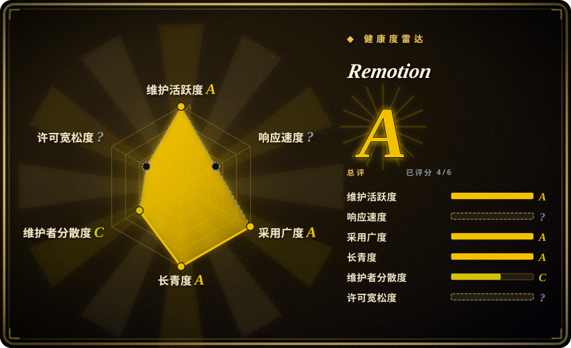

# Remotion

用 React 程序化做视频的框架——composition 就是 React 组件，帧在本地经 headless Chrome 渲染，`@remotion/lambda` 把渲染分布到**你自己的** AWS 账号——采用 source-available 许可证，个人与 3 人以下公司免费。它是本地开发框架，不是托管的云服务、也不是 AI 模型：本地渲染是默认路径，要上规模由你自带基础设施，「用编码 agent 做视频」只是它支持的三种工作流之一，而非项目的出身。

## 何时使用

你是 React 优先的工程师，要规模化做数据驱动的视频——每个客户一条个性化营销片、每场比赛一条集锦、PR 转视频的开发者内容、同一模板的十种语言本地化版——你需要视频本身是**代码**：props 进、MP4 出、能在 diff 里 review、能在 CI 里测试。人类剪辑师做不出一万个参数化变体，生成模型又保证不了你的数据渲染得分毫不差。

这时你选 Remotion，因为它是这个形态里验证最充分的引擎：6 年以上持续开发、庞大且可组合的 API 目录（`@remotion/player` 做 web 预览、`@remotion/lambda` 做分布式云渲染、转场、字幕、GIF、经 Three.js 的 3D），以及 59.7k stars 带来的生态引力。相对 [HyperFrames](hyperframes.zh.md) 的决定性取舍：Remotion 要求 React/打包器项目，且对 3 人以上公司收费（Remotion License，超阈值需公司许可证；5.0 条款还会再变），HyperFrames 是无构建步骤的 HTML 加 Apache-2.0——要生态深度和 Lambda 成熟度选 Remotion，要许可证自由和 agent 人体工学选 HyperFrames。这套用法与 AI 无关——同一个引擎既支持在自带的 Studio 里交互式剪辑，也支持纯代码驱动的批量渲染；官方 [Remotion Agent Skills](../agent-skills/vendor-collections/remotion-skills.zh.md) 只是补上了面向 agent 的、把帧模型写对的入口。

## 何时不用

- **你的公司超过 3 人且不打算买许可证。** Remotion License 是 source-available 而非开源；请改用 [HyperFrames](hyperframes.zh.md)（Apache-2.0，无收入/规模阈值），因为免费档是按主体资格划线而非按功能划线，法务审查会卡这一点。
- **你的团队不用 React 思考，或视频由 coding agent 执笔。** Remotion composition 需要 React/打包器项目；agent 和非 React 团队写纯 HTML 更可靠——这正是 [HyperFrames](hyperframes.zh.md) 的赌注。
- **你需要生成式画面（写实人物/场景）或克隆爆款的管线。** Remotion 渲染你合成的东西，不生成像素、也不分解参考视频。克隆到变体的 workflow 用 [Hypit](hypit.zh.md)；画面本身必须靠幻觉生成时用生成类 SaaS/模型（Runway、Seedance，未收录）。
- **你想要整条制作被编排——调研、脚本、素材生成、审批闸门。** Remotion 是渲染引擎层；[OpenMontage](open-montage.zh.md) 把这类引擎包进带治理的端到端管线。
- **你要一次性的手工精修电影感剪辑。** 用 DaVinci Resolve / Premiere Pro（未收录）配人类剪辑师；程序化管线只有在视频被参数化、重复、反复重新生成时才回本。
- **你要的是全托管渲染服务。** Remotion 没有托管渲染云——本地渲染跑在你机器上，Lambda 渲染跑在**你的** AWS 账号里，基础设施、IAM 和成本都归你。要按次调用、不想养基础设施，就用托管视频渲染 API 或生成类 SaaS（Runway，未收录）。

## 横向对比

| 替代品 | 是否收录 | 我们的评价 | 取舍 |
|---|---|---|---|
| [HyperFrames](hyperframes.zh.md) | ✅ | 如果你要许可证自由（Apache-2.0）、无打包器、coding agent 能可靠编辑的 HTML 创作，选 HyperFrames；如果 React 生态深度、web player 组件和身经百战的 Lambda 分布式渲染更重要，选 Remotion，因为 Remotion 6 年的目录和云渲染成熟度正是 HyperFrames 还在长成的东西。 | Remotion：成熟云渲染 + 生态，3 人以上付费；HyperFrames：许可证自由 + 更简单创作，pre-1.0 且更年轻。 |
| [Hypit](hypit.zh.md) | ✅ | 如果入口是「克隆这条爆款、出 50 个变体」并需要生成画面和词级对齐，选 Hypit；如果你自己在 React 代码库里写 composition、要一个稳定的 6 年框架，选 Remotion，因为 Hypit 验证时仅 7 周龄、许可证受限且依赖付费生成 API。 | Hypit 带来克隆/生成/对齐闭环；Remotion 带来长期性、稳定性、零模型 API 开销——但没有生成管线。 |
| [OpenMontage](open-montage.zh.md) | ✅ | 如果你要 agent 驱动、带调研/脚本/审批闸门、产出解说类视频的管线，选 OpenMontage；如果你要在 React 代码库里对每一帧做引擎级直接控制，选 Remotion，因为 OpenMontage 编排的正是这一类引擎而非替代它们。 | OpenMontage 在上层加治理；Remotion 给裸引擎控制，管线纪律自己扛。 |
| Runway / Pika（SaaS） | 未收录 | 如果你要零代码的写实生成画面，选生成类 SaaS；如果每个像素都必须确定性、数据驱动、可在 CI 重渲染，选 Remotion，因为 prompt 摇出来的片段保证不了你的文字、数据和品牌元素。 | SaaS：即得写实画面、按次计价、不可控；Remotion：完全可控、本地渲染免费、只出图形风格画面。 |
| DaVinci Resolve / Premiere Pro | 未收录 | 如果人类剪辑师要对一条片子做帧级手工打磨，选专业 NLE；如果视频被参数化、由代码批量产出，选 Remotion，因为 NLE 撑不起上千条数据驱动变体。 | NLE：手工技艺、无自动化接口；Remotion：自动化原生、无手剪时间线 GUI。 |

## 技术栈

- TypeScript/React monorepo（Bun workspace；根 engines Node ≥ 16），以 `remotion` + `@remotion/*` 包发布于 npm（v4.0.526，2026-09-17）。
- 渲染：headless Chrome（Chrome Headless Shell）逐帧渲染 React composition，FFmpeg 编码——Remotion 自带 FFmpeg 二进制 [未验证]。
- `@remotion/lambda`：AWS Lambda 分布式渲染；`@remotion/player`：可嵌入的 React web 播放器做预览；目录包含转场、字幕、GIF、Lottie、Three.js、media parser 等。
- 经 `create-video` CLI 脚手架出模板；composition 用代码声明、以 Zod schema 参数化。
- 库之外的产物：可即插即用的 **Elements** 组件集（图表、字幕、背景、地图、下三分之一）、35+ 模板、可嵌进 web 应用的 `Player` 组件，以及教编码 agent 掌握帧模型的官方 [Agent Skills](../agent-skills/vendor-collections/remotion-skills.zh.md) 捆绑包。

## 依赖

- Node.js（根 engines ≥ 16，建议当前 LTS）+ npm/bun/pnpm；React 18/19。
- Chrome Headless Shell——渲染器自动下载管理。
- FFmpeg——由 Remotion 捆绑 [未验证]，标准路径无需系统安装。
- 可选：AWS 账号（Lambda 渲染）；3 人以上组织需 `@remotion/licensing` 公司许可证 key。公开档位（remotion.dev，2026-09-19）：个人与 ≤3 人免费；Company License 分「Remotion for Automators」$0.01／次渲染（$100/月起）与「Remotion for Creators」$25/月/席；Enterprise 自 $500/月起。
- 本地渲染无数据库、无常驻服务；用 Lambda 时才需要部署那套基础设施。

## 运维难度

**低到中等。** 本地开发就是 `npx create-video` → `npx remotion studio` → `npx remotion render`；Chrome 和 FFmpeg 管理全自动，6 年的发版把棱角磨平了。中等难度出现在两处：Lambda 渲染栈（AWS IAM、S3 桶、并发配额——基础设施归你养）和较大公司的许可证管理。约 2 天一版的节奏是纪律性的（v4 patch 列车），但已公告的 5.0 许可证变更意味着要盯的不只是代码还有条款。

## 健康度与可持续性

- **维护（2026-09）：** 顶级——创建于 2020-06，每日有 push（持续到 2026-09-19），v4.0.526 发布于 2026-09-17，多年来约 2 天一个 release；npm 首发 2020-12。
- **治理 / bus factor：** 组织（remotion-dev）即背后公司持有；雷达统计 12 个月内有 134 名活跃维护者，但头号贡献者占比≈76%——创始人主导，官网则宣称 300+ 名贡献者。创始人**就是**商业主体，维护激励是结构性的。
- **背书与 Lindy：** 6 年以上仍在加速——按本索引的先验是强 Lindy 画像；靠公司许可证而非 VC 级热度输血 [推断]。
- **采用与生态：** 59,735 stars／4,584 forks（2026-09-19）；官网称 5M+ 月安装量、300+ 客户、35+ 模板、1,000+ 文档页；Elements 组件集可即插即用，`Player` 组件被生产级 web 应用使用，Lambda 渲染成熟——「视频即 React 代码」的默认答案。
- **风险信号：** source-available 许可证（非 OSI）带资格阈值、按用量计价的公开定价，且 5.0 条款变更已公告；171 个 open issue 更多反映高使用量而非失修 [推断]；无「突然收紧许可证」的历史——付费档从项目早期就存在。

## 存疑（未验证）

- [未验证] 「Remotion 自带 FFmpeg 二进制」反映项目长期的捆绑行为；v4 的确切机制（安装时下载还是内置）未在此核查。
- [未验证] 公开定价（个人与 ≤3 人免费；Automators $0.01／次渲染、$100/月起；Creators $25/月/席；Enterprise 自 $500/月起）读自 remotion.dev（2026-09-19）——视为时点数据，做决策前核对现行条款；已公告的 5.0 许可证变更可能改动档位与计价口径。
- [未验证] star／fork／open issue 数字（59,735／4,584／171）以及官网宣称的 300+ 贡献者、5M+ 月安装量、300+ 客户、1,000+ 文档页均为时点数据（2026-09-19），易变且部分由厂商自述。
- [推断] 「Remotion 没有托管渲染云」由官网「在你自己的基础设施上渲染」的定位与 AWS Lambda 部署模型推断；未发现第一方托管渲染产品。
- [推断] 「靠公司许可证而非 VC 级热度输血」由双层许可模式推断；公司实际融资情况未调研。
- [推断] Node ≥ 16 取自 monorepo 根 engines 字段；单个包或 Lambda 运行时可能有更高下限。
- [未验证] 跨机器渲染确定性——浏览器渲染会因字体/GPU 差异产生像素偏移，这是所有 headless-Chrome 渲染器的共同存疑项。
