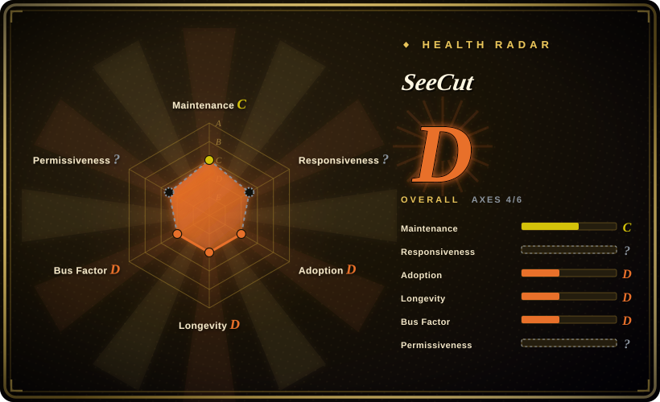
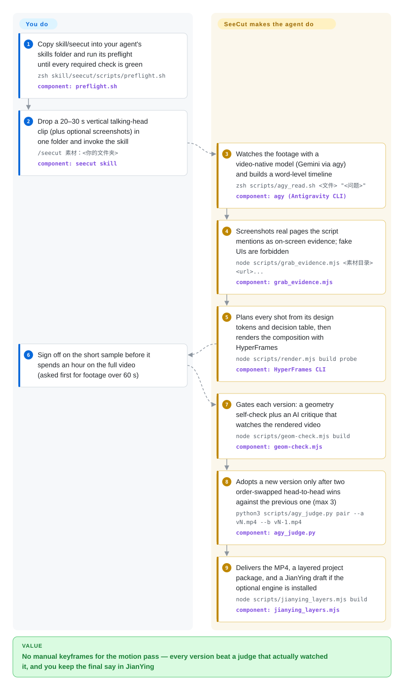

# SeeCut

You have a 20-second talking-head clip and want the high-energy short-video look — cards, real screenshots, hand-drawn callouts popping on each keyword — without keyframing the motion pass in an NLE. SeeCut is a skill for coding agents: the agent edits and renders your footage, then *watches the rendered video itself* with a video-native model, fixes what it sees, and iterates until a head-to-head review says the new cut is better — you keep the final say, and every layer stays editable in JianYing.

## When to use

You run a talking-head channel — short vertical videos where you explain a product or an idea to camera. The raw clip is fine; the "网感" polish is what eats your evenings: a card or big number landing within about a second of each noun you say, a real screenshot of the page you mention filling the frame, the speaker shrinking to a corner when the screen carries the information and returning full-screen when you address the viewer. A normal coding agent can't do this job because it can't *watch* motion — it sees extracted stills, so pacing and animation are invisible to it. SeeCut's whole premise is giving the agent an eye: it routes footage understanding and self-review through Google's Antigravity CLI (`agy`), which lets Gemini watch actual video instead of frames. You copy `skill/seecut` into `~/.claude/skills/`, point `/seecut 素材：<你的文件夹>` at a clip, and the loop runs: understand → find real evidence → plan shots → render with HyperFrames → self-review → iterate → deliver.

Pick SeeCut over [video-use](video-use.md) when the quality bar lives in the *picture* rather than the words — video-use cuts from a transcript and never looks at the rendered result the way SeeCut's judge does. Pick it over [anything2explainer](anything2explainer.md) when your A-roll already exists — anything2explainer draws footage from a topic, SeeCut polishes footage you shot (or built with the repo's HeyGen-avatar + Doubao-TTS recipe). Pick it over the bare [HyperFrames](hyperframes.md) engine when you want the editing *method* — design tokens, a sentence-function → screen-decision table, a per-shot build sheet — already worked out. The deciding tradeoff: SeeCut is one codified house style plus a verification loop, not a general editing toolkit — and its eye is mandatory, with no degraded mode.

## How it works

The style lives in reference documents the agent must read in priority order — design tokens (color families, type, spring-motion rules), an arrangement decision table mapping "what is this sentence doing" to "what the frame shows", and a SHOTBOOK per-shot build-sheet spec — backed by zsh/Node/Python scripts. You supply: a footage folder; a working `agy` (a Google account whose region Antigravity accepts — the preflight pings it live before the run starts, because "installed" ≠ "usable"); and the free local toolchain ffmpeg, Node ≥ 22, Python 3 + faster-whisper, playwright-core, plus HyperFrames CLI via `npx` (the engine that turns the HTML/GSAP compositions into MP4). The agent does the rest: watches the source clip through `agy`, builds a word-level timeline, screenshots the *real* web page or product screen for every concrete noun it can (fake UIs are forbidden by the rules; every screenshot gets re-read for sensitive text before it lands on screen), plans each shot against the decision table, renders, and then gates each version twice: a geometry scan (every 2 frames: element collisions, face-covering, dead-air beats) and an `agy` critique against a defect checklist — and any FAIL it reports must be adjudicated by opening the exact second it flagged, no dismissing it from a description. Adoption is pairwise: vN must beat vN-1 in two reviews with the A/B order swapped, because the author's calibration experiment found absolute scores useless (a deliberately ugly fake-filled version tied the reference film) while "which of these two is better" tracked human judgment; the judge is isolated — it sees only the video copied to a system temp dir, never the project source — and any on-screen text it claims to have read must exist in the build's fingerprint manifest. Footage over 60 s is run as a 20–30 s sample first, since one loop renders 2–3 versions and a 25 s sample takes roughly an hour (author-reported; see Caveats). Deliverables: the rendered MP4, an editor-agnostic layered project package, and — if the optional jianying-headless engine is installed — a JianYing draft with per-track layers and an SFX track; subtitles and BGM are left to you.

<!-- flow-steps:begin (generated from flows/seecut.json by tools/flow_card.py — do not edit) -->

Text version of the flow

1. **You**: Copy skill/seecut into your agent's skills folder and run its preflight until every required check is green — `zsh skill/seecut/scripts/preflight.sh` — component: `preflight.sh`
2. **You**: Drop a 20–30 s vertical talking-head clip (plus optional screenshots) in one folder and invoke the skill — `/seecut 素材：<你的文件夹>` — component: `seecut skill`
3. **SeeCut**: Watches the footage with a video-native model (Gemini via agy) and builds a word-level timeline — `zsh scripts/agy_read.sh <文件> "<问题>"` — component: `agy (Antigravity CLI)`
4. **SeeCut**: Screenshots real pages the script mentions as on-screen evidence; fake UIs are forbidden — `node scripts/grab_evidence.mjs <素材目录> <url>...` — component: `grab_evidence.mjs`
5. **SeeCut**: Plans every shot from its design tokens and decision table, then renders the composition with HyperFrames — `node scripts/render.mjs build probe` — component: `HyperFrames CLI`
6. **You**: Sign off on the short sample before it spends an hour on the full video (asked first for footage over 60 s)
7. **SeeCut**: Gates each version: a geometry self-check plus an AI critique that watches the rendered video — `node scripts/geom-check.mjs build` — component: `geom-check.mjs`
8. **SeeCut**: Adopts a new version only after two order-swapped head-to-head wins against the previous one (max 3) — `python3 scripts/agy_judge.py pair --a vN.mp4 --b vN-1.mp4` — component: `agy_judge.py`
9. **SeeCut**: Delivers the MP4, a layered project package, and a JianYing draft if the optional engine is installed — `node scripts/jianying_layers.mjs build` — component: `jianying_layers.mjs`

**Value**: No manual keyframes for the motion pass — every version beat a judge that actually watched it, and you keep the final say in JianYing

<!-- flow-steps:end -->

## When NOT to use

- **Any monetized or commercial pipeline in sight.** The LICENSE is PolyForm Noncommercial 1.0.0 — commercial use of the toolkit is outside the grant. For a commercially clean agent cut use MIT [video-use](video-use.md), Apache-2.0 [HyperFrames](hyperframes.md), or AGPL [OpenMontage](open-montage.md), because PolyForm gates the software itself however little of it you reuse.
- **You can't get — or won't chase — a working Google `agy` setup.** The README itself documents account-region and proxy gymnastics, and SKILL.md is explicit: no degraded mode without agy ships. If that eye can't be reliable for you, [video-use](video-use.md) (transcript-driven) or [Auto-Editor](../media-processing/video-audio/editing-and-cutting/auto-editor.md) (deterministic silence cut) avoid the dependency entirely.
- **No footage exists yet.** SeeCut polishes an A-roll you have; for topic → video go to [anything2explainer](anything2explainer.md), [OpenMontage](open-montage.md), or an appliance like [MoneyPrinterTurbo](moneyprinter-turbo.md).
- **You need your own motion-design language.** The core tokens are pinned for the whole film (fixed color families, spring cascades, three "never" rules) — the output is one author's 网感 style. For your own compositions use [HyperFrames](hyperframes.md) directly, or [Remotion](remotion.md) if your team writes React.
- **Batch throughput or long videos.** One loop = 2–3 rendered versions, each reviewed by a video-watching model several times; the author's own README says ~1 h per 25 s sample and warns the free `agy` quota may not last a whole video. Drive the engine directly or use a template pipeline instead.
- **Your input isn't a half-body talking head or avatar.** Screen-recording-with-corner-PIP is admitted-untested; the geometry rules (face rect, PiP states, "show the face when addressing, hide it when showing") assume talking-head A-roll.
- **Windows, or an agent that isn't skill-shaped.** macOS is what's tested (v3.3.2-beta only added Linux headless-shell *path* recognition); Claude Code is the proven harness and other agents are "theoretically generic" per the README. The draft step targets the Chinese JianYing app through jianying-headless — for a desktop that subtitles, dubs, and recuts one existing video, [OpenCreator](open-creator.md) is the different shape.

## Comparison

| Alternative | In index | Our verdict | Tradeoff |
|---|---|---|---|
| [video-use](video-use.md) | ✅ | Pick SeeCut when the quality gate must be visual — a model watches the rendered cut and rejects motion-layer defects; pick video-use when transcript work is the whole edit (filler words, dead air, take-picking), since it never watches the picture. | SeeCut spends a region-eligible Google account and roughly an hour per 25 s sample to earn a self-checking loop; video-use spends a paid ElevenLabs Scribe key for a cheaper transcript cut, and it carries MIT where SeeCut carries PolyForm noncommercial. |
| [HyperFrames](hyperframes.md) | ✅ | Pick HyperFrames when you want the deterministic HTML→MP4 engine itself — which SeeCut runs on — under an Apache-2.0 license you can ship commercially; pick SeeCut when the editing method (evidence rules, decision table, QC loop) is what you lack, not the renderer. | Engine vs method: HyperFrames ships the renderer and component registry but no editorial rules; SeeCut ships the rules and the judge loop but hard-depends on the same engine plus `agy`. |
| [anything2explainer](anything2explainer.md) | ✅ | Pick anything2explainer when there is no footage and the film should be drawn from a topic through a 9-stage governed pipeline; pick SeeCut when the talking-head clip already exists and the gap is the motion-polish pass on *your* picture. | Both are Claude-family skills under the same non-OSI PolyForm license; one generates frames in Remotion, the other edits your A-roll via HyperFrames — and SeeCut's judge watches video, anything2explainer's QC scores rendered frames. |
| [jianying-headless](../media-processing/nle-automation/jianying-headless.md) | ✅ | Pick jianying-headless when your end state is literally "an editable JianYing draft" — it is the very engine SeeCut optionally drives; pick SeeCut when the cut itself has to happen first. | Draft-engine only (its own personal/non-commercial license; no editing, no render) vs full pipeline (render + layered package + optional draft push; PolyForm noncommercial). |
| video-talkcraft | not indexed | Reach for video-talkcraft when you want the upstream SHOTBOOK / Design-Reference arrangement methodology that SeeCut credits as the origin of its decision-table structure, rather than SeeCut's 网感-taste variant with the `agy` verification loop; it is not added in this tab-intake batch. | SeeCut's README 致谢 names it as the pipeline-orchestration inspiration [推断: verdict rests on that lineage claim, no independent read of video-talkcraft]. |

## Health & viability

- **Maintenance (2026-09-29):** four days old at sprint cadence — 8 commits, 2026-09-25 → 2026-09-29, internal versions v3.2.1 → v3.3.2-beta in `CHANGELOG.md`; the only GitHub tag is `demo-v1`, which attaches the before/after demo files. The v3.x prefix implies pre-public iterations [推断: first CHANGELOG entry is "开源同步前整理", no public history before 2026-09-25]. Every commit carries a "Claude Opus 5.5" co-author trailer — the repo is itself agent-written.
- **Governance / bus factor:** single `User` maintainer, 0 watchers, 0 open issues, one issue template. The CHANGELOG documents an external-agent round-trip (Meta's "Muse" cloned the repo, ran fresh AV5 footage, and the maintainer re-ran the checks and confirmed 9 of 11 reported defects before fixing them) — a real feedback loop, but no evidence yet of human third-party contributions being handled.
- **Backing & age / Lindy (2026-09-29):** no organization backing; four days old is the worst Lindy position. 126 stars / 24 forks in 4 days is social attention (the author promotes on X), not third-party validation [推断]. Adopt it to study the method or for personal non-commercial cuts, not as infrastructure you depend on.
- **Dependent-service risk:** the loop's eye, `agy`/Antigravity, sits on Google account-region eligibility and quota policy that can change without notice; the optional step-1 recipe bills a HeyGen API wallet (README: AV5 ≈ $0.12/s, and it warns balance-shortfall still charges and tasks can't be cancelled) and Volcengine Doubao TTS trial quotas. Any of these repricing or geo-blocking stalls the pipeline mid-cut.
- **Risk flags:** PolyForm Noncommercial 1.0.0 (LICENSE read in full 2026-09-29) — not OSI, no commercial use. `NOTICE` lists bundled parts under Apache-2.0 (HyperFrames registry helpers) and SIL OFL 1.1 (Caveat font). The README runs headless `agy` with `--dangerously-skip-permissions`, and the JianYing draft path inherits jianying-headless's personal/non-commercial terms.

## Caveats (unverified)

- [未验证] 126 stars / 24 forks / 0 watchers / 0 open issues per GitHub API 2026-09-29 — a four-day-old repo, expect drift.
- [未验证] Wall-clock (~1 h per 25 s sample) and 2–3 versions per loop are the author's own README numbers; reproducing needs the paid HeyGen/Doubao + eligible-Google-account stack, not done here.
- [未验证] HeyGen pricing (AV4 ≈ $0.04/s, AV5 ≈ $0.12/s) and the ~20k-character Doubao trial are author-reported in `digital-human/README.md`, pointing at current console docs.
- [未验证] The judge-calibration results (`references/06` §7: absolute scoring tied a deliberately ugly fake-filled cut with the reference; order-swapped pairwise tracked human judgment but could be gamed by pretty fake backgrounds) are one author experiment dated 2026-09-23, not reproduced.
- [未验证] The "Muse" external audit (CHANGELOG v3.3: 18 raw QC returns reviewed, 9 of 11 claimed defects confirmed) is reported by the author for both sides.
- [未验证] Harness coverage: Claude Code tested; "Codex and others are theoretically generic" is the README's claim with no in-repo evidence. Screen-recording + corner-PIP footage is admitted-untested.
- [未验证] Linux support is best-effort (README: tested on macOS only; v3.3.2-beta added Linux headless-shell path recognition); Windows unmentioned; CapCut (international JianYing) compatibility is not claimed either way.
- [未验证] Whether a free-tier `agy` quota finishes one video — the README itself hedges ("以官方说明为准"); depends on Google's current policy.
- [推断] v3.x versioning reflects private iterations before the open-source sync (single public tag, CHANGELOG opens pre-public).
- [推断] The video-talkcraft comparison row rests on SeeCut's acknowledgements (Design Reference → component library → SHOTBOOK lineage), not an independent read of that repo.
