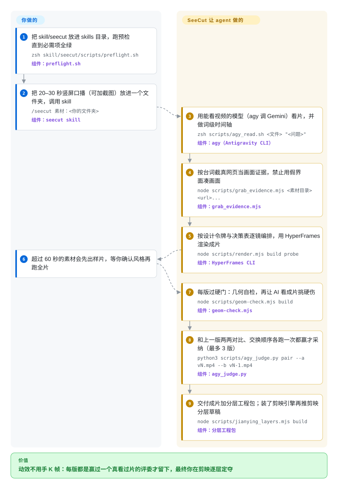

# SeeCut

你有一条二十秒的口播原片，想要刷到就停不下来的“网感”成片——卡片、真截图、手绘圈注跟着每个关键词弹出来——却不想在剪辑软件里逐帧手 K 动效。SeeCut 是给编码 agent 的 skill：agent 剪完渲完，再让一个能直接看视频的 AI *亲眼看*成片挑硬伤、两两 PK 上一版，赢了才留下；终审交给你，每一层还都能在剪映里逐轨改。

## 何时使用

你做口播频道——竖屏、真人或数字人对镜头讲产品讲观点。原片不难拍，难的是那层“网感”包装：每说到一个名词大约一秒内画面要接住，提到某个网页就得把真页面截满屏幕，讲给观众听时人像露脸、给观众看证据时人像缩成小窗。普通 coding agent 干不了这活，因为它*看不了*动效——只能看抽出来的静帧，节奏和弹跳全在盲区里。SeeCut 的整个前提就是给 agent 装上一只眼睛：素材理解和质检都走 Google 的 Antigravity CLI（`agy`），让 Gemini 直接看视频而不是图片。把 `skill/seecut` 放进 `~/.claude/skills/`，对着素材文件夹喊 `/seecut 素材：<你的文件夹>`，循环就自己跑：读片→找真证据→逐镜编排→HyperFrames 渲染→AI 看片自审→迭代→交付。

要拿画面质量当验收标准时选它而不是 [video-use](video-use.zh.md)——那份 skill 从转写稿下刀，成片渲出来长什么样它不看。底片已经存在时选它而不是 [anything2explainer](anything2explainer.zh.md)——那件从主题画片子，这件精剪你拍好的（或用仓里 HeyGen 数字人加豆包配音配方做出来的）A-roll。缺的是“怎么剪”的方法而不是渲染器时选它而不是光用的 [HyperFrames](hyperframes.zh.md)——设计令牌、句子功能→画面对策的决策表、逐镜施工单都替你定好了。决定性的取舍：SeeCut 是一套写死的个人风格加一条自验证循环，不是通用剪辑工具库——而且那只眼睛是硬依赖，官方明说没有降级模式。

## 怎么用起来

风格住在按优先级读取的参考文档里——设计令牌（色族、字体、弹簧动效规则）、一张“这句话在干什么→画面怎么接”的编排决策表、一份逐镜施工单规格（SHOTBOOK）——外面包着 zsh/Node/Python 脚本。你要做的：备好素材文件夹；让 `agy` 真能用（Google 账号的底层地区要在支持列表里，预检会实调一次，因为“装了”不等于“能用”）；装上免费的本地工具链 ffmpeg、Node ≥ 22、Python 3 加 faster-whisper、playwright-core，HyperFrames CLI 走 `npx`（把 HTML/GSAP composition 渲成 MP4 的那台引擎）。剩下的归 agent：经 `agy` 看原片、做词级时间轴；台词里每个具体名词去截*真*网页、真界面当画面证据（规则禁止假界面，每张截图入片前还要读一遍核敏感字）；按决策表逐镜编排、渲染；每版过两道硬门——每 2 帧一查的几何自检（撞位、压脸、空拍）和 agy 对硬伤清单看片评审，而且评审报的每条 FAIL 必须打开它标的那一秒逐帧裁定，不许凭描述驳回。采纳是两两 PK：vN 要在交换过 A/B 顺序的两次对比里都赢 vN-1——作者的校准实验发现打绝对分没用（一版故意做丑的假满屏和参考原片同分），而“这两条哪条好”和人工判断一致；评委还被隔离，它只看得到复制到系统临时目录的视频、读不到工程源码，它声称看到的每行画面文字都得在指纹清单里找到。素材超 60 秒先拿 20–30 秒样片跑，因为一轮要渲 2–3 版、25 秒样片实测约一小时（作者口径，见存疑）。交付三件：渲染成片、一份不绑编辑器的分层工程包、装了可选的 jianying-headless 引擎时再推一份剪映分层草稿（音效进草稿轨）；字幕和 BGM 留给你自己。

<!-- flow-steps:begin (generated from flows/seecut.json by tools/flow_card.py — do not edit) -->

流程文字版

1. **你**：把 skill/seecut 放进 skills 目录，跑预检直到必需项全绿 — `zsh skill/seecut/scripts/preflight.sh` — 组件：`preflight.sh`
2. **你**：把 20–30 秒竖屏口播（可加截图）放进一个文件夹，调用 skill — `/seecut 素材：<你的文件夹>` — 组件：`seecut skill`
3. **SeeCut**：用能看视频的模型（agy 调 Gemini）看片，并做词级时间轴 — `zsh scripts/agy_read.sh <文件> "<问题>"` — 组件：`agy（Antigravity CLI）`
4. **SeeCut**：按台词截真网页当画面证据，禁止用假界面凑画面 — `node scripts/grab_evidence.mjs <素材目录> <url>...` — 组件：`grab_evidence.mjs`
5. **SeeCut**：按设计令牌与决策表逐镜编排，用 HyperFrames 渲染成片 — `node scripts/render.mjs build probe` — 组件：`HyperFrames CLI`
6. **你**：超过 60 秒的素材会先出样片，等你确认风格再跑全片
7. **SeeCut**：每版过硬门：几何自检，再让 AI 看成片挑硬伤 — `node scripts/geom-check.mjs build` — 组件：`geom-check.mjs`
8. **SeeCut**：和上一版两两对比、交换顺序各跑一次都赢才采纳（最多 3 版） — `python3 scripts/agy_judge.py pair --a vN.mp4 --b vN-1.mp4` — 组件：`agy_judge.py`
9. **SeeCut**：交付成片加分层工程包；装了剪映引擎再推剪映分层草稿 — `node scripts/jianying_layers.mjs build` — 组件：`分层工程包`

**价值**：动效不用手 K 帧：每版都是赢过一个真看过片的评委才留下，最终你在剪映逐层定夺

<!-- flow-steps:end -->

## 何时不用

- **内容要商用、频道要变现。** LICENSE 通读为 PolyForm Noncommercial 1.0.0——商用不在授权里。要商业干净的 agent 剪辑，用 MIT 的 [video-use](video-use.zh.md)、Apache-2.0 的 [HyperFrames](hyperframes.zh.md) 或 AGPL 的 [OpenMontage](open-montage.zh.md)，因为 PolyForm 卡的是软件本身，复用多少都一样。
- **拿不到、或不想折腾能用的 Google `agy`。** README 自己就写着账号地区和代理的绕法，SKILL.md 明说不提供无 agy 的降级模式。这只眼睛靠不住时，靠转写稿的 [video-use](video-use.zh.md) 或确定性切静音的 [Auto-Editor](../media-processing/video-audio/editing-and-cutting/auto-editor.zh.md) 根本不碰这个依赖。
- **还没有素材。** SeeCut 精剪的是已有的 A-roll；从主题出发生成片子去 [anything2explainer](anything2explainer.zh.md)、[OpenMontage](open-montage.zh.md)，或 [MoneyPrinterTurbo](moneyprinter-turbo.zh.md) 这类家电。
- **要有你自己的动效语言。** 内核令牌全片锁死（固定色族、弹簧错峰、“三禁”），产出是作者一人的网感口味。要自定 composition 直接用 [HyperFrames](hyperframes.zh.md)，团队写 React 就选 [Remotion](remotion.zh.md)。
- **要批量走量或做长片。** 一轮 2–3 版、每版被看片模型评审若干次；作者 README 自己给的是 25 秒样片约一小时，并提醒免费 agy 额度可能跑不完一条片。批量场景直接驱动引擎或用模板管线，别用这条循环。
- **输入不是半身口播或数字人。** 录屏加角落圆头像这类素材作者承认没充分测试；几何规则（脸框、小窗状态、“对你说露、给你看藏”）默认素材就是口播 A-roll。
- **Windows，或你的 agent 不吃 skill 这套格式。** 实测口径只有 macOS（v3.3.2-beta 也只是认了 Linux 无头浏览器的文件名）；Claude Code 实测过，其它 agent 是 README 里“理论上通用”。剪映草稿那步通过 jianying-headless 只对着国内版剪映——要一个给*这一条*已有视频做字幕、配音、重切的桌面，选 [OpenCreator](open-creator.zh.md)。

## 横向对比

| 替代品 | 是否收录 | 我们的评价 | 取舍 |
|---|---|---|---|
| [video-use](video-use.zh.md) | ✅ | 验收标准必须落在画面上时选 SeeCut——模型真看渲出来的片、动效硬伤会拦下来；转写稿层面的活（去口头禅、剪冷场、挑 take）就是全部时选 video-use，它根本不看画面。 | SeeCut 花一个地区可用的 Google 加额度和 25 秒样片约一小时，换来会自审的循环；video-use 花 ElevenLabs Scribe 的付费额度换更便宜的转写剪辑，而且带 MIT——SeeCut 的 PolyForm 非商用不给。 |
| [HyperFrames](hyperframes.zh.md) | ✅ | 要 SeeCut 脚下那台确定性 HTML 转 MP4 引擎本身、还要能商用发布时选 HyperFrames；缺的是“怎么剪”的方法（证据规则、决策表、质检循环）而不是渲染器时选 SeeCut。 | 引擎对方法：HyperFrames 给渲染器和组件库（Apache-2.0）不给剪辑规则；SeeCut 给规则和评委循环，但硬依赖同一台引擎再加 `agy` 这只眼。 |
| [anything2explainer](anything2explainer.zh.md) | ✅ | 没有素材、片子该从主题画出来时选 anything2explainer（9 阶段带治理管线）；口播原片已经在、缺的是动效精剪这道工序时选 SeeCut。 | 同为 Claude 系 skill、同为 PolyForm 非商用；一个在 Remotion 上生成画面，一个用 HyperFrames 剪你的画面；SeeCut 的评委看视频，anything2explainer 的 QC 打分渲染帧。 |
| [jianying-headless](../media-processing/nle-automation/jianying-headless.zh.md) | ✅ | 终点就是“剪映里能打开的分层草稿”时选 jianying-headless——它正是 SeeCut 可选驱动的那台引擎；剪这件事本身也要发生才选 SeeCut。 | 只给草稿引擎（自带个人非商用协议，不剪辑不渲染）对整条管线（成片加分层工程包加可选推草稿；PolyForm 非商用）。 |
| video-talkcraft | 未收录 | 要 SeeCut 致谢里那条方法论源头——Design Reference 到组件库到 SHOTBOOK 的编排骨架——本身、不要 SeeCut 这套网感口味加 agy 验证循环时，看 video-talkcraft；本批（标签采集批次）未添加它。 | SeeCut 的 README 致谢称编排思路源自它 [推断：此裁决依据 SeeCut 的自述渊源，未独立通读 video-talkcraft]；本批未收录，不展开对比。 |

## 健康度与可持续性

- **维护（2026-09-29）：** 创建才 4 天、冲刺节奏——2026-09-25 到 09-29 共 8 次提交，`CHANGELOG.md` 里内部版本从 v3.2.1 一路到 v3.3.2-beta；GitHub 上唯一 tag 是 `demo-v1`，挂着改片前后两份原始视频。v3.x 的编号暗示开源同步前已有私有迭代 [推断：CHANGELOG 首条即“开源同步前整理”，公开史始于 2026-09-25]。每条提交都带 “Claude Opus 5.5” 合署尾注——这个仓库本身就是 agent 写的。
- **治理与巴士因子：** 单一 `User` 维护者，0 人 watch，0 个 open issue，一份反馈模板。CHANGELOG 记录了一轮外部 agent 审计（Meta 的 Muse 克隆仓库、拿新素材实跑，维护者本地复跑几何检查后确认 11 条报告里 9 条属实再修复回灌）——反馈通道是真的，但还没有处理第三方人类 PR 的证据。
- **背书与年代／Lindy（2026-09-29）：** 无组织背书；4 天龄是最差的 Lindy 位置。4 天 126 star、24 fork，读作社交热度（作者在 X 活跃）而非第三方验证 [推断]。把它当“值得研究的剪法”或个人非商用出片用，别当依赖的基础设施。
- **外部服务风险：** 循环的眼睛 `agy`／Antigravity 押在 Google 账号地区资格和额度政策上，随时可改；可选的第 1 步配方要 HeyGen API 钱包计费（README：AV5 约 $0.12/秒，并警告余额不足照扣、任务不可取消）和火山豆包试用额度。任一项改价或按地区拦截，管线就在半条片上停摆。
- **风险标志：** PolyForm Noncommercial 1.0.0（2026-09-29 通读 LICENSE）——非 OSI、不得商用。`NOTICE` 列明内置件另有许可（HyperFrames registry 助手件 Apache-2.0、Caveat 字体 SIL OFL 1.1）。README 指导无头调用 `agy` 要加 `--dangerously-skip-permissions`；剪映草稿路径继承 jianying-headless 的个人非商用条款。

## 存疑（未验证）

- [未验证] 126 star／24 fork／0 watch／0 open issue 为 2026-09-29 GitHub API 读数——4 天的仓库，随时漂移。
- [未验证] 耗时（25 秒样片约一小时、每轮 2–3 版）是作者 README 自述；复现需要 HeyGen／豆包付费加地区可用的 Google 账号，本机未复现。
- [未验证] HeyGen 价目（AV4 约 $0.04/秒、AV5 约 $0.12/秒）与豆包约 2 万字符试用额度，出自 `digital-human/README.md` 作者口径，指向官方控制台为准。
- [未验证] 评委校准结论（`references/06` §7：绝对分会让故意做丑的假满屏版和参考原片同分；交换顺序的两两对比与人工一致，但可能被漂亮的前景骗过）是作者 2026-09-23 的一次实验，未复现。
- [未验证] “Muse”外部审计（CHANGELOG v3.3：复盘 18 份 QC 原始返回、11 条仓库问题确认 9 条）双方均为作者自述。
- [未验证] harness 覆盖：Claude Code 实测，“Codex 等理论上通用”是 README 主张、仓内无证据；录屏加角落头像素材作者承认未充分测试。
- [未验证] Linux 支持尽力而为（README 口径仅 macOS 实测，v3.3.2-beta 只是识别了 Linux 无头浏览器路径）；Windows 未提及；剪映国际版 CapCut 兼容与否无主张。
- [未验证] 免费档 `agy` 额度能否跑完一条片——README 自己也只说“以官方说明为准”，取决于 Google 现行政策。
- [推断] v3.x 版本号为开源同步前的私有迭代（公开仅一个 tag，CHANGELOG 开篇即“开源同步前整理”）。
- [推断] 与 video-talkcraft 的对比裁决建立在 SeeCut 致谢的渊源自述上，未独立通读该仓库。
