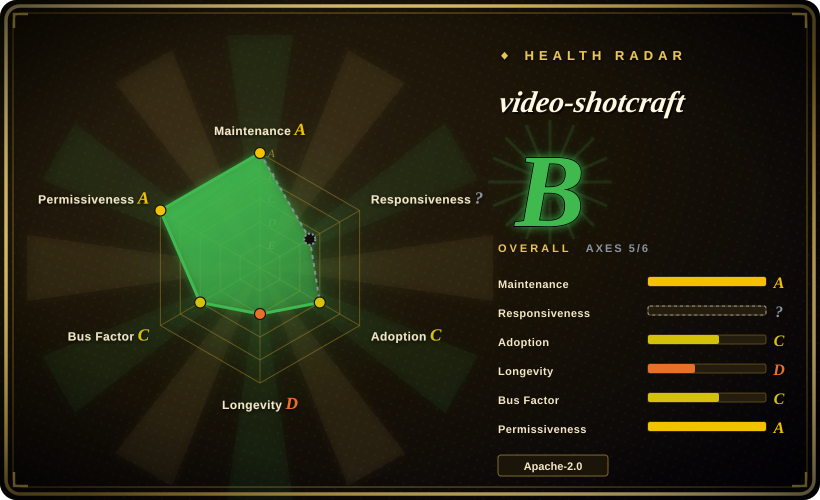
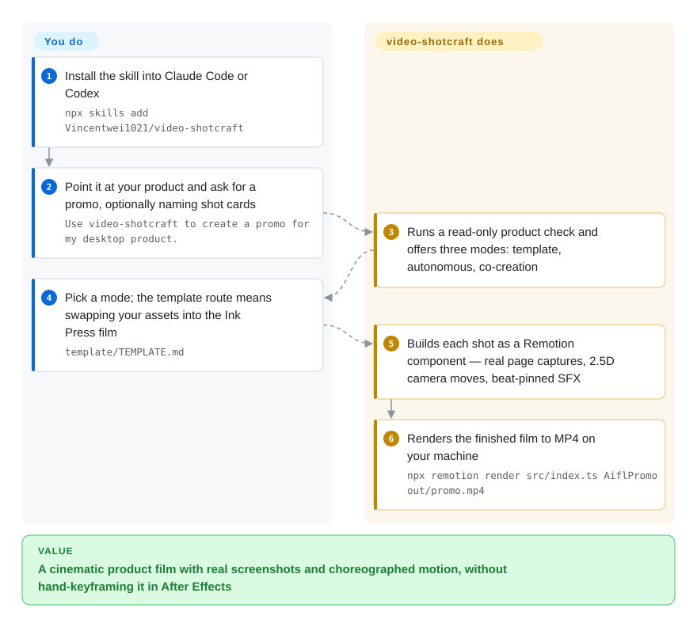

# video-shotcraft

A Claude Code / Codex skill that turns a product or webpage into a cinematic promo: a library of shot recipe cards plus a validated 36.2s Remotion template, using real page captures, 2.5D camera moves and beat-synced sound design, rendered locally from Remotion compositions.

## When to use

You are shipping a web or desktop product and need a launch video — not a screen recording with a title card, but something that looks art-directed: close-ups of the real interface, camera moves that follow the eye, cuts that land on the beat. Your agent can write React, and you would rather have it assemble the film from a documented shot vocabulary than hand-keyframe it yourself.

You install the skill, point your agent at the product, and it runs a read-only product check before offering three routes: reproduce the bundled Ink Press template by swapping assets, work autonomously, or co-create with you approving the brief, styleframe, shot map and storyboard. The deciding tradeoff against the official [Remotion Agent Skills](../agent-skills/vendor-collections/remotion-skills.md): those teach an agent how to write the engine correctly, while this one supplies the *taste layer* — 150-odd named shot recipes with demos, a finished reference film to imitate, a pinned Remotion project and an SFX pass — so quality comes from the library rather than from the model's motion-design instincts. Against [HyperFrames](hyperframes.md): HyperFrames is Apache-2.0 all the way down, while this skill's own code is Apache-2.0 but the engine it targets is [Remotion](remotion.md), whose licence is free only for individuals and companies up to three employees — that licence question, not the feature list, is what usually decides between them.

## How it works

The skill is Markdown instructions plus assets: `SKILL.md` sets the mode rules, `references/` holds the pipeline, aesthetic rules, sound-design and final-review checklists, `references/shots/` holds the recipe cards, `demos/` holds one Remotion component per card, and `template/` is a complete film project. Your agent reads the mode it was told to use, screenshots your actual product pages, then writes the film as a React/Remotion composition — each shot being a component driven by normalized progress `t` so it composes deterministically. Rendering is the ordinary Remotion CLI: `npm install`, then `npx remotion render src/index.ts AiflPromo out/promo.mp4` (the template pins `remotion` and `@remotion/cli` at 4.0.484; the project is private and its tests are vitest over pure helpers). What the skill does *not* do is generate footage, voices or music: subjects are your real screenshots, motion is code, and audio is a pinned SFX library plus beat-sync rules. After delivery two optional hand-offs exist — a browser Motion Workbench that decomposes the film into shot/transition/caption/SFX tracks for further editing, and an export to an editable 剪映 draft — so your side of the line is the product brief, the mode choice and the final taste call, and its side is storyboarding, shot implementation, sound design and render.

<!-- flow-steps:begin (generated from flows/video-shotcraft.json by tools/flow_card.py — do not edit) -->

Text version of the flow

1. **You**: Install the skill into Claude Code or Codex — `npx skills add Vincentwei1021/video-shotcraft`
2. **You**: Point it at your product and ask for a promo, optionally naming shot cards — `Use video-shotcraft to create a promo for my desktop product.`
3. **video-shotcraft**: Runs a read-only product check and offers three modes: template, autonomous, co-creation
4. **You**: Pick a mode; the template route means swapping your assets into the Ink Press film — `template/TEMPLATE.md`
5. **video-shotcraft**: Builds each shot as a Remotion component — real page captures, 2.5D camera moves, beat-pinned SFX
6. **video-shotcraft**: Renders the finished film to MP4 on your machine — `npx remotion render src/index.ts AiflPromo out/promo.mp4`

**Value**: A cinematic product film with real screenshots and choreographed motion, without hand-keyframing it in After Effects

<!-- flow-steps:end -->

## When NOT to use

- **Your organisation has more than three employees and will not buy a Remotion licence.** The deliverable is a Remotion project, so the engine's eligibility-gated licence applies to the work you ship. Use [HyperFrames](hyperframes.md) (Apache-2.0, no size threshold) or [anything2explainer](anything2explainer.md) instead, because this is a licence problem no amount of pinning fixes.
- **You need narration, talking avatars, or generated footage.** This skill is motion design over real product screenshots — it has no voiceover or video-generation step. For a narrated explainer use [anything2explainer](anything2explainer.md) or [OpenMontage](open-montage.md); for footage-driven documentary-style montage, [OpenMontage](open-montage.md).
- **You need a 剪映-native Chinese short-video workflow as the primary path.** Here 剪映 is a post-delivery export of a Remotion film; if the timeline itself is what you want automated, use [JianYing Editor Skill](../media-processing/nle-automation/jianying-editor-skill.md).
- **You want the same clip's structure cloned from an existing viral video.** That is a different method — [Hypit](hypit.md) targets clone-and-vary; this targets original product promos.
- **You need stability guarantees, versioned releases or a supportable dependency.** The repo is ~2 months old with media-only "releases" and no semver tags, 11 watchers against 9.1k stars, and a companion-repo series from one author. Treat it as a skills library you vendor and pin by commit, not as infrastructure [推断].
- **You are looking for an explainer film with a governed multi-stage pipeline and QC gates.** Use [anything2explainer](anything2explainer.md), whose whole point is checkpoints and quantitative review; this skill's quality control is review checklists plus your own judgment.
- **Your product's screenshots are confidential or under NDA and the workflow would leave them with a third party.** The pipeline is local (screenshots, Remotion render, SFX assets in-repo), so no upload step is described — but confirm that before pointing it at unreleased UI, since the skill also drives agent-side tooling you did not write.

## Comparison

| Alternative | In index | Our verdict | Tradeoff |
| --- | --- | --- | --- |
| [Remotion Agent Skills](../agent-skills/vendor-collections/remotion-skills.md) | ✅ | When the film is bespoke and the agent needs to author the engine correctly, pick the vendor skills; pick video-shotcraft when you want an art-directed product promo out of a proven shot library and a finished template, because vendor skills give knowledge of the API and no shot vocabulary or reference film. | Vendor skills are first-party, engine-versioned and unopinionated about aesthetics; video-shotcraft is third-party, ships 150+ shot cards and a 36.2s reference film, and inherits someone else's taste and asset layout. |
| [Remotion](remotion.md) | ✅ | When you are building your own composition pipeline and want a six-year framework with a Lambda renderer, pick Remotion directly; pick video-shotcraft when you want the product-promo layer — shot recipes, template, SFX, workbench — without designing it, because Remotion is the engine and this is one opinionated application of it. | Remotion gives longevity, ecosystem and distributed rendering with a company-size licence gate; video-shotcraft gives speed to a polished promo but is months old, single-author and pinned to one engine version. |
| [HyperFrames](hyperframes.md) | ✅ | When licensing freedom and an edit-friendly HTML composition model matter more than motion-design depth, pick HyperFrames; pick video-shotcraft when the output must look deliberately choreographed and you accept Remotion's licence, because HyperFrames is free of thresholds but has no equivalent shot library. | HyperFrames is Apache-2.0, bundler-free and CI-friendly; video-shotcraft is Apache-2.0 itself but ships Remotion compositions, so the licence and the React toolchain come along. |
| [anything2explainer](anything2explainer.md) | ✅ | When the film must explain a topic with narration and human checkpoints, pick anything2explainer; pick video-shotcraft when the film must sell a product with real UI close-ups and no voiceover, because the two produce different artifacts from different inputs. | anything2explainer has a governed 9-stage pipeline, quantitative QC and a non-commercial licence; video-shotcraft is Apache-2.0 with no narration and a permissive-but-young codebase. |
| After Effects | 未收录 | When a motion designer owns the work and manual control is the point, use After Effects; pick video-shotcraft when the promo must be regenerated from code by an agent, because AE is proprietary GUI work with no agent-reachable source of truth. | After Effects offers total frame-level control and a professional talent market; video-shotcraft trades that control for repeatability, real-page captures and a code-reviewable film. |

## Health & viability

- **Maintenance (2026-09-21):** created 2026-07-19, last push 2026-09-09 — active, but with no versioned releases: the two GitHub releases are media attachments (`gallery-media`, `showcase-media`), so there is no tag to pin. The in-repo `plugin.json` declares version 1.0.0.
- **Governance / bus factor:** one author (`Vincentwei1021`, 34 commits) plus five small contributors (`skyzhao1223` 6, `sarff0` 3, and three at 1–2). Personal account, no organisation, foundation or funding observed. Bus factor 1 [推断].
- **Backing & Lindy:** ~2 months old. This is the clearest Lindy warning in this batch: 9,119 stars against 11 watchers and 828 forks, with a 188 MB repository that is mostly gallery media — star growth that fast, without a corresponding watch/contributor base, is a promotional signal rather than a durability one [推断]. The author runs a series of these skills, which suggests a repeatable process but also a concentration risk.
- **Adoption & ecosystem:** a live gallery site, multi-language READMEs (EN/CN/JA), a Trendshift badge and a plugin manifest for the Claude Code plugin marketplace; six open issues at verification. Real usage is plausible but unmeasured — no download or dependent-project numbers exist for a skills repo.
- **Risk flags:** no tagged releases (cannot pin), engine-version pinning to Remotion 4.0.484 inside the template (upgrading Remotion is your job), documentation count drift (the README header says 157 cards / 214 previews, the same README's changelog says 152 cards / 209 previews and the Workbench note says 216 motions, while `SKILL.md` says 157 — pick a number only after counting the directory), and the licence split between this repo (Apache-2.0) and the engine it targets (Remotion, eligibility-gated).

## Caveats (unverified)

- [未验证] Nothing on this page was executed: no render was run and no shot card was rendered, so all quality claims (cinematic 2.5D moves, beat-synced SFX, pixel-parity between preview and render) are author-reported README/SKILL.md statements.
- [未验证] The 剪映 export (per-shot plate cutting, native text tracks, separate SFX/BGM audio tracks) is documented as verified by the author on JianYing Pro 11.2 for macOS only; it was not reproduced, and other 剪映 versions are unaccounted for.
- [未验证] The Workbench's "preview and render are frame-identical (pixel-parity verified)" claim was not tested; treating it as a guarantee for your own edits would be unjustified.
- [推断] The star-to-watcher ratio (9,119 stars / 11 watchers, 2 months old) is read as ranking-driven exposure rather than deep adoption; GitHub does not expose the acquisition channel, so this is inference, not evidence of artificial inflation.
- [推断] The licence consequence — that shipping a promo built with this skill pulls in Remotion's eligibility-gated licence — follows from the generated artifacts being Remotion compositions and the template pinning `remotion`/`@remotion/cli` 4.0.484; the author does not state this coupling in the README.
- [未验证] The asset counts are inconsistent across the repository's own documents (157 / 152 shot cards; 214 / 209 previews; 216 workbench motions); the actual number in `references/shots/` was not counted.
- [未验证] The pinned dependency set (`@remotion/cli` 4.0.484, `react` 19.2.7, `typescript` 6.0.3) and the vitest-only test scope were read from `template/package.json` and the root `package.json`; no install or test run was performed.
- [未验证] The README points to a sibling narration-video skill by the same author; it is not a substitute for this page's job and was not evaluated here.
- [推断] The 188 MB repository size is attributed to gallery/preview media from the file listing pattern (demos, gallery, assets), not from a size breakdown per directory.
- [推断] The health radar's `risk_license` grade of A scores this repository's own `LICENSE` file only; it does not model the downstream licence exposure created by emitting Remotion compositions, so do not read a green licence axis here as clearance for commercial use above Remotion's employee threshold.
