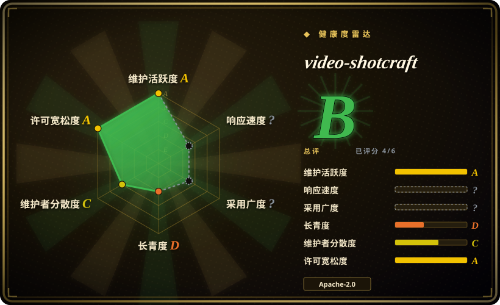
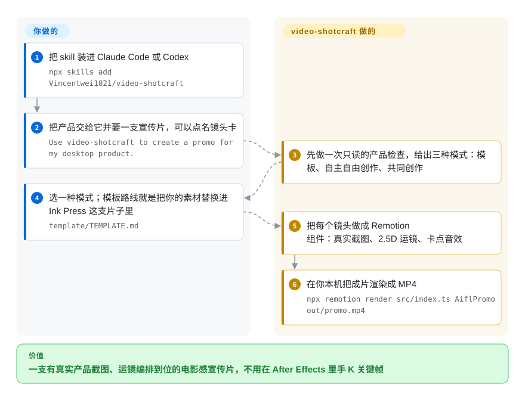

# video-shotcraft

给“电影感产品片”用的 agent skill：约 157 张镜头配方卡（每张带 Remotion 参考实现）、一支已验收的 36 秒宣传片模板、成套声音设计素材，以及交付后的浏览器工作台——让编码 agent 用你产品自己的真实截图，完成分镜、动效与音效设计。

## 何时使用

你正要发布一个 Web 或桌面产品，需要一支 30–60 秒的发布会、演示或功能片。你手上有真实截图和文案、有一个编码 agent（Claude Code 或 Codex），但没有动效设计师——而试过的替代方案都不够看：一段配了音乐的录屏，或者一个生成式视频 SaaS 编出来的、跟你产品毫无关系的画面。

选 video-shotcraft，是因为它补上的正是通常只能靠品味而非代码解决的那一层：一套**镜头词汇**（卡片翻入、行内嵌入、聚光主卡、2.5D 页面运镜），每张卡都附可运行的 TSX demo，里面写着真实的缓动与时长参数；再加一套固定许可的音效/BGM 素材库，以及“卡点剪辑与声音设计”的成文方法。它既能让你把品牌替换进一支已验证模板，也能让 agent 用镜头卡自由组片。与最近邻相比的决定性取舍：[Remotion Agent Skills](../agent-skills/vendor-collections/remotion-skills.zh.md) 教的是**API**，视觉与声音设计仍归你；[anything2explainer](anything2explainer.zh.md) 是单一体裁（解说型 MG）的现成流水线，且是非商用许可——本 skill 聚焦产品宣传片这一体裁、采用宽松许可（Apache-2.0），并且交付后片子仍可编辑：既有自己的浏览器工作台，也能导出成可编辑的剪映草稿。

## 怎么用起来

这个 skill 是“方法论 markdown + 一个能跑的 Remotion 工程”，不是服务。`SKILL.md` 先把 agent 路由到三种模式之一——替换素材以复现内置的 **Ink Press** 模板、用镜头卡自主自由创作、或与你共同创作（依次确认产品简报、视觉方向与分镜）——每种模式再指向对应的参考文档。之后 agent 用仓内的采集脚本抓你产品的页面，把镜头卡映射成故事板，用 TSX 写出各个 composition（每张卡的 demo 都由归一化进度 `t` 驱动，所以时长是确定性的），让音效和 BGM 落在节拍上，最后走模板自带的 Remotion 脚本渲染。交付物也不是死文件：自带的工作台会把成片拆成镜头/转场/字幕/音效轨道，让你改时长和文案，再经 Remotion 重新导出。留给你的是三件事：替换演示截图与品牌、选定模式，以及为你的组织厘清 Remotion 的许可问题。

<!-- flow-steps:begin (generated from flows/video-shotcraft.json by tools/flow_card.py — do not edit) -->

流程文字版

1. **你**：把 skill 装进你的编码 agent — `npx skills add Vincentwei1021/video-shotcraft`
2. **你**：告诉它产品是什么、这支片子给谁看 — `Use video-shotcraft to create a promo for my desktop product.`
3. **video-shotcraft**：只读地看一遍产品，挑镜头卡，出分镜
4. **video-shotcraft**：写出 Remotion 组件：2.5D 运镜、字幕、卡点音效
5. **你**：用自带模板渲染成片 — `npm run render`
6. **video-shotcraft**：打开工作台，让你继续改镜头时长和文案 — `node workbench/scripts/open.mjs <project>`

**价值**：一份截图加一句话，得到还能继续改镜头的电影感宣传片

<!-- flow-steps:end -->

## 何时不用

- **片子里需要真人旁白或逐字对齐的配音。** 这是动效设计包，不是解说流水线，没有 TTS 也没有强制对齐环节。要带人工检查点的解说型 MG 片就用 [anything2explainer](anything2explainer.zh.md)；要合成语音配库存素材的短视频就用 [MoneyPrinterTurbo](moneyprinter-turbo.zh.md)。
- **你只是想让 agent 别再写错 Remotion 代码。** 那就装 [Remotion Agent Skills](../agent-skills/vendor-collections/remotion-skills.zh.md)——那是厂商版本锁定的最佳实践；本 skill 是某位作者的个人库加一支模板。
- **你的动效栈是 HTML 而不是 React。** 选 [HyperFrames](hyperframes.zh.md)（Apache-2.0）及其 skills；video-shotcraft 的 demo、模板与工作台全是 Remotion/React，无法移植。
- **你要的是能跨体裁、带审批门、从调研一路到成片的完整流水线。** 用 [OpenMontage](open-montage.zh.md)；video-shotcraft 的前提是你已经知道要什么片子，并且会自己提供产品素材。
- **团队里没人能承担 Remotion 的许可问题。** Remotion 是源码可见，个人与小公司免费，但更大的组织可能需要付费许可——README 自己也这么写。如果这是硬阻塞，改用 Apache-2.0 的 [HyperFrames](hyperframes.zh.md)，或者直接用 [Remotion](remotion.zh.md) 创作并自行解决条款。
- **你需要写实素材、出镜人或你没有版权的 B-roll。** 这里的一切都由你的截图和代码绘制的动效构成；要生成式画面或数字人，用闭源 SaaS（Runway、HeyGen——未收录），代价是它无法还原你的真实界面。
- **你需要一个有维护履历的依赖。** 本仓只有约两个月、没有版本化 release，各项数字每周都在变——把它当成发布会标准流程之前，请先看下面的健康度一节。

## 横向对比

| 替代品 | 是否收录 | 我们的评价 | 取舍 |
| --- | --- | --- | --- |
| [Remotion Agent Skills](../agent-skills/vendor-collections/remotion-skills.zh.md) | ✅ | 如果 agent 已经能写合格的 Remotion、你只需要框架正确性，用厂商 skills；如果缺的是**设计**那一层——用哪个镜头、怎么缓动、哪个音效落在哪一拍，选 video-shotcraft，因为厂商包里没有镜头库、模板和音频素材。 | 厂商 skills：权威、版本锁定、对你的片子不持观点。video-shotcraft：有观点的镜头/音效库加一支模板，由个人维护并绑定自己的 Remotion 版本。 |
| [Remotion](remotion.zh.md) | ✅ | 如果你要完全控制权和自己的视觉识别，直接用 Remotion 写；如果你想从一个“动效决策已经做完”的起点出发，选 video-shotcraft，因为这个包是固定的镜头库加模板，不是通用框架。 | Remotion：自由度最高、没有设计帮助、构图与声音全归你。video-shotcraft：第一版更快，但继承一套风格词汇和它自己的版本钉扎。 |
| [anything2explainer](anything2explainer.zh.md) | ✅ | 如果交付物是带调研、配音和 QC 门的解说片，选 anything2explainer；如果是带真实界面、电影感运镜和声音设计的产品宣传片，选 video-shotcraft，因为两者体裁不同，且只有后者是 Apache-2.0。 | anything2explainer：风格固定、有治理流水线、非商用许可。video-shotcraft：宽松许可加产品专属素材，但没有配音与事实核查环节。 |
| [OpenMontage](open-montage.zh.md) | ✅ | 如果整条产线——调研、脚本、素材、渲染——该跨体裁地被编排并设审批，选 OpenMontage；如果任务就是一支产品片、你要的是镜头级手艺层，选 video-shotcraft，因为 OpenMontage 编排引擎，而这个包提供动效词汇与音频。 | OpenMontage：范围更宽、AGPL-3.0、工具链更重。video-shotcraft：窄而手艺密度高、Apache-2.0、没有审批门机制。 |
| [HyperFrames](hyperframes.zh.md) | ✅ | 如果栈是 HTML、且许可必须宽松到没有公司规模门槛，选 HyperFrames；如果是 React 团队、想要那套镜头库，选 video-shotcraft，因为 HyperFrames 是带 skills 的渲染引擎，不是精选的动效与声音库。 | HyperFrames：引擎优先、Apache-2.0、设计体系要你自己搭。video-shotcraft：设计优先、建在 Remotion 之上，而 Remotion 自身许可可能要求商业授权。 |

## 健康度与可持续性

- **维护（雷达 A，2026-09-21）：** 以年龄论非常活跃——创建于 2026-07-19，96 次提交，最后推送 2026-09-09，CI 除 `pr-checks.yml` 外还有画廊与展示站的部署工作流。没有版本化 release：只有媒体同步用的 tag（`showcase-media`、`gallery-media`），所以没有一个稳定版本可以固定。
- **治理 / bus factor（雷达 C）：** 本批里社区信号最好的一个——7 位贡献者、头号作者约占 69% 提交、约 54 个已合并 PR，未关 issue 多是本地化与工作台功能建议而非故障报告。但背后仍没有组织或基金会，路线图是一位实践者的。[推断]
- **背书与 Lindy（雷达 D）：** 两个月大、约 9.1k stars / 826 forks 属于注意力而非履历，且仓库挂着 Trendshift 徽章和 star 历史图——应把这种速度当作营销放大来看。内容是公开动效作品的再提炼（README 致谢了 ClickUp、Perplexity、Slack、Notion、Figma 等官方片的“学习素材”定位，未拷贝任何素材），所以**技法**本身是耐久的，尽管这个仓库还没有历史。
- **采用与生态（雷达 ?）：** 分发靠 `npx skills add` 与 agent 自己的 skill 加载器，外加公开的动效预览画廊；npm 上没有包，所以无法用下载量衡量使用，这个轴在结构上无法评分。作者还为其它视频体裁维护了同系列 skill 包（本批未收录），也就是说这一页覆盖的是一个系列中的一个条目，而不是一条完整产品线。[推断]
- **风险信号（雷达 A）：** 仓库是 Apache-2.0，但核心依赖 **Remotion 是源码可见且有公司规模门槛**——许可问题归属交付片子的那一方；克隆体积约 189 MB，因为画廊与音频素材都提交进了仓库；README 自己的数字前后不一致（更新日志写 152 张卡 / 209 个预览，标题与内容表写 157 / 214）；模板自带的截图是演示素材，发布前必须替换；剪映导出文档只写了 macOS 已验证，Windows 未测。

## 存疑（未验证）

- [未验证] 本页没有实际执行任何流程：镜头数量、模板规格、音频清单、无头渲染注意事项与工作台契约都来自 2026-09-21 读到的 README、`SKILL.md`、`template/package.json` 与 GitHub 目录树。
- [未验证] star / fork / issue / 提交数是 2026-09-21 的 GitHub API 时点值；对两个月大的仓库而言变化很快。
- [未验证] 这个包实际产出片子的质量没有独立评估——Gallery 与 YouTube 例子是项目自己的产出，也没有找到第三方复现报告。
- [推断] README 数字漂移（152 与 157 张卡、209 与 214 个预览）更像是文档滞后而非内容缺失：目录树里 `references/shots/` 下有 158 个文件，含一份署名说明。
- [未验证] “剪映导出已在 JianYing Pro 11.2 for macOS 验证”的说法在 README 里有歧义（另一处表格写的是 macOS 11.2）；仓库自己的目录树注释把 Windows 标为未测。在你自己复现之前，按仅支持 macOS 对待。
- [未验证] 无头渲染注意事项（`--concurrency=1`、chrome-headless-shell、`--browser-executable` 兜底）是作者在一台 2 核 Linux 机器上的自述。
- [未验证] 公司规模超过免费阈值后 Remotion 许可的具体含义没有经过有资质的人审阅；README 只是承认可能需要付费许可。
- [推断] 镜头来源说明（把官方片当参考资料研究、未拷贝素材）采信项目自己的说法；本页没有对 TSX demo 做来源审计。
