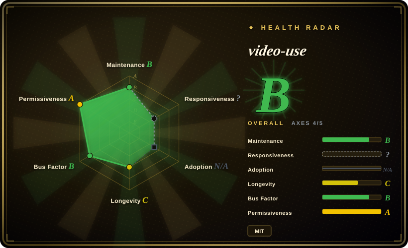
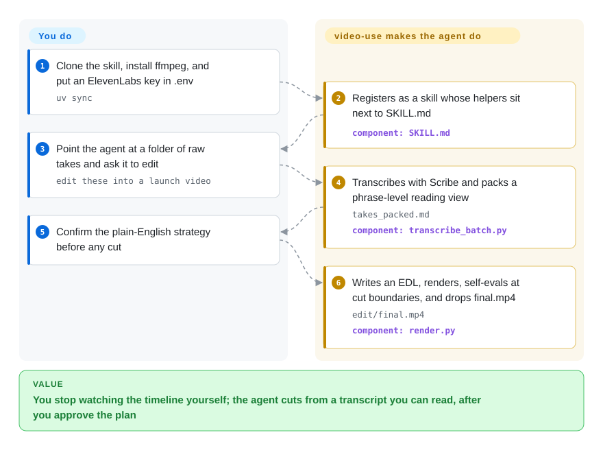

# video-use

You have a folder of raw takes full of umms and dead air, and you do not want to learn an NLE. video-use lets a coding agent read a packed transcript instead of watching the video, propose a cut, and write `edit/final.mp4` after you confirm.

## When to use

You shoot talking-head, tutorial, interview, or launch footage into a folder — five takes of the same sentence, filler words, two seconds of silence between them — and the next tool you would otherwise open is Premiere. You already run Claude Code or Codex. You symlink this repo into the agent's skills directory, drop an ElevenLabs API key in `.env` for word-level Scribe transcripts, and say "edit these into a launch video." The agent inventories with `ffprobe`, transcribes, packs every take into one `takes_packed.md`, asks you the strategy in plain English, and only then writes `edl.json` and runs `helpers/render.py`.

Pick this over [Auto-Editor](../media-processing/video-audio/editing-and-cutting/auto-editor.md) when silence is not the whole job: you also want take-picking, color, burned-in captions, and overlay animations from a conversation. Pick it over [anything2explainer](anything2explainer.md) or [OpenMontage](open-montage.md) when the picture already exists on disk — this skill edits files you dropped, it does not generate the base footage. Pick it over [OpenCreator](open-creator.md) when you live in the terminal and do not want a Codex-login desktop.

## Q&A

**Does this depend on browser-use the Python agent?**
No. Same company, same idea ("give the model a cheap structured view instead of pixels"), zero import. `pyproject.toml` lists `requests`, `librosa`, `matplotlib`, `pillow`, `numpy`. There is no PyPI package.

**Is this the recorder inside Browser Harness?**
No. Harness recordings are traces of a browser session. This skill cuts camera files with ffmpeg after an ElevenLabs transcript.

## How it works

The LLM never watches the video. One ElevenLabs Scribe call per source produces word-level timestamps, speaker labels, and events such as `(laughter)`; `pack_transcripts.py` turns that into a ~12 KB `takes_packed.md` the model can actually read. Visuals are on demand: `timeline_view.py` draws a filmstrip plus waveform PNG for a time range, used at decision points and again on the rendered output at every cut. What you do: install ffmpeg, pay for Scribe, confirm a 4–8 sentence strategy, give notes on the preview. What it does: cache transcripts, snap every cut to a word boundary, extract per segment, concat losslessly, put 30 ms audio fades on every join, burn subtitles last, and cap self-eval at three passes. Animation slots (HyperFrames, Remotion, Manim, or PIL) are optional and spawned in parallel; they are not the backbone. Outputs stay in `<videos_dir>/edit/` so the skill clone stays clean. Hard dependency: without `ELEVENLABS_API_KEY`, nothing transcribes.

<!-- flow-steps:begin (generated from flows/video-use.json by tools/flow_card.py — do not edit) -->

Text version of the flow

1. **You**: Clone the skill, install ffmpeg, and put an ElevenLabs key in .env — `uv sync`
2. **video-use**: Registers as a skill whose helpers sit next to SKILL.md — component: `SKILL.md`
3. **You**: Point the agent at a folder of raw takes and ask it to edit — `edit these into a launch video`
4. **video-use**: Transcribes with Scribe and packs a phrase-level reading view — `takes_packed.md` — component: `transcribe_batch.py`
5. **You**: Confirm the plain-English strategy before any cut
6. **video-use**: Writes an EDL, renders, self-evals at cut boundaries, and drops final.mp4 — `edit/final.mp4` — component: `render.py`

**Value**: You stop watching the timeline yourself; the agent cuts from a transcript you can read, after you approve the plan

<!-- flow-steps:end -->

## When NOT to use

- **The only job is cut silence or still stretches, with no LLM.** Use [Auto-Editor](../media-processing/video-audio/editing-and-cutting/auto-editor.md). It labels by loudness or motion and can export a timeline into Premiere or Resolve; it does not phone a transcript API.
- **There is no footage — you want an explainer drawn from a topic.** Use [anything2explainer](anything2explainer.md) (Remotion, governed pipeline, PolyForm noncommercial) or [OpenMontage](open-montage.md) (from-scratch film, AGPL). video-use will not invent the base picture.
- **You want a desktop for subtitling, dubbing, and recutting one existing video.** Use [OpenCreator](open-creator.md). It is a Codex-native app; this is a `SKILL.md` plus helper scripts.
- **You cannot send audio to ElevenLabs, or you will not pay Scribe.** Transcription is hosted Scribe, word-level, cached per file. The skill tells the agent not to run Whisper locally. No key means no edit.
- **You need frame-level manual control in a traditional NLE.** Use DaVinci Resolve or Premiere (not a repo). video-use will not give you a node graph; it gives you an EDL the agent wrote.
- **You need the HTML-to-MP4 engine itself.** Use [HyperFrames](hyperframes.md). video-use may `npx --yes hyperframes` inside one overlay slot; it does not replace that engine.
- **You are betting on Lindy.** 27k stars on a 22-commit, five-month-old skill-pack is a hype signal. The README still points always-on VPS editing at "Browser Use Box"; current Browser Use docs say Box and Bux are retired.

## Comparison

| Alternative | In index | Our verdict | Tradeoff |
|---|---|---|---|
| [Auto-Editor](../media-processing/video-audio/editing-and-cutting/auto-editor.md) | ✅ | Choose Auto-Editor when the cut is "delete the quiet bits" with no model and no transcript bill; choose video-use when a coding agent should pick takes, grade, caption, and overlay from a conversation. | Auto-Editor is a deterministic CLI you can script; video-use spends Scribe credits and agent tokens, and it will not start until you approve a strategy. |
| [OpenCreator](open-creator.md) | ✅ | Choose OpenCreator when you want a local desktop for subtitle/dub/portrait recut of *this* video; choose video-use when the input is a folder of raw takes and you already live in Claude Code or Codex. | OpenCreator is an app that requires a Codex login; video-use is a skill directory with no GUI. |
| [anything2explainer](anything2explainer.md) | ✅ | Choose anything2explainer when there is no camera footage and the film should be drawn in Remotion from a topic; choose video-use when the files already exist and the pain is cutting them. | Explainer generates every frame (PolyForm noncommercial); video-use never generates the base picture, it edits what you dropped (MIT). |
| [OpenMontage](open-montage.md) | ✅ | Choose OpenMontage when the agent should research, script, generate assets, and render a film from a prompt; choose video-use when the source of truth is camera takes. | OpenMontage is a from-scratch production pipeline under AGPL; video-use is an MIT editor that still needs a paid Scribe key. |
| [HyperFrames](hyperframes.md) | ✅ | Choose HyperFrames when you need the HTML-to-MP4 engine; choose video-use when HyperFrames is at most one overlay slot inside a larger edit of real footage. | video-use can scaffold a HyperFrames slot with `npx --yes hyperframes`; it does not replace lint/validate/render of the engine itself. |

## Health & viability

- **Maintenance — Grade B.** Last commit 3 days ago, but only 3 of 13 weeks active. Default branch SHA `b8770638` (PR #183, 2026-09-24). GitHub reports **22 commits** on `main` total. `pyproject.toml` is `0.1.0`; there are no GitHub Releases. Created 2026-04-12.
- **Responsiveness — not scored (`?`).** Skill-pack axis left unknown (`type_na`).
- **Adoption — N/A.** No install channel (PyPI 404). ~27.4k stars and ~3.2k forks (2026-09-27) therefore do not enter the grade. Helpers run as `python helpers/<name>.py`.
- **Governance — Grade B.** 8 active maintainers in 12 months, top-1 share 50%, top-3 70%. Org `browser-use`; several commits are co-authored by Claude. The same company sells Cloud, which the README still promotes as a place to try the skill.
- **Age & Lindy — Grade C.** 168 days, 22 commits, 27k stars. Treat the star count as marketing until a release train appears.
- **License / risk — Grade A (MIT).** Operational risk is not the license: hosted Scribe, ffmpeg on PATH, and a README that still names the retired Box product. Overall B on 4/5 applicable axes.

## Caveats (unverified)

- [未验证] Scribe cost per hour of footage was not priced against a live ElevenLabs bill.
- [未验证] The self-eval loop (timeline PNGs at every cut, EBU R128 numbers, optional critic sub-agent, cap of 3) was not run on a real edit.
- [推断] 27k stars on 22 commits is hype, not a user census — there is no download number to cross-check.
- [未验证] HyperFrames / Remotion / Manim overlay slots were not exercised; they are documented as lazy, first-use installs.
- [未验证] Whether `librosa` / `matplotlib` are required for a transcript-only cut, or only for `timeline_view.py` and grade helpers.
- [推断] README's "Browser Use Box" pointer is stale relative to Browser Use docs ("Box and Bux are retired") as of 2026-09-27; always-on VPS/Telegram hosting should not be planned against Box.
