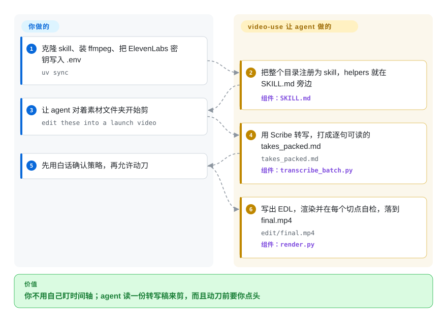

# video-use

文件夹里一堆带嗯啊和冷场的素材，你又不想学剪辑软件。video-use 让 coding agent 去读一份打包好的逐字稿而不是逐帧看片，先问你方案，再写出 `edit/final.mp4`。

## 何时使用

你把口播、教程、访谈或发布会素材丢进一个文件夹——同一句五条、口头禅、中间空两秒——下一件本会打开的工具是 Premiere。你已经在跑 Claude Code 或 Codex。把这个仓库链进 agent 的 skills 目录，在 `.env` 里放一把 ElevenLabs 密钥做逐词 Scribe 转写，然后说 “edit these into a launch video”。agent 用 `ffprobe` 清点、转写、把所有 take 打进一份 `takes_packed.md`，用白话问你策略，这之后才写 `edl.json`、跑 `helpers/render.py`。

静音不是全部工作、你还想靠对话来选 take、调色、烧字幕、叠动画时，选它而不是 [Auto-Editor](../media-processing/video-audio/editing-and-cutting/auto-editor.zh.md)。画面已经在磁盘上时，选它而不是 [anything2explainer](anything2explainer.zh.md) 或 [OpenMontage](open-montage.zh.md)——这份 skill 剪的是你丢进去的文件，不生成底片。你住在终端里、不想要一个必须 Codex 登录的桌面时，选它而不是 [OpenCreator](open-creator.zh.md)。

## 快问快答

**它依赖 browser-use 那个 Python agent 吗？**
不依赖。同一家公司，同一套想法（“给模型一份便宜的结构化视图，而不是像素”），零 import。`pyproject.toml` 列的是 `requests`、`librosa`、`matplotlib`、`pillow`、`numpy`。没有 PyPI 包。

**这就是 Browser Harness 里的录像吗？**
不是。Harness 的录像是浏览器会话的轨迹。这份 skill 是在 ElevenLabs 转写之后，用 ffmpeg 去剪摄像机文件。

## 怎么用起来

LLM 从不看视频。每个源文件一次 ElevenLabs Scribe 调用，得到逐词时间戳、说话人标签，以及 `(laughter)` 这类事件；`pack_transcripts.py` 把它收成大约 12 KB 的 `takes_packed.md`，模型才读得动。画面按需出现：`timeline_view.py` 给一段时间画出胶片条加波形 PNG，决策时用，渲完后每个切点再看一遍。你要做的是：装 ffmpeg、为 Scribe 付钱、确认一段 4 到 8 句的策略、给预览提意见。它代劳的是：缓存转写、把每个切点咬在词边界上、分段抽出、无损拼接、每个接头加 30 ms 音频淡化、字幕放在滤镜链最后，自检最多三轮。动画槽位（HyperFrames、Remotion、Manim 或 PIL）是可选项，并行拉起，不是主干。产出都在 `<videos_dir>/edit/`，skill 的克隆目录保持干净。硬依赖：没有 `ELEVENLABS_API_KEY`，什么都转写不了。

<!-- flow-steps:begin (generated from flows/video-use.json by tools/flow_card.py — do not edit) -->

流程文字版

1. **你**：克隆 skill、装 ffmpeg、把 ElevenLabs 密钥写入 .env — `uv sync`
2. **video-use**：把整个目录注册为 skill，helpers 就在 SKILL.md 旁边 — 组件：`SKILL.md`
3. **你**：让 agent 对着素材文件夹开始剪 — `edit these into a launch video`
4. **video-use**：用 Scribe 转写，打成逐句可读的 takes_packed.md — `takes_packed.md` — 组件：`transcribe_batch.py`
5. **你**：先用白话确认策略，再允许动刀
6. **video-use**：写出 EDL，渲染并在每个切点自检，落到 final.mp4 — `edit/final.mp4` — 组件：`render.py`

**价值**：你不用自己盯时间轴；agent 读一份转写稿来剪，而且动刀前要你点头

<!-- flow-steps:end -->

## 何时不用

- **活只是切掉静音或静止段，不需要 LLM。** 用 [Auto-Editor](../media-processing/video-audio/editing-and-cutting/auto-editor.zh.md)。它按响度或运动打标，还能把时间轴导出给 Premiere 或 Resolve；它不会去打转写 API。
- **没有素材——你要从一个主题画出讲解片。** 用 [anything2explainer](anything2explainer.zh.md)（Remotion、带治理的管线、PolyForm 非商用）或 [OpenMontage](open-montage.zh.md)（从零做片，AGPL）。video-use 不会发明底片。
- **你要一个桌面，给已经存在的那一条视频做字幕、配音、重切。** 用 [OpenCreator](open-creator.zh.md)。那是 Codex 原生应用；这是一份 `SKILL.md` 加帮手脚本。
- **音频不能送给 ElevenLabs，或者你不想付 Scribe。** 转写是托管的 Scribe，逐词、按文件缓存。skill 明确不让 agent 在本地跑 Whisper。没密钥就剪不成。
- **你要传统 NLE 里的帧级手动控制。** 用达芬奇或 Premiere（不是仓库）。video-use 不给你节点图，给你的是 agent 写的 EDL。
- **你要的是 HTML 转 MP4 那台引擎本身。** 用 [HyperFrames](hyperframes.zh.md)。video-use 可以在某个叠加槽里 `npx --yes hyperframes`；它替不了那台引擎。
- **你在赌 Lindy。** 五个月大、22 次提交的 skill-pack 上挂着 2.7 万 star，这是炒作信号。README 仍把长期 VPS 剪辑指向 “Browser Use Box”；Browser Use 现在的文档写着 Box 和 Bux 已退役。

## 横向对比

| 替代品 | 是否收录 | 我们的评价 | 取舍 |
|---|---|---|---|
| [Auto-Editor](../media-processing/video-audio/editing-and-cutting/auto-editor.zh.md) | ✅ | 剪辑就是“把安静的地方删掉”、不要模型也不要转写账单时选 Auto-Editor；要 coding agent 靠对话来选 take、调色、字幕、叠加时选 video-use。 | Auto-Editor 是可脚本化的确定性 CLI；video-use 要花 Scribe 额度和 agent token，而且策略未经你点头它不动刀。 |
| [OpenCreator](open-creator.zh.md) | ✅ | 要本机桌面给*这一条*视频做字幕／配音／竖屏重切时选 OpenCreator；输入是一文件夹素材、你已经住在 Claude Code 或 Codex 里时选 video-use。 | OpenCreator 是应用，必须 Codex 登录；video-use 是 skill 目录，没有 GUI。 |
| [anything2explainer](anything2explainer.zh.md) | ✅ | 没有摄像机素材、片子该用 Remotion 从主题画出来时选 anything2explainer；文件已经在、痛点是剪它们时选 video-use。 | 讲解片生成每一帧（PolyForm 非商用）；video-use 从不生成底片，只剪你丢进去的东西（MIT）。 |
| [OpenMontage](open-montage.zh.md) | ✅ | agent 该从一句提示去做研究、脚本、生成素材并渲成片时选 OpenMontage；真相来源是摄像机 take 时选 video-use。 | OpenMontage 是 AGPL 的从零制作管线；video-use 是 MIT 的剪辑器，但仍要一把付费的 Scribe 密钥。 |
| [HyperFrames](hyperframes.zh.md) | ✅ | 你要 HTML 转 MP4 那台引擎时选 HyperFrames；HyperFrames 最多只是真实素材剪辑里的一个叠加槽时选 video-use。 | video-use 可以用 `npx --yes hyperframes` 搭一个槽；它替不了引擎自己的 lint／validate／render。 |

## 健康度与可持续性

- **维护——B。** 上次提交 3 天前，但 13 周里只有 3 周有活动。默认分支 SHA `b8770638`（PR #183，2026-09-24）。GitHub 统计 `main` 上总共 **22 次提交**。`pyproject.toml` 是 `0.1.0`；没有 GitHub Release。建仓 2026-04-12。
- **响应——未打分（`?`）。** skill-pack 这一轴标成未知（`type_na`）。
- **采用——不适用。** 没有安装通道（PyPI 404）。约 2.74 万 star、约 3200 fork（2026-09-27）因此不进分数。帮手按 `python helpers/<name>.py` 调用。
- **治理——B。** 12 个月 8 个活跃维护者，第一名占比 50%，前三 70%。组织是 `browser-use`；若干提交由 Claude 共同署名。同一家公司在卖 Cloud，README 仍把它当作试用这份 skill 的地方来推。
- **年龄与 Lindy——C。** 168 天、22 次提交、2.7 万 star。在出现发布列车之前，把 star 数当营销看。
- **许可 / 风险——A（MIT）。** 运营风险不在许可证：托管 Scribe、PATH 上要有 ffmpeg，以及 README 仍在点名已退役的 Box。总分 B，4／5 条适用轴。

## 存疑（未验证）

- [未验证] 每小时素材的 Scribe 费用，没有对着一张真实的 ElevenLabs 账单核过价。
- [未验证] 自检回路（每个切点的时间轴 PNG、EBU R128 数字、可选的批评子 agent、上限 3 轮）没有在一次真实剪辑上跑过。
- [推断] 22 次提交上的 2.7 万 star 是炒作，不是用户普查——没有下载量可以对。
- [未验证] HyperFrames／Remotion／Manim 叠加槽没有实操过；文档写的是第一次用才装。
- [未验证] 只做转写剪辑时，`librosa`／`matplotlib` 是否必需，还是只给 `timeline_view.py` 和调色帮手用。
- [推断] README 里的 “Browser Use Box” 指针，相对 Browser Use 文档（“Box 和 Bux 已退役”，截至 2026-09-27）已经过时；长期 VPS／Telegram 托管不要按 Box 来规划。
