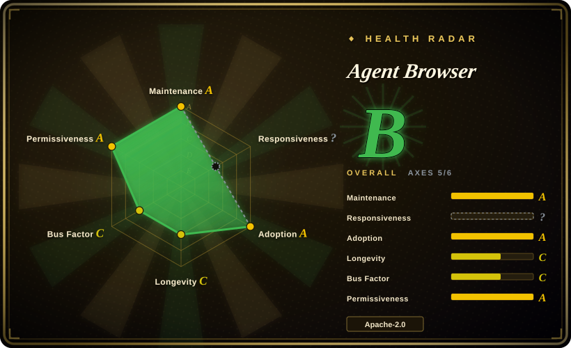
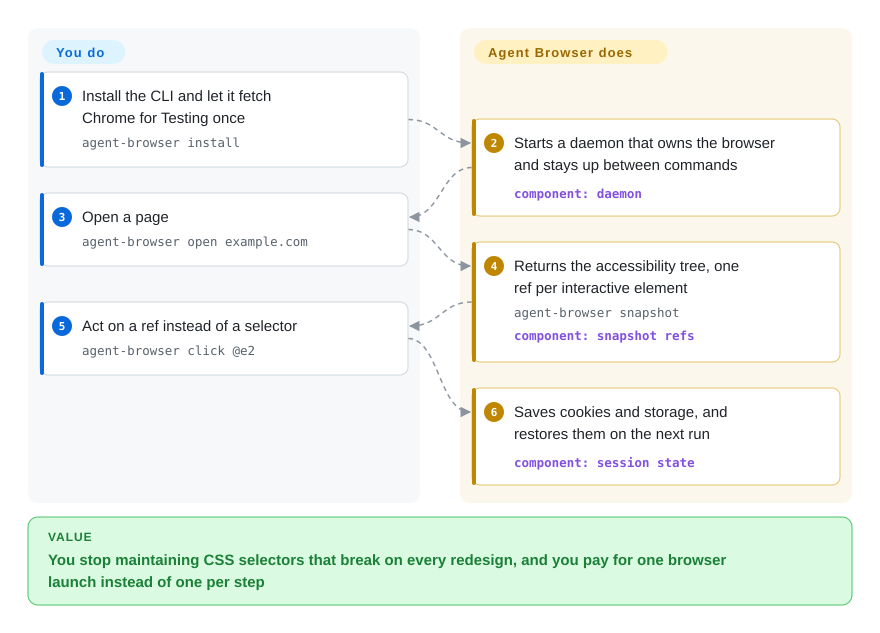

# Agent Browser

Your agent drives a real browser by writing CSS selectors, and the selectors snap the next time the page is reshuffled — the button is still there, the run dies anyway. Agent Browser hands the model accessibility-tree refs (`@e1`, `@e2`) instead, and keeps one Chrome resident between commands so each step is a cheap CLI call rather than a browser launch.

## When to use

You're building a coding agent or a shell-driven automation that has to operate real websites — log into a dashboard, fill a multi-step form, scrape a table, verify a deploy preview rendered. You don't want to embed a Node.js Playwright library inside the agent and you don't want the model inventing CSS selectors that break on the next deploy. What you want is a command the agent can shell out to, plus a stable handle on each element that the LLM can reason about.

You install `agent-browser` (npm, Homebrew, or cargo), run `agent-browser install` once to fetch Chrome for Testing, then the loop is: `agent-browser snapshot` returns the accessibility tree with refs, the model picks `@e2`, and you run `agent-browser click @e2` or `agent-browser fill @e3 "value"`. Because the daemon persists between commands you skip the per-action launch cost, and because `batch` runs a whole sequence in one process you also skip the per-command startup when a step needs several actions. Every command takes `--json`, `agent-browser mcp` exposes a typed subset over MCP, and `read` fetches agent-friendly text (markdown, `llms.txt`) without launching Chrome at all. Session cookies and localStorage auto-save and restore, so a logged-in flow survives across runs.

Choose it over [Chrome DevTools MCP](chrome-devtools-mcp.md) when you want a CLI primitive the agent shells out to *and* an MCP mode from the same binary, and over [browser-use](browser-use.md) when you would rather own the agent loop in your own harness than adopt a Python agent with its own.

## Q&A

**It ships a `chat` command now — is it still "you supply the agent loop"?**
Mostly yes. `chat` is a convenience REPL over the same CLI, and it needs a Vercel AI Gateway key (`AI_GATEWAY_API_KEY`, model defaulting to `anthropic/claude-sonnet-4.6`), so page content leaves your machine for that gateway. If you are driving Agent Browser from your own harness — MCP or shell — you still supply the loop and the model.

**I wired up the MCP server and most of my tools are missing.**
The default MCP profile is `core`, deliberately small. Add the surface you need: `agent-browser mcp --tools core,network,react`, or `--tools all` for full CLI parity. The same split applies to the `webmcp` tools, which are out of the default profile.

## How it works

The CLI is a thin client over a long-lived Rust daemon that owns the Chrome connection over CDP — that split is the whole design. Your command talks to the daemon, the daemon talks to the browser, and the browser stays open between commands, so you pay for a launch once instead of per step. `snapshot` flattens the page's accessibility tree into text with a ref per interactive element; the refs are what the model reasons about, and the daemon keeps them valid across same-document changes (a replaced element or a navigation invalidates its ref rather than recycling the identifier, so a stale ref fails loudly instead of clicking the wrong thing). What it takes over: browser lifecycle, element handles, tab bookkeeping, session state on disk, and the idle shutdown that stops a crashed integration from leaking a browser forever. What stays yours: the model, the agent loop, the decision about which pages it may touch, and — because the security features are opt-in — the choice to switch on domain allowlisting, content boundaries, action confirmation, or the encrypted auth vault. Two entry points converge here: the same binary serves the CLI and `agent-browser mcp`, so an agent can shell out or speak MCP without changing what runs underneath.

<!-- flow-steps:begin (generated from flows/agent-browser.json by tools/flow_card.py — do not edit) -->

Text version of the flow

1. **You**: Install the CLI and let it fetch Chrome for Testing once — `agent-browser install`
2. **Agent Browser**: Starts a daemon that owns the browser and stays up between commands — component: `daemon`
3. **You**: Open a page — `agent-browser open example.com`
4. **Agent Browser**: Returns the accessibility tree, one ref per interactive element — `agent-browser snapshot` — component: `snapshot refs`
5. **You**: Act on a ref instead of a selector — `agent-browser click @e2`
6. **Agent Browser**: Saves cookies and storage, and restores them on the next run — component: `session state`

**Value**: You stop maintaining CSS selectors that break on every redesign, and you pay for one browser launch instead of one per step

<!-- flow-steps:end -->

## When NOT to use

- **You want an in-page, no-backend NL copilot.** Agent Browser drives an *external* Chrome from the CLI; it does not run inside your app's existing browser tab/session. For an embeddable in-page GUI agent, use [page-agent](page-agent.md) instead.
- **You're writing a normal Node.js test/automation library.** It's a CLI + daemon, not an importable JS API. If your code lives in TypeScript and wants `await page.click(...)`, plain Playwright/Puppeteer is the better fit.
- **You need vision-first / pixel-precise interaction.** Selection is anchored on the accessibility tree, not screenshots. Canvas/WebGL UIs, pixel-coordinate clicks, or content absent from the a11y tree are weak spots; the a11y audit and annotated screenshots are unavailable on Safari/iOS WebDriver sessions.
- **Page content must not leave your machine, and you still want natural-language control.** The `chat` command routes through Vercel's AI Gateway, so the DOM you are driving goes to a third party. Use [browser-use](browser-use.md) with a local model, or drive Agent Browser's CLI from your own loop, instead of `chat`.
- **You need a managed cloud browser fleet out of the box.** It runs a local Chrome by default; large-scale concurrent/headless fleets mean wiring up a cloud provider plugin (Browserbase, Browser Use, Kernel, etc.) and operating that yourself.
- **Cross-engine breadth as a hard requirement.** Core path targets Chrome over CDP; Safari/iOS go through WebDriver sessions with partial coverage, and the domain allowlist and a11y audit reject those paths outright.
- **Maturity / churn.** Still pre-1.0 and shipping fast (roughly weekly, v0.31 in June to v0.38 in September), so the CLI surface and config can shift — pin a version if you script against it.

## Comparison

| Alternative | In index | Our verdict | Tradeoff |
|---|---|---|---|
| [Chrome DevTools MCP](chrome-devtools-mcp.md) | ✅ | Choose Chrome DevTools MCP when you want Google's official MCP server covering DevTools inspection; choose Agent Browser when the agent also needs to *act* on refs, or when it shells out rather than speaking MCP. | DevTools MCP is the official inspection surface and MCP-only; Agent Browser is a CLI-first Rust daemon that also ships MCP profiles, snapshot refs, a11y audits and HAR capture. |
| [browser-use](browser-use.md) | ✅ | Choose browser-use when you want a Python agent with a batteries-included LLM loop; choose Agent Browser when you own the loop and want a fast primitive underneath it. | browser-use is a framework you program against; Agent Browser is a binary you call, which makes it easier to embed but means the loop, prompting and retries are yours. |
| [page-agent](page-agent.md) | ✅ | Choose page-agent when the agent must live inside the user's page and reuse that session; choose Agent Browser when the browser should be a separate, scriptable one. | page-agent runs in-page with no backend; Agent Browser owns an external Chrome, so it can do server-side/CI work but cannot inherit a live tab's JS context. |
| [Cua](../../desktop-automation/cua.md) | ✅ | Choose Cua when the task leaves the browser — native desktop apps, OS dialogs, VM isolation; choose Agent Browser when everything happens on web pages and determinism matters more than reach. | Cua drives a whole computer at the OS level — structured state or pixels, sandbox optional; Agent Browser is browser-only and a11y-tree-based, which is cheaper and more reproducible but blind outside the page. |
| [Playwright](../playwright-family/playwright.md) / Puppeteer | partly indexed | Choose Playwright or Puppeteer when you are writing long-lived test suites in Node with cross-browser coverage; choose Agent Browser when the caller is a model that needs refs instead of selectors. | Playwright/Puppeteer are libraries you import and maintain inside a test runner; Agent Browser is a process a model drives, trading ecosystem breadth for LLM-facing ergonomics. |

## Tech stack

- **Language:** Rust (native CLI binary + persistent daemon), Apache-2.0, pnpm workspace with a Node bootstrap for the npm install path.
- **Browser control:** direct Chrome DevTools Protocol over a daemon socket — no Node.js or Playwright in the runtime path.
- **Browser engine:** Chrome for Testing, fetched by `agent-browser install` (`--with-deps` on Linux); existing Chrome, Brave, Playwright and Puppeteer installs are detected, and `--cdp`/`--auto-connect`/`--profile` attach to a browser you already have.
- **Model integration:** MCP stdio server with tool profiles (`core`, `network`, `state`, `debug`, `tabs`, `react`, `mobile`, `all`); `--json` on every command; bundled skills served by `agent-browser skills` so an agent reads instructions matching the installed version.
- **Selection model:** accessibility-tree snapshot with stable refs (`@e1`…), persistent across same-document changes; stable tab ids (`t1`…) plus optional user labels; annotated screenshots; `snapshot --delta` for compact revisions.
- **Built-in tooling:** `read` (agent-friendly text, `llms.txt`), `batch`, `diff` (snapshot/screenshot/url), `a11y` (embedded axe-core), `network` routes/HAR, React DevTools and Web Vitals, `record` (webm/mp4 with pointer and contact sheet), `trace`/`profiler`, `doctor`, `upgrade`.
- **Security, opt-in:** encrypted auth vault, plugin system (`agent-browser.plugin.v1` stdio), `--content-boundaries`, `--allowed-domains` (plus WebRTC/worker containment), `--action-policy`, `--confirm-actions`, `--max-output`; state encryption with `AGENT_BROWSER_ENCRYPTION_KEY`.
- **Experimental:** WebMCP catalog discovery (`webmcp list/invoke/result/cancel`), which treats page-provided tool metadata as untrusted and bounds what it advertises.

## Dependencies

- **Runtime:** the native `agent-browser` binary plus Chrome — `agent-browser install` downloads Chrome for Testing, or point it at an existing browser with `--executable-path`/`--cdp`. Running commands needs no Node.js.
- **Install:** `npm install -g agent-browser`, `brew install agent-browser` (macOS), or `cargo install agent-browser`; `agent-browser upgrade` detects the install method. Building from source needs Node.js 24+, pnpm 11+ and Rust.
- **Optional, per feature:** `AI_GATEWAY_API_KEY` (and optionally `AI_GATEWAY_MODEL`) for `chat` and the dashboard's AI panel; `ffmpeg` on `PATH` for `record`; an MCP-capable client for `agent-browser mcp`; Appium plus an iOS Simulator for the Safari-on-iOS path; a cloud provider plugin and account for headless fleets.

## Ops difficulty

**Low-to-medium.** For a single local Chrome it is close to drop-in: one install, one `agent-browser install`, then shell out. The daemon means you manage a long-lived process, but the failure modes are handled for you — a missing or stale daemon is started on demand, `doctor` diagnoses and cleans stale socket/pid files, and an idle daemon saves state, closes the browser and exits after an hour so a crashed integration cannot leak it. Default operation timeout is 25s, deliberately below the CLI's 30s IPC read timeout so you get a real error instead of `EAGAIN`. Difficulty rises to **medium** once you run headless at scale (wiring and paying for a cloud provider plugin), reuse Chrome profiles (Windows requires closing Chrome first), depend on the Safari/WebDriver/iOS paths, or switch on the security features — those constraints are the ones to read before pointing it at untrusted pages.

## Health & viability

- **Maintenance — very active.** Grade A: pushed within a day, 11 of 13 active weeks, and a steady release train (v0.31 in late June to v0.38.1 on 2026-09-16, roughly weekly).
- **Responsiveness — not scored (`?`).** The index found no qualifying issue window to measure; the release cadence is the visible signal instead.
- **Adoption — Grade A.** 5,145,602 npm downloads in the last month and 14,505 Homebrew installs in 90 days (2026-09-23), alongside 43.1k stars and 2.9k forks.
- **Backing — Grade C.** Vercel Labs: organization-owned, 96 active maintainers over 12 months, but top-1 share 64.9% and top-3 73.4%, so the commit history concentrates in one author. A `-labs` badge also means an incubation surface rather than a flagship product.
- **Age & Lindy — Grade C.** 255 days old (created 2026-01-11) and still pre-1.0; there is no Lindy prior to lean on yet.
- **Risk / License — Grade A.** Apache-2.0, no relicense in 36 months. The risk is churn and defaults, not the license: CLI and config shift between releases, cross-engine coverage lags, and the safety features are off until you enable them — a plain install runs with your Chrome's permissions.

## Caveats (unverified)

- [未验证] Feature breadth (WebMCP, plugins, a11y audit, recording, dashboard, security flags) is read from the README, CHANGELOG and docs index on 2026-09-23; most of it was not exercised first-hand.
- [推断] Non-Chromium/Safari-WebDriver coverage lags the Chrome-over-CDP path; the limitations are stated per feature, but parity per command is not enumerated.
- [未验证] Whether `chat` sends only the DOM or also your prompts to Vercel's AI Gateway, and what that gateway retains — the README documents the required key and default model, not the data path.
- [未验证] Homebrew/npm download counts as a proxy for real users; both are noisy and the repo is also installed by CI.
- [推断] The 25s/30s timeout relationship is documented as intentional, not measured here; slow pages still need explicit timeouts.
- [未验证] The security features are described as opt-in and existing workflows unaffected; no independent test of the domain allowlist's containment was performed.
- [推断] Release cadence is inferred from GitHub releases; the CHANGELOG is per-release and does not summarise breaking changes across versions.
- [未验证] Whether the bundled `skills` content and the published `agent-browser.dev/schema.json` stay in lockstep with the installed binary.
